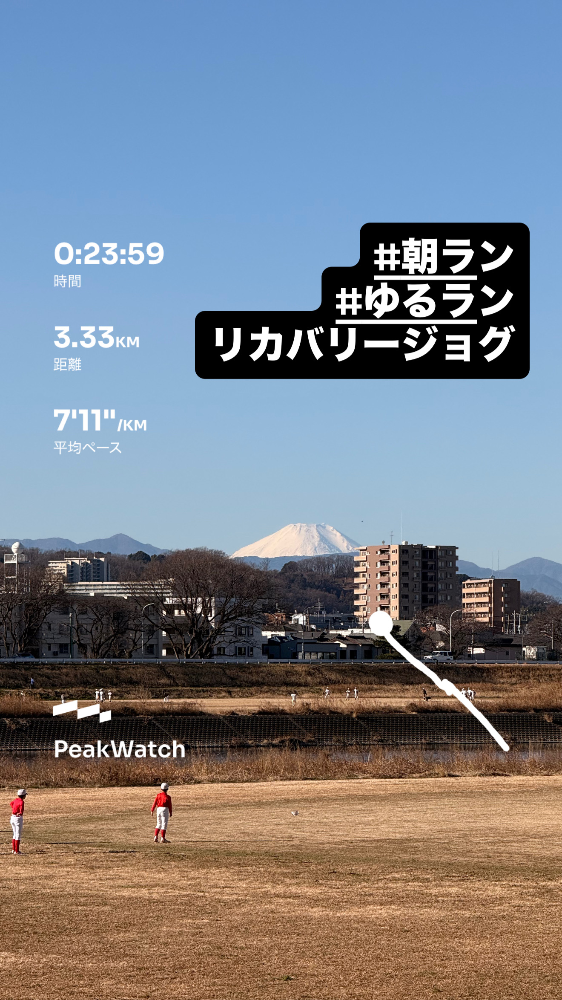
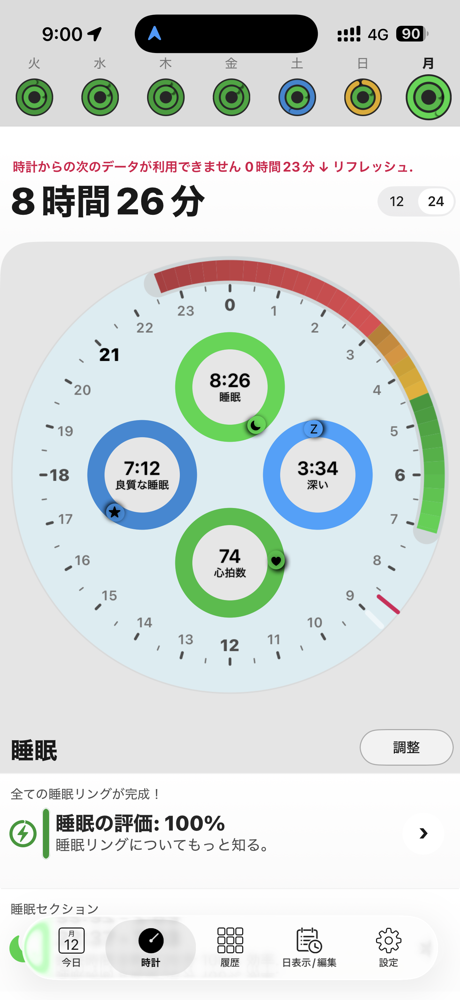
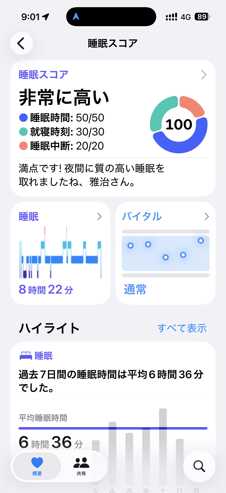
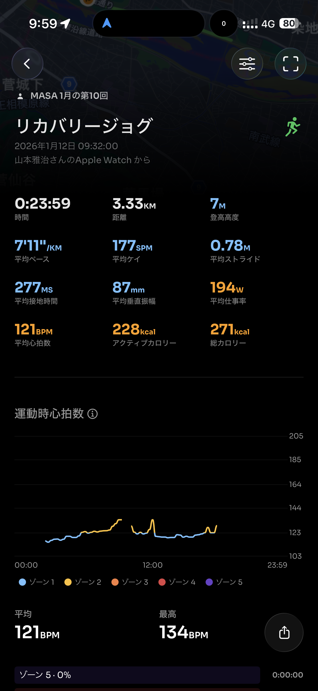
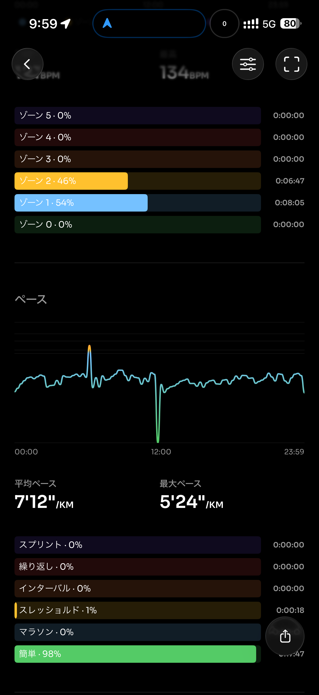
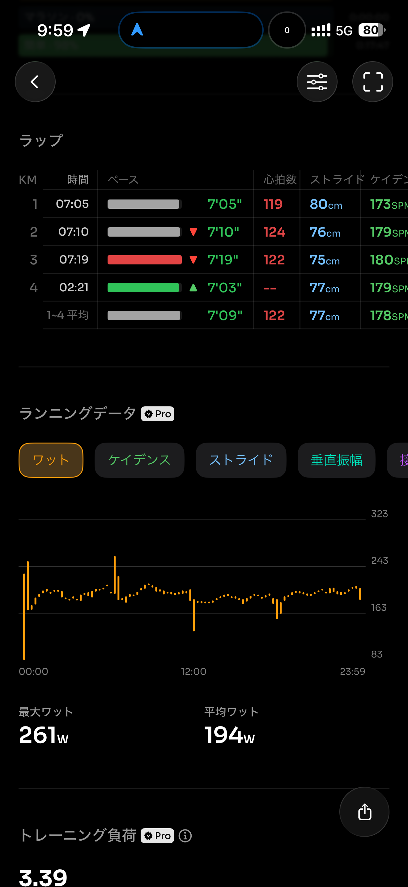
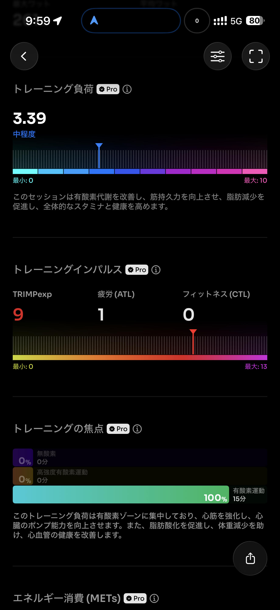
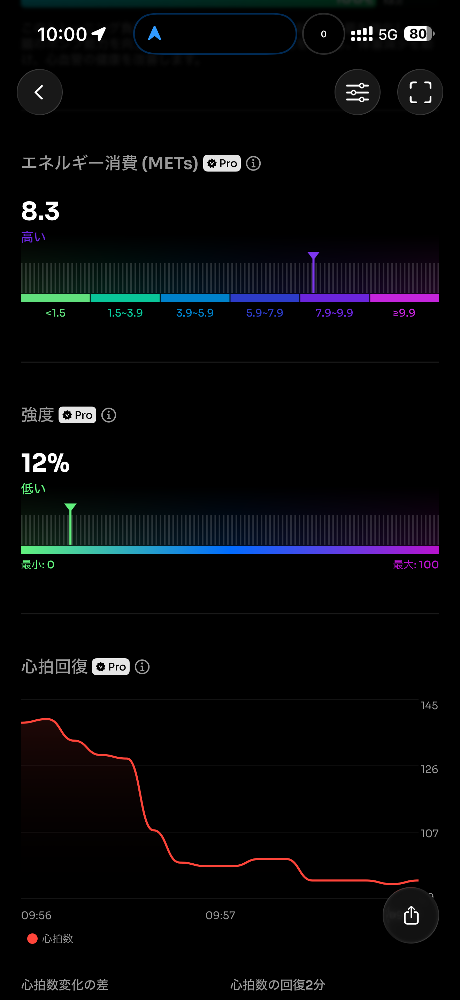
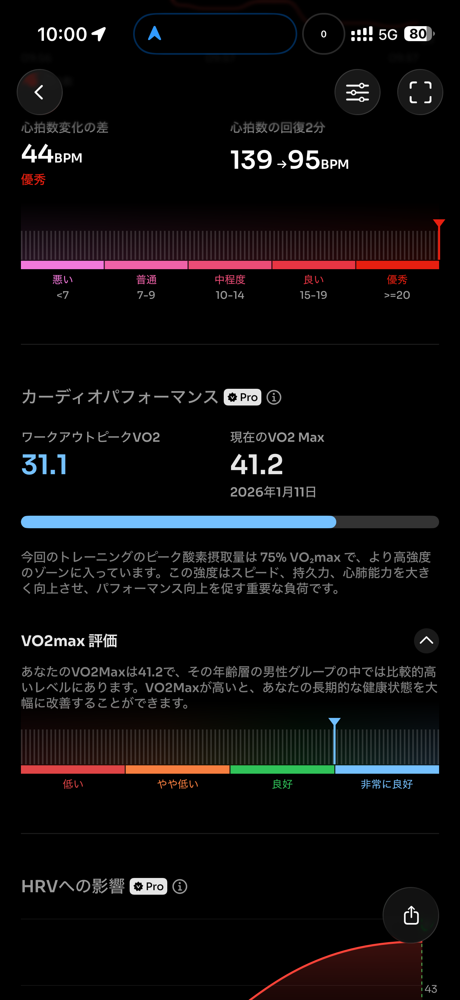
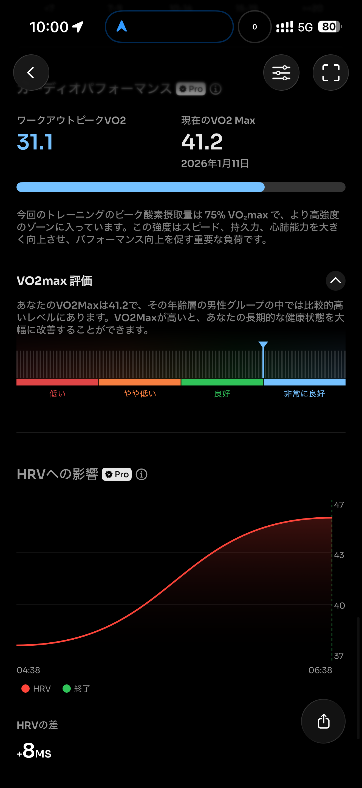

- 距離：3.33km
- 時間：00:23:59
- 平均心拍数：122
- 時間帯：09:32
- 天候：晴れ
- コース：多摩川河川敷（折り返し）
- 補給：朝ジェル
- 睡眠：8時間26分
- 今日の目的：リカバリージョグ
- コメント：ちゃんとリカバリージョグ

## 📝 コーチコメント：
心拍121bpm・ゾーン1〜2中心、負荷3.39と数値的にも「回復にちょうどいい」内容で、レース翌日の脚と自律神経をうまく整えられています。
睡眠も8時間超＋スコア100なので、今日はこれ以上足さず、この流れのまま明日も“軽め or 休み”でOKです。

## 📸 写真一覧

