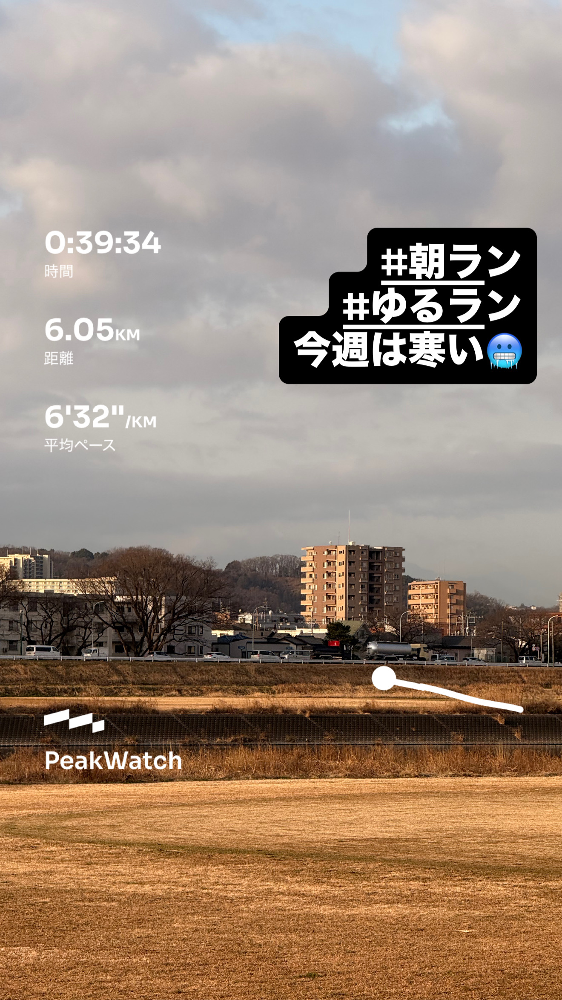
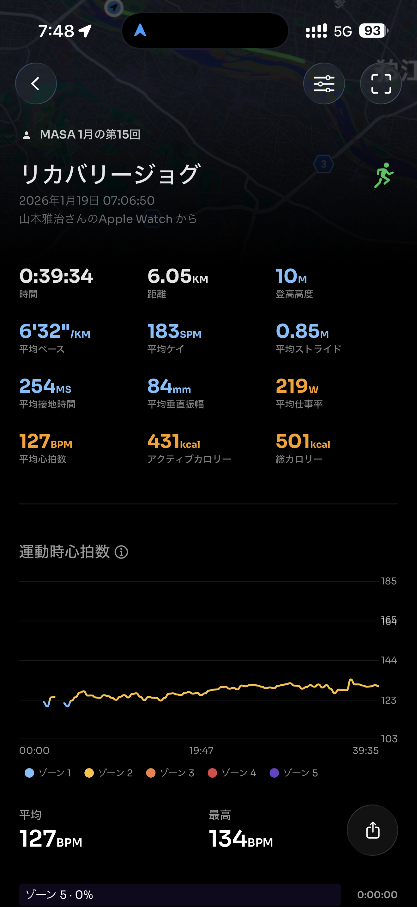
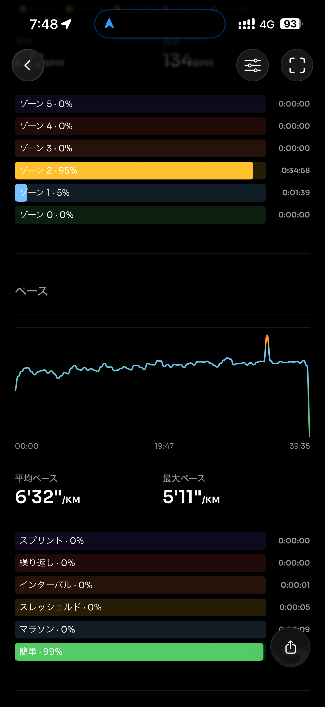
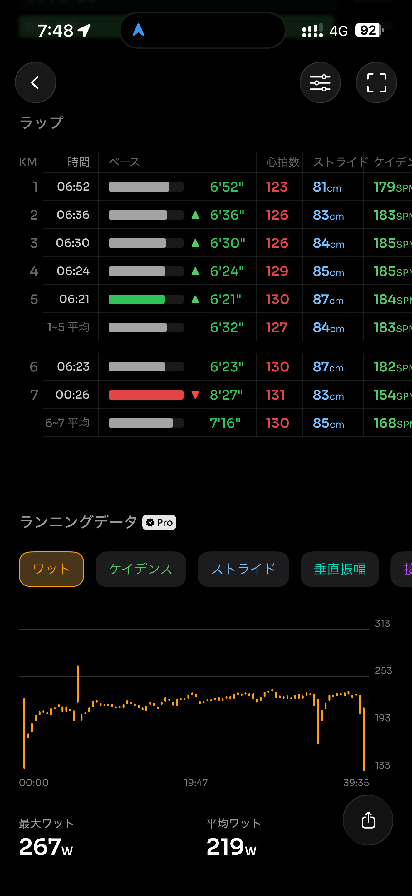
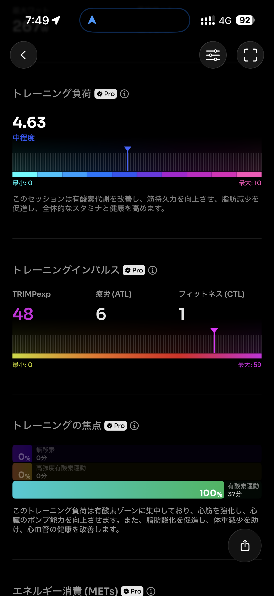
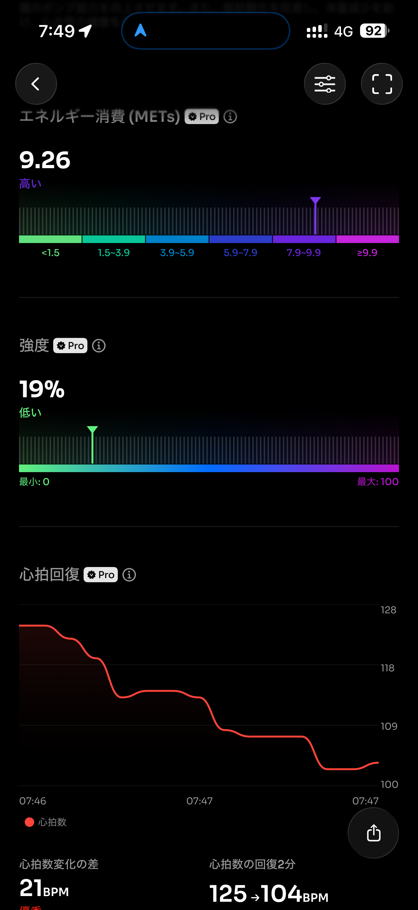
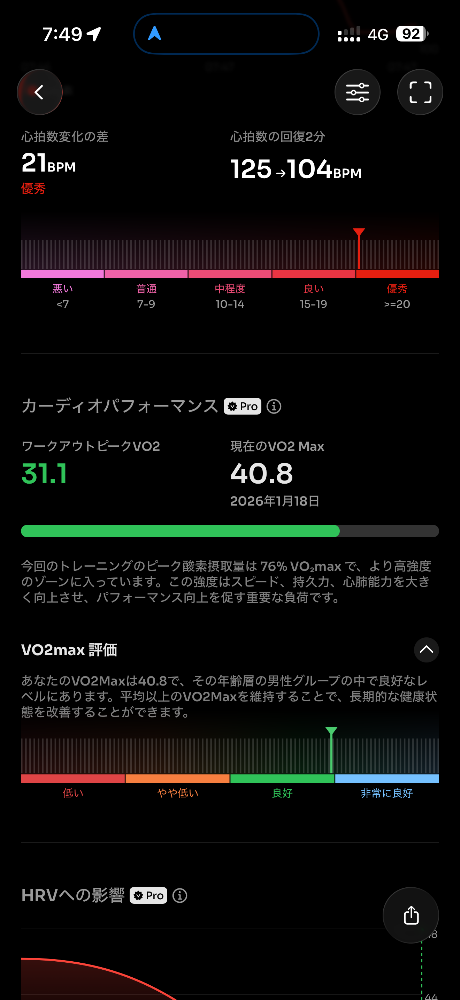
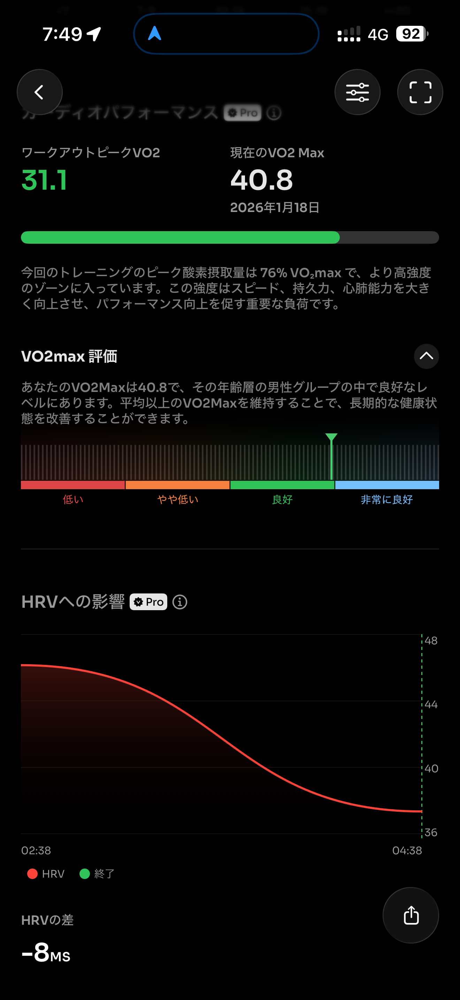
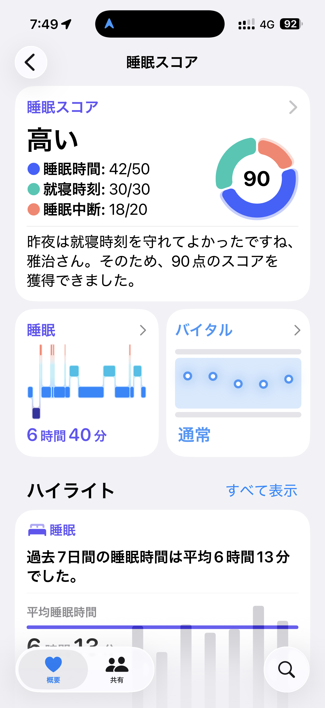
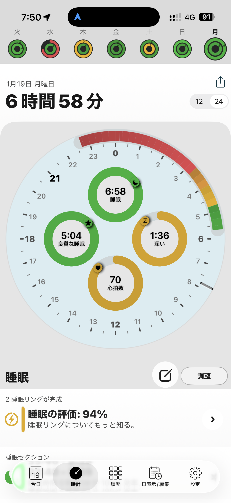

- 距離：6.05km
- 時間：00:39:34
- 平均心拍数：128
- 時間帯：7:06~
- 天候：曇り（寒い）
- コース：多摩川河川敷（折り返し）
- 補給：朝ジェル
- 睡眠：6時間48分
- 今日の目的：リカバリージョグ
- コメント：リカバリーできたと思う。

## 📝 コーチコメント：
6.05km（6’32”/km）で平均心拍127bpm、ゾーン2が95%＆ラップも大崩れなし。回復ランとして狙い通りで、心拍回復（125→104/2分）も優秀＝疲労抜きが進んでます。

## 📸 写真一覧

