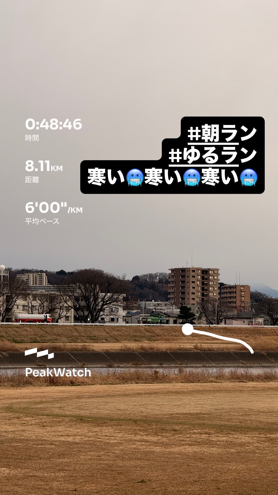
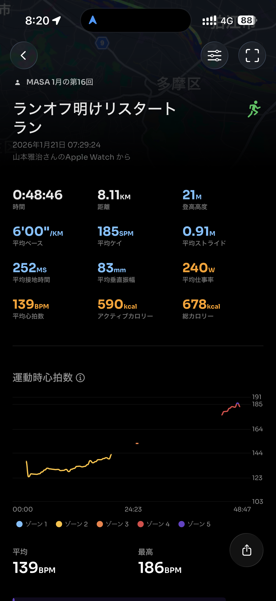
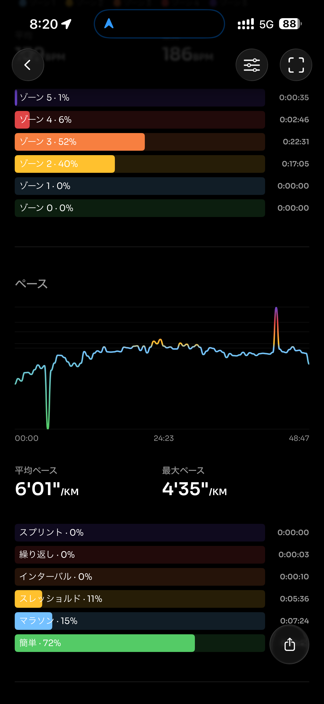
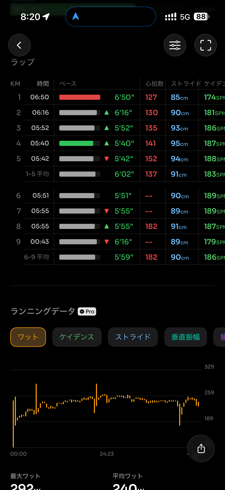
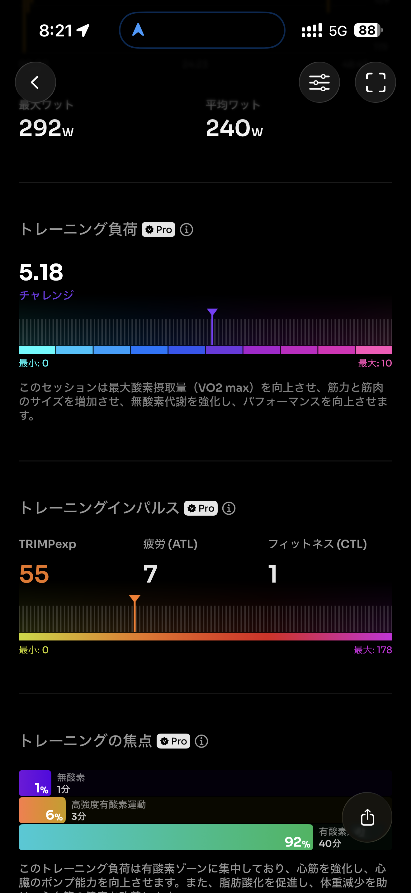
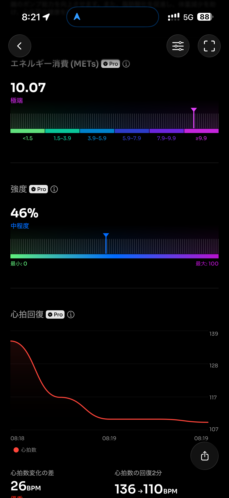
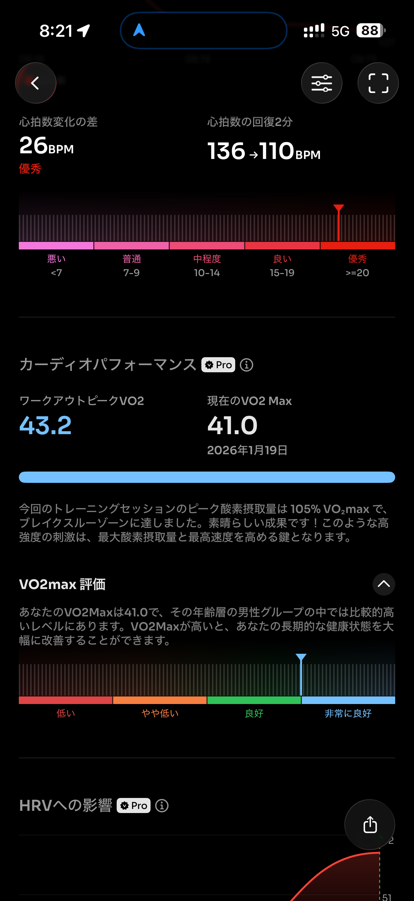
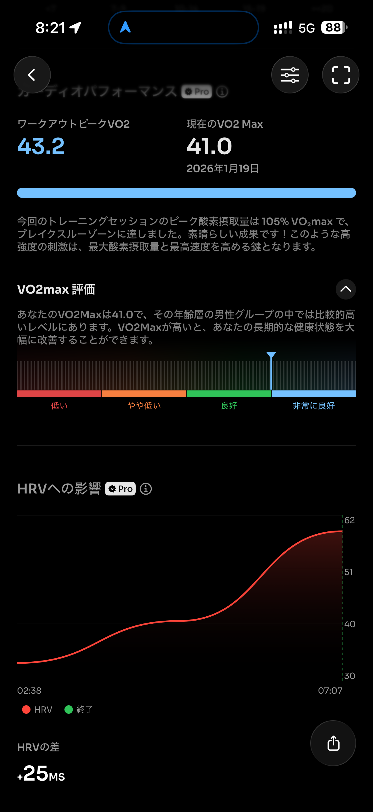
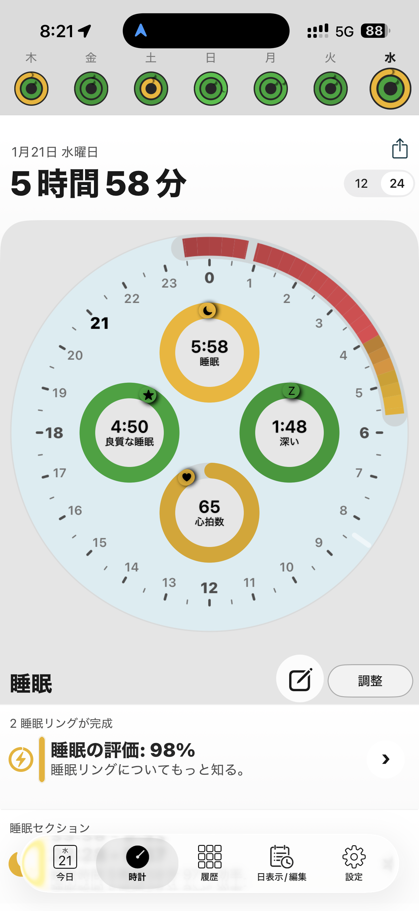
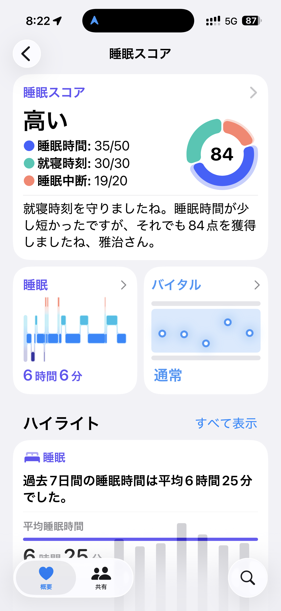

- 距離：8.11km
- 時間：00:48:46
- 平均心拍数：142
- 時間帯：7:29~
- 天候：曇り（寒い）
- コース：多摩川河川敷（折り返し）
- 補給：朝ジェル
- 睡眠：6時間6分
- 今日の目的：つなぎのジョグ
- コメント：まぁまぁペース上がったかも

## 📝 コーチコメント：
今日の「ブレイクスルー」した心肺機能なら、明日は良い走りができるはずです。 寒さで体が硬いと思うので、アップだけは念入りにお願いします！🔥

## 📸 写真一覧

