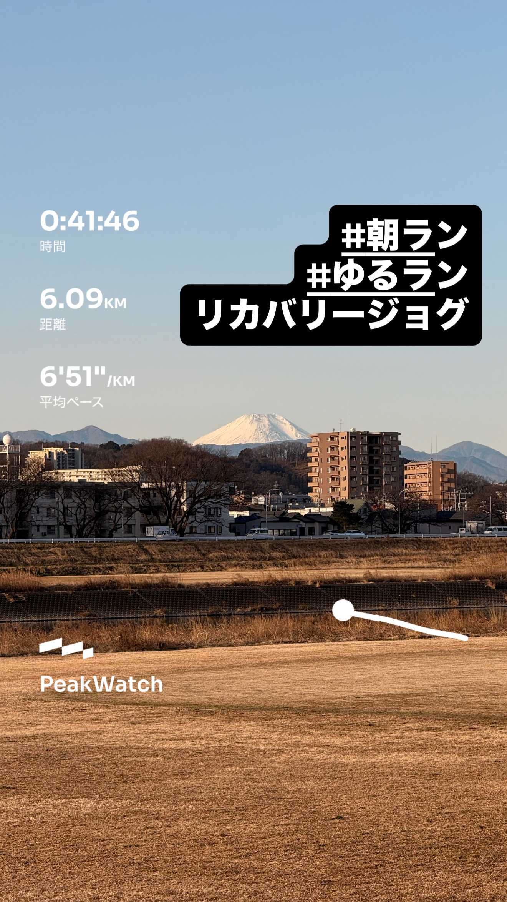
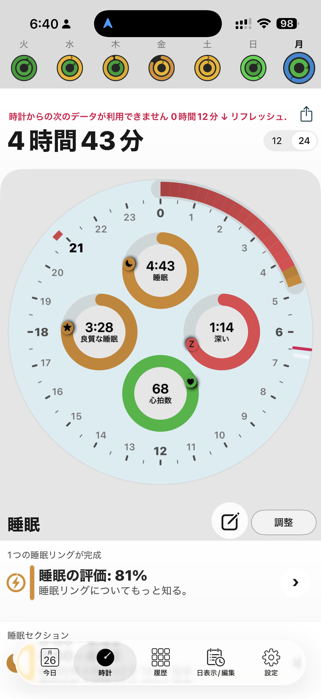
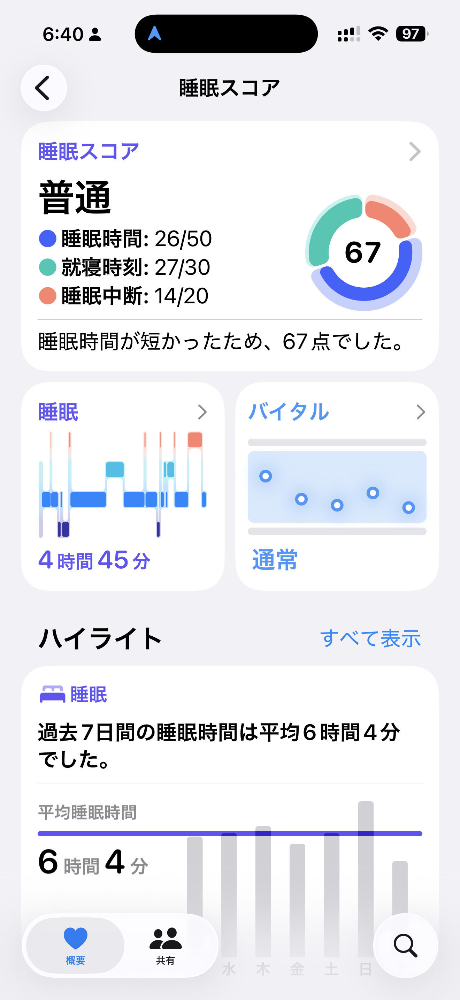
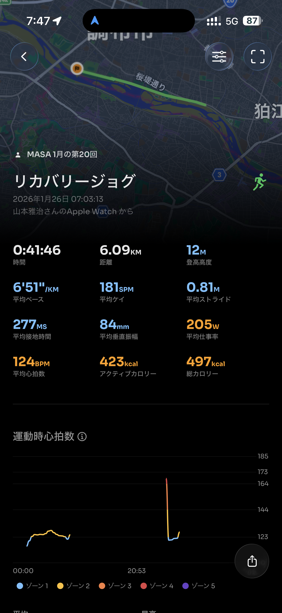
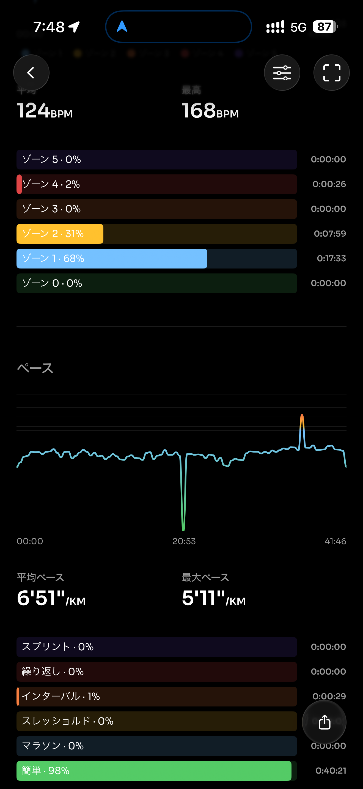
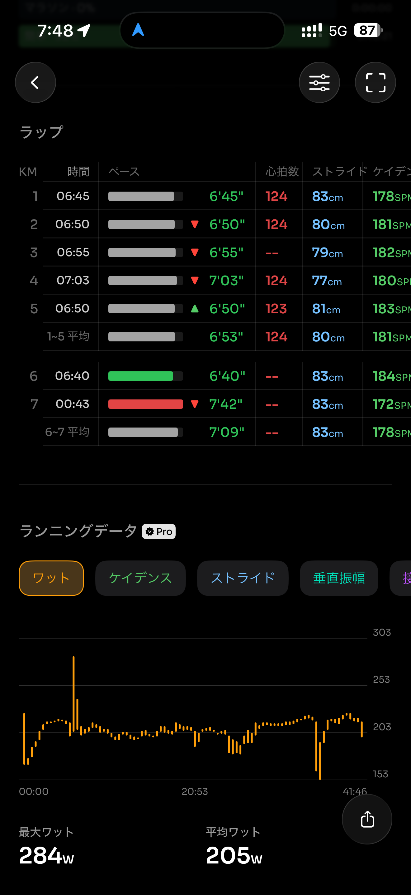
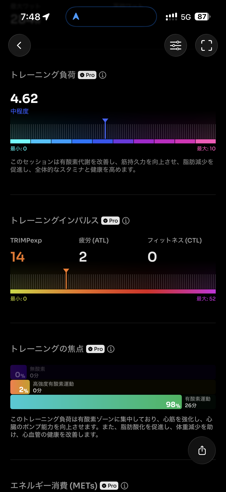
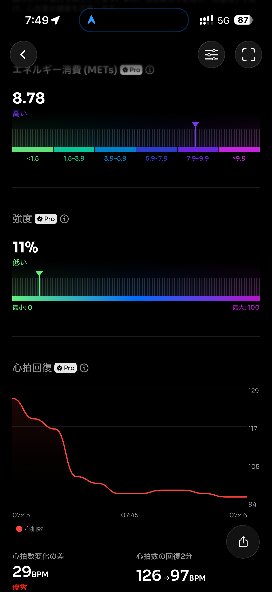
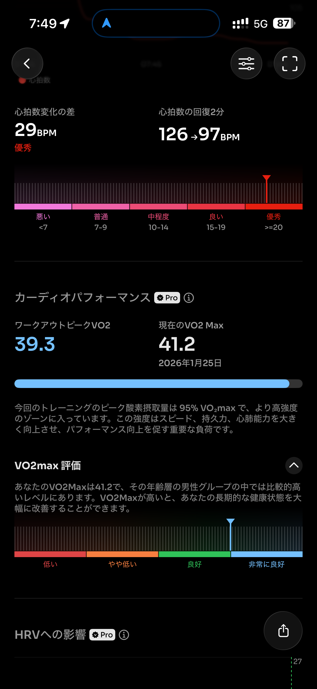
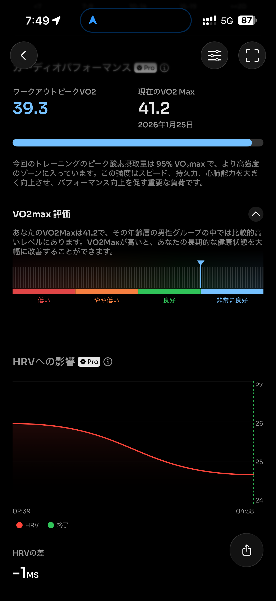

- 距離：6.09km
- 時間：00:41:46
- 平均心拍数：124
- 使用シューズ：インフィニットプロ
- 時間帯：07時
- 天候：07時頃の気象データ: 気温: 0.2℃, 風速: 8.7m/s
- コース：
- 補給：
- 睡眠：4時間43分 (評価: 普通)
- 今日の目的：リカバリージョグ
- コメント：極寒と強風の中でのリカバリージョグ。体幹を意識し、無理なくペースを抑えて走れました。

## 📝 コーチコメント：
MASAさん、今日のリカバリージョグ、大変お疲れ様でした！

気温0.2℃、そして風速8.7m/sという、まさに凍えるような強風の中で、よくぞ走り切りましたね！この厳しい気象条件下でのランニングは、まさにMASAさんのサブ4達成への強い意志を象徴しています。3月15日の板橋シティマラソン本番でも、今日のような厳しいコンディションになる可能性はゼロではありません。しかし、今日の経験がMASAさんのメンタルを鍛え、本番でのウェアリングや戦略を考える上で大きな糧となるはずです。

6.09kmを00:41:46、平均心拍数124bpmというデータを見るに、しっかりとリカバリーの目的に徹した素晴らしい内容です。無理なく体を動かし、疲労回復を促す。この地道で丁寧な積み重ねこそが、サブ4達成の盤石な土台となります。

一点だけ、睡眠時間が4時間43分とやや短めだったようですね。ハードなトレーニングを積むMASAさんにとって、疲労回復とパフォーマンス向上のためには質の高い睡眠が不可欠です。怪我のリスクを減らし、日々のトレーニング効果を最大限に引き出すためにも、しっかりとした睡眠時間の確保を意識してください。

サブ4達成まで、残された時間は決して長くありませんが、MASAさんのこの粘り強さと、目標への強い情熱があれば、必ずや目標を達成できると信じています。一日一日を大切に、最高のコンディションでスタートラインに立ちましょう！応援しています！

## 📸 写真一覧

