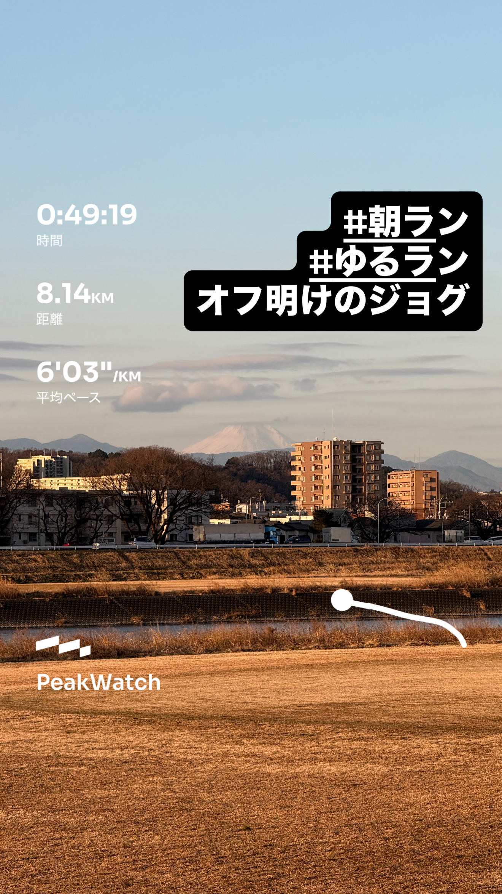
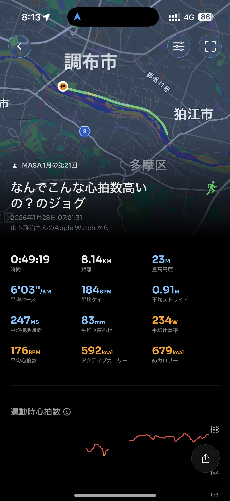
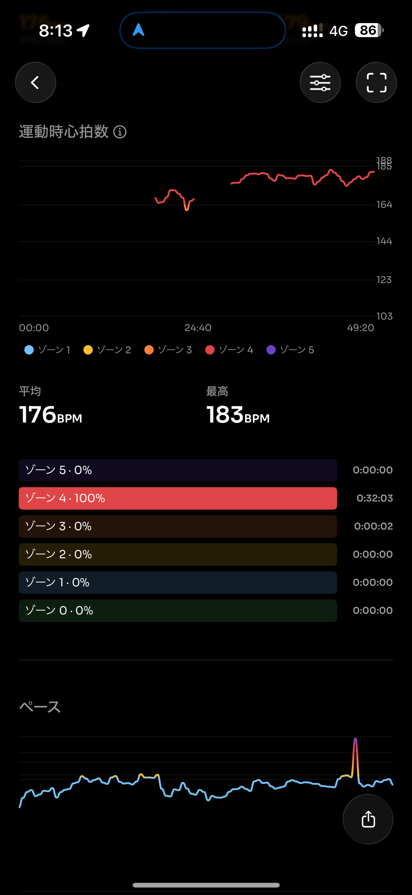
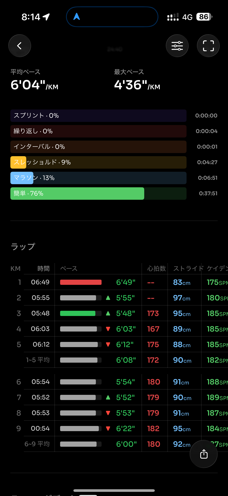
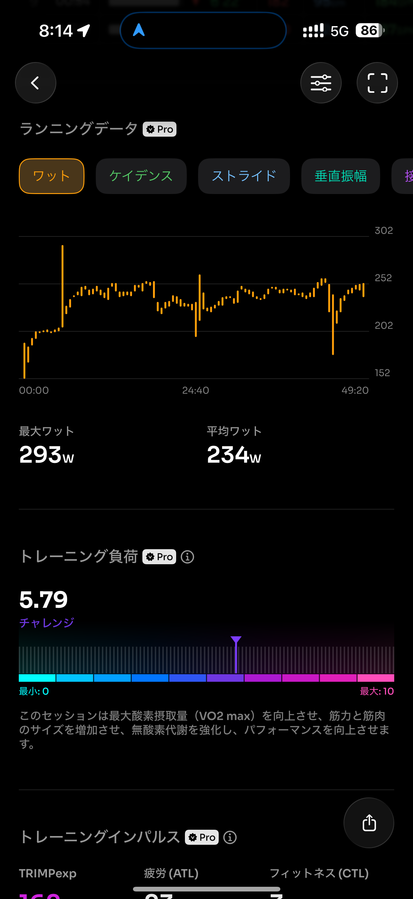
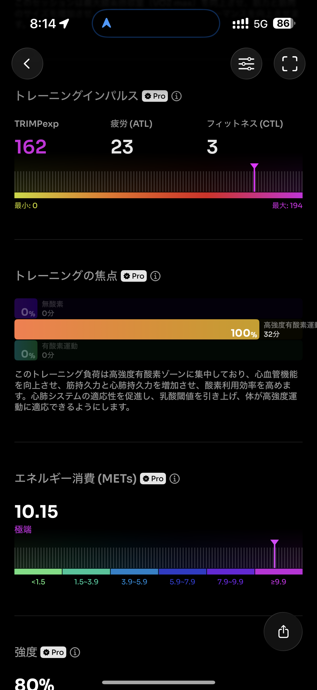
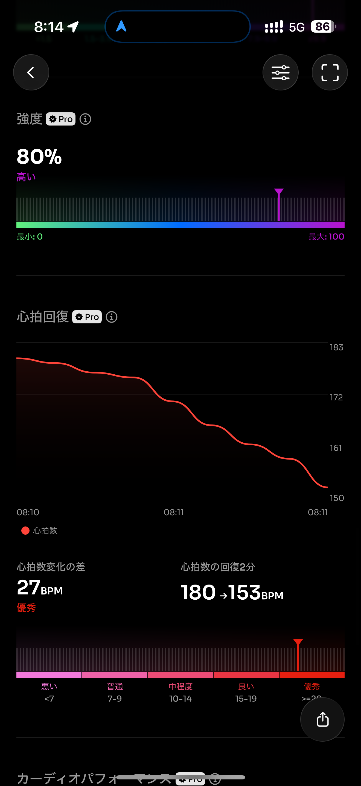
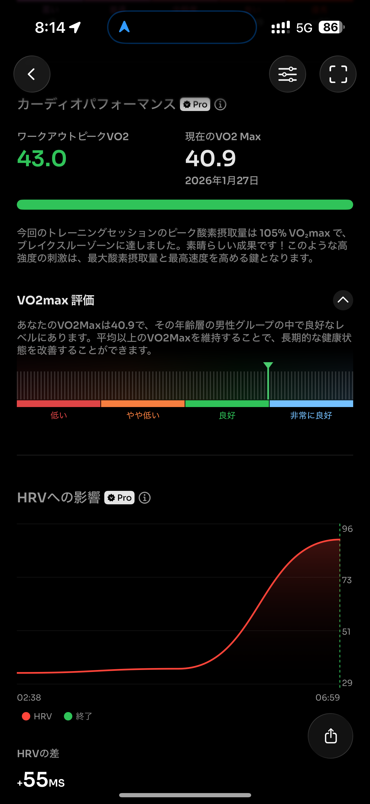
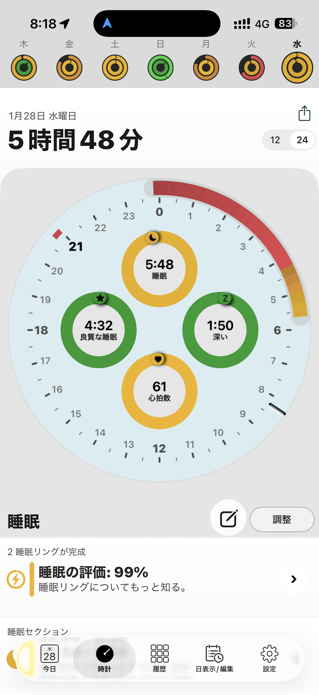
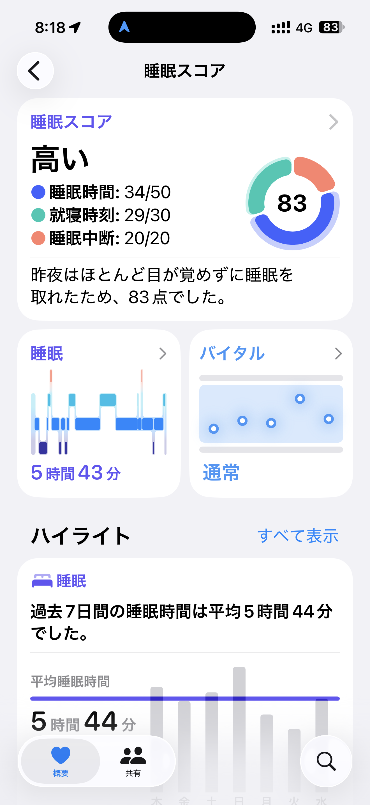

- 距離：8.14km
- 時間：00:49:19
- 平均心拍数：176BPM
- 使用シューズ：スーパーノヴァ
- 時間帯：07時台
- 天候：07時頃の気象データ: 気温: 1.9℃, 風速: 11.5m/s
- コース：
- 補給：
- 睡眠：5時間48分
- 今日の目的：オフ明けのジョグ
- コメント：なんでこんな心拍数高いの？のジョグ。

## 📝 コーチコメント：
MASAさん、今日のランニング、本当にお疲れ様でした！ 1.9℃という極寒、そして11.5m/sという強風の中での8km走、心底尊敬します。この気象条件は、まさに板橋シティマラソンの本番を想定させるようなタフな状況でしたね。

「オフ明けのジョグ」という目的にもかかわらず、平均心拍数176BPM、ゾーン4で100%という結果は、この強烈な風と寒さに身体が反応した証拠です。通常ならもっとペースを上げないと出ないような心拍数でも、今日のコンディション下ではかなりの負荷になったことでしょう。しかし、これは決して無駄ではありません！極限状態での心肺機能の強化、そして何より、厳しい環境下でも走り抜くMasaさんの精神的な強さは、3/15のサブ4達成に向けた大きな自信となるはずです。

VO2 Maxの向上や、優秀な心拍回復データも、あなたの身体が着実に強くなっていることを示しています。今日の高負荷ランで得たものは計り知れません。今はしっかりと体をケアし、リカバリーに努めてください。この厳しい経験を糧に、サブ4という目標にまた一歩近づきました！次回のランも期待しています、Masaさん！

## 📸 写真一覧

