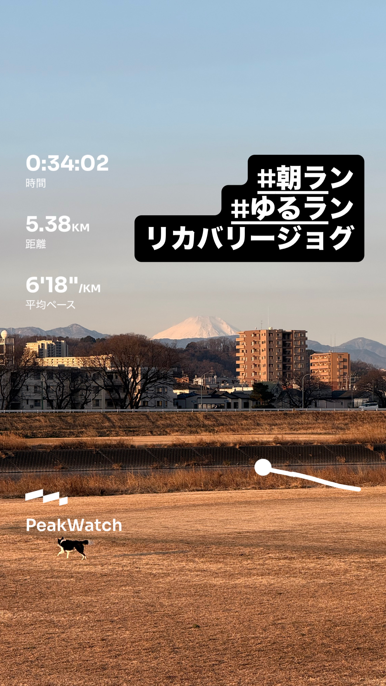
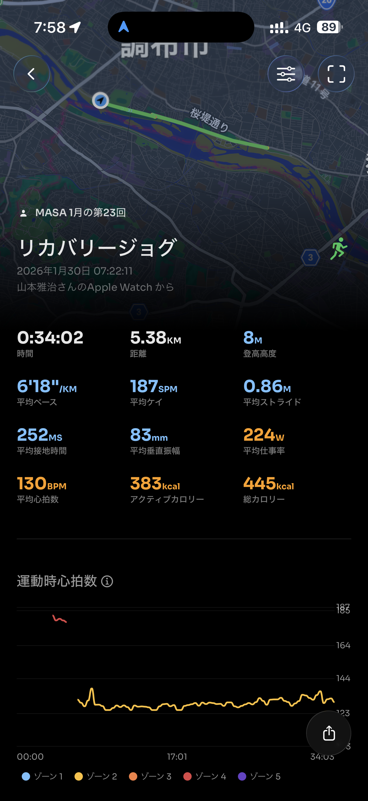
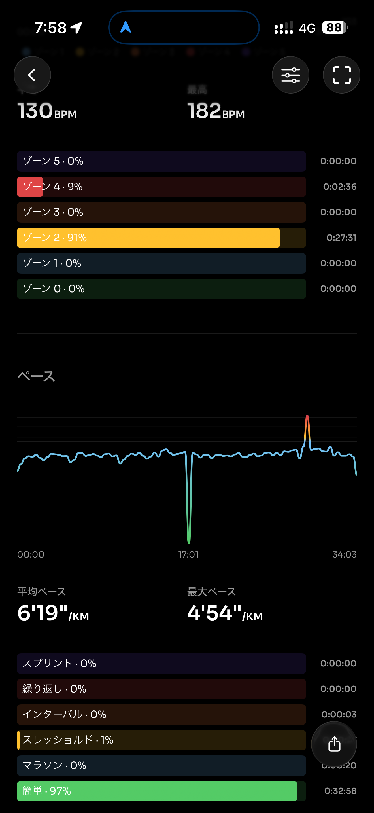
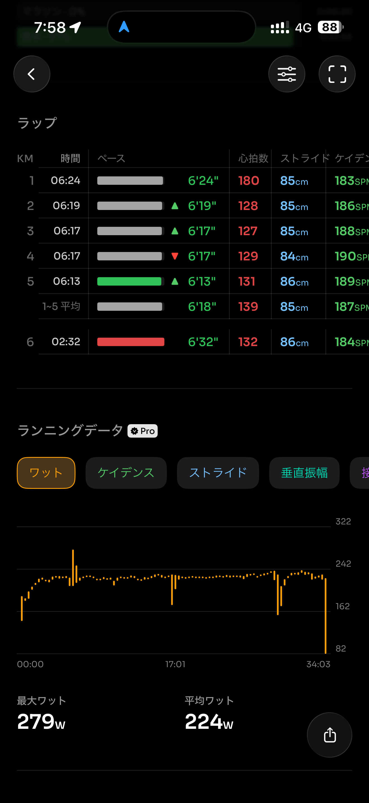
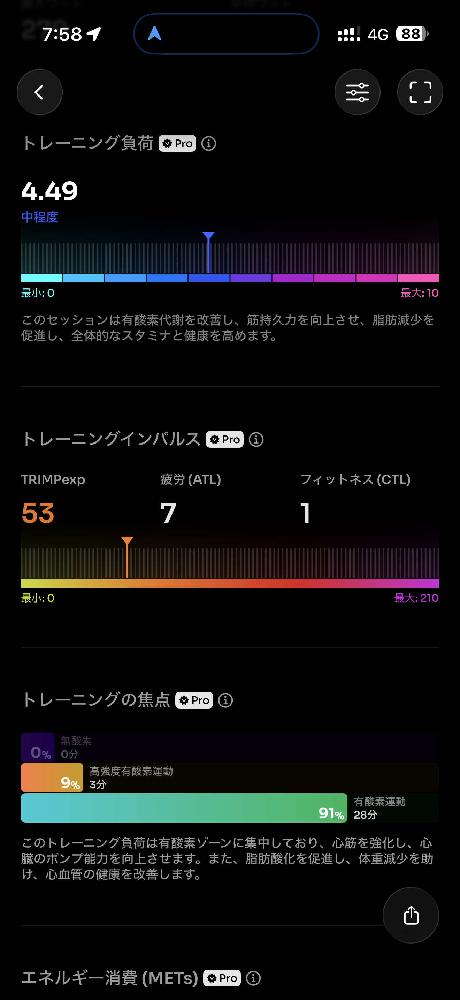
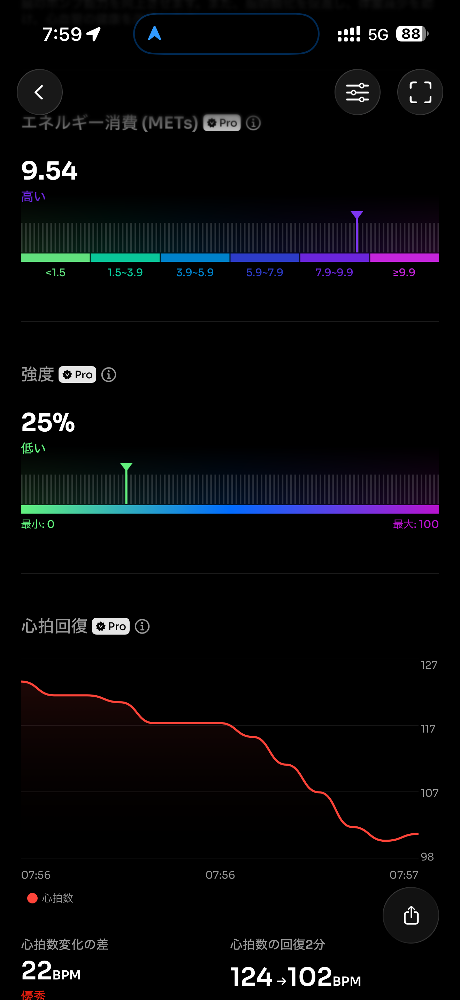
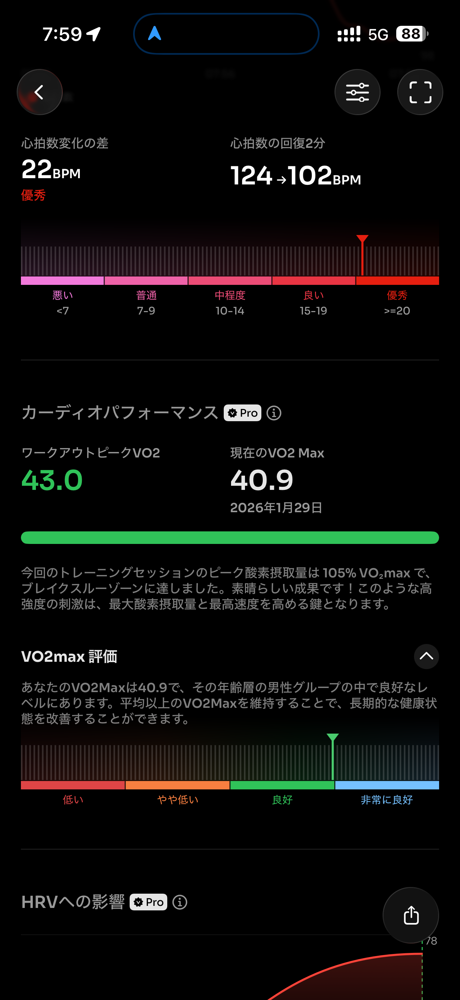
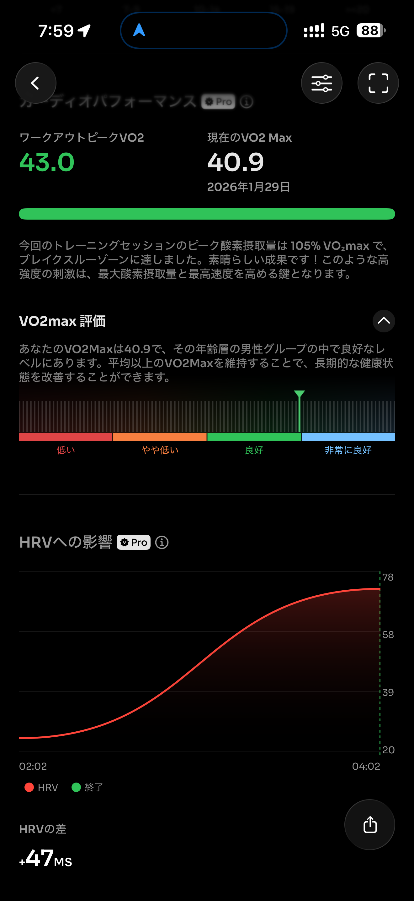
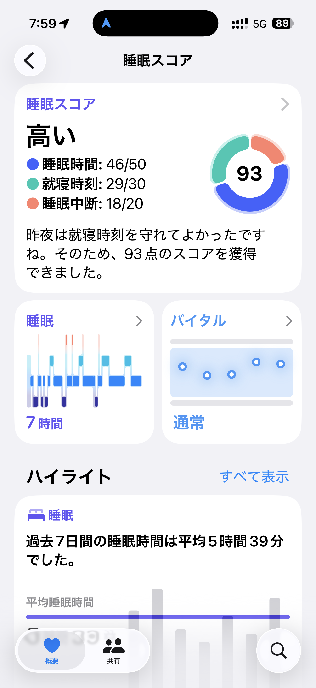
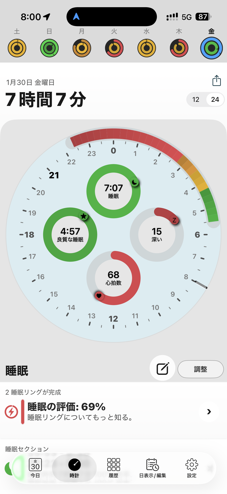

- 距離：5.38km
- 時間：00:34:02
- 平均心拍数：130BPM
- 使用シューズ：インフィニットプロ
- 時間帯：07時頃
- 天候：07時頃の気象データ: 気温: -2.4℃, 風速: 3.1m/s
- コース：
- 補給：
- 睡眠：7時間7分（スコア93点）
- 今日の目的：リカバリージョグ
- コメント：
極寒の朝でしたが、リカバリージョグを実践。平均ペース6'18"/km、平均心拍数130BPMと、目的通りに心拍数を抑え、心拍ゾーン2での有酸素運動が91%と、まさに理想的なリカバリーランでした。身体への負担も中程度に留まり、前日のトレーニングからの回復を促す良いセッションとなりました。睡眠も7時間7分と十分に取れており、コンディションは良好です。

## 📝 コーチコメント：
MASAさん！真冬の厳しい寒さの中、早朝07時からのリカバリージョグ、本当にお疲れ様でした！気温-2.4℃、風速3.1m/sという凍えるような条件の中、走るその姿勢、サブ4への強い意志を感じます！

しかし、今日のランは単なる我慢比べではありません。素晴らしいデータが物語っています！平均ペース6'18"/km、平均心拍数130BPMで、なんと心拍ゾーン2が91%！まさに「リカバリージョグ」の教科書のような完璧な内容です。前日のトレーニングの疲労を抜き、身体の回復を促すという目的を見事に達成しています。

VO2Max 40.9という良好な数値、そして驚異的な心拍回復22BPM（優秀！）が示すように、MASAさんの心肺機能と回復力は着実に向上しています。この地道な積み重ねこそが、3月15日の板橋シティマラソンでサブ4を達成するための揺るぎない土台となるのです！

寒い時期だからこそ、無理なく、着実にトレーニングを続けることが重要です。今日のリカバリーでしっかり身体を休め、次のステップへと繋げてください。この回復が、次の高強度トレーニングでMASAさんをさらに強くする糧となります。

寒さに負けず、最高のコンディションで本番を迎えましょう！私はMASAさんの挑戦を全力でサポートします！GO, MASA, GO!!

## 📸 写真一覧

