- 距離：11.73km
- 時間：1:21:19
- 平均心拍数：125BPM
- 使用シューズ：スーパーノヴァ
- 時間帯：不明時
- 天候：(解析中)
- コース：街中ジョグ
- 補給：不明
- 睡眠：5時間55分
- 今日の目的：＃朝ラン ＃ゆるラン 街中散歩ジョグ
- コメント：不明

## 📝 コーチコメント
MASAさん、今日のランニングもお疲れ様でした！11.73kmの街中ジョグ、心身ともにリフレッシュできたのではないでしょうか。平均心拍数も125BPMと、心地よいペースで走れていることが伺えます。日々の積み重ねが、着実に体力向上に繋がっていますね。

ハーフマラソン完走という目標に向かって、焦らず、楽しみながらトレーニングを続けましょう。大切なのは、毎日少しずつでも体を動かす習慣を維持することです。時には、無理せず休息日を設けることも重要です。

歳を重ねるごとに、体力維持は難しくなるものですが、MASAさんのように、日々の努力を怠らず、ランニングをライフスタイルに取り入れることで、健康寿命を延ばすことができます。これからも、楽しく、健康に走り続けるMASAさんを応援しています！ハーフマラソン当日、最高の笑顔でゴールテープを切れるよう、私も全力でサポートします。

## 📸 写真一覧
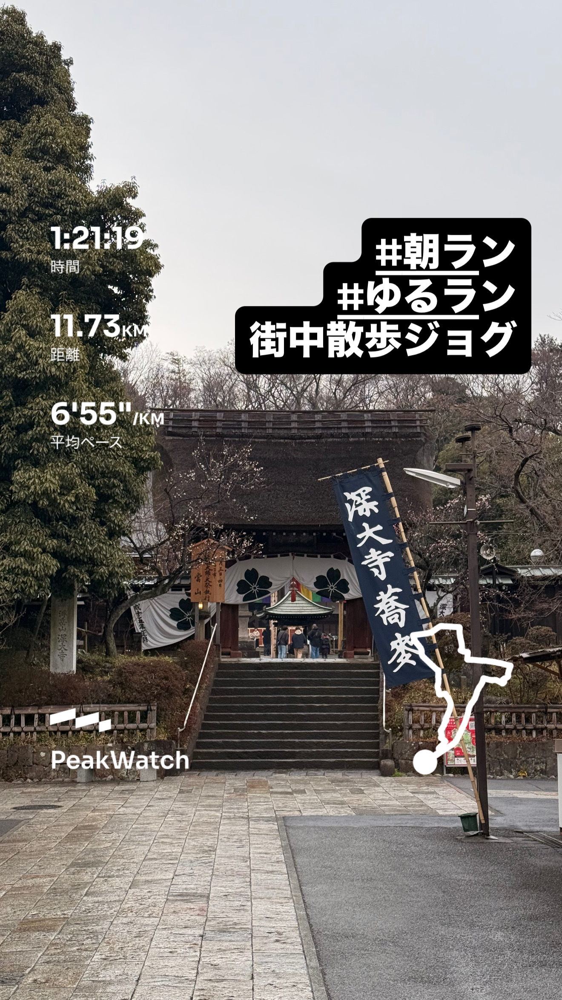
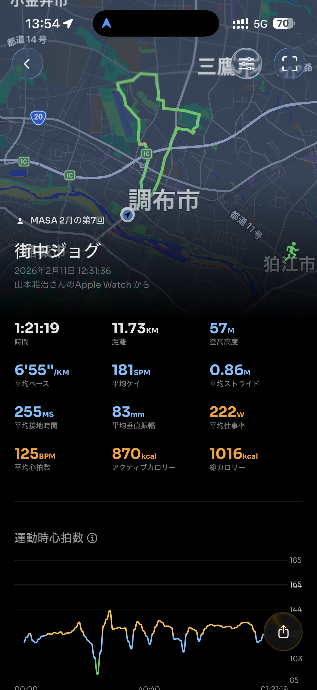
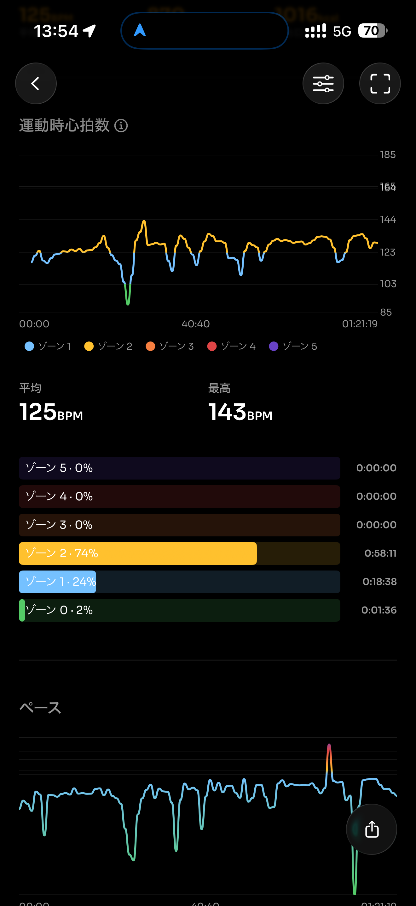
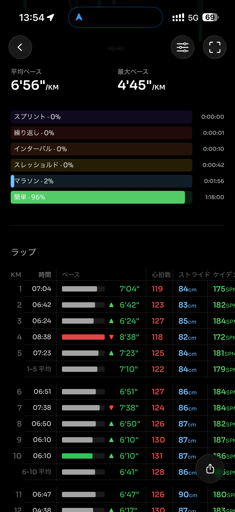
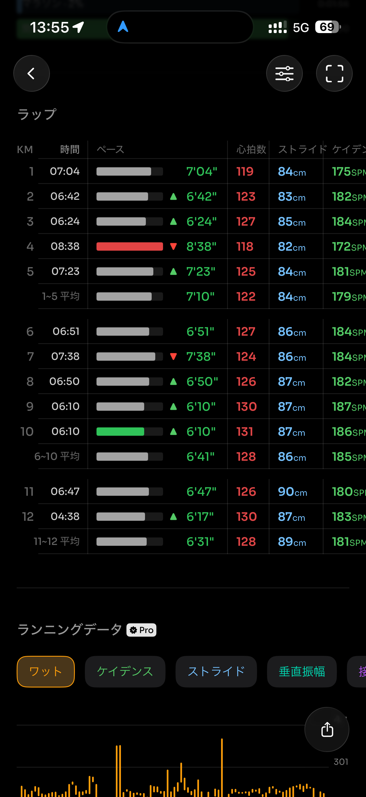
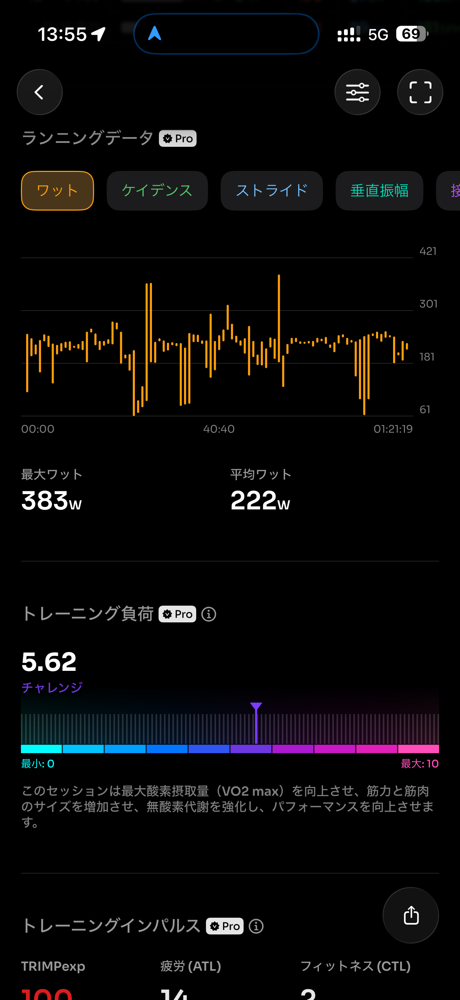
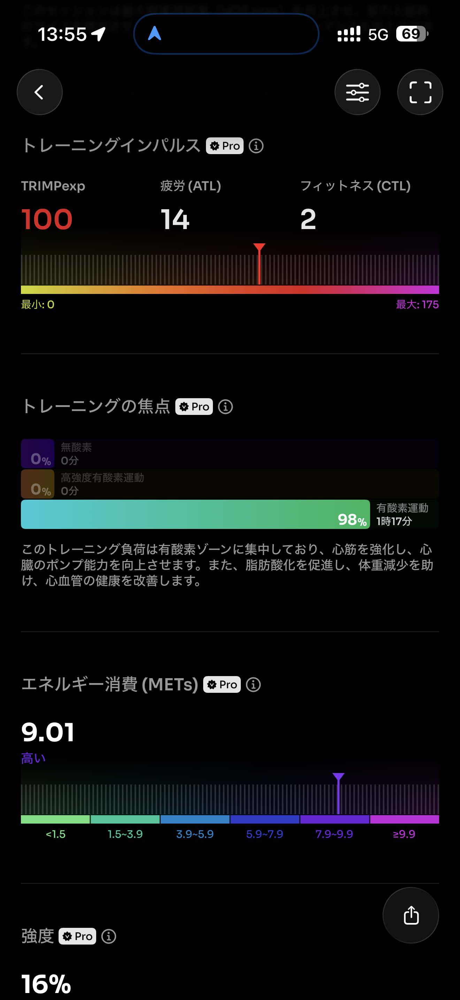
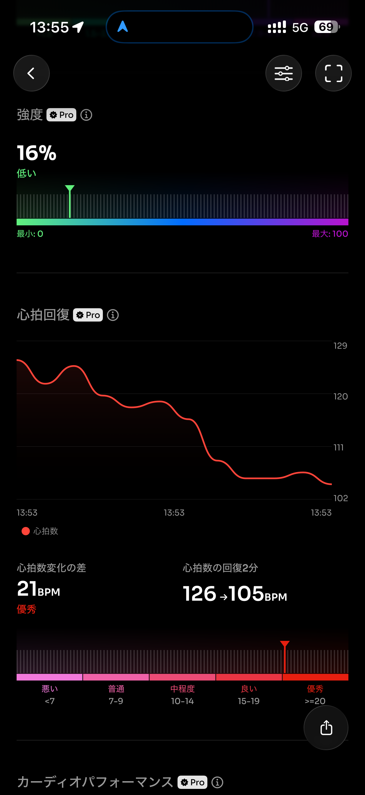
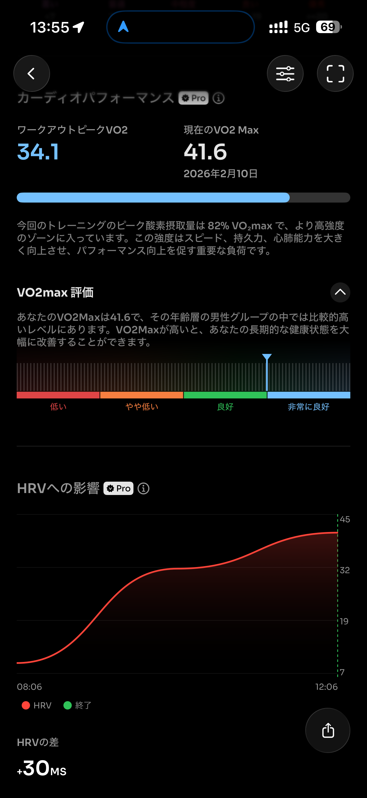
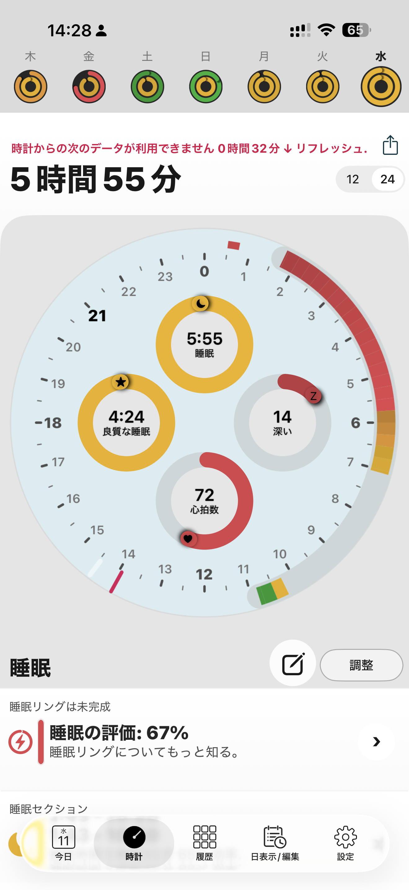
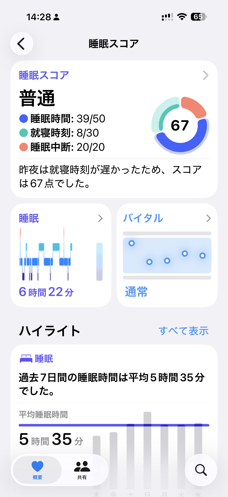
