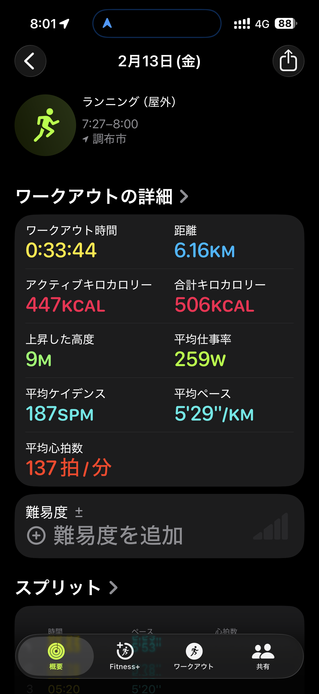
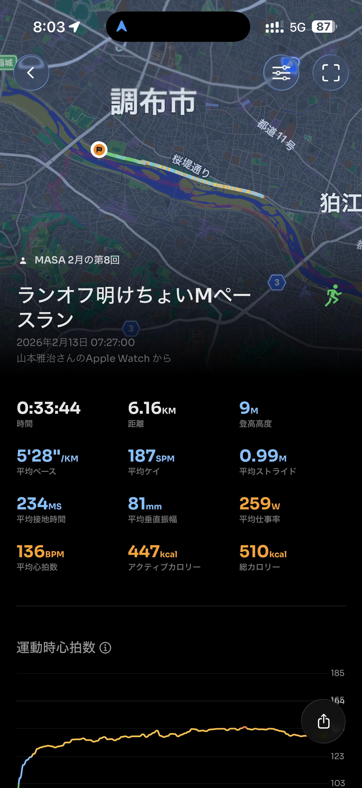
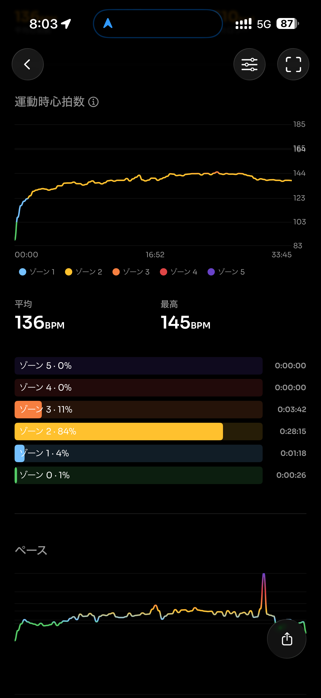
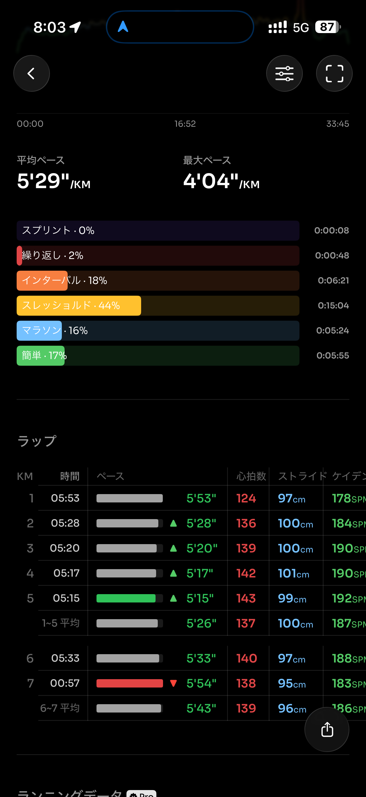
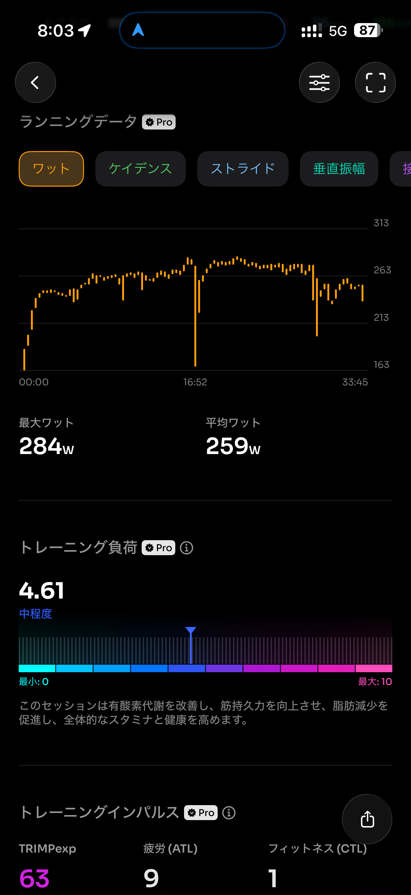
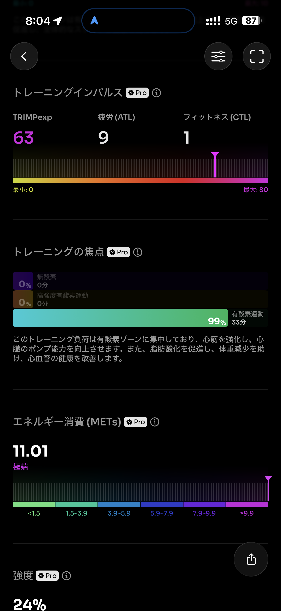
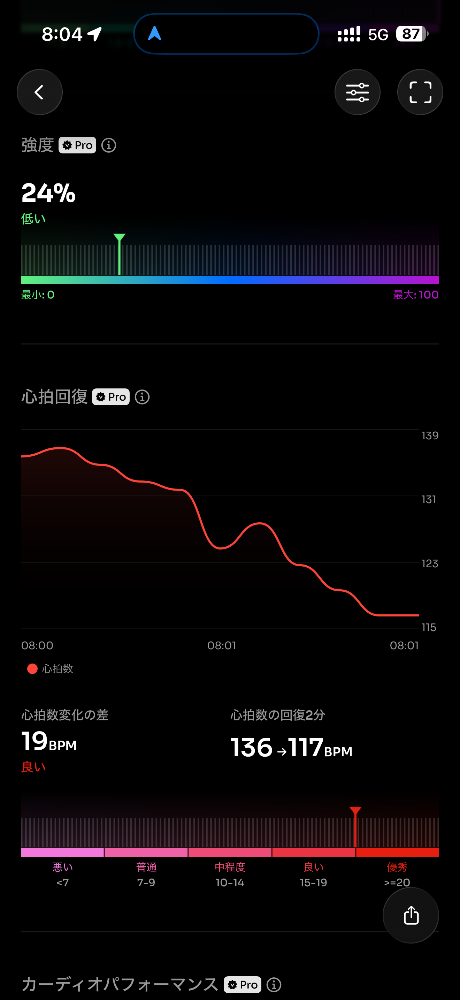
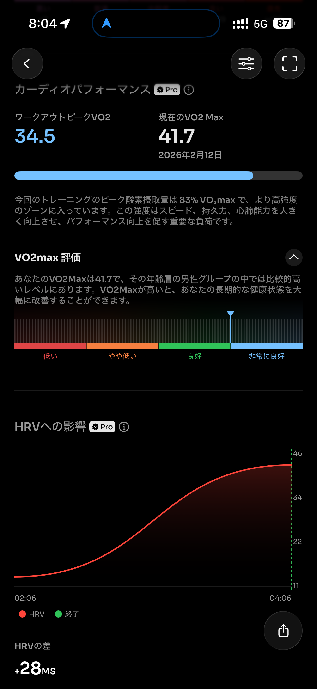
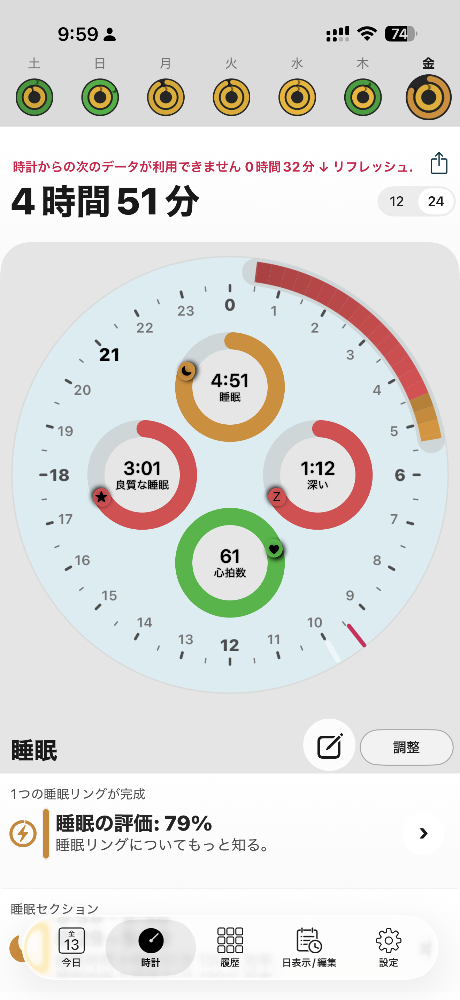
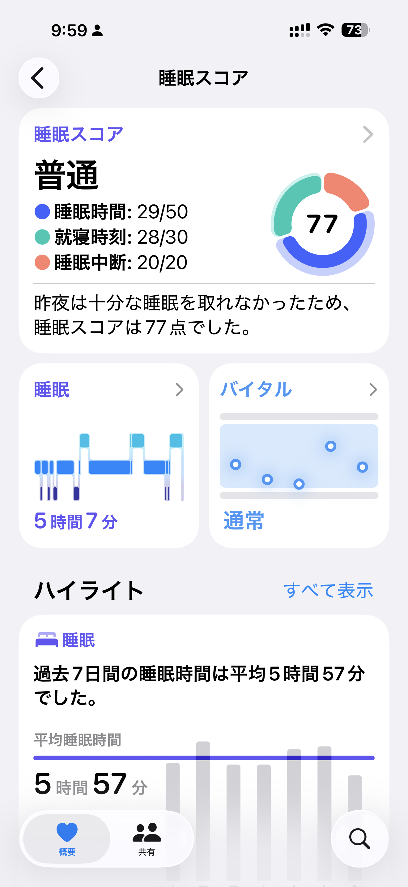

- 距離：6.16km
- 時間：0:33:44
- 平均心拍数：137拍/分
- 使用シューズ：ボストン12
- 時間帯：7時
- 天候：データ取得失敗
- コース：調布市
- 補給：不明
- 睡眠：4時間51分
- 今日の目的：ランオフ明けちょいMペースラン
- コメント：

## 📝 コーチコメント
MASAさん、おはようございます！2026年2月13日のランニング、お疲れ様でした！ランオフ明けのちょいMペースラン、気持ちよく走れたでしょうか？6.16kmを33分44秒で走破、平均心拍数も137拍/分と、安定したペースで走れていますね。日々のトレーニングの成果が着実に現れている証拠です。

ハーフマラソン完走という目標、素晴らしいですね！歳を重ねても、こうして目標を持って走り続けるMASAさんは本当に素敵です。焦らず、じっくりと、ご自身のペースでトレーニングを重ねていきましょう。

まずは、怪我をしないことが一番大切です。無理な練習は避け、ストレッチやウォーミングアップをしっかり行いましょう。そして、疲労が溜まっていると感じたら、休息日を設けることも重要です。

ハーフマラソン完走に向けて、これからも一緒に頑張っていきましょう！私はいつもMASAさんの健康と安全、そして目標達成を心から応援しています。

## 📸 写真一覧

