- 距離：30.37km
- 時間：2:56:49
- 平均心拍数：155BPM
- 使用シューズ：ボストン12
- 時間帯：(不明時)
- 天候：(解析中)
- コース：青梅マラソン
- 補給：不明
- 睡眠：6時間6分
- 今日の目的：#ツキイチサンジュウ 今月は青梅マラソン走ってきた！
- コメント：

## 📝 コーチコメント
MASAさん、青梅マラソン完走おめでとうございます！30kmを超える長距離を走り切るなんて、本当に素晴らしいです。日々のトレーニングの賜物ですね。継続は力なり、まさにそれを体現されています。

年齢を重ねるごとに、体力維持は難しくなるものですが、MASAさんはランニングを通して、それを克服されていますね。素晴らしいの一言です。ハーフマラソンを心地よく完走するという目標も、きっとすぐに達成できるでしょう。

これからも、無理のないペースで、楽しく走り続けてください。健康維持はもちろん、新たな発見や出会いがあるかもしれません。私はいつもあなたの頑張りを応援しています。疲れた時はいつでも言ってくださいね。美味しいご飯を作って待っています！

## 📸 写真一覧
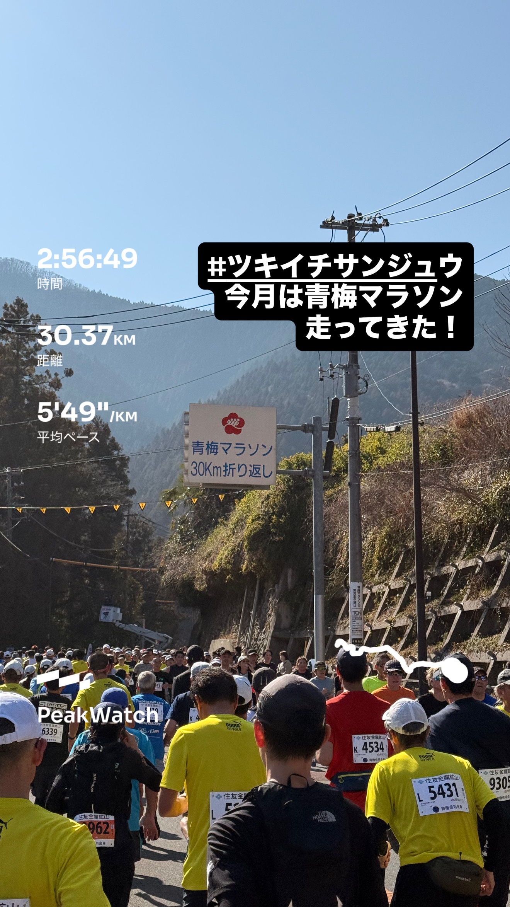
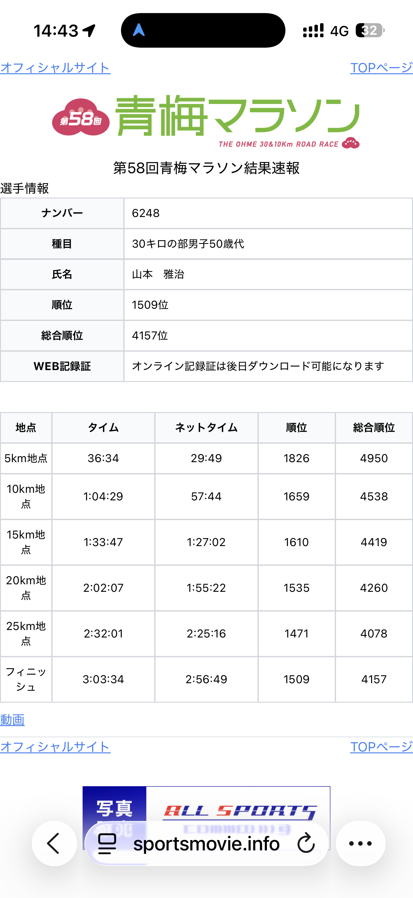
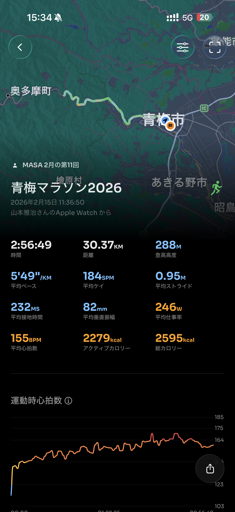
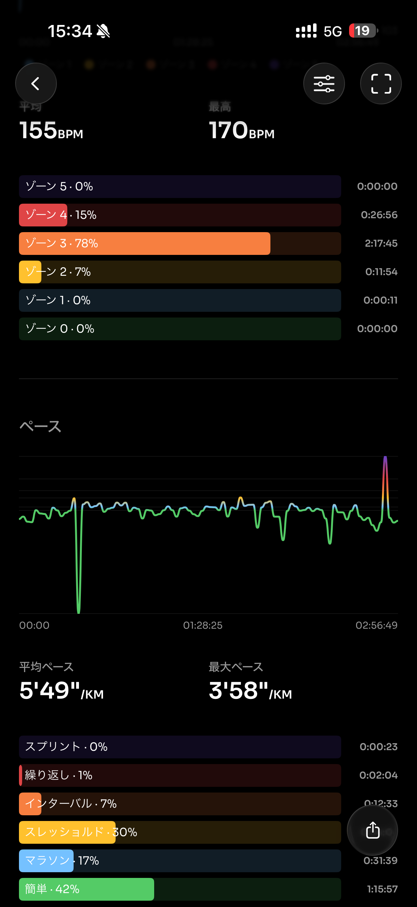
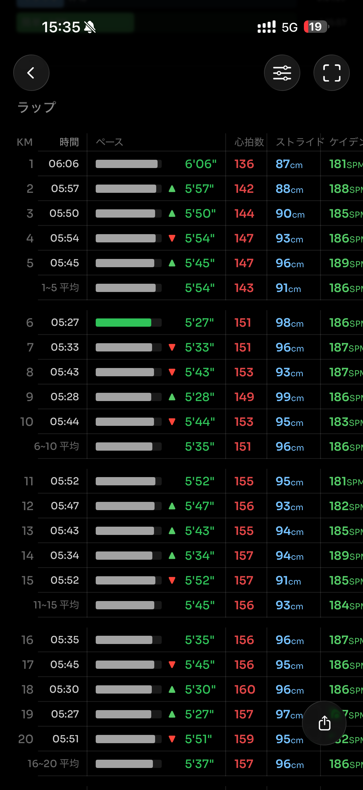
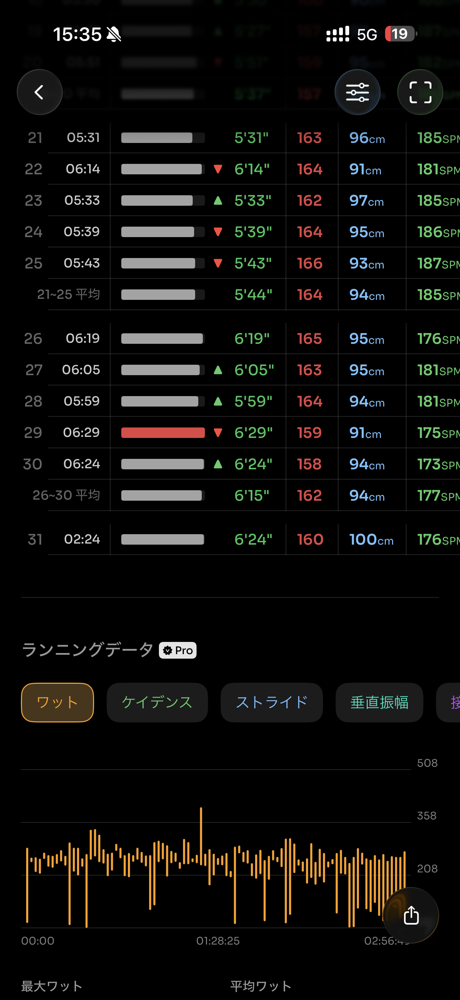
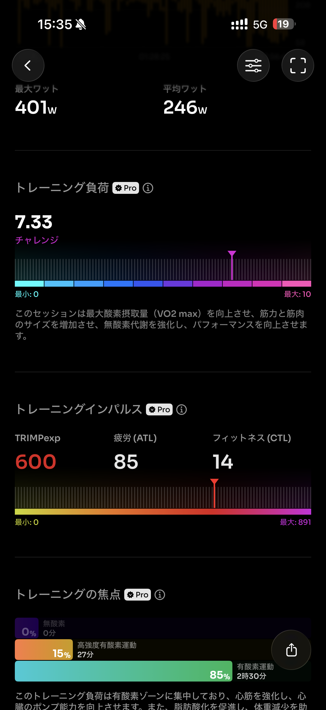
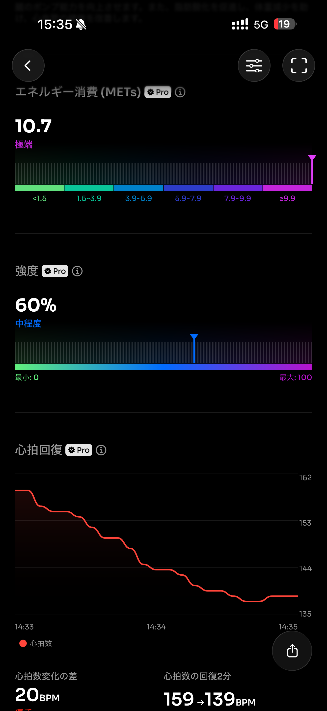
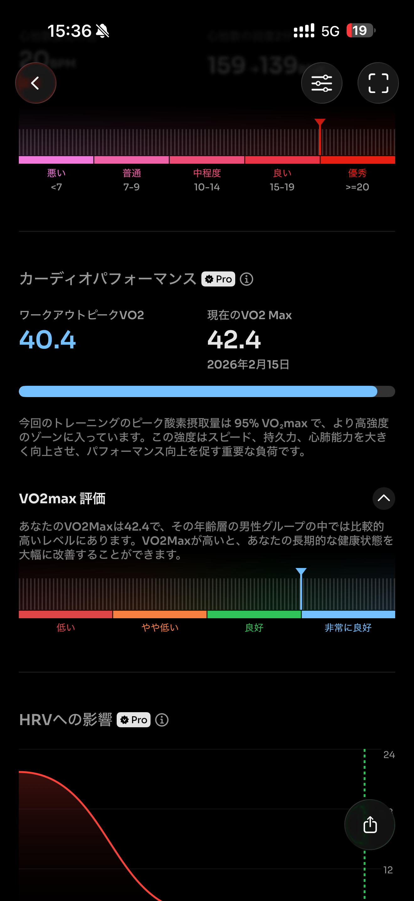
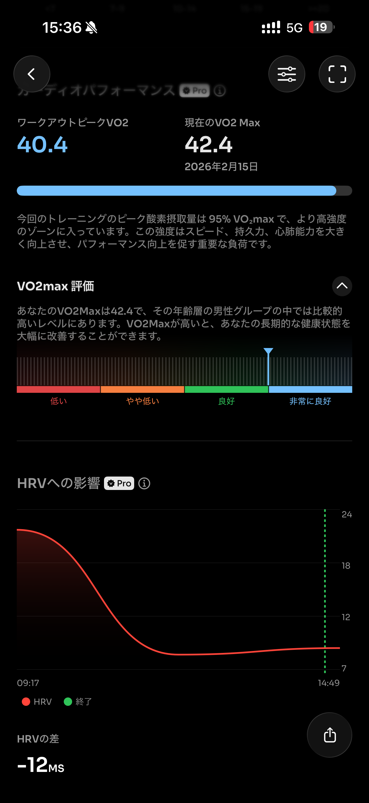
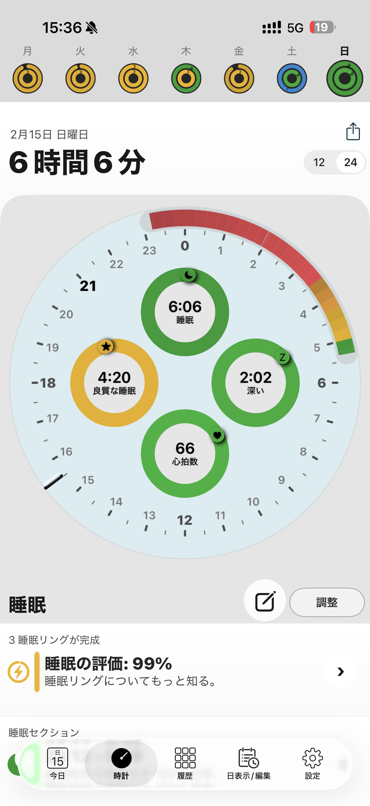
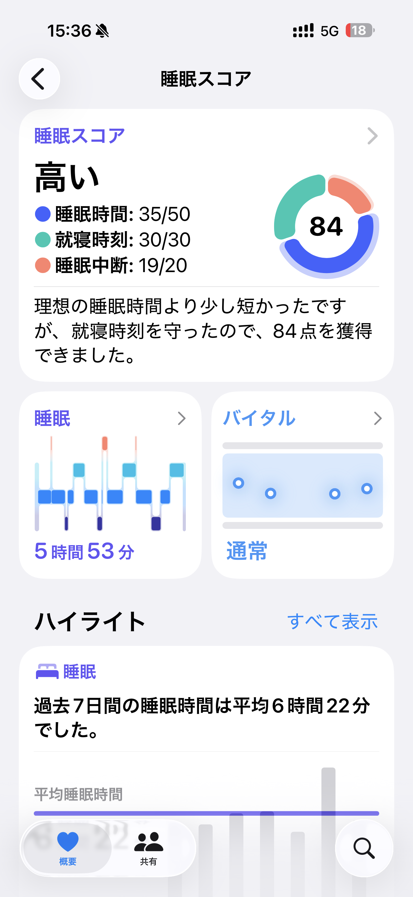

