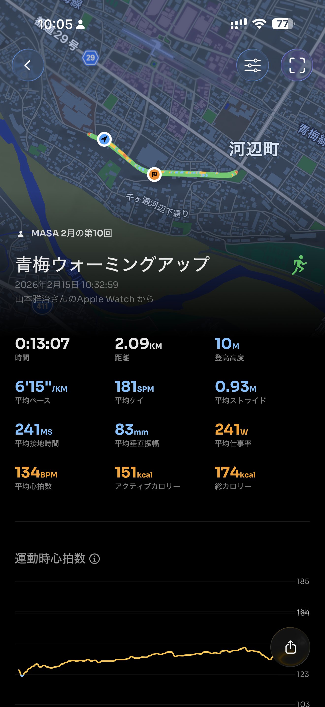
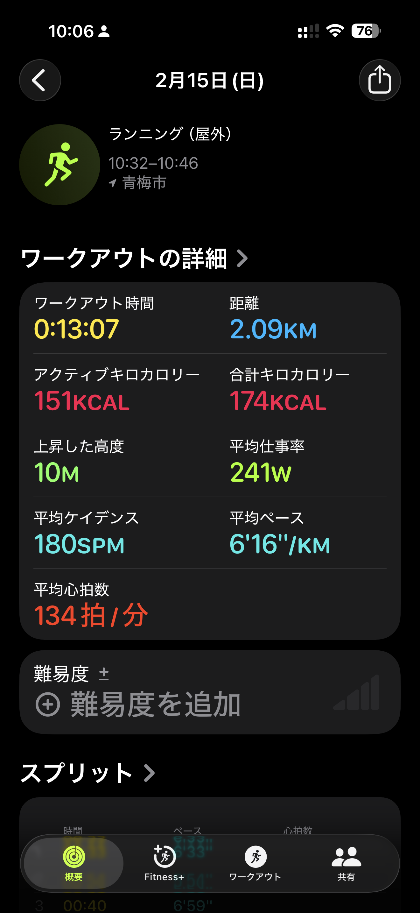

- 距離：2.09km
- 時間：0:13:07
- 平均心拍数：134BPM
- 使用シューズ：ボストン12
- 時間帯：(10時)
- 天候：データ取得失敗
- コース：
- 補給：
- 睡眠：不明
- 今日の目的：青梅ウォーミングアップ
- コメント：MASA 2月の第10回

## 📝 コーチコメント
MASAさん、今日のランニング、お疲れ様でした！2kmを少し超える距離を、気持ちの良いペースで走られましたね。心拍数も安定していて、ウォーミングアップには最適だったのではないでしょうか。

年齢を重ねても、こうしてランニングを続けられていること、本当に素晴らしいです。健康維持はもちろん、日々の生活に活力が湧いてくるはずです。無理せず、自分のペースで走り続けることが一番大切です。

目標のハーフマラソン完走に向けて、焦らずじっくりとトレーニングを重ねていきましょう。まずは、今のペースを維持しながら、少しずつ距離を伸ばしていくのがおすすめです。体調に合わせて、休息日もきちんと取るようにしてくださいね。

ハーフマラソンを心地よく完走するために、私ができるサポートは惜しみません。いつでも相談してください。応援しています！

## 📸 写真一覧

