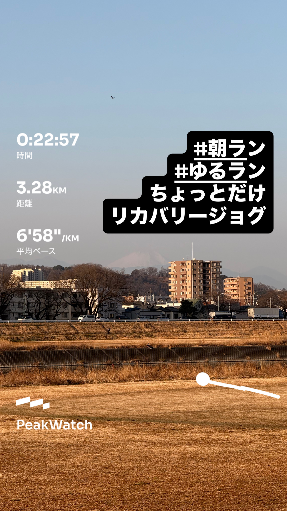
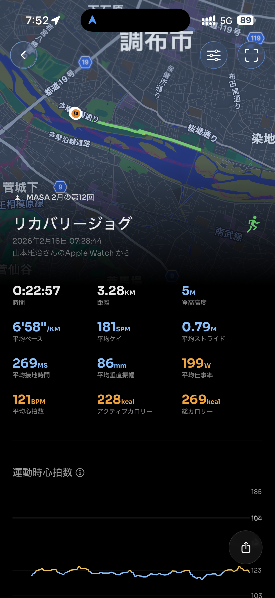
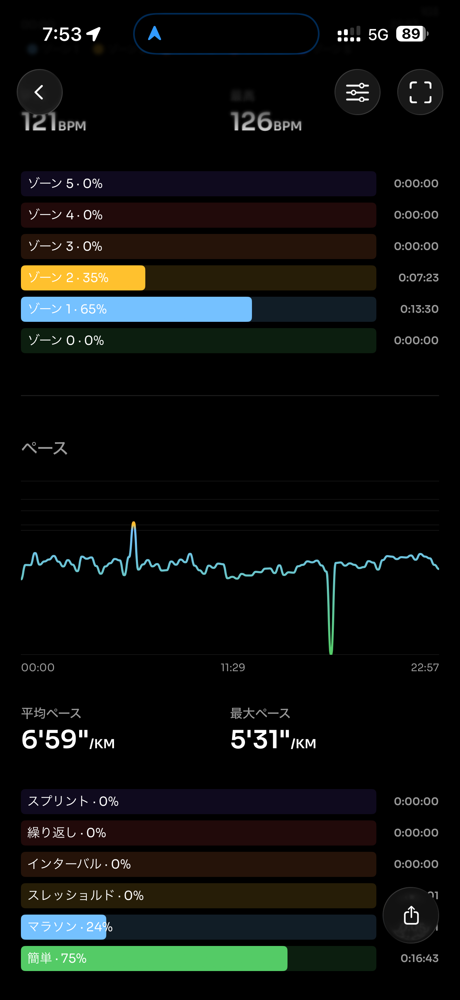
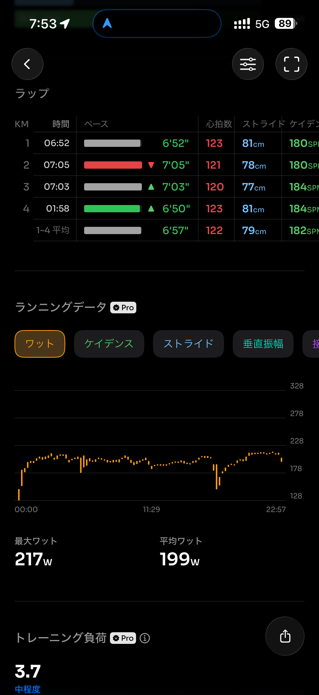
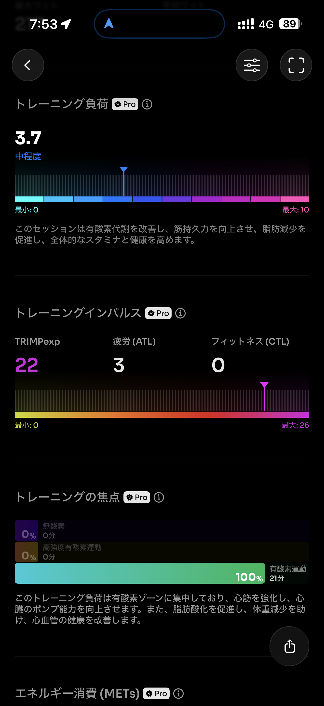
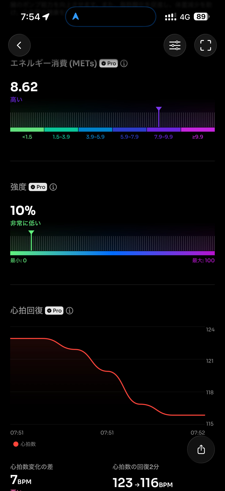
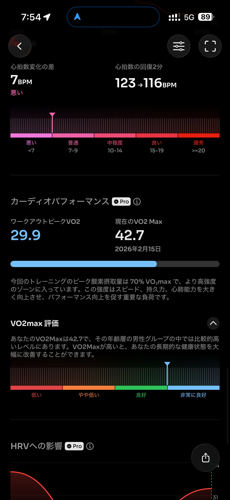
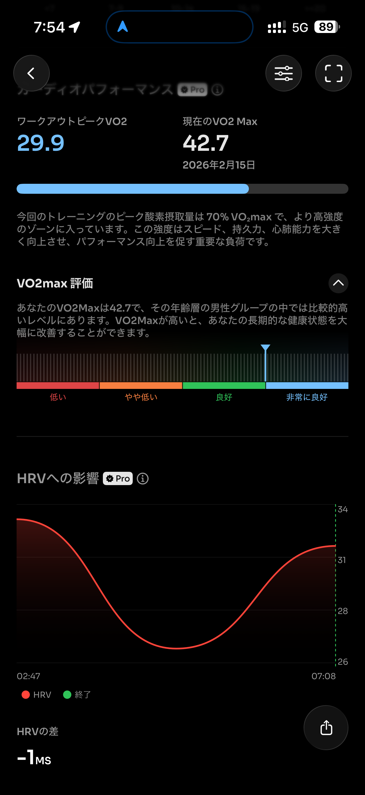
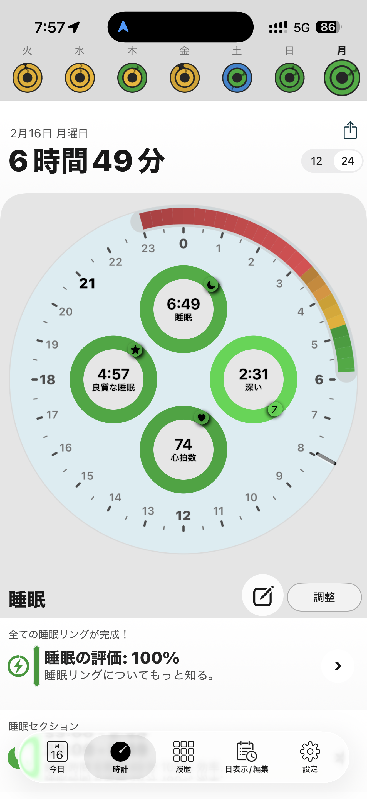
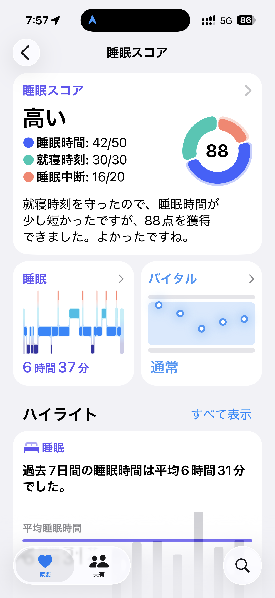

- 距離：3.28km
- 時間：0:22:57
- 平均心拍数：121BPM
- 使用シューズ：インフィニットプロ
- 時間帯：7時
- 天候：7時頃: 気温: 8.9℃, 風速: 16.9m/s
- コース：
- 補給：
- 睡眠：6時間49分
- 今日の目的：
- コメント：

## 📝 コーチコメント
MASAさん、おはようございます！2026年2月16日のランニング、お疲れ様でした。7時台の朝ラン、気持ちよかったでしょうね！3.28kmの道のりを軽快に走り抜けていて素晴らしいです。平均心拍数も落ち着いていて、リカバリージョグに最適だったようですね。睡眠も6時間以上とれていて、体調も万全のようですね。

年齢を重ねてもこうして走り続けられるのは、日々の努力の賜物です。健康維持はもちろん、精神的な充実感も得られていることでしょう。これからもご自身のペースで、ランニングを楽しんでくださいね！ハーフマラソン完走に向けて、引き続き応援しています！

## 📸 写真一覧

