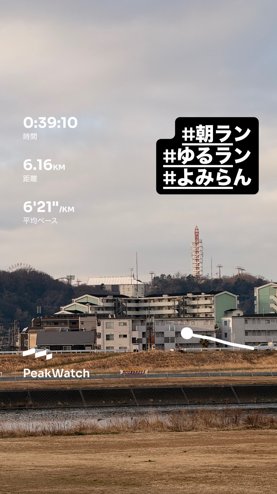
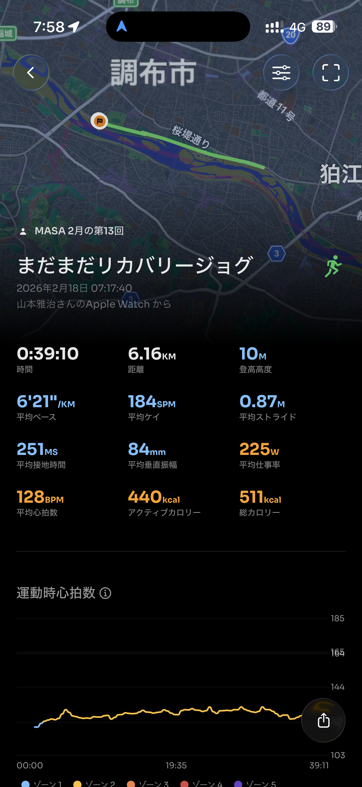
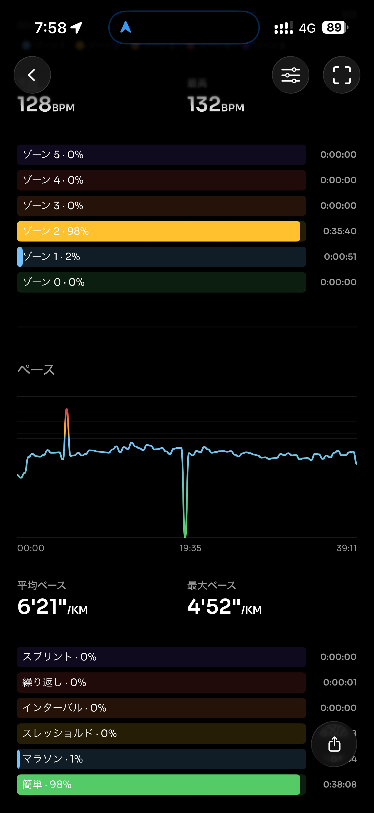
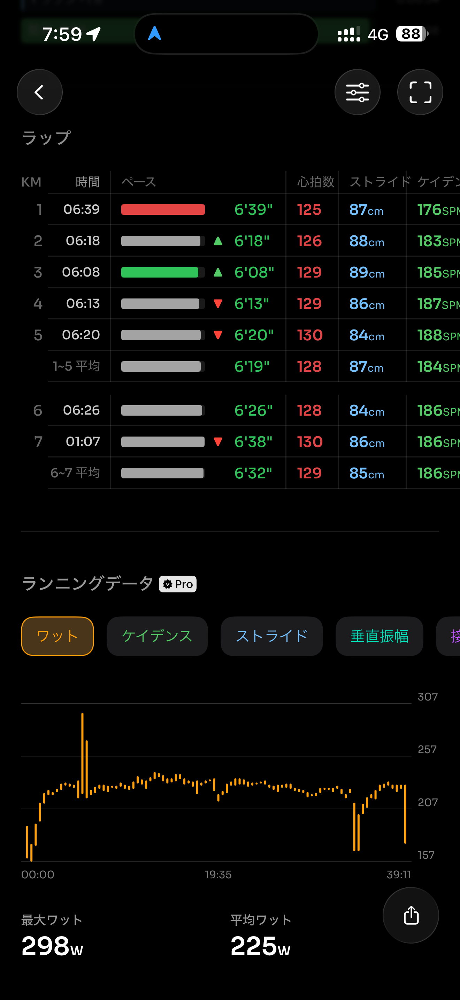
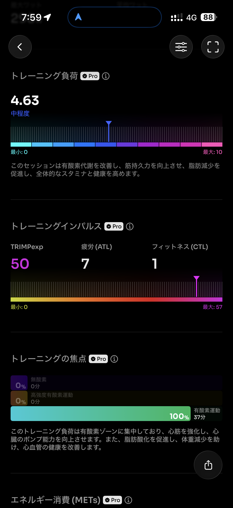
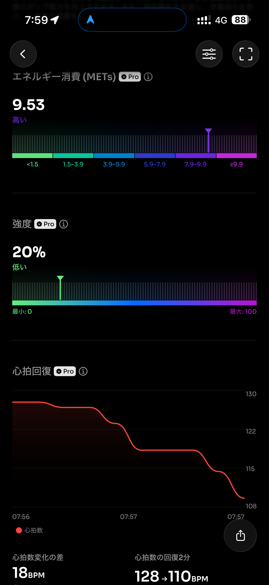
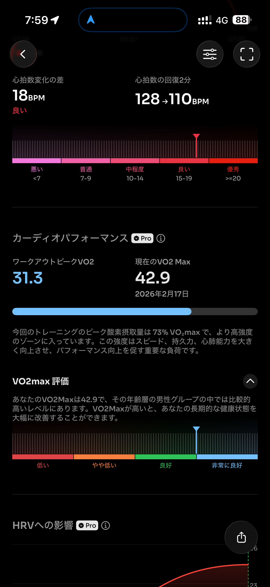
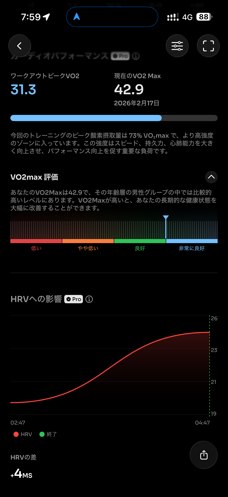
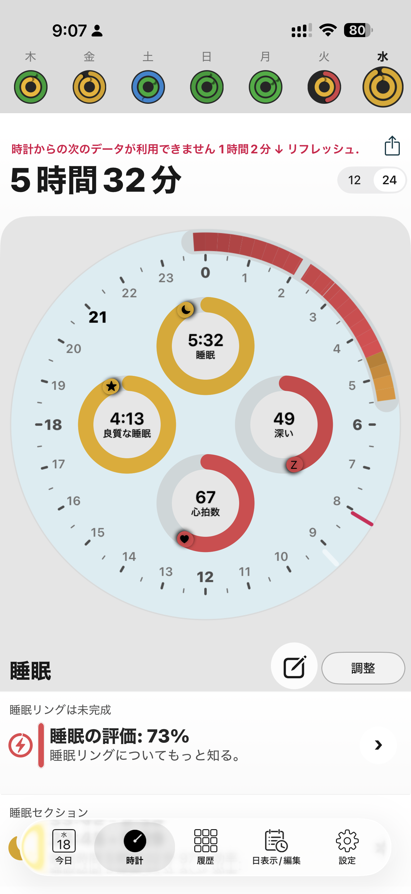
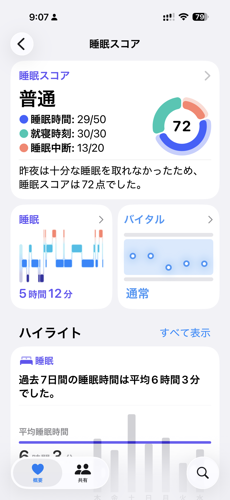

- 距離：6.16km
- 時間：0:39:10
- 平均心拍数：128BPM
- 使用シューズ：インフィニットプロ
- 時間帯：07時
- 天候：7時頃: 気温: 2.8℃, 風速: 6.3m/s
- コース：
- 補給：
- 睡眠：5時間32分
- 今日の目的：
- コメント：

## 📝 コーチコメント
MASAさん、おはようございます！2026年2月18日のランニング、お疲れ様でした！6.16kmの距離を39分10秒で走破、素晴らしいですね。平均心拍数も128BPMと、リラックスしたジョギングだったことが伺えます。リカバリージョグとのことですが、しっかりと身体を動かすことができていて感心します。

日々の努力が、着実にハーフマラソン完走へと繋がっているはずです。焦らず、ご自身のペースでトレーニングを続けてください。大切なのは、楽しむこと！ランニングを生涯の趣味として、これからも一緒に走り続けましょう。体調に気を付けて、次のランも楽しんでくださいね！応援しています！

## 📸 写真一覧

