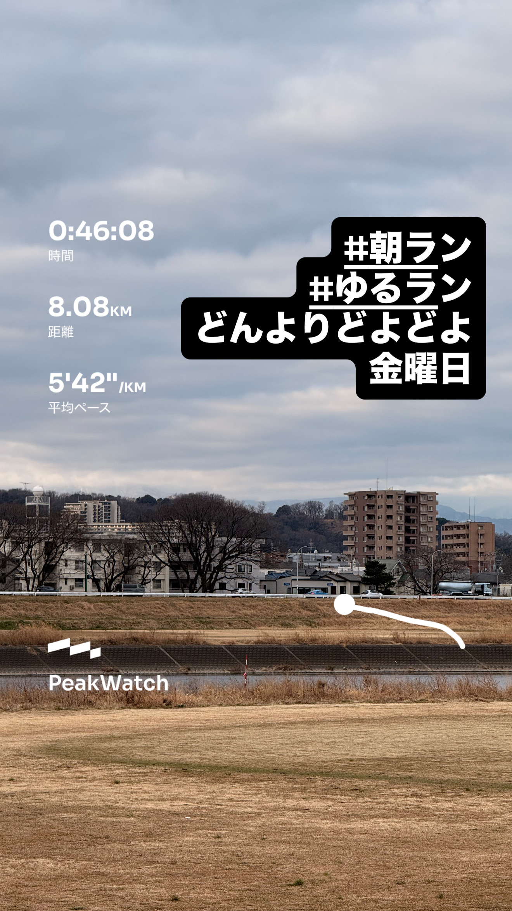
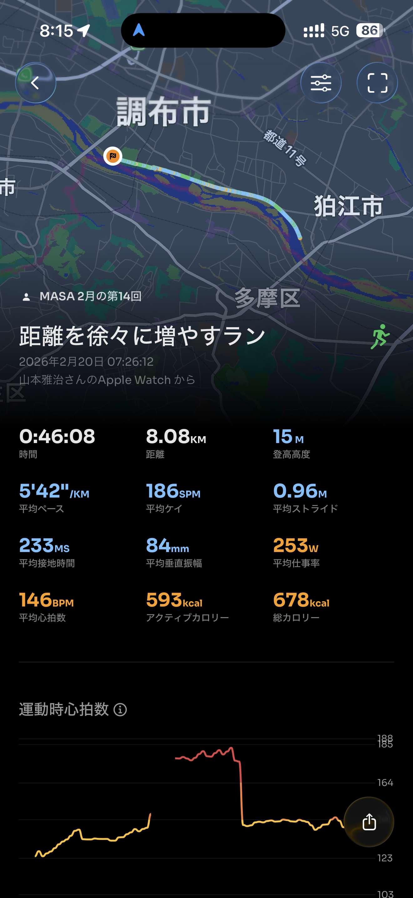
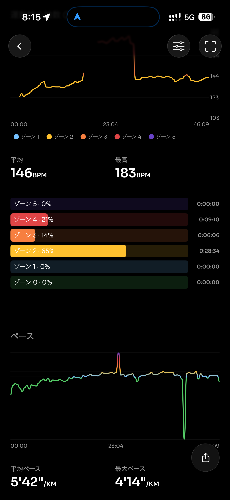
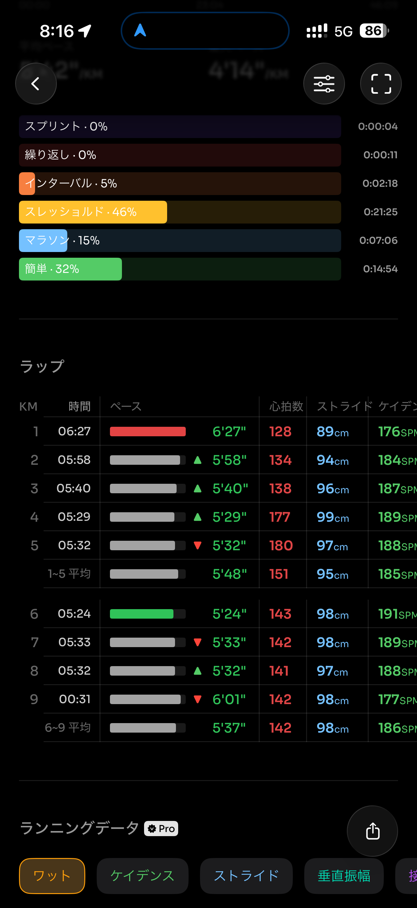
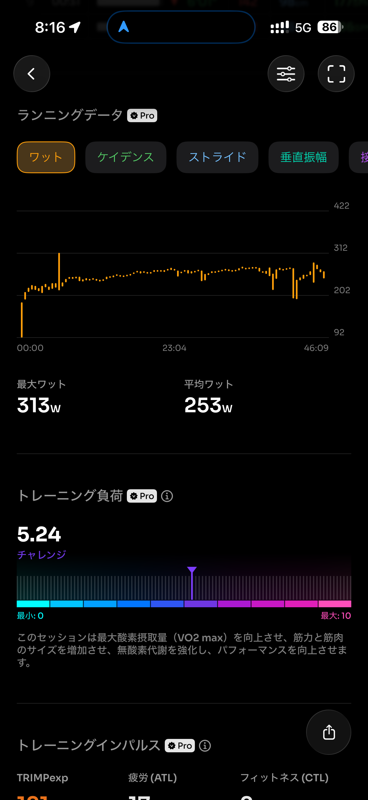
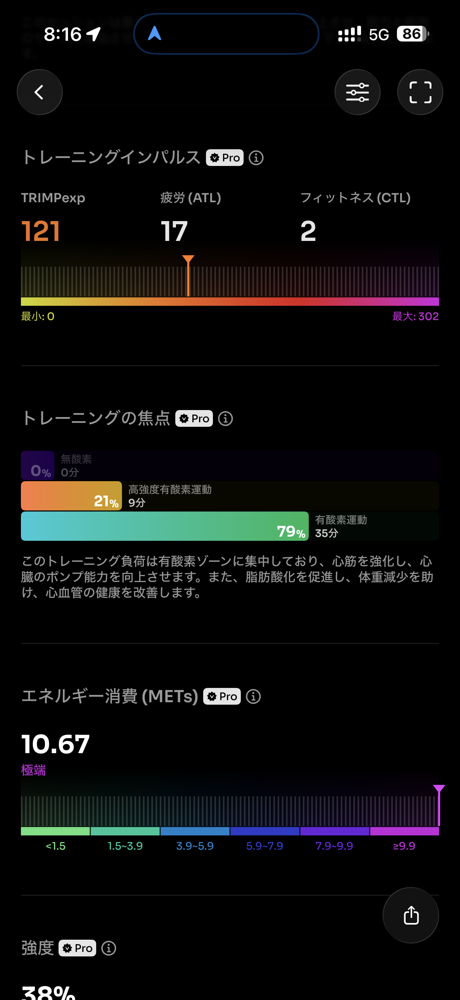
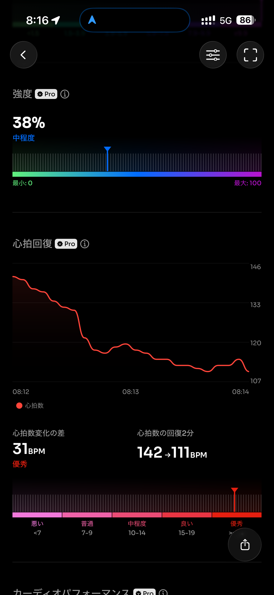
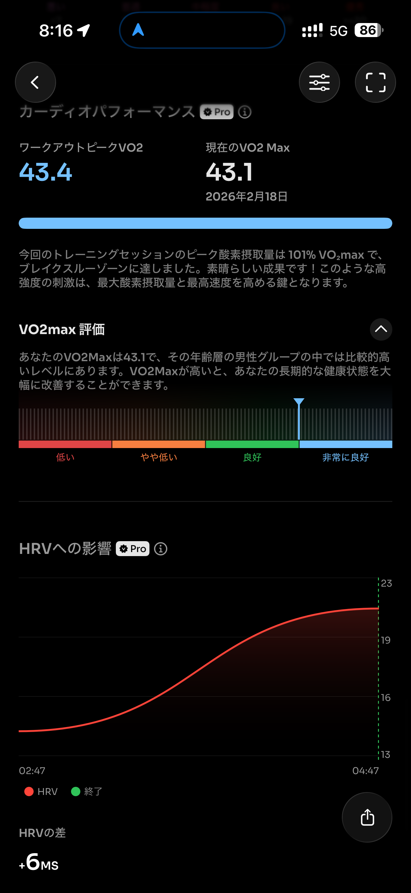
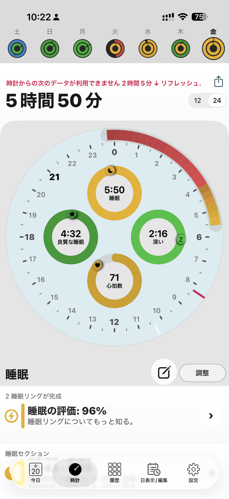
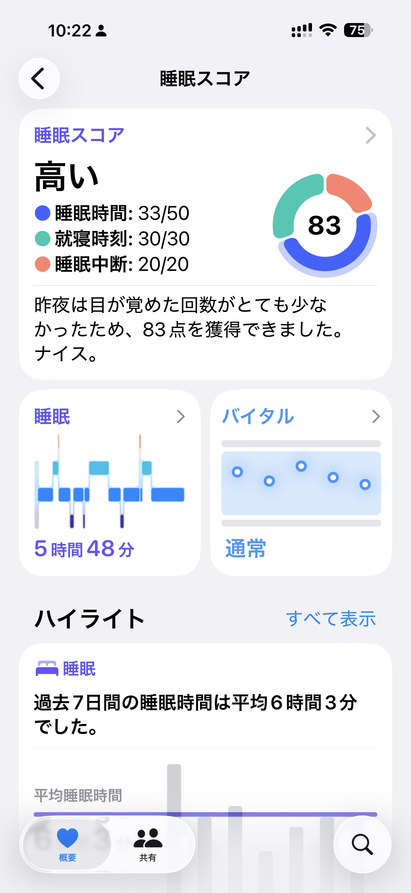

- 距離：8.08km
- 時間：0:46:08
- 平均心拍数：146BPM
- 使用シューズ：スーパーノヴァ
- 時間帯：朝
- 天候：(解析中)
- コース：
- 補給：
- 睡眠：5時間50分
- 今日の目的：
- コメント：

## 📝 コーチコメント
MASAさん、おはようございます！2026年もランニングライフを楽しんでいらっしゃいますね。朝の7時台から8km以上も走るなんて、本当に素晴らしいです。平均心拍数も安定していて、トレーニングの成果が着実に現れているのがわかります。

ハーフマラソン完走に向けて、この調子で少しずつ距離を伸ばしていくと良いでしょう。焦らず、自分のペースで、そして何よりも楽しく走り続けることが大切です。歳を重ねても、こうして健康に走り続けられるのは本当に素晴らしいこと。私も全力で応援しています！次のハーフマラソン、きっと完走できますよ！頑張ってください！

## 📸 写真一覧

