- 距離：20.10km
- 時間：2:22:05
- 平均心拍数：134 拍/分
- 使用シューズ：スーパーノヴァ
- 時間帯：朝
- 天候：(解析中)
- コース：井の頭公園往復
- 補給：
- 睡眠：6時間5分
- 今日の目的：
- コメント：

## 📝 コーチコメント
MASAさん、おはようございます！20km超えのラン、本当にお疲れ様でした！井の頭公園の景色を楽しみながらのランニング、想像するだけで気持ちが良いです。平均心拍数も安定していて、素晴らしいですね。

ハーフマラソン完走という目標、素晴らしいです！年齢を重ねるごとに、体力維持や健康管理は重要になってきますが、MASAさんはランニングを通してそれを実践されている。本当に素晴らしいです。

ハーフマラソンに向けて、無理のない範囲で少しずつ距離を伸ばしていくのも良いでしょう。そして、何よりも楽しむことを忘れずに！応援しています！

## 📸 写真一覧
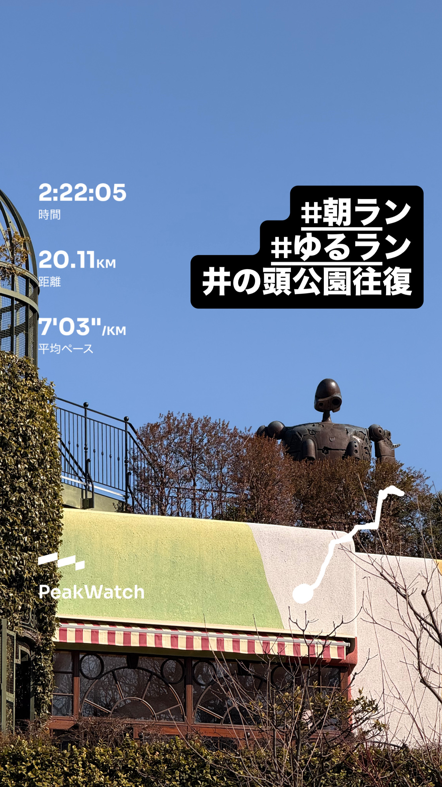
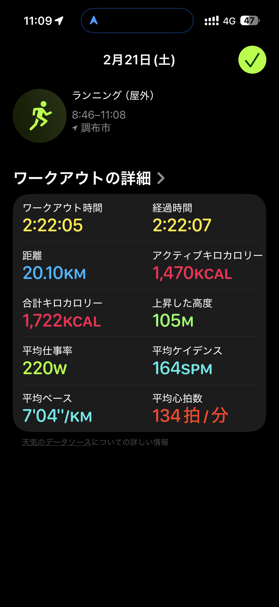
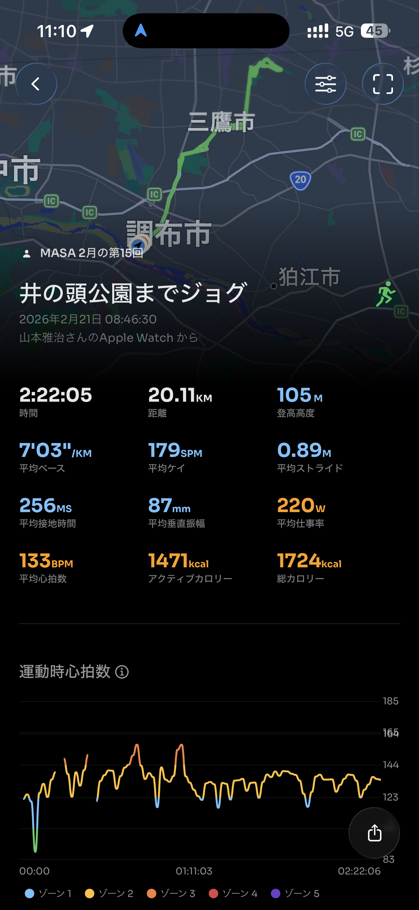
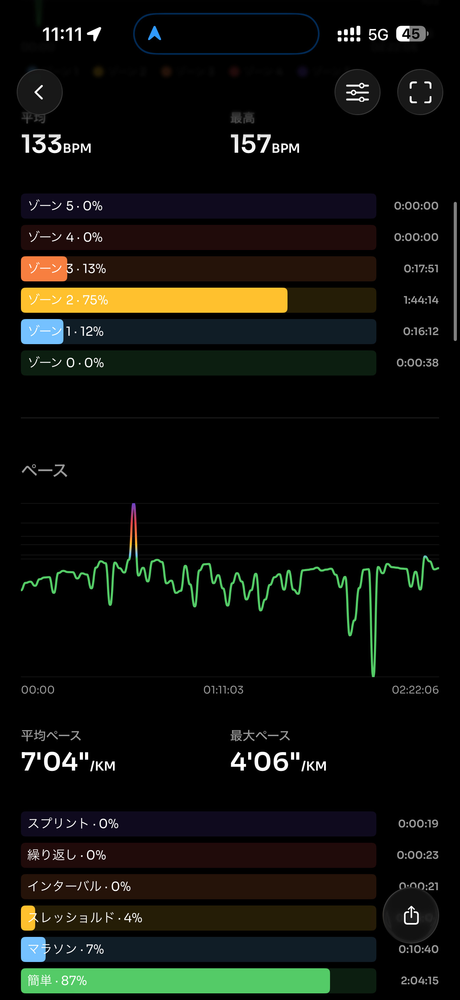
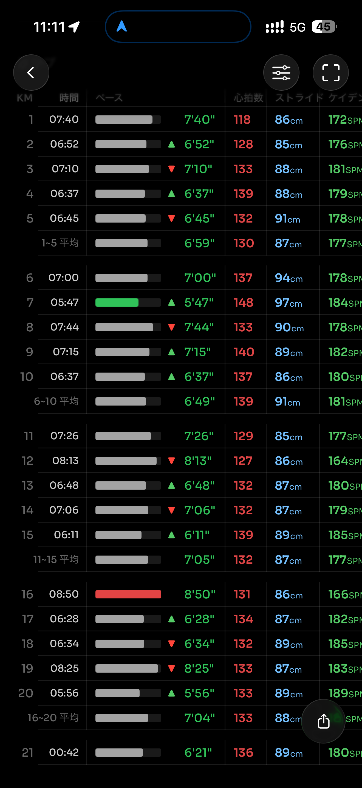
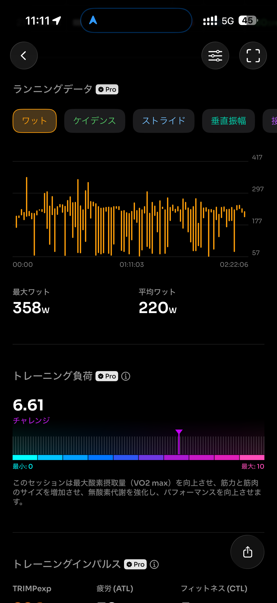
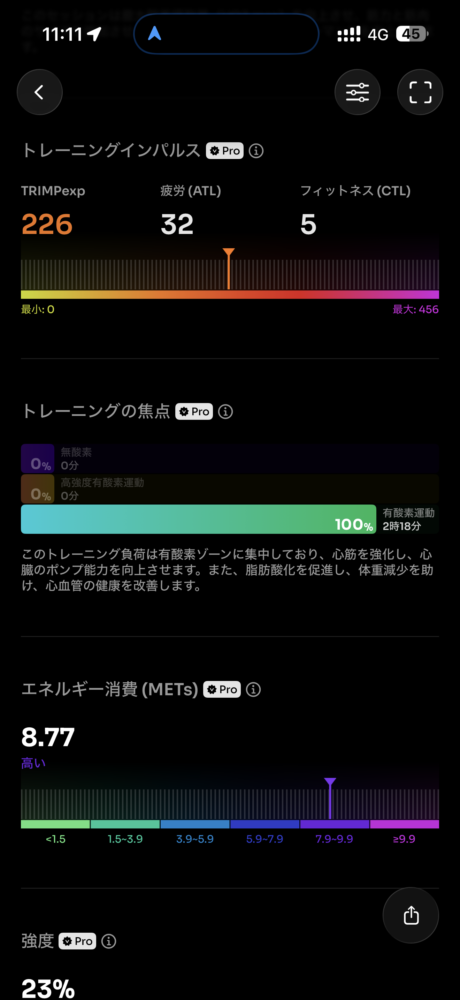
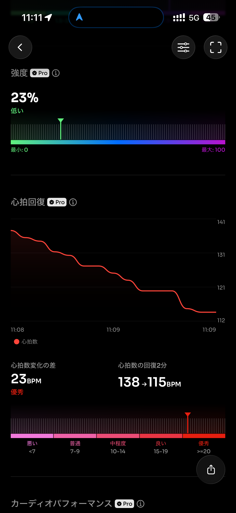
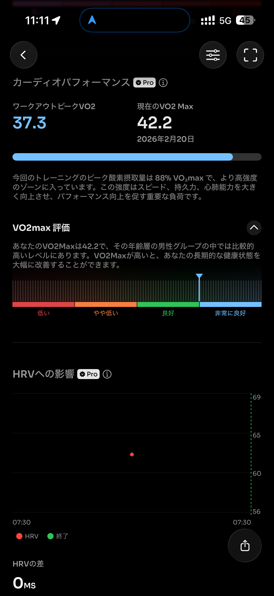
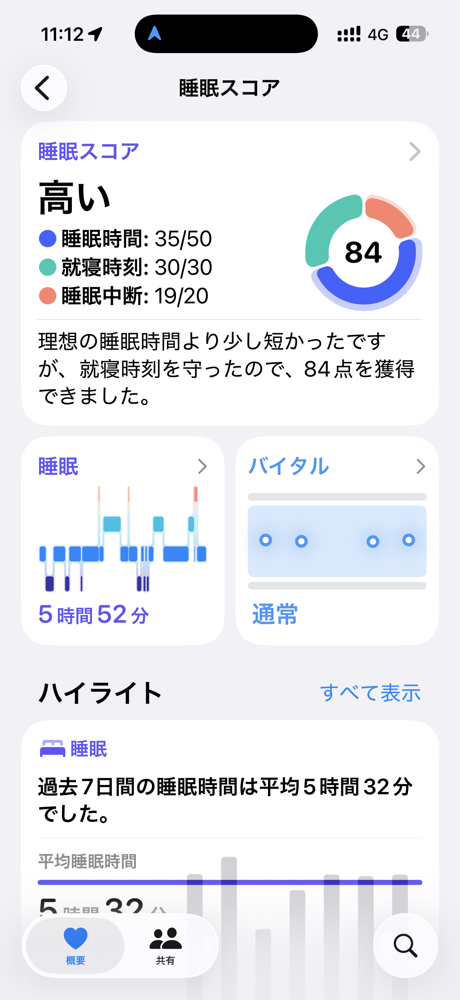
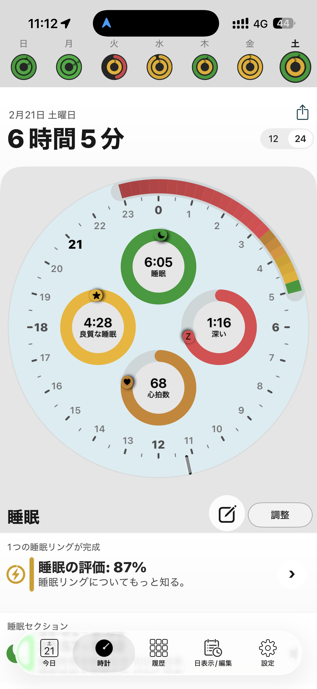
