- 距離：6.09km
- 時間：0:33:11
- 平均心拍数：145拍/分
- 使用シューズ：インフィニットプロ
- 時間帯：7時
- 天候：7時頃: 気温: 8.6℃, 風速: 9.6m/s
- コース：
- 補給：
- 睡眠：4時間16分
- 今日の目的：
- コメント：4日ぶりのラン、お疲れ様でした！富士山を見ながらのランニング、気持ちよさそうですね。3日もランオフだったとのことですが、6kmしっかりと走られていますね。

## 📝 コーチコメント
MASAさん、おはようございます！4日ぶりのラン、本当にお疲れ様でした。3日間のランオフ明けとのことですが、6kmを軽快に走り切るあたり、さすがですね！写真には美しい富士山も写っていて、清々しい朝の空気が伝わってきます。年齢を重ねるごとに、どうしても体の変化を感じることもあるかもしれませんが、MASAさんのように、こうしてランニングを習慣にされていることは、本当に素晴らしいです。無理せず、ご自身のペースで、これからも走り続けてくださいね。ハーフマラソン完走に向けて、私も全力で応援します！体調管理をしっかりとして、目標に向かって楽しく走りましょう！

## 📸 写真一覧
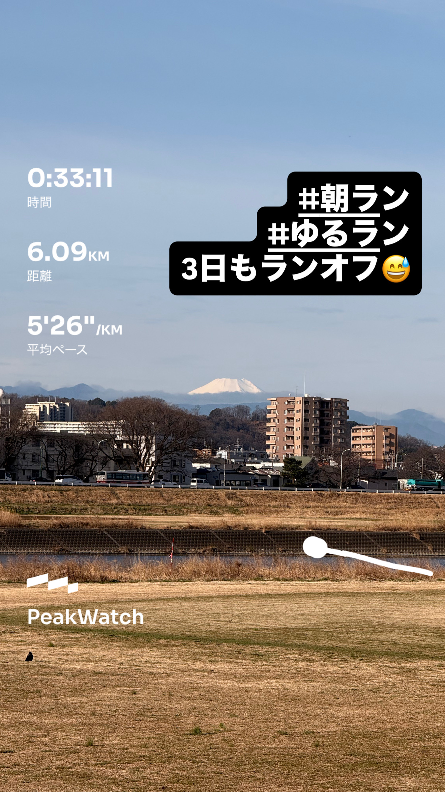
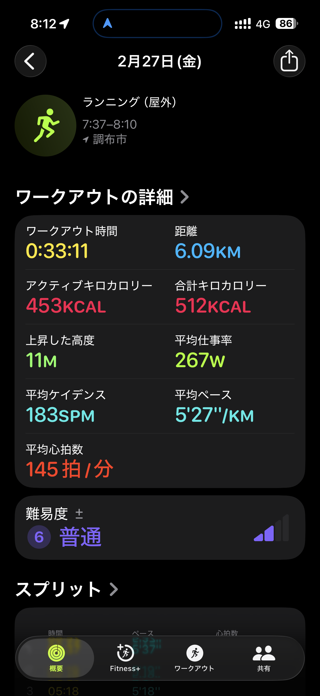
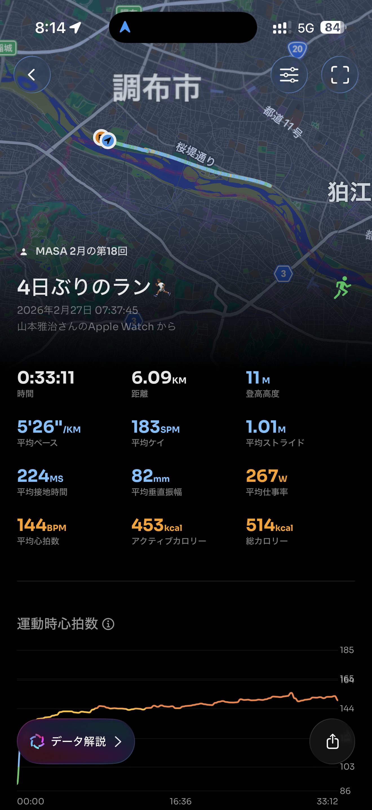
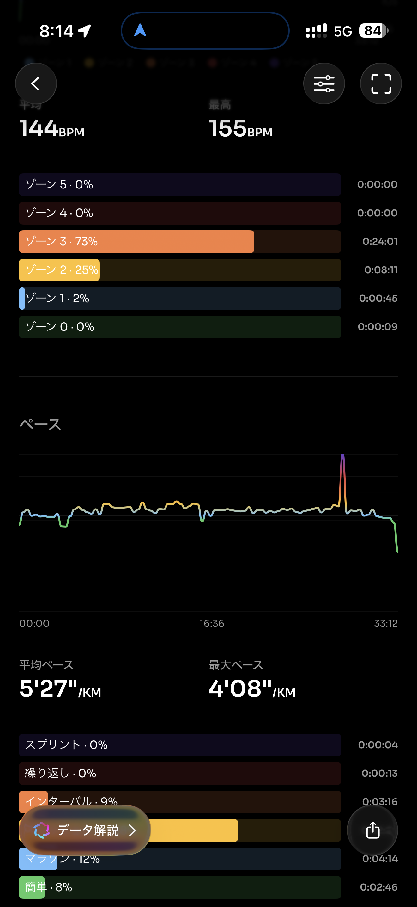
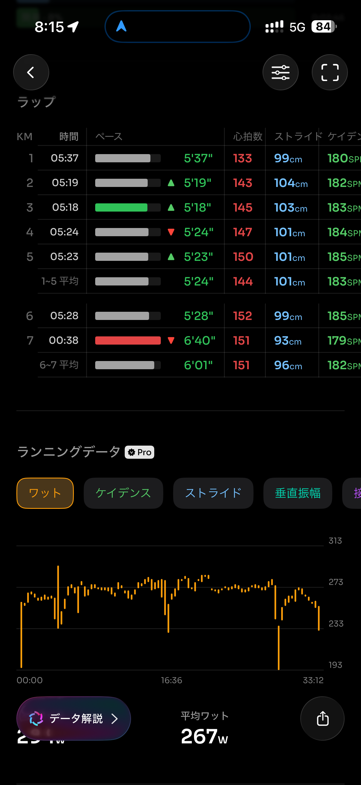
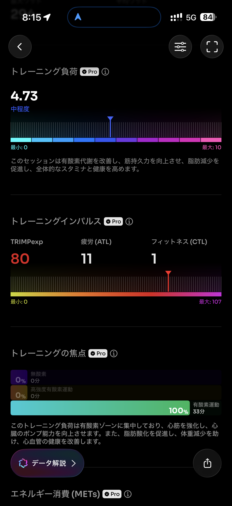
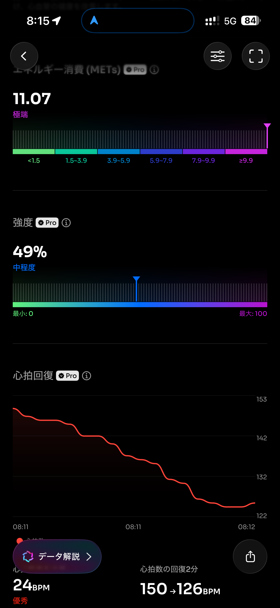
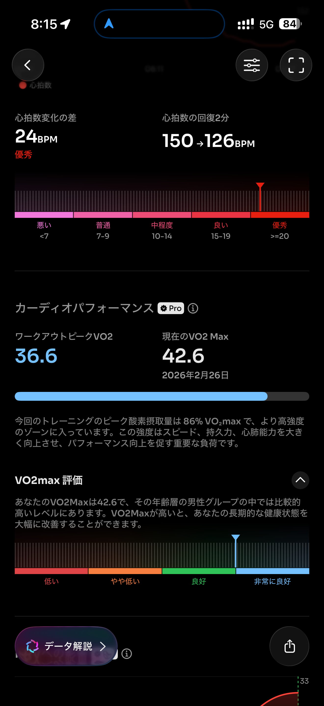
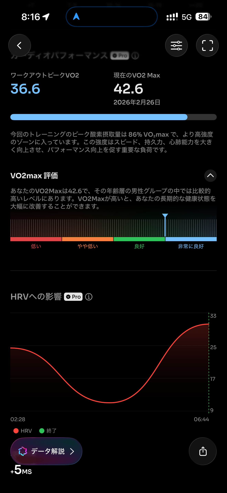
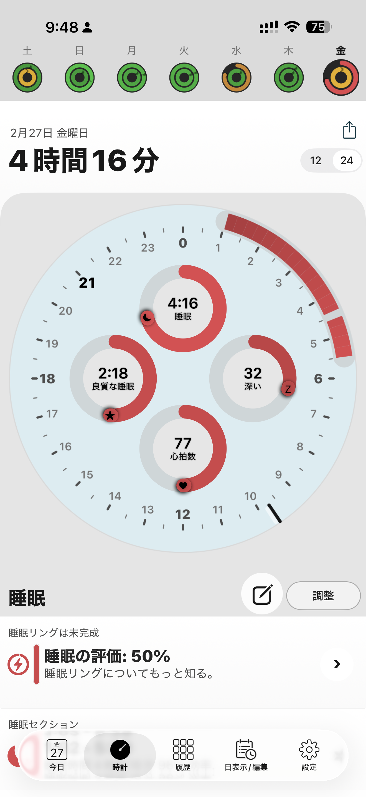
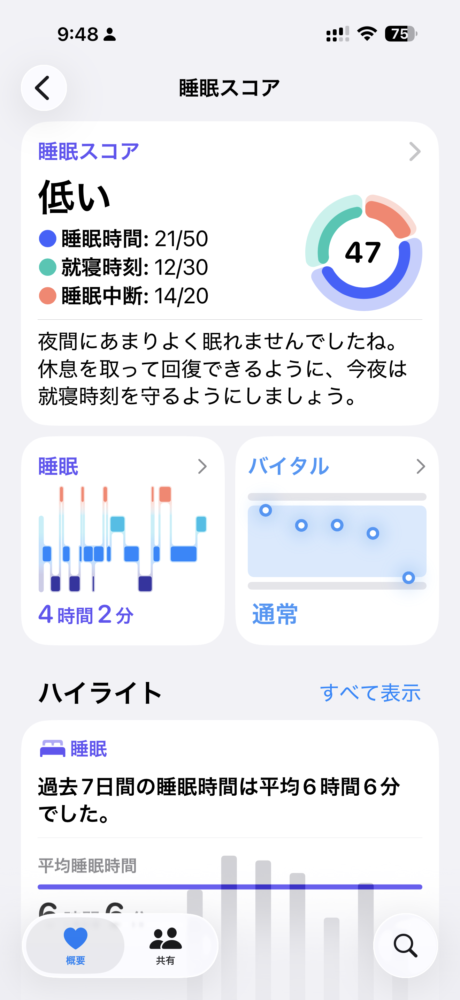
