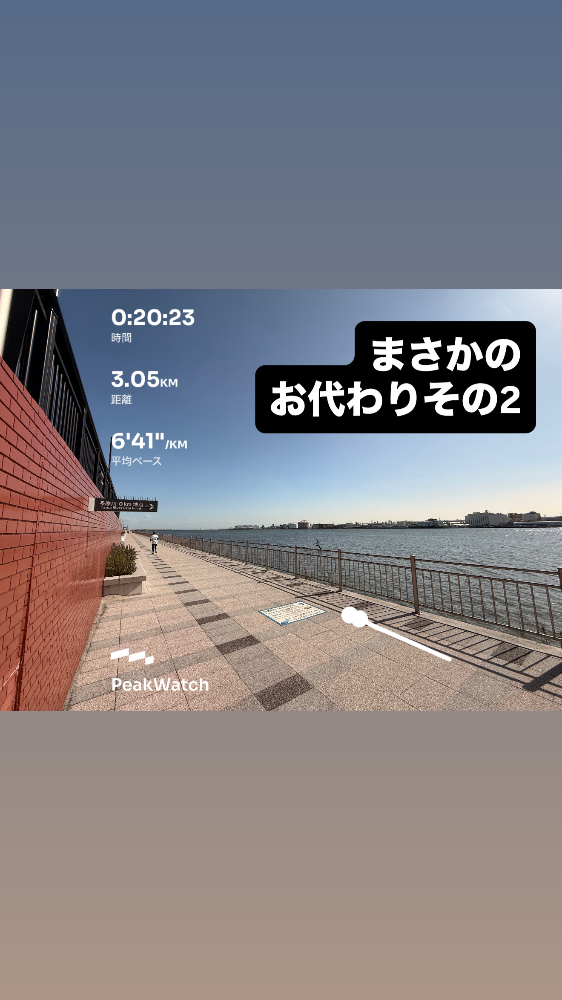
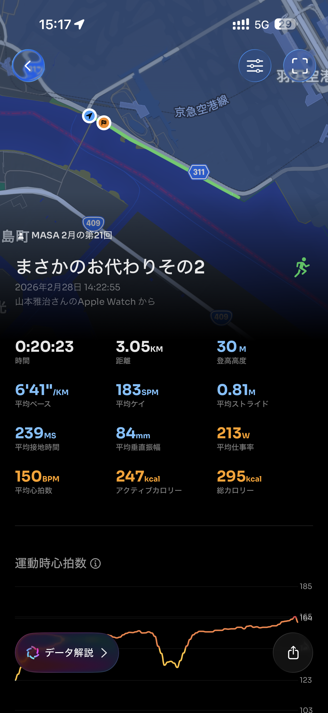
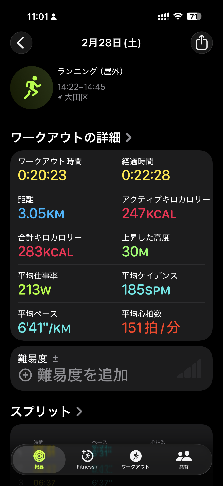

- 距離：3.05km
- 時間：0:20:23
- 平均心拍数：151BPM
- 使用シューズ：スーパーノヴァ
- 時間帯：早朝
- 天候：(解析中)
- コース：
- 補給：
- 睡眠：
- 今日の目的：
- コメント：

## 📝 コーチコメント
MASAさん、ランニングお疲れ様でした！3kmのラン、素晴らしいですね。毎日の積み重ねが、着実に体力向上に繋がっていますよ。平均心拍数も安定していて、良いペースで走れている証拠ですね。

年齢を重ねるごとに、体力維持は重要になってきます。MASAさんのように、ランニングを習慣にされているのは本当に素晴らしいです。無理せず、自分のペースで、これからも楽しく走り続けてくださいね。

特に、ハーフマラソン完走という目標、心から応援しています！目標に向かって努力する姿は、周りの人にも良い影響を与えます。体調に気を配りながら、着実にトレーニングを重ねて、ぜひ目標を達成してください！私も全力でサポートします！

## 📸 写真一覧

