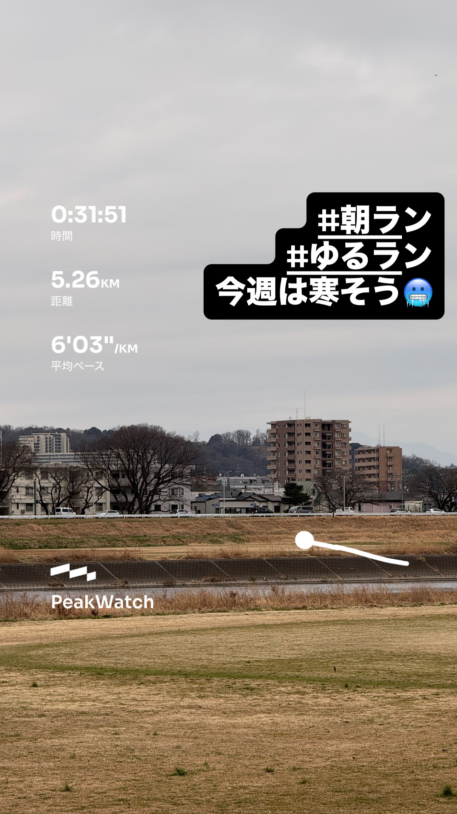
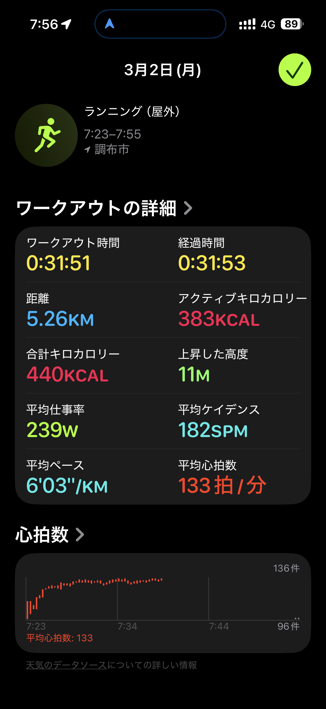
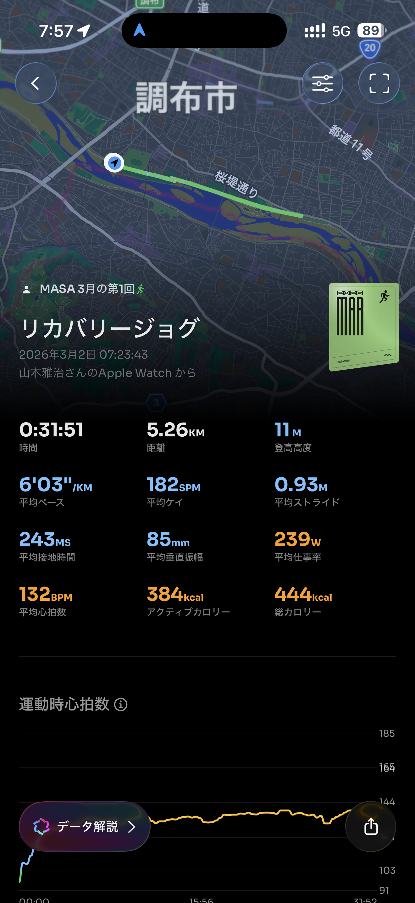
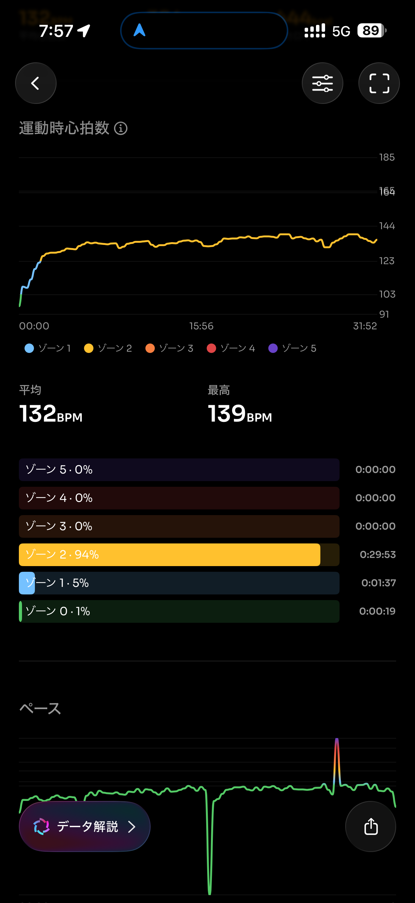
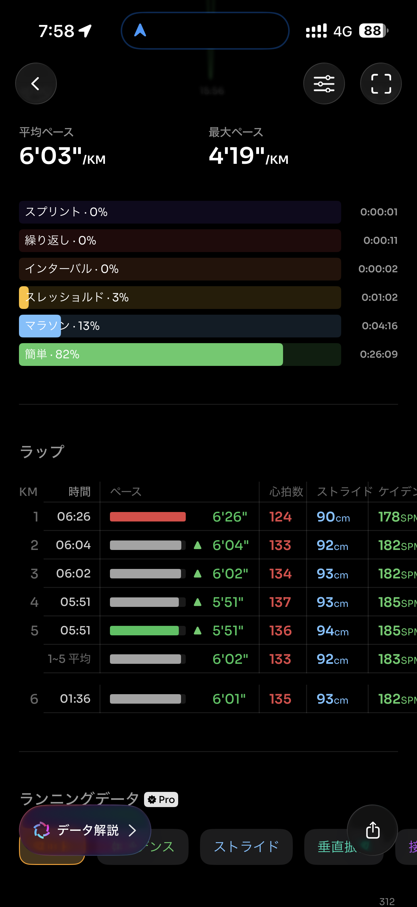
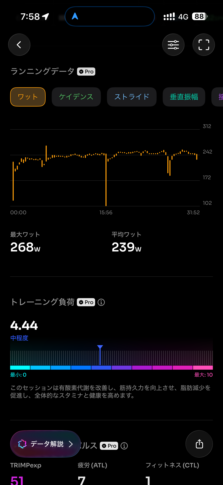
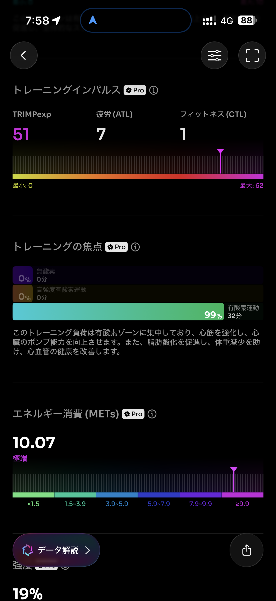
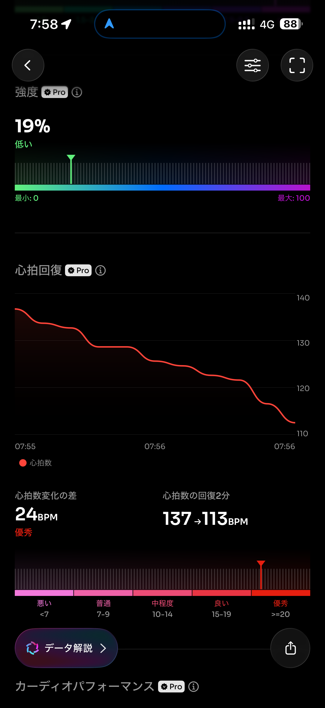
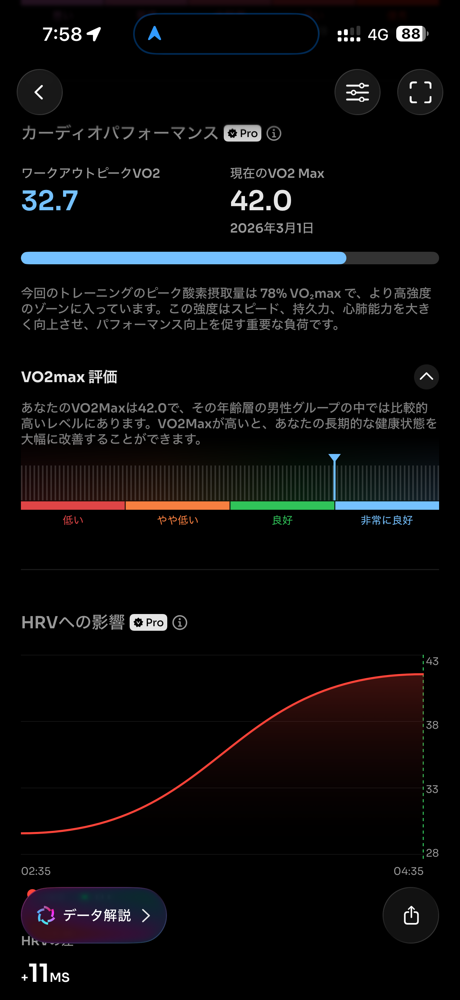
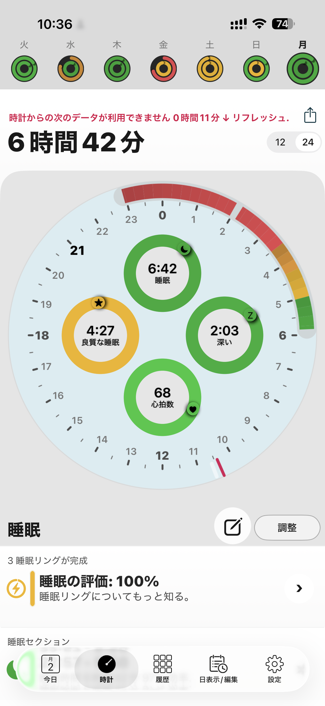

- 距離：5.26km
- 時間：0:31:51
- 平均心拍数：133拍/分
- 使用シューズ：インフィニットプロ
- 時間帯：7時
- 天候：7時頃: 気温: 7.1℃, 風速: 13.3m/s
- コース：
- 補給：
- 睡眠：6時間42分
- 今日の目的：
- コメント：

## 📝 コーチコメント
MASAさん、今日もランニングお疲れ様でした！3月に入り、いよいよハーフマラソンが近づいてきましたね。今回のランニングでは平均心拍数も安定しており、良い調整ができていることが伺えます。距離も無理なく、リラックスして走れているようで安心しました。

寒暖差が激しい時期ですので、体調管理にはくれぐれも気を付けてくださいね。特にレース直前は、質の良い睡眠とバランスの取れた食事が大切です。

年齢を重ねても、こうして走り続けられるのは本当に素晴らしいことです。MASAさんのように、生涯を通してランニングを楽しめることは、私たちの目標でもあります。ハーフマラソン完走に向けて、私も全力で応援しています！自信を持って、ゴールを目指してくださいね！

## 📸 写真一覧

