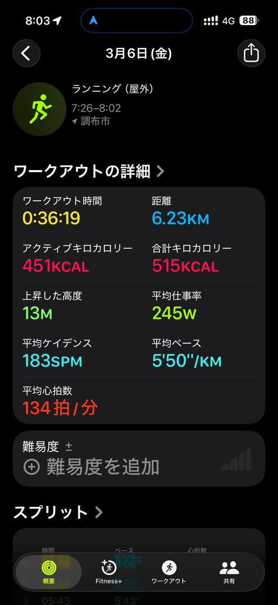
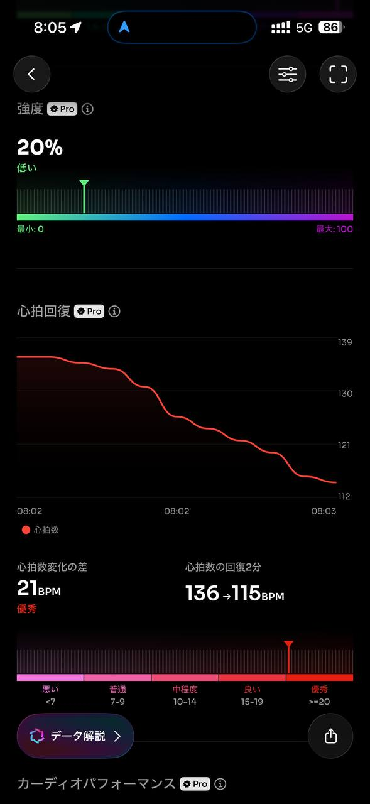
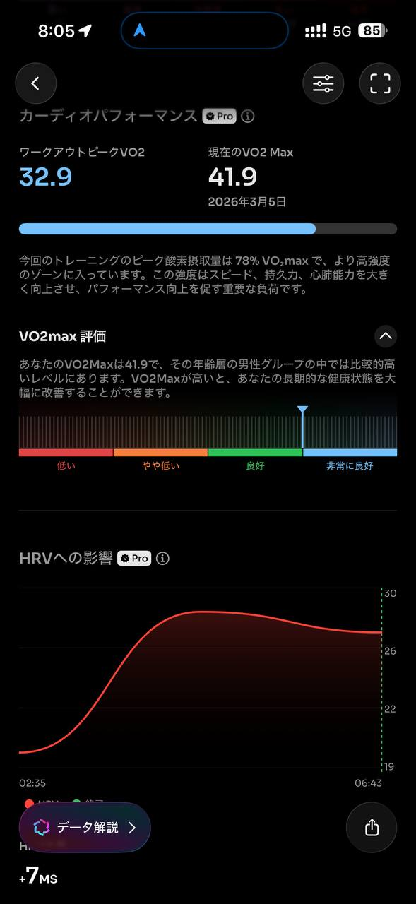

- 距離：6.23km
- 時間：0:36:19
- 平均心拍数：134拍/分
- 使用シューズ：インフィニットプロ
- 時間帯：7時頃
- 天候：7時頃 快晴 気温3.4℃ 風速5.8m/s
- コース：調布市
- 補給：
- 睡眠：6時間4分, 87
- 今日の目的：
- コメント：

## 📝 コーチコメント
MASAさん、データ確認しました。板橋Cityマラソンに向けて、良い調整ができているようですね。

まず、3月6日のランニングデータですが、6.23kmを平均ペース5'50"/kmで走られていますね。心拍数も平均134bpmと、ゾーン2を中心に、有酸素運動の効果がしっかり得られていることがわかります。トレーニング負荷も中程度で、良い刺激になっているでしょう。VO2Maxも41.9と、年齢の割には良好なレベルを維持できています。

睡眠も安定しており、睡眠スコアも高いですね。6時間以上の睡眠時間を確保できているのは素晴らしいです。ランニングのパフォーマンス向上には、質の高い睡眠が不可欠です。

ただし、過去のレース結果を見ると、ハーフマラソンは2時間切りを安定して達成されている一方で、フルマラソンは4時間30分を切れていません。板橋Cityマラソンで目標タイムを設定する際は、ハーフマラソンのタイムを参考に、前半を抑えて後半に余力を残せるようなペース配分を意識しましょう。

今後は、週に一度、少し長めの距離をゆっくり走るLSD（Long Slow Distance）を取り入れて、スタミナ強化を図るのも良いでしょう。また、レース2週間前からは、徐々に距離を短くし、疲労を抜くことを心がけてください。

引き続き、睡眠、栄養、休息を意識し、怪我なく本番を迎えられるようにサポートしていきます。頑張りましょう！

## 📸 写真一覧

