- 距離：15.19km
- 時間：1:23:59
- 平均心拍数：145拍/分
- 使用シューズ：ボストン12
- 時間帯：10時頃
- 天候：10時頃 晴れ 気温11.9℃ 風速15.3m/s
- コース：調布市
- 補給：
- 睡眠：6時間48分 スコア77
- 今日の目的：
- コメント：

## 📝 コーチコメント
MASAさん、データ確認しました。3月7日の15km走、お疲れ様でした！平均ペース5分32秒/km、平均心拍数145bpmと、良いペースで走れていますね。特に11km以降のペースアップは素晴らしいです。心拍数も上がっていますが、最後まで粘れていますね。

トレーニング強度が40%と中程度なので、有酸素能力の強化に繋がっていると思います。VO2Maxも向上しているようですし、着実にレベルアップしていますね。

直近の板橋Cityマラソンに向けて、良い練習になっていると思います。ただ、睡眠時間が平均6時間強と少し短いかもしれません。疲労回復のためにも、レースに向けて睡眠時間を7時間以上確保するように意識しましょう。

花粉症とのことなので、体調管理にも気を付けてください。レース当日まで無理せず、調整していきましょう！

## 📸 写真一覧
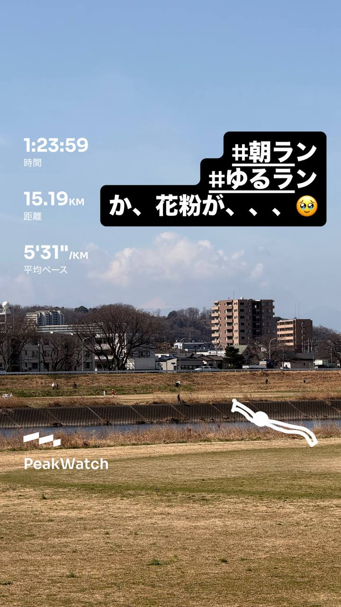
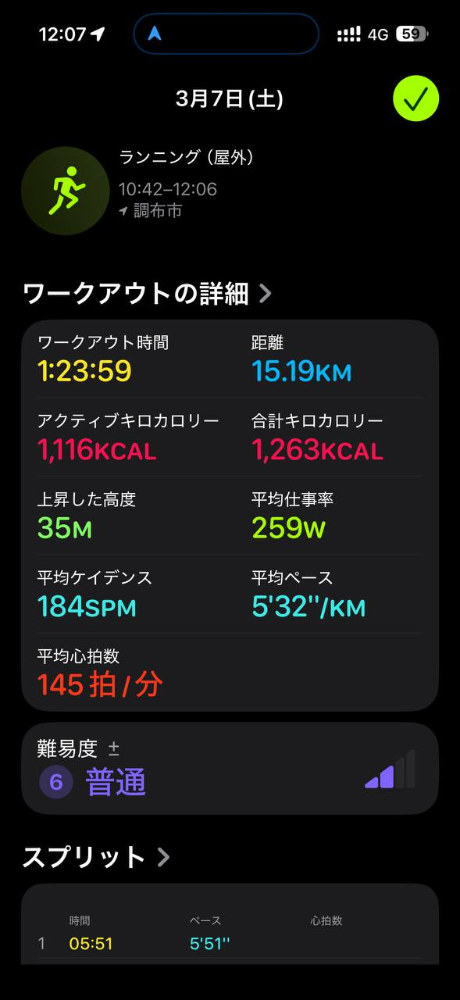
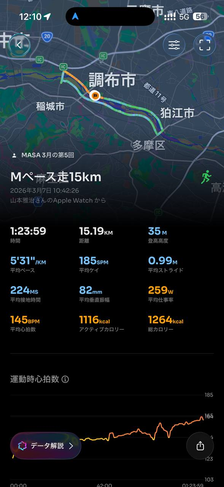
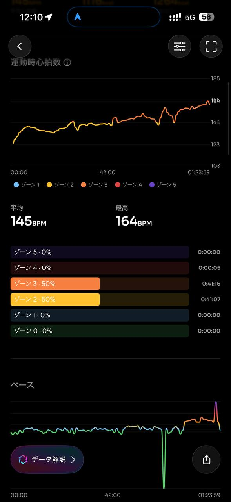
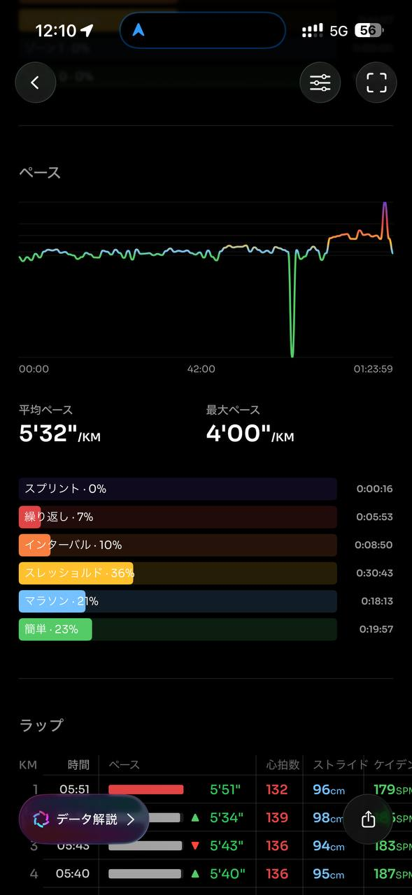
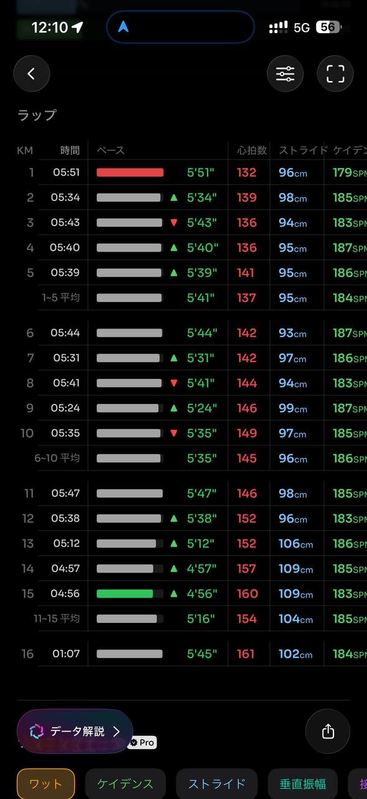
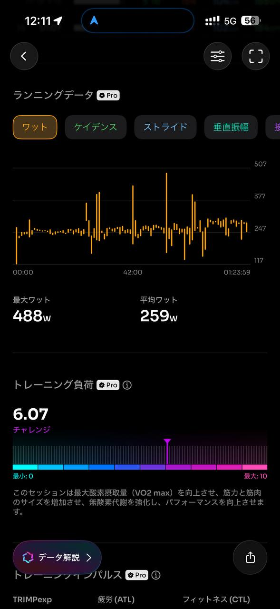
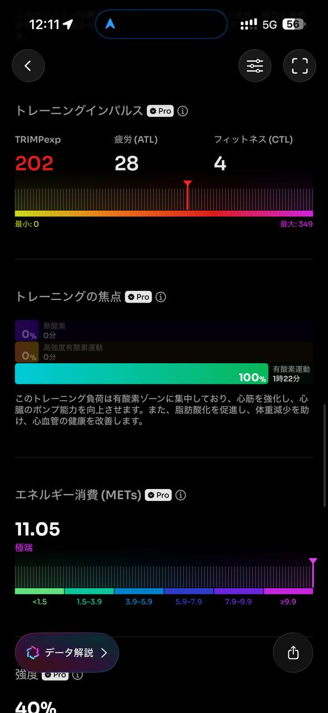
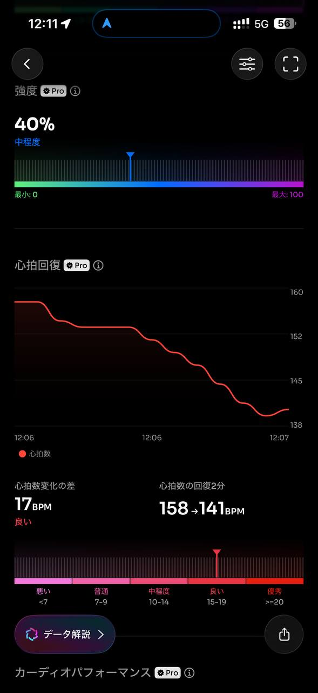
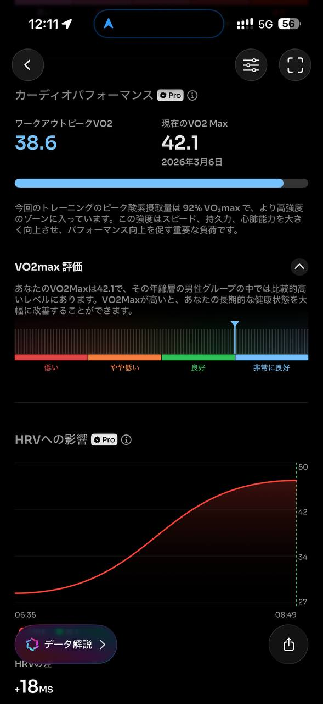
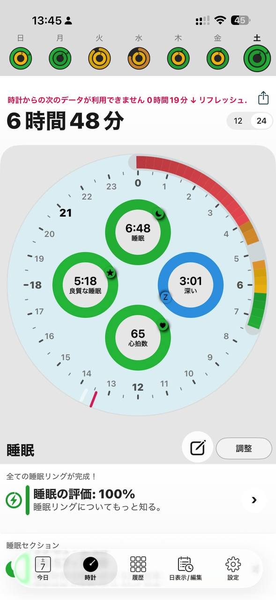
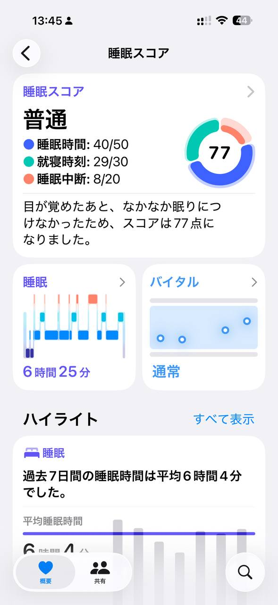