- 距離：6.22km
- 時間：0:34:48
- 平均心拍数：139拍/分
- 使用シューズ：スーパーノヴァ
- 時間帯：7時頃
- 天候：7時頃 快晴 気温1.2℃ 風速9.1m/s
- コース：調布市
- 補給：
- 睡眠：6時間25分 スコア82
- 今日の目的：ジョグ+流し3本
- コメント：#朝ラン #ゆるラン 晴れてるけど富士山🗻は見えず😢

## 📝 コーチコメント
MASAさん、データ確認しました。3月12日のジョグ＋流し3本のデータですね。平均ペース5'35"/km、平均心拍数138bpm、平均ケイデンス187spm。VO2maxも43.3と良好な数値です。心拍数とペースのバランスも良く、有酸素能力が高いことが伺えます。

直近の板橋Cityマラソンに向けて、良いトレーニングが出来ているようです。ただ、過去のレース結果を見ると、ハーフマラソンは2時間を切るタイムを出せているのに、フルマラソンでは4時間25分と、後半に失速している可能性があります。

今回のデータからは、スタミナ強化のためのロング走や、レースペースでの持続走を取り入れると、後半の失速を防ぐことができるかもしれません。また、睡眠時間が平均5時間59分と少し短いようなので、睡眠時間を確保することもパフォーマンスアップに繋がります。疲労回復も意識して、レースに向けて調整していきましょう！

## 📸 写真一覧
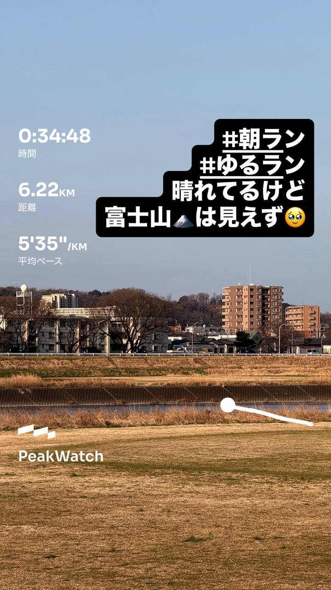
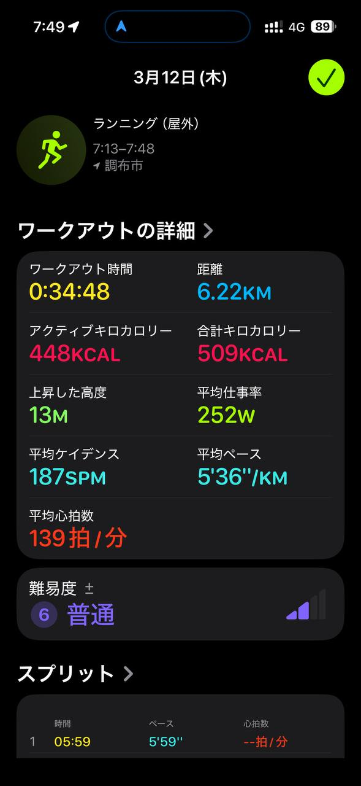
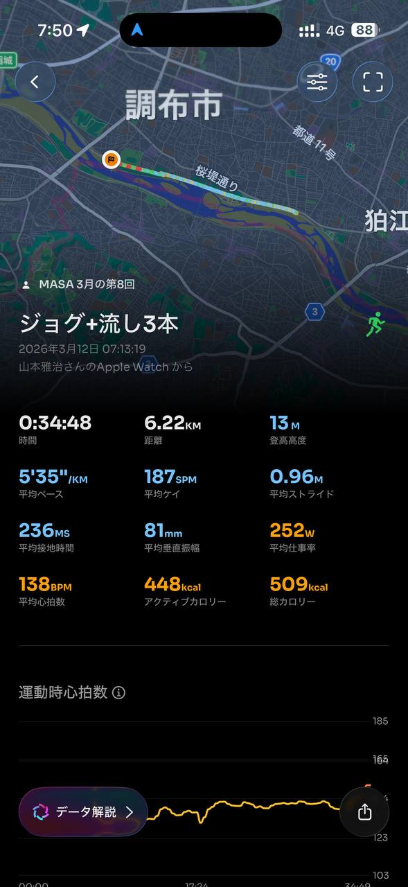
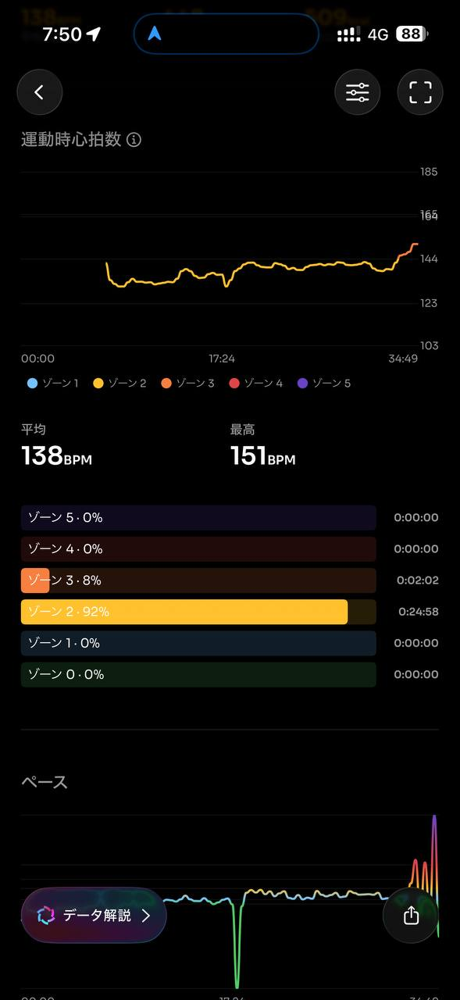
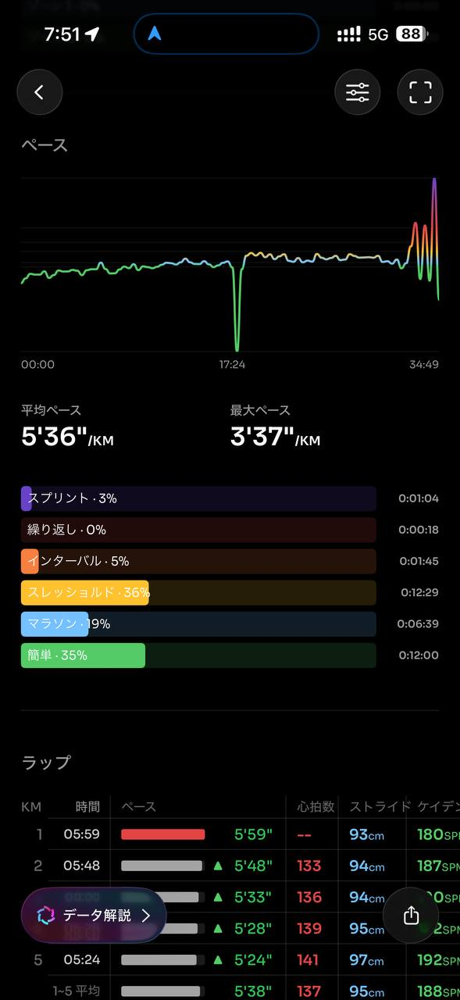
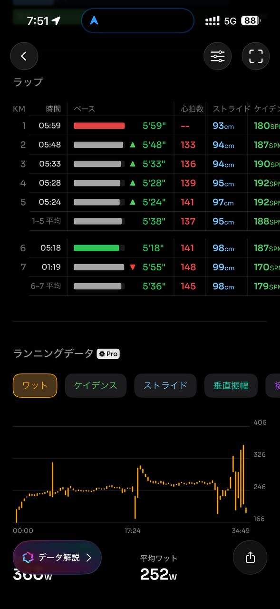
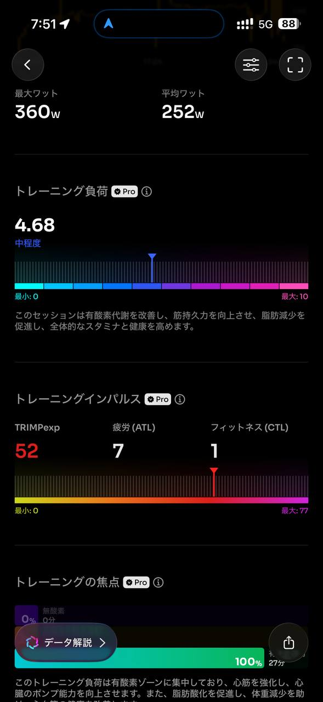
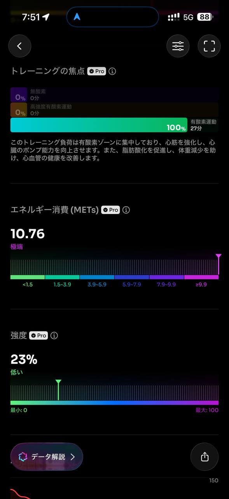
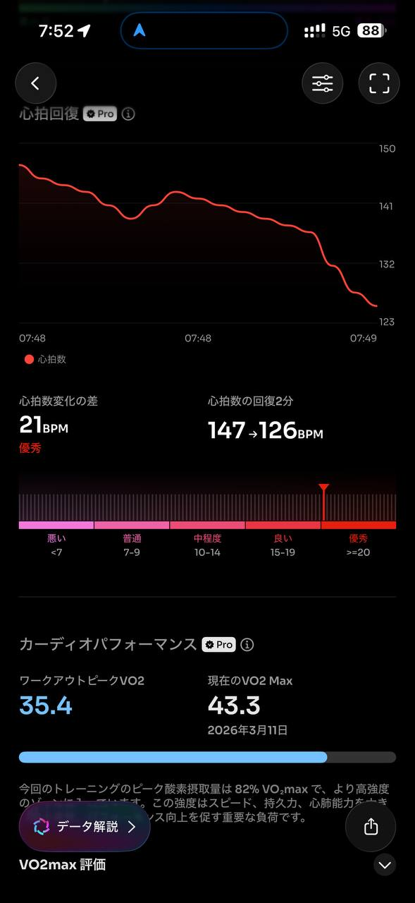
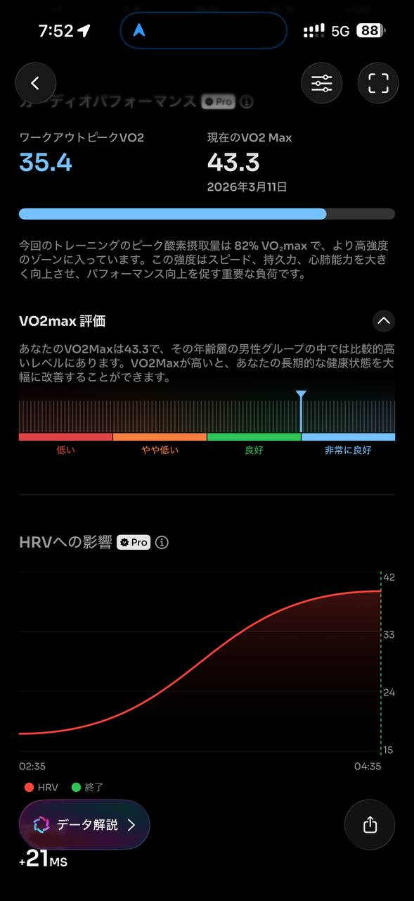
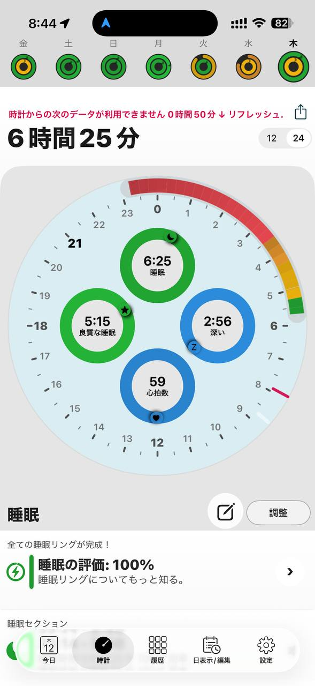
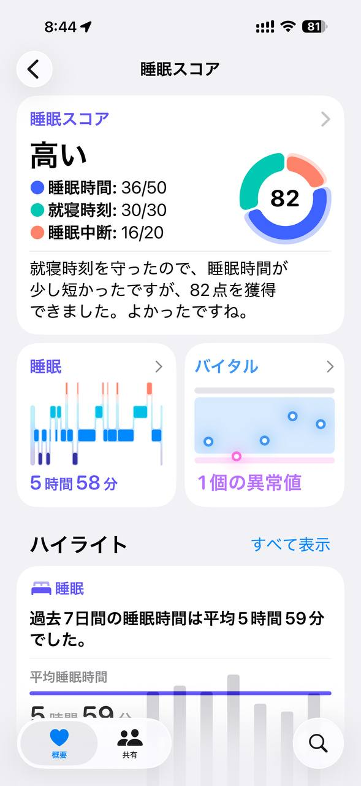