- 距離：10.15km
- 時間：0:56:16
- 平均心拍数：147拍/分
- 使用シューズ：スーパーノヴァ
- 時間帯：9時頃
- 天候：9時頃 晴れ 気温10.1℃ 風速7.4m/s
- コース：調布市
- 補給：
- 睡眠：7時間17分, 92
- 今日の目的：再度始動でビルドアップラン
- コメント：#朝ラン #ゆるラン まーまー走れたかな？
- 自分メモ：ようやく身体エネルギーも戻ってきて走れたよー

## 📝 コーチコメント
MASAさん、ランニング再開おめでとうございます！身体エネルギーが戻ってきたとのこと、素晴らしいですね。

今回の10kmランのデータ、拝見しました。平均ペース5'32"/km、平均心拍数147bpm、最大心拍数168bpmと、再始動としては良い強度で走れていると思います。特に後半ペースが上がっているのが素晴らしいですね！ビルドアップ走として、良いトレーニングになったのではないでしょうか。

ただし、いくつか気になる点もあります。睡眠時間が少し短い傾向にあるようです。直近の目標レース、東日本国際親善マラソンに向けて、疲労回復のためにも、最低でも7時間以上は睡眠時間を確保するように心がけましょう。また、心拍数のゾーン分析を見ると、ゾーン3（ややきつい）の割合が高いようです。ハーフマラソンに向けて、もう少し楽なペースでのジョギングや、LSDトレーニングも取り入れて、有酸素能力を高めることをおすすめします。

4月26日のレースまで残り1ヶ月ほどです。焦らず、着実にトレーニングを積み重ねて、万全の状態でレースに臨めるようにサポートしていきます。次回の練習内容についても、ぜひ相談してください。応援しています！

## 📸 写真一覧
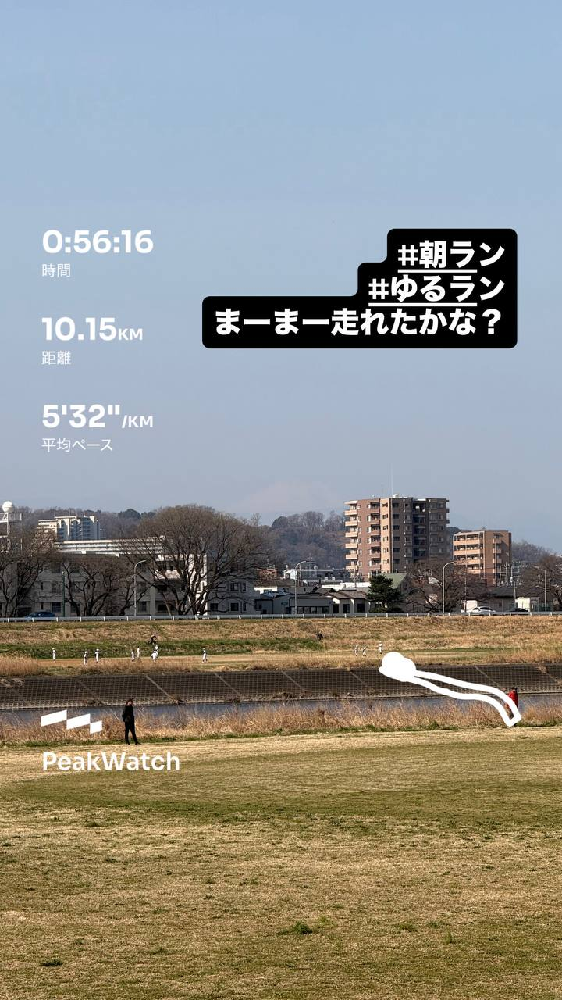
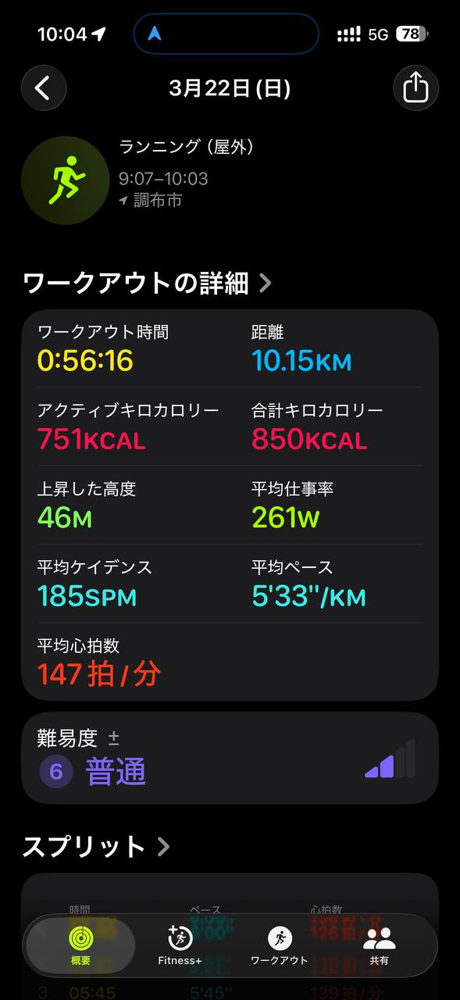
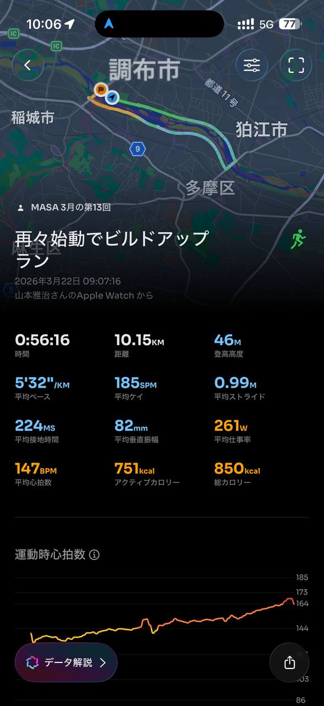
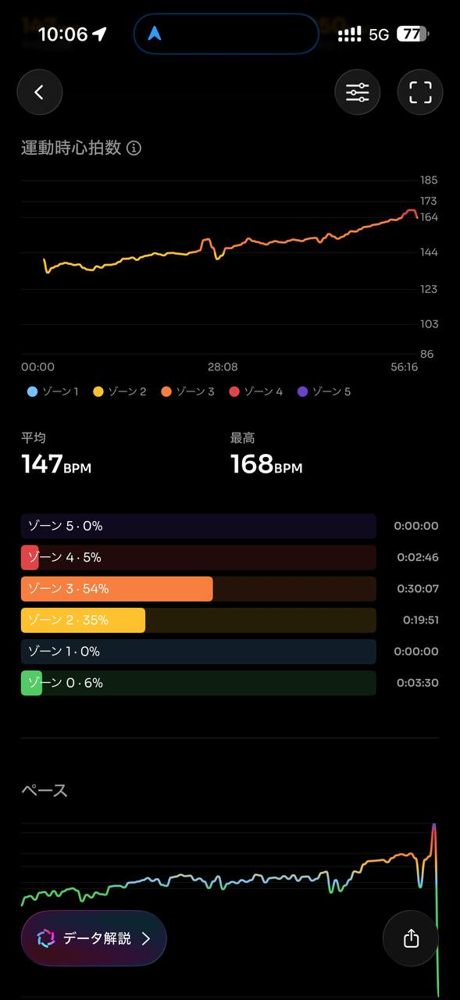
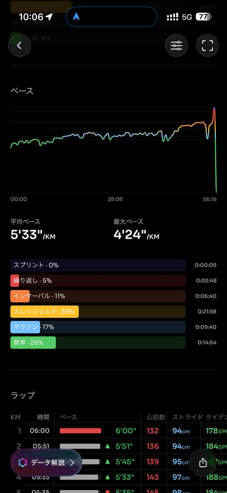
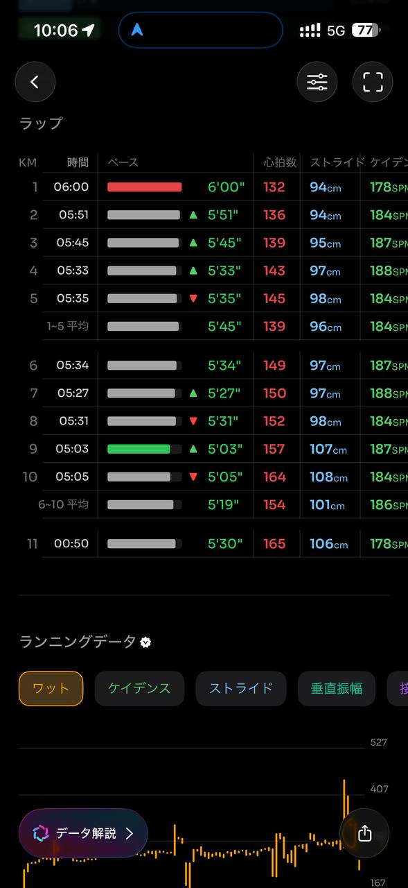
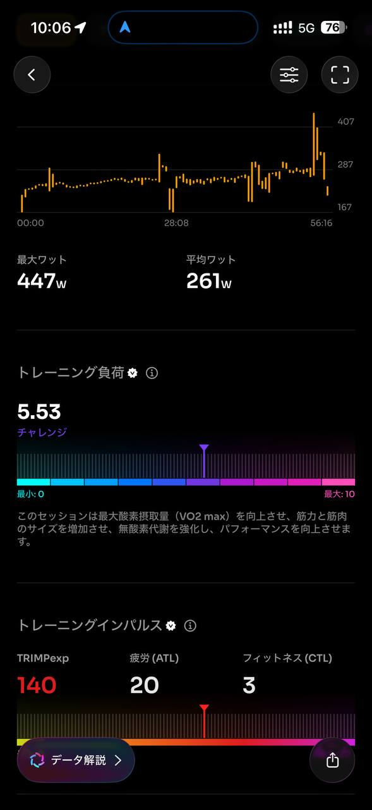
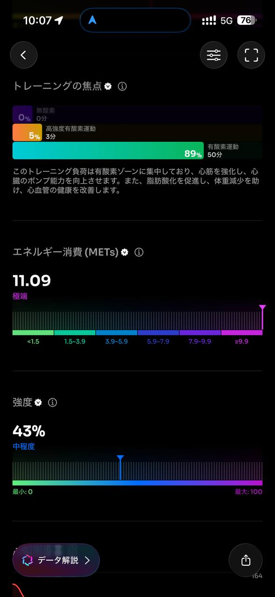
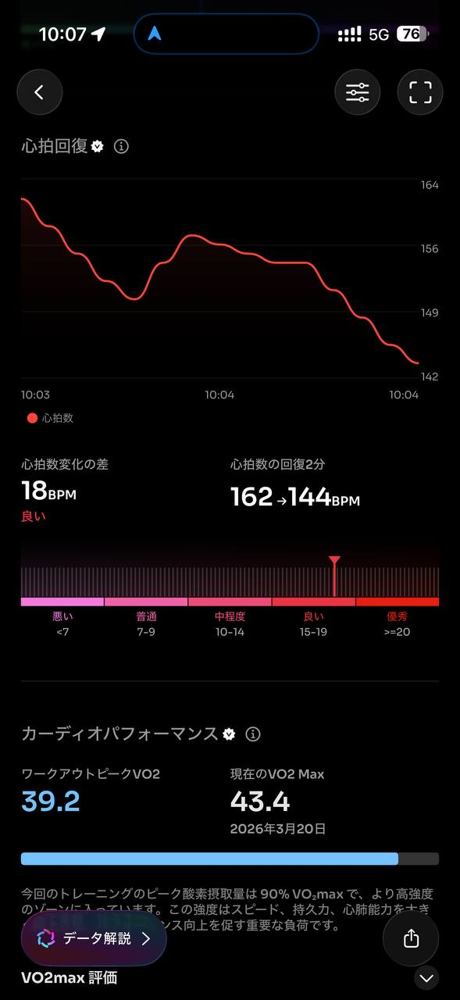
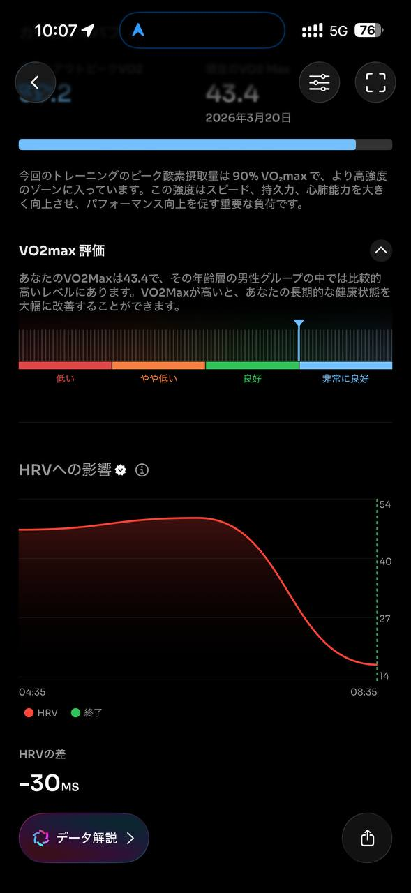
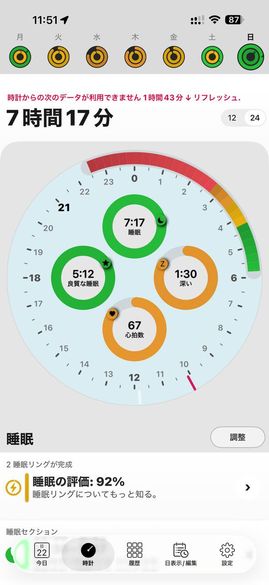
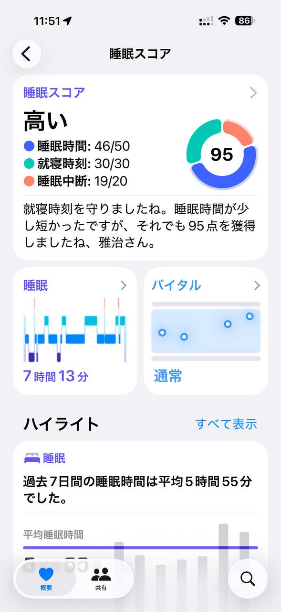
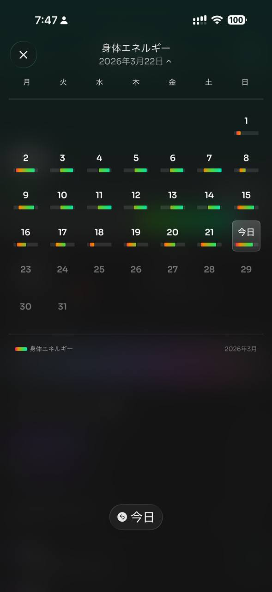