- 距離：6.17km
- 時間：0:34:48
- 平均心拍数：137拍/分
- 使用シューズ：インフィニットプロ
- 時間帯：7時頃
- 天候：取得失敗
- コース：調布市
- 補給：
- 睡眠：6時間6分, スコア85
- 今日の目的：リカバリージョグ
- コメント：#朝ラン
#ゆるラン
クソのシャワーラン
- 自分メモ：リカバリージョグのつもりがビルドアップになってしまった😅

## 📝 コーチコメント
MASAさん、データ確認しました。リカバリージョグのつもりがビルドアップになったとのこと、お気持ちお察しします（笑）。

平均ペース5'38"/km、平均心拍数138bpmを見ると、確かにリカバリーにしては少し強度が高かったかもしれませんね。特に6km地点でペースが上がっているのがわかります。

直近のレース目標がハーフマラソンなので、スピードを意識するのは良い傾向です。ただ、リカバリージョグの目的は疲労回復なので、心拍数をゾーン2以下に抑えることを意識しましょう。具体的には、会話ができるくらいのペースが目安です。

今回のデータを見ると、トレーニング負荷は4.67で中程度、トレーニングの焦点は有酸素運動95%と良好です。VO2maxも43.0と高い水準を維持できています。

睡眠時間が平均5時間53分と少し短いのが気になります。パフォーマンス向上のためには、質の高い睡眠が不可欠です。7時間以上睡眠時間を確保するように心がけてください。

今後の練習では、リカバリージョグの日はしっかりとペースを抑え、心拍数を確認しながら走るようにしましょう。ビルドアップ走は計画的に取り入れることで、レースに向けた良い刺激になります。東日本国際親善マラソンに向けて、頑張っていきましょう！

## 📸 写真一覧
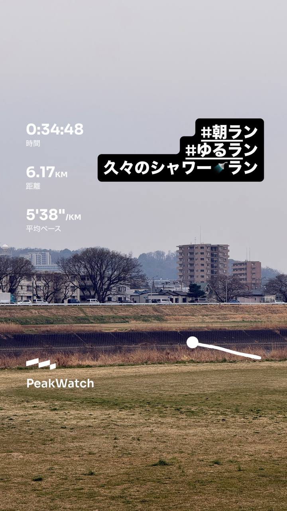
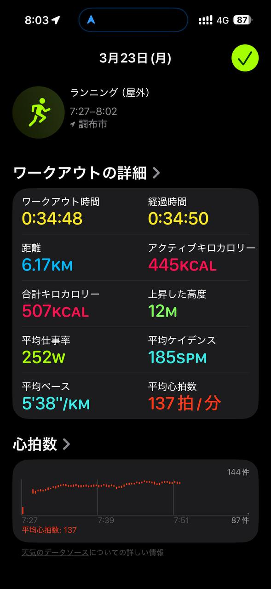
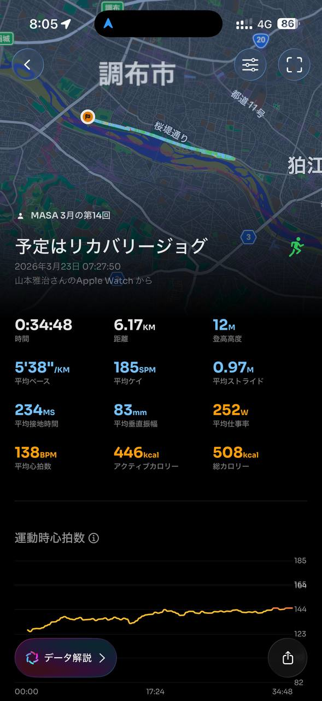
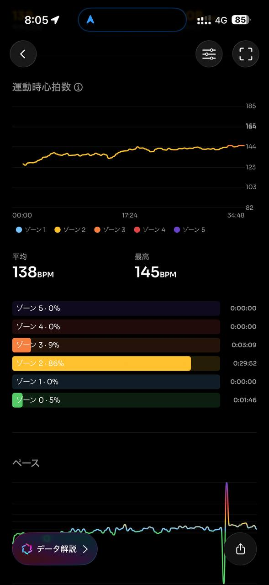
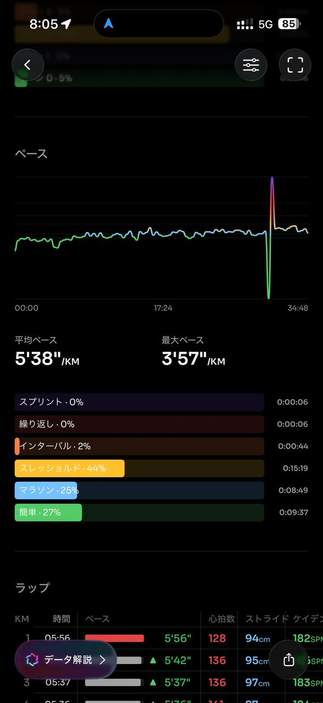
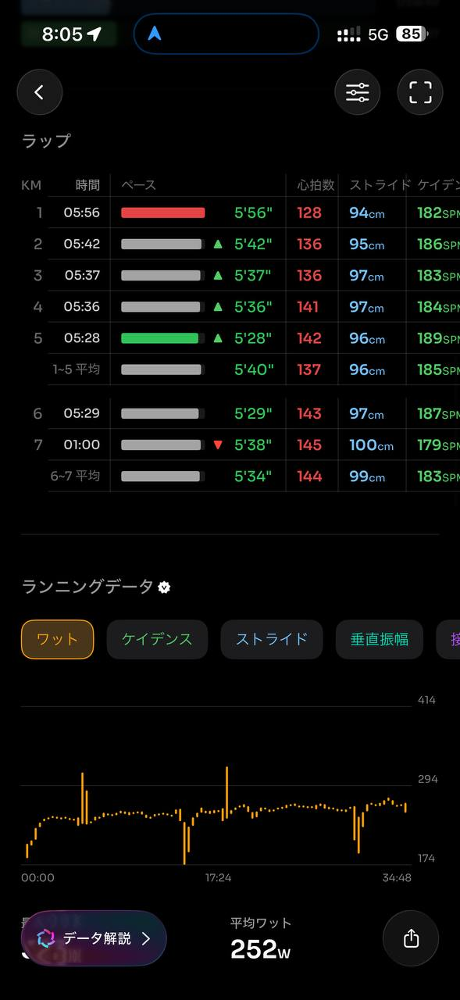
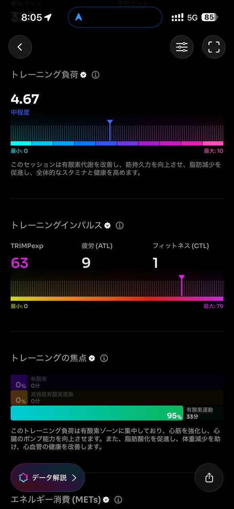
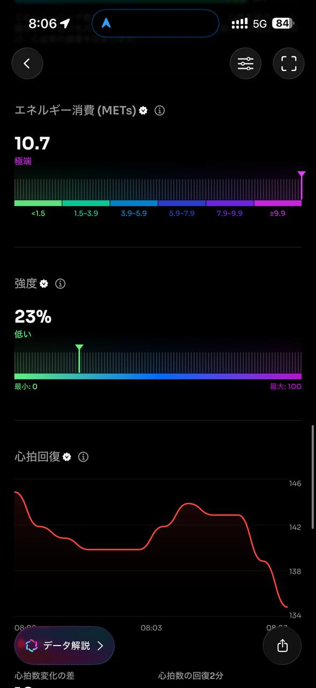
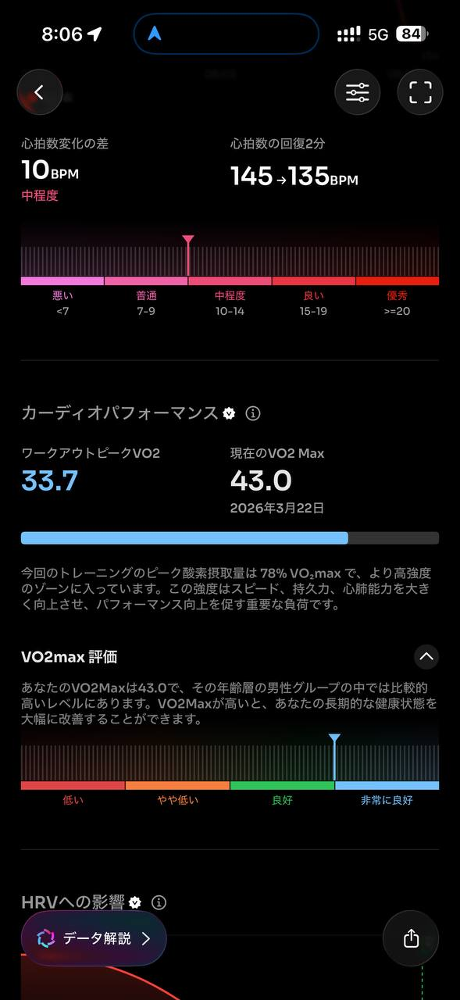
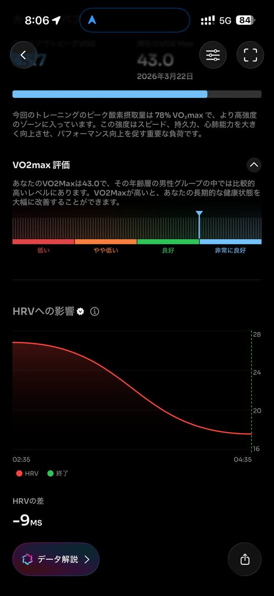
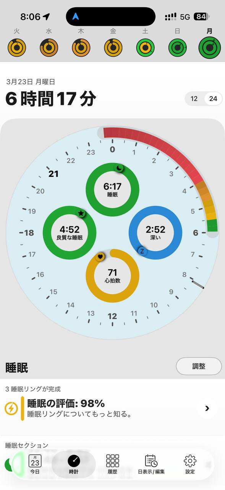
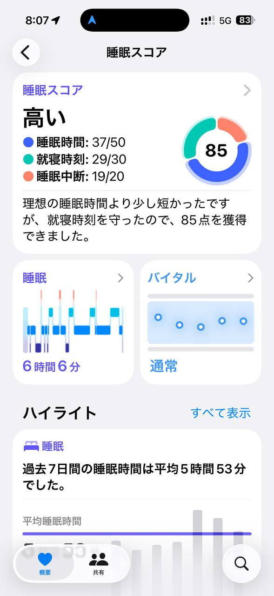