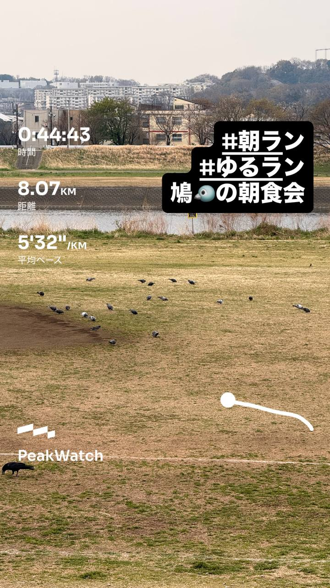
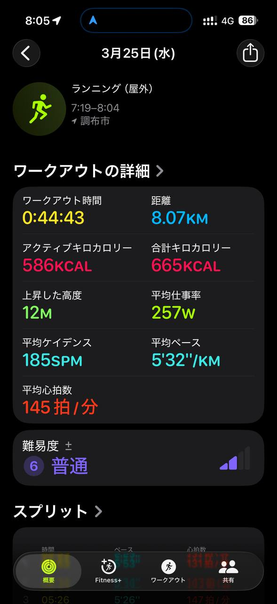
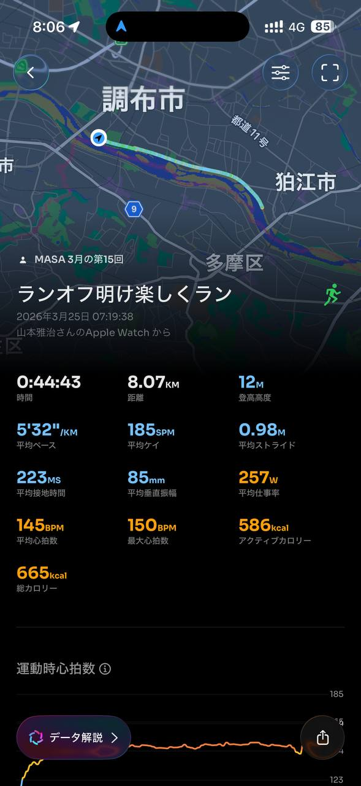
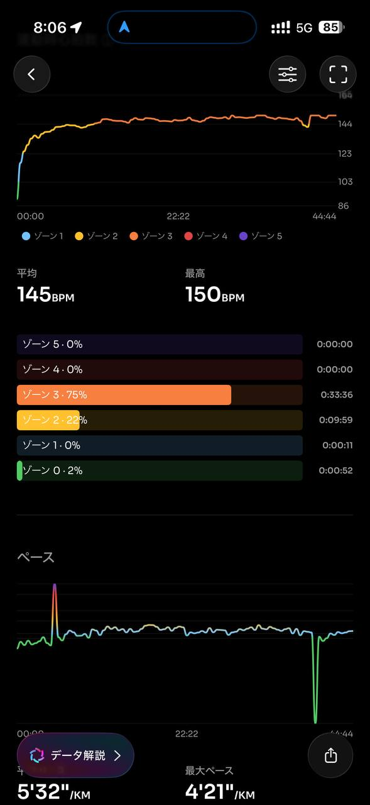
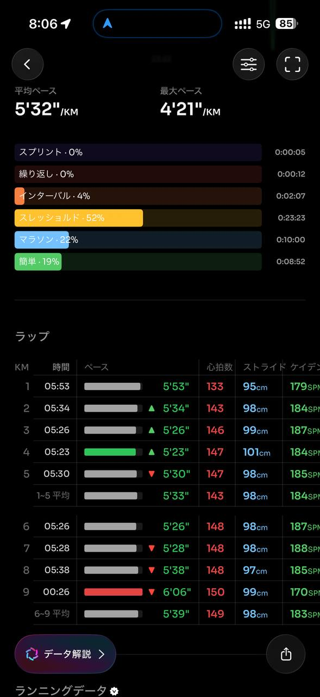
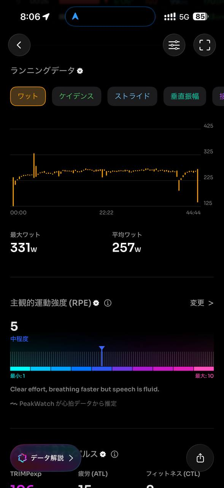
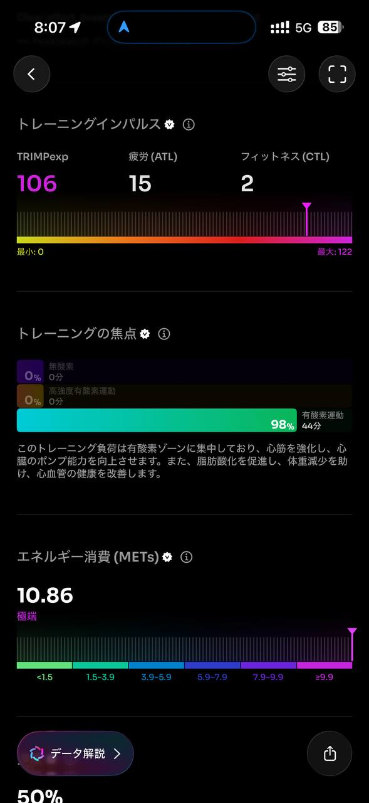
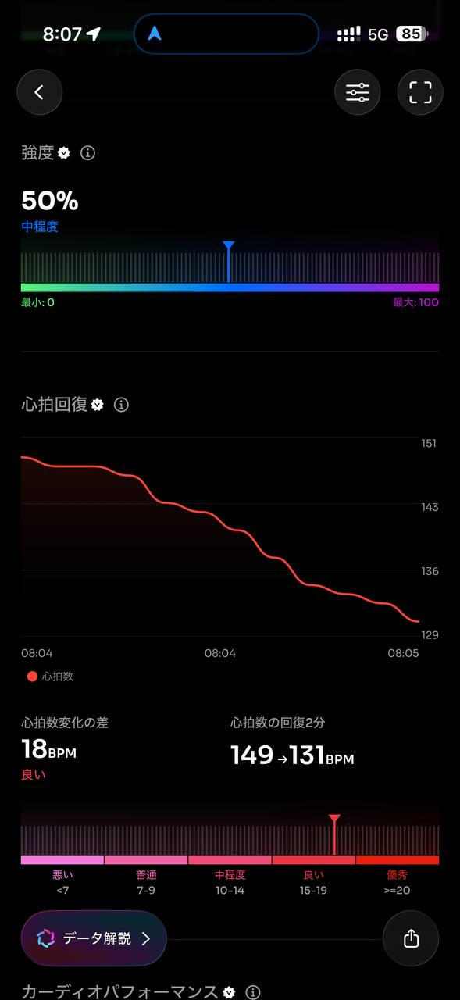
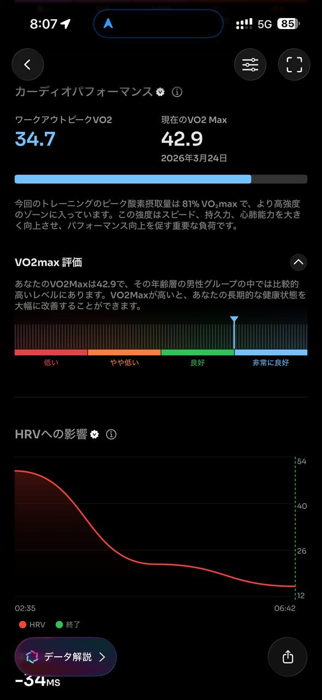
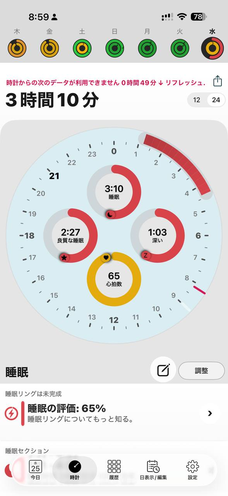

- 距離：8.07km
- 時間：0:44:43
- 平均心拍数：145拍/分
- 使用シューズ：スーパーノヴァ
- 時間帯：7時頃
- 天候：7時頃 曇り 気温9.8℃ 風速6.5m/s
- コース：調布市
- 補給：
- 睡眠：3時間10分 評価:65%
- 今日の目的：PeakWatch
- コメント：#朝ラン
#ゆるラン
鳩の朝食会
- 自分メモ：なんだか仕事で疲れてたのか早朝に目が覚めてもう寝られなくなってしまった😅

## 📝 コーチコメント
MASAさん、データ確認しました。早朝ラン、お疲れ様です！まず、睡眠時間が3時間10分と非常に短いのが気になります。仕事疲れで眠りが浅かったとのことですが、ランニングのパフォーマンスを最大限に引き出すためには、睡眠時間の確保が最重要課題です。

今回のランは8kmを平均ペース5分32秒/km、心拍数も平均145bpmと、確かに「ゆるラン」ですね。心拍数のゾーン分析を見ると、ほぼ有酸素運動の範囲内で、脂肪燃焼効果も期待できます。ただ、睡眠不足の影響で疲労が蓄積している可能性もあるので、無理は禁物です。

東日本国際親善マラソンに向けて、今週は疲労回復を優先し、ジョギングやウォーキングなどの軽めの運動に留め、睡眠時間をしっかり確保することを心がけてください。特にレース1週間前は、疲労を完全に抜くことを意識しましょう。

可能であれば、昼休憩に15分程度の仮眠を取り入れるのも効果的です。睡眠不足が続くと、集中力も低下し、怪我のリスクも高まります。睡眠時間の改善と疲労回復を最優先に、レースに向けて最高のコンディションを作り上げていきましょう！

## 📸 写真一覧

