- 距離：8.06km
- 時間：0:44:44
- 平均心拍数：143拍/分
- 使用シューズ：スーパーノヴァ
- 時間帯：7時頃
- 天候：取得失敗
- コース：調布市
- 補給：
- 睡眠：5時間7分, 55%
- 今日の目的：リラックスジョグ
- コメント：#朝ラン #ゆるラン 富士山白い❤️
- 自分メモ：ボディバッテリー🪫が相変わらず低め。まぁタイムとか意識せず走ったら楽しく走れました！😊

## 📝 コーチコメント
MASAさん、データ確認しました。富士山を眺めながらのラン、気持ちよさそうですね！タイムを意識せずとも8kmを5'32"/kmのペースで走れているのは素晴らしいです。

ボディバッテリーが低いとのことですが、睡眠時間が5時間7分と推奨睡眠時間より短く、睡眠の質も55%と改善の余地ありそうです。練習内容も大切ですが、まずは睡眠時間の確保と質の向上に注力してみましょう。

具体的には、就寝前にカフェインを摂取しない、寝る前にリラックスできる時間を作る、寝室の環境を整えるなど、できることから始めてみてください。

心拍数のデータを見ると、ゾーン3（58%）が中心で有酸素運動としては良い強度です。ただ、直近の目標レースがハーフマラソンなので、レースペースに近い強度での練習も取り入れて、レース本番でのパフォーマンス向上を目指しましょう。具体的には、週に1回は目標レースペースでのインターバル走やペース走を取り入れてみてください。

睡眠改善と質の高い練習で、4月26日の東日本国際親善マラソンでの自己ベスト更新、期待しています！

## 📸 写真一覧
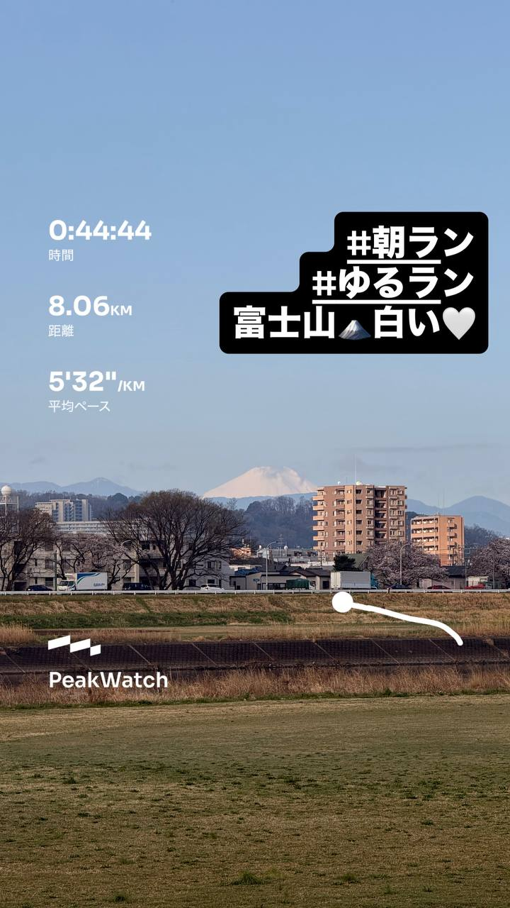
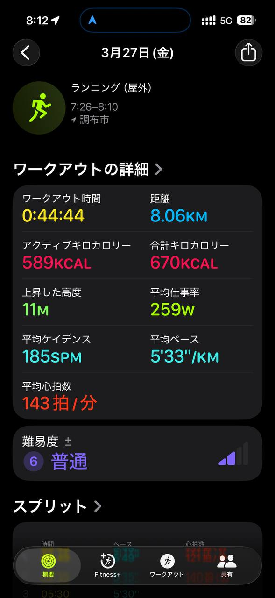
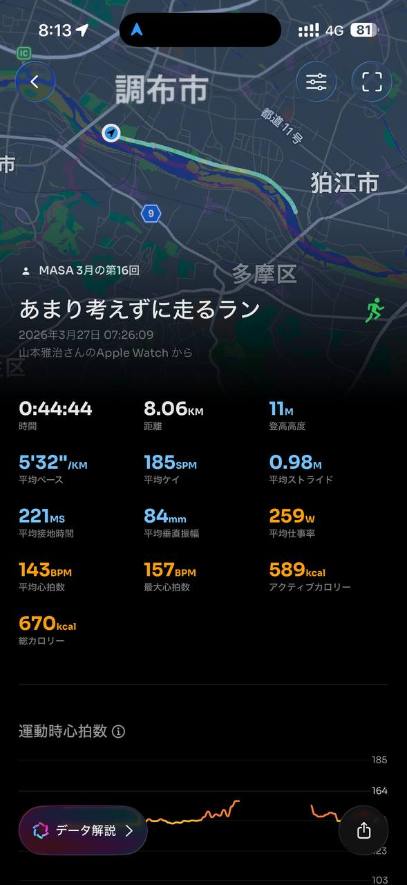
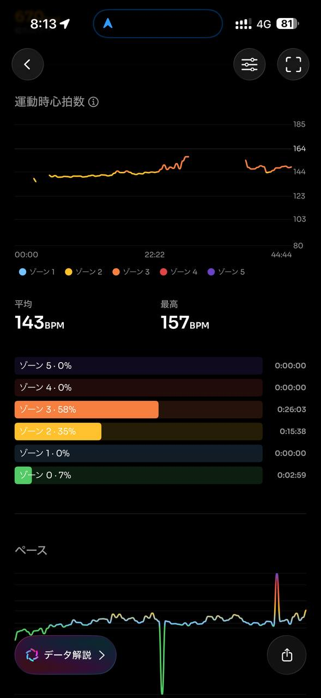
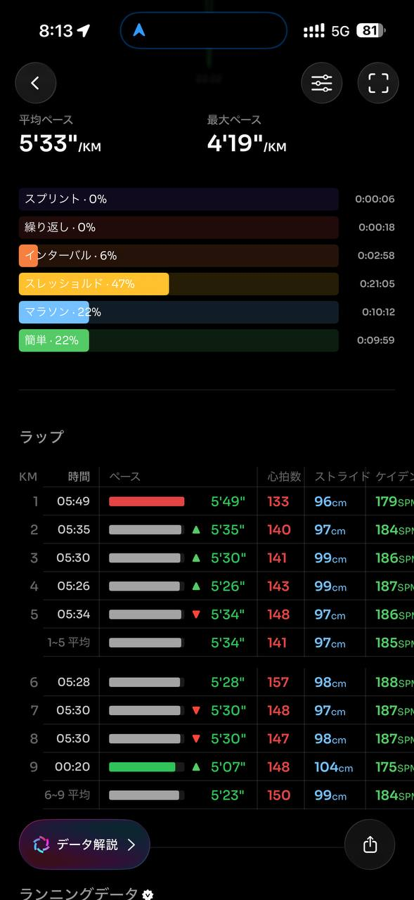
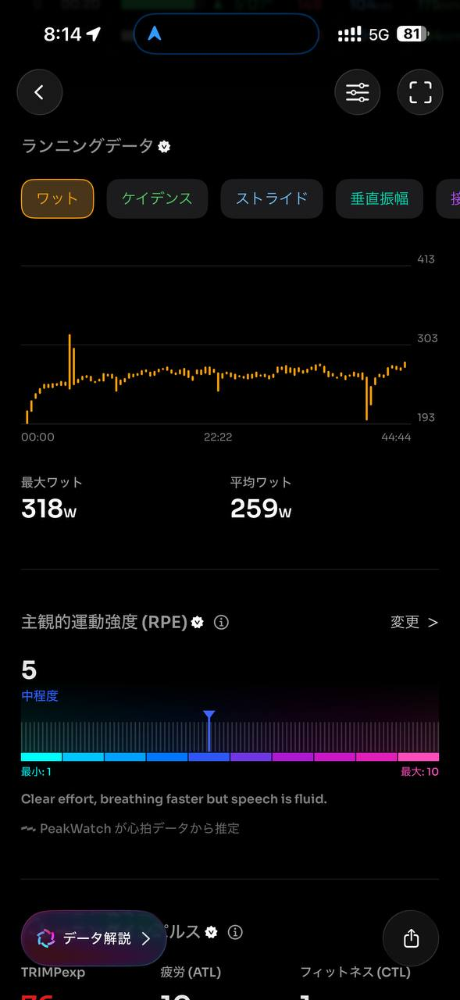
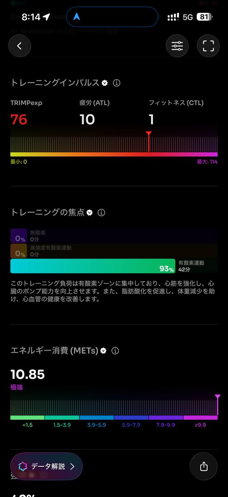
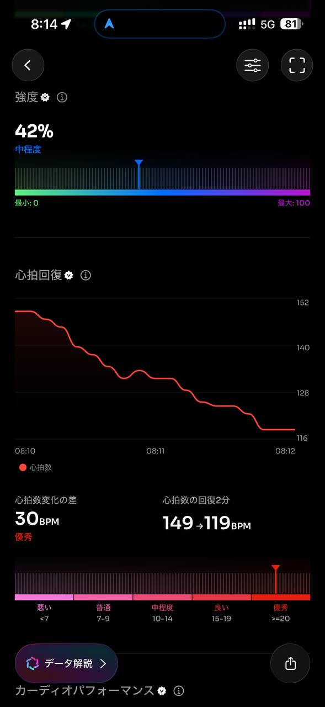
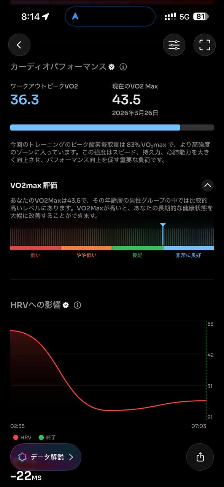
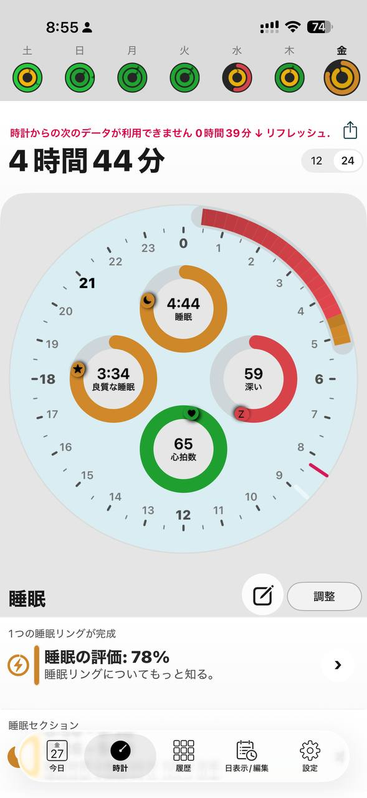
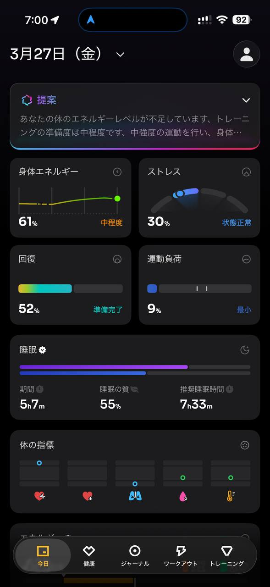