- 距離：10.23km
- 時間：1:00:12
- 平均心拍数：140拍/分
- 使用シューズ：インフィニットプロ
- 時間帯：10時頃
- 天候：10時頃 快晴 気温16.6℃ 風速4m/s
- コース：調布市
- 補給：
- 睡眠：7時間47分 73%
- 今日の目的：PeakWatch
- コメント：#朝ラン
#ゆるラン
#花見ラン
- 自分メモ：うーん、寝たのにボディバッテリー🪫復活せずだなー。まぁそれでも10km走れたらから、よしとするかな。

## 📝 コーチコメント
MASAさん、データ拝見しました。ボディバッテリーが低い状態での10km走、お疲れ様でした！桜を見ながらのランニング、リフレッシュできたのではないでしょうか？

データを見ると、平均ペースは5'53"/km、平均心拍数は140bpmですね。心拍ゾーンはゾーン2が中心で、ジョギングとしては適切な強度です。ただ、ラップごとのペース変動を見ると、6km以降ペースが上がっていますね。これはボディバッテリーが低い状態だったため、後半に無理が出てしまった可能性があります。

4月26日の東日本国際親善マラソンに向けて、疲労をためないことが重要です。睡眠時間をしっかり確保し、質の向上も意識しましょう。特にレース1週間前からは、練習量を落とし、疲労回復に専念してください。

今回のデータからは、ストライドが90cm前後と短めなのが気になります。もう少しストライドを伸ばせるように、普段の練習で意識してみてはいかがでしょうか。また、VO2maxが42.3と表示されていますが、ハーフマラソン1時間57分台の記録をお持ちなので、潜在能力はもっと高いはずです。レースに向けて、スピード練習を取り入れることで、さらに記録更新を目指せるでしょう。

疲労が残っている場合は、無理せず休養することも大切です。体調と相談しながら、計画的にトレーニングを進めていきましょう！

## 📸 写真一覧
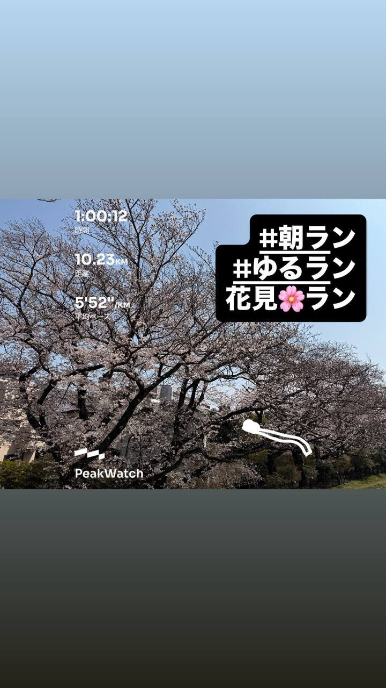
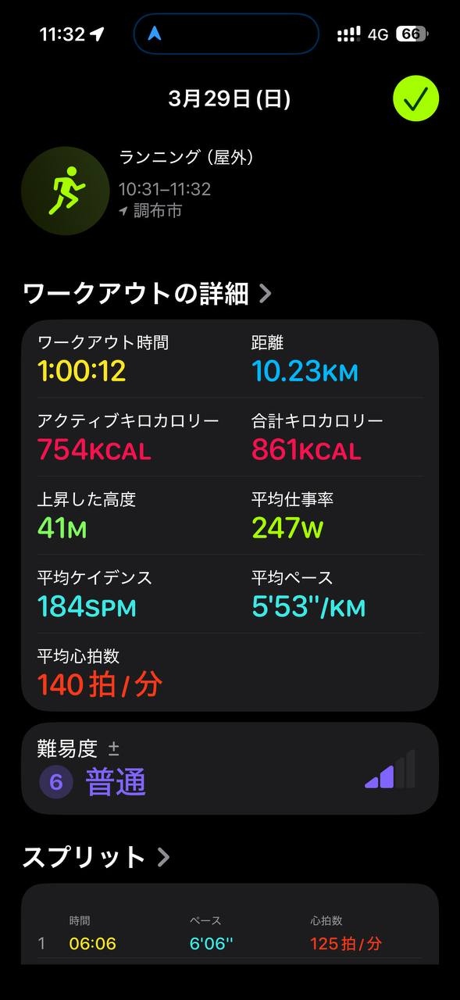
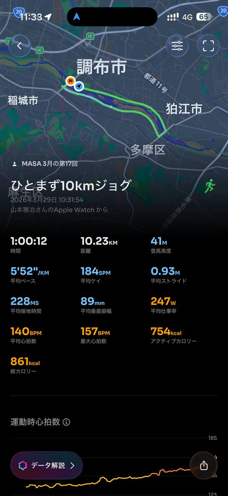
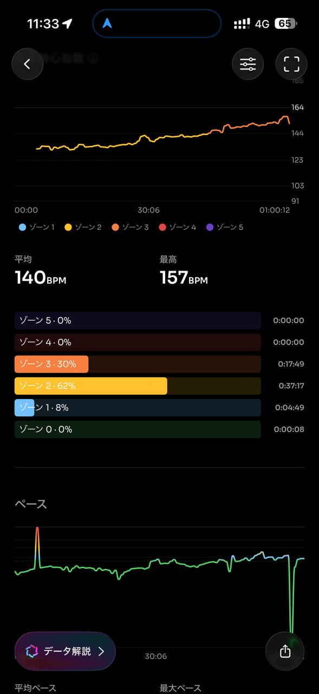
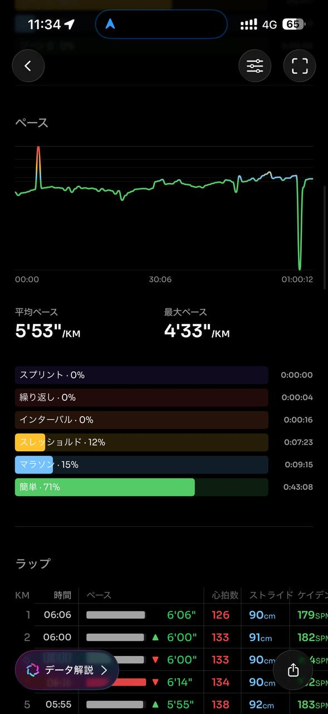
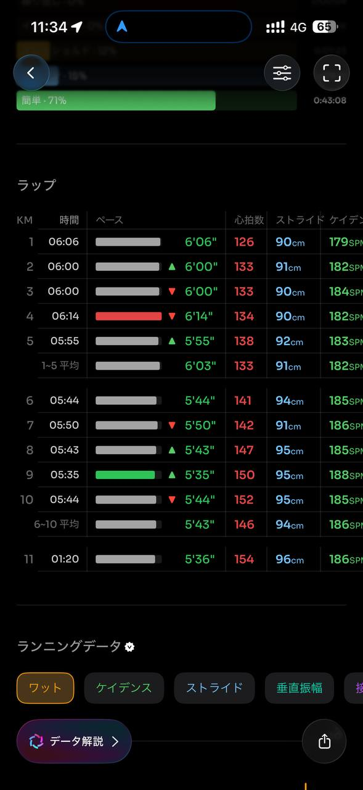
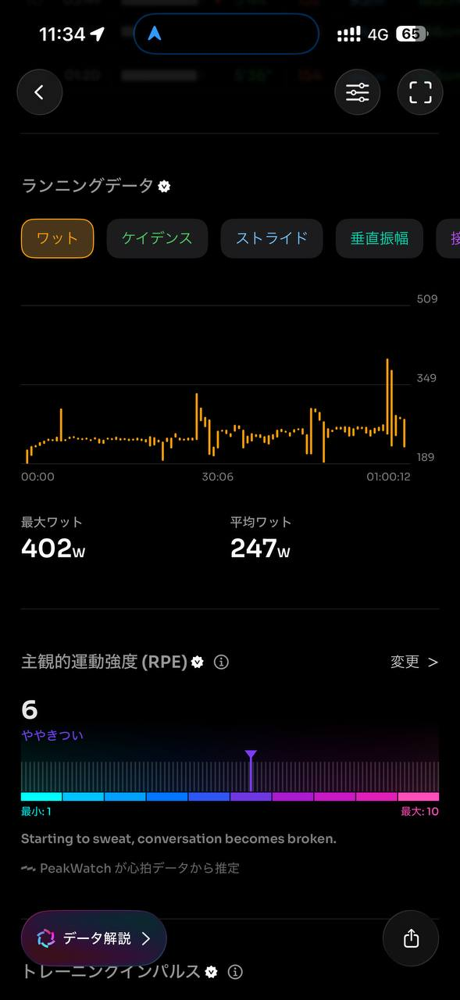
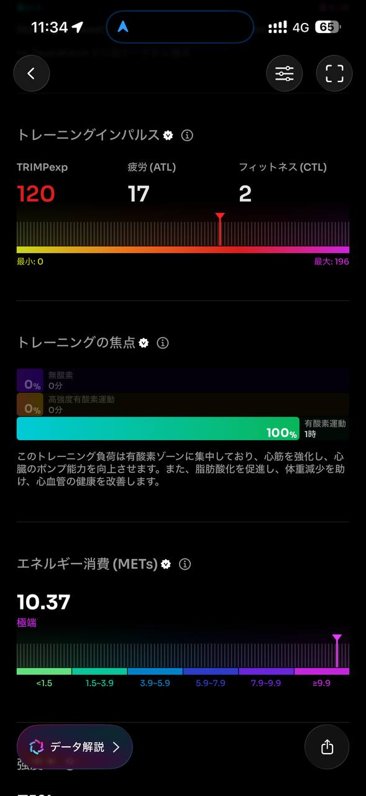
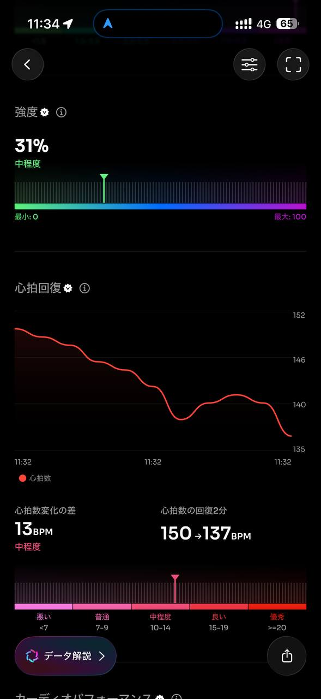
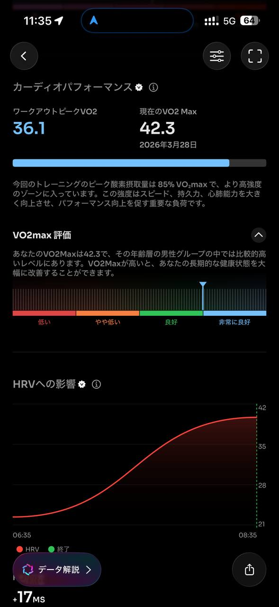
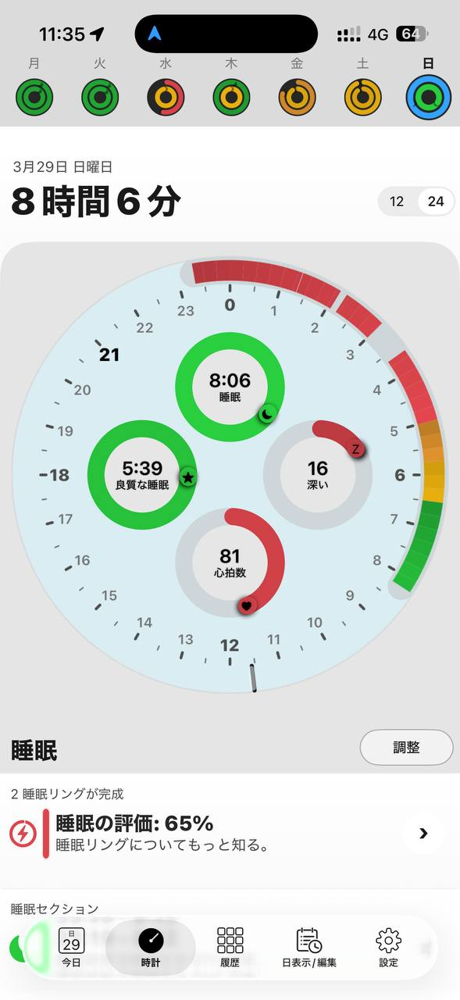
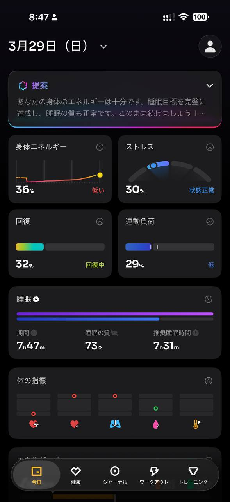