- 距離：6.44km
- 時間：0:39:14
- 平均心拍数：131拍/分
- 使用シューズ：インフィニットプロ
- 時間帯：7時頃
- 天候：7時頃 霧雨 気温9.1℃ 風速11.7m/s
- コース：調布市
- 補給：
- 睡眠：5時間44分,81
- 今日の目的：リカバリーシャワージョグ
- コメント：#朝ラン#ゆるラン 軽くシャワーラン
- 自分メモ：久々にシャワーラン！ゆっくりだけど走り終わると充実😊

## 📝 コーチコメント
MASAさん、シャワーランお疲れ様でした！気持ちよく走れたようで、充実感が伝わってきますね。

データを見ると、平均ペース6'05"/km、平均心拍数130BPMで、ほぼゾーン2でのランニングですね。これはまさにリカバリーランに最適な強度です。直近の目標レースである東日本国際親善マラソンに向けて、疲労を抜きつつ、基礎的な持久力を高めるにはとても良い練習です。

睡眠データも確認しましたが、睡眠時間が少し短いようですね。過去7日間の平均睡眠時間が約6時間とのことですので、あと1時間程度確保できると、トレーニング効果もさらに高まります。特にレースが近づいているので、積極的に睡眠時間を確保するように意識してみてください。質の良い睡眠は、疲労回復だけでなく、パフォーマンス向上にも繋がります。

シャワーランは、気温や湿度が高い時期には特に効果的です。身体を冷やしながら走ることで、パフォーマンスの低下を防ぎ、熱中症のリスクを軽減できます。

これからも、シャワーランを有効活用して、目標レースに向けてコンディションを整えていきましょう！

## 📸 写真一覧
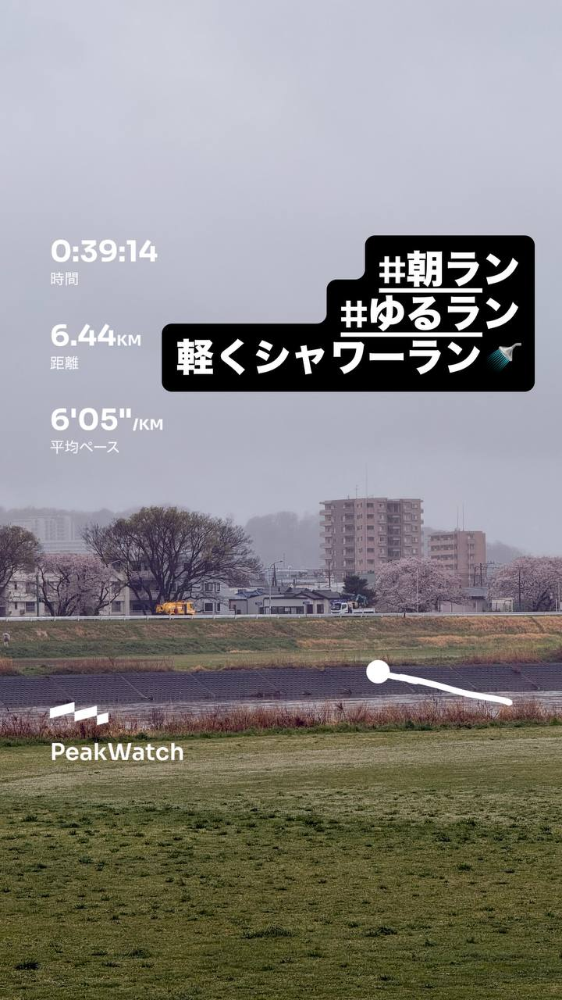
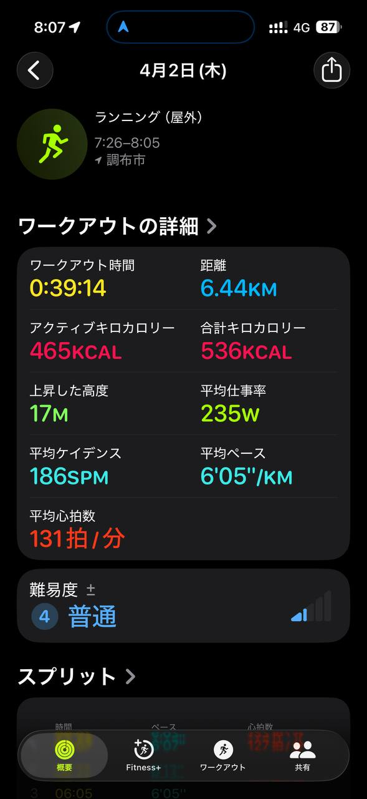
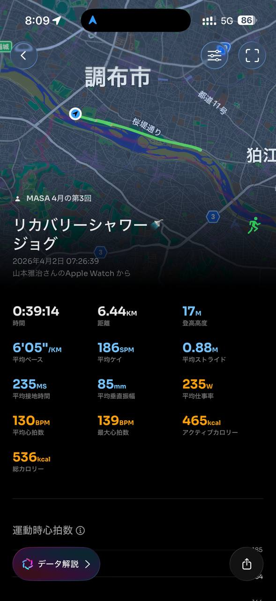
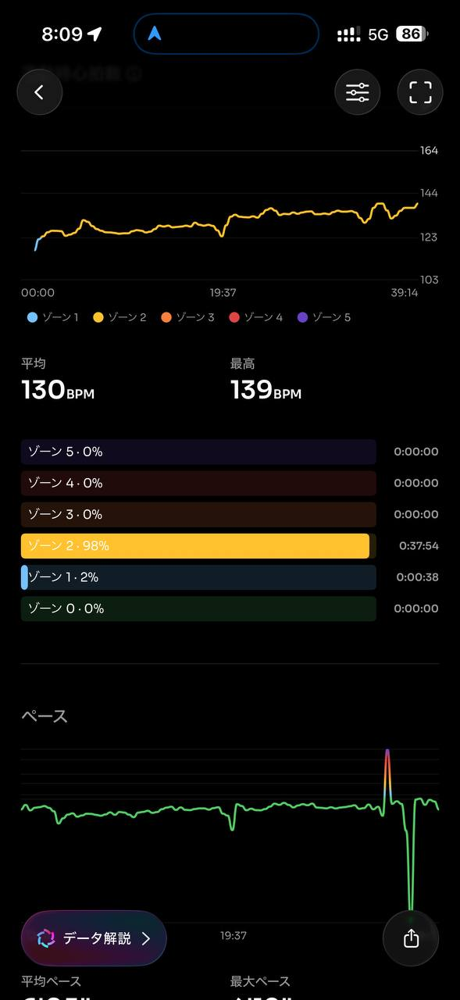
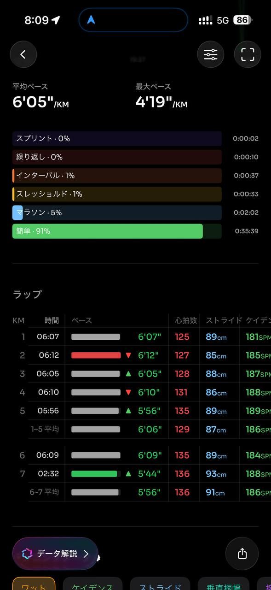
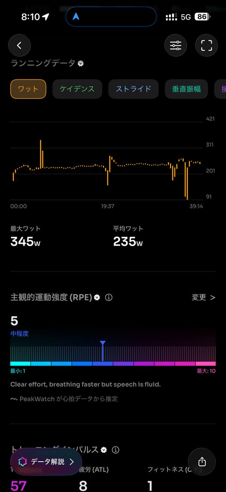
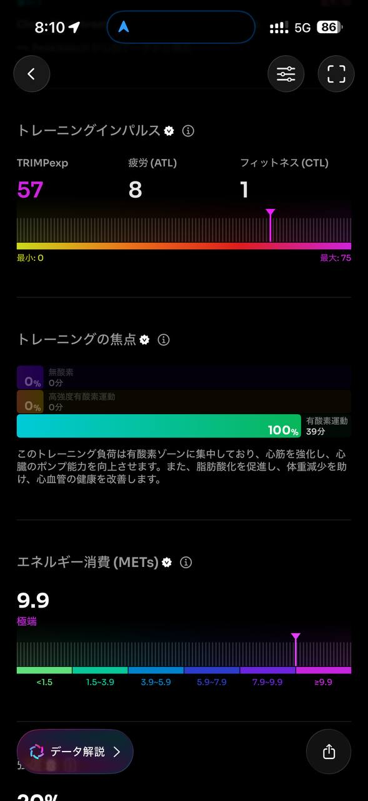
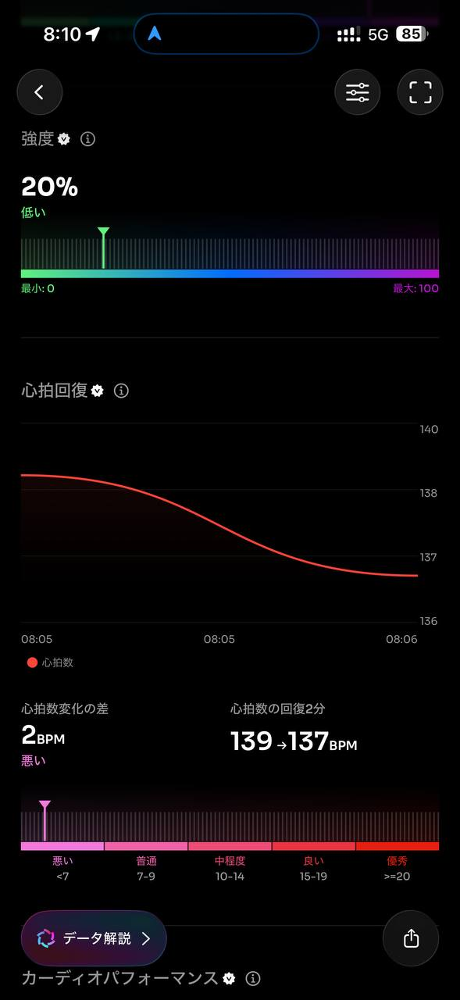
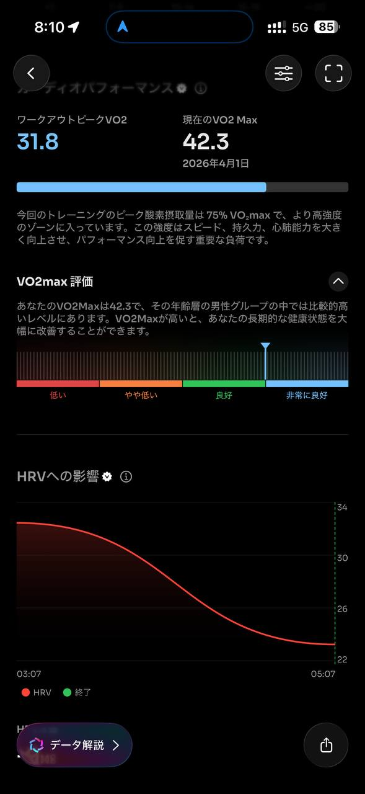
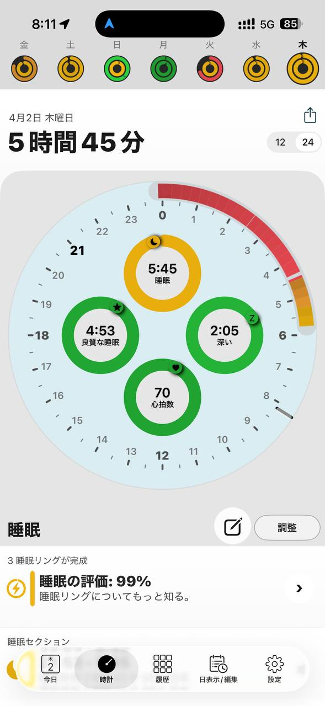
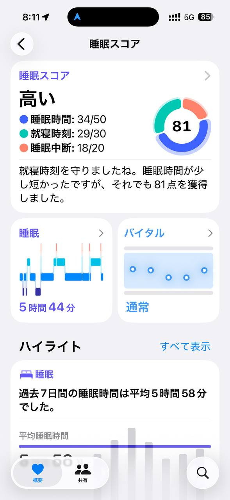