- 距離：15.96km
- 時間：1:56:25
- 平均心拍数：142拍/分
- 使用シューズ：スーパーノヴァ
- 時間帯：10時頃
- 天候：10時頃 曇り 気温20℃ 風速3.4m/s
- コース：羽田から川崎市
- 補給：
- 睡眠：7時間30分 スコア96
- 今日の目的：羽田からLSDチャレンジ
- コメント：多摩川0キロ地点スタートラン
- 自分メモ：羽田から25km走ろうとするも暑くて10kmちょっとでダウン。その後なんとか6km歩いたり走ったりで終了😰

## 📊 ラップデータ
- 1km:6:23
- 2km:6:00
- 3km:5:56
- 4km:5:56
- 5km:7:34
- 6km:5:46
- 7km:5:53
- 8km:5:51
- 9km:5:52
- 10km:6:47
- 11km:10:48
- 12km:9:01
- 13km:11:47
- 14km:10:15
- 15km:6:12
- 16km:6:26

## 📝 コーチコメント
MASAさん、羽田からの25km走チャレンジ、お疲れ様でした。暑さでダウンされたとのこと、無理は禁物です。まずは10km以上走られたこと、その後も歩きやジョグでリカバリーされたことを評価します。

データを見ると、前半は5分台/kmで走れていたようですが、後半はペースが落ち、心拍数も高くなっています。これは暑さの影響に加え、準備不足も考えられます。

直近のハーフマラソン目標に向け、以下の点を意識しましょう。

1. **暑熱対策:** こまめな水分補給、日中のランニングは避け、早朝や夕方の涼しい時間帯を選びましょう。帽子や日焼け止めも忘れずに。
2. **LSDトレーニング:** 今回の15.96kmはLSDトレーニングとして良い距離です。しかし、写真に「きつい」とあるように、少しペースが速すぎたかもしれません。目標は心拍数をゾーン2〜3に抑え、会話ができるくらいの余裕を持ったペースで走ることです。
3. **距離への慣れ:** 目標のハーフマラソンに向け、徐々に走行距離を伸ばしていきましょう。まずは15kmを楽に走れるように、LSDトレーニングを継続し、週末には少し長めの距離に挑戦するのも良いでしょう。
4. **睡眠:** 睡眠スコアが非常に高いのは素晴らしいです。質の高い睡眠は疲労回復に不可欠です。今の睡眠習慣を維持し、トレーニングの効果を高めましょう。
5. **レース戦略:** レース本番でも、暑さ対策は必須です。給水所の位置を確認し、こまめに水分補給をしましょう。また、序盤は抑え気味にスタートし、後半に余力を残せるようにペース配分を意識しましょう。

4月26日の東日本国際親善マラソンに向け、無理なく計画的にトレーニングを進めていきましょう。応援しています！

## 📸 写真一覧
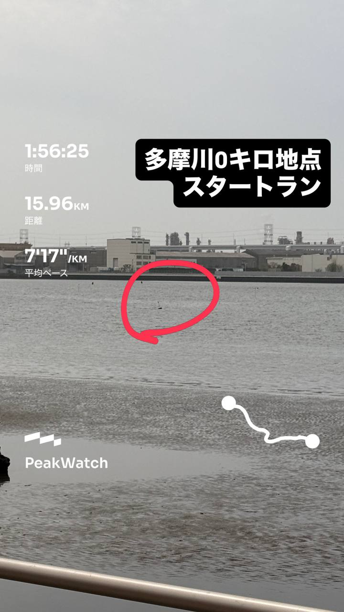
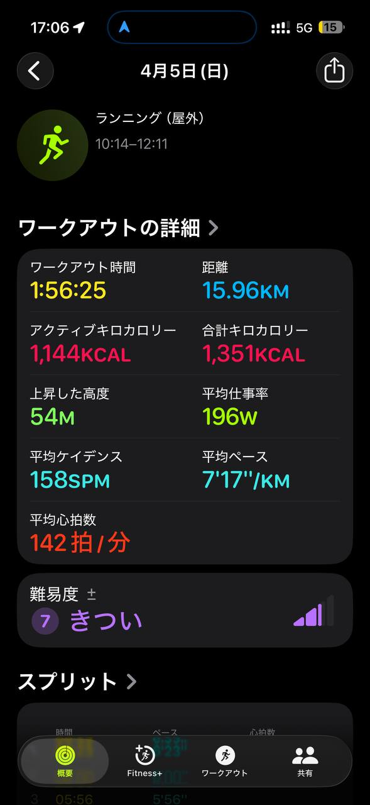
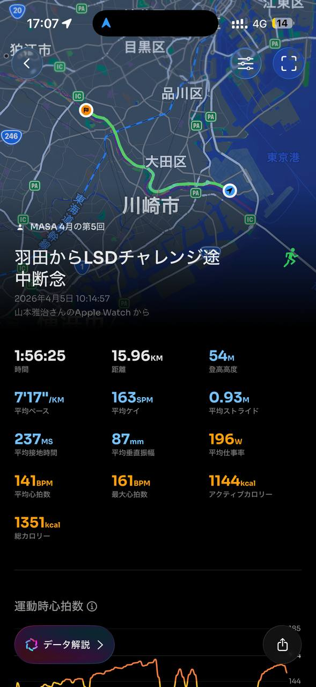
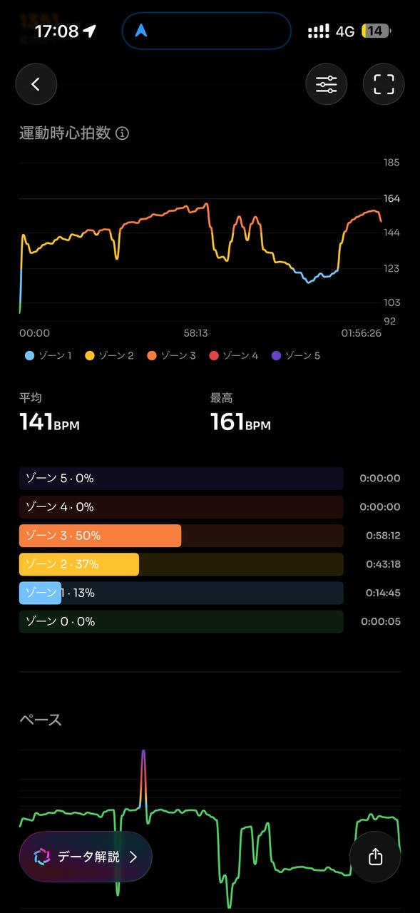
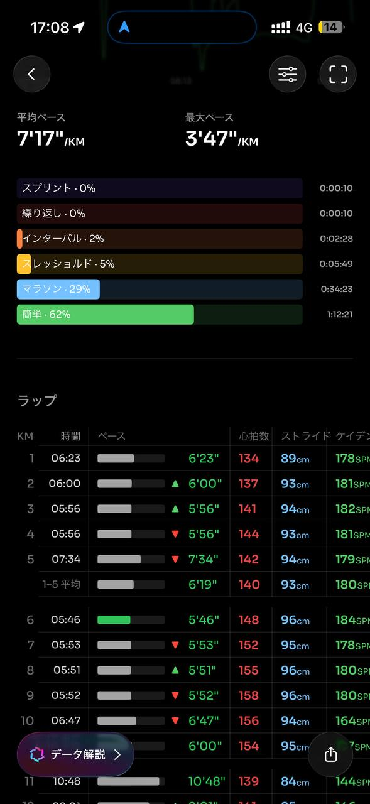
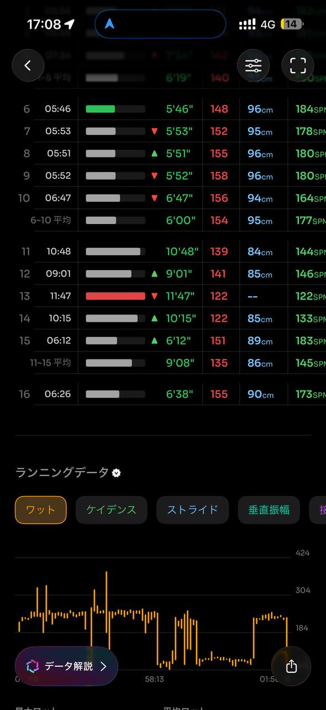
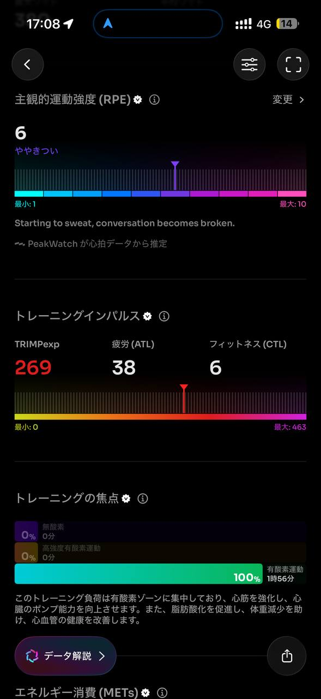
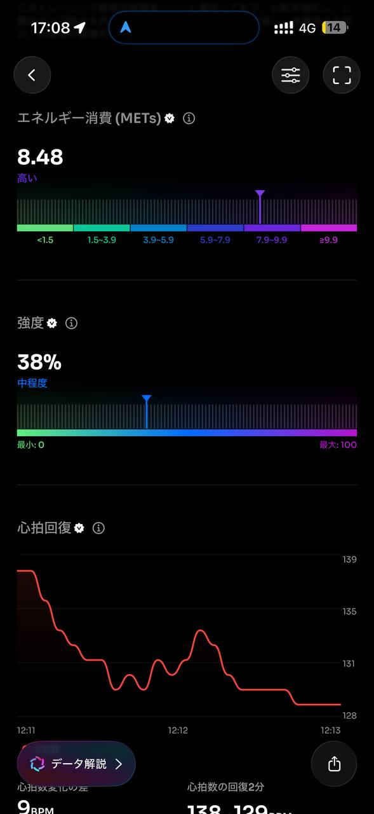
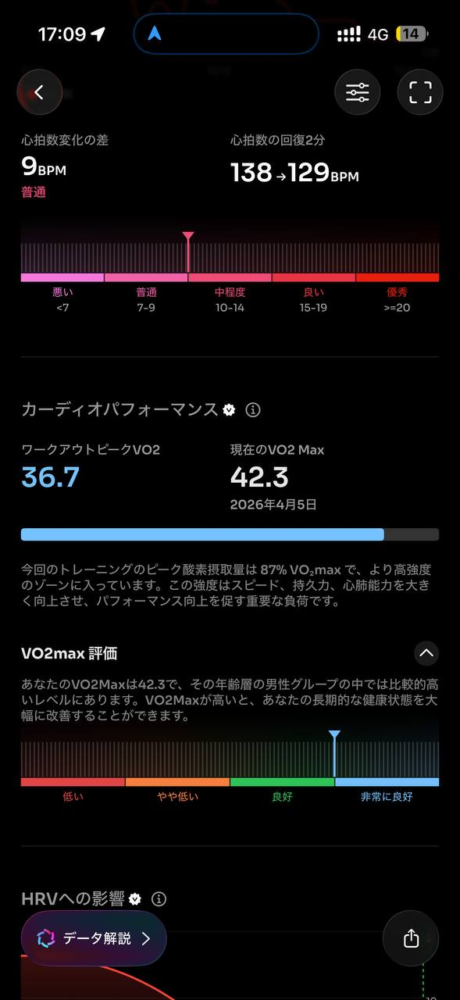
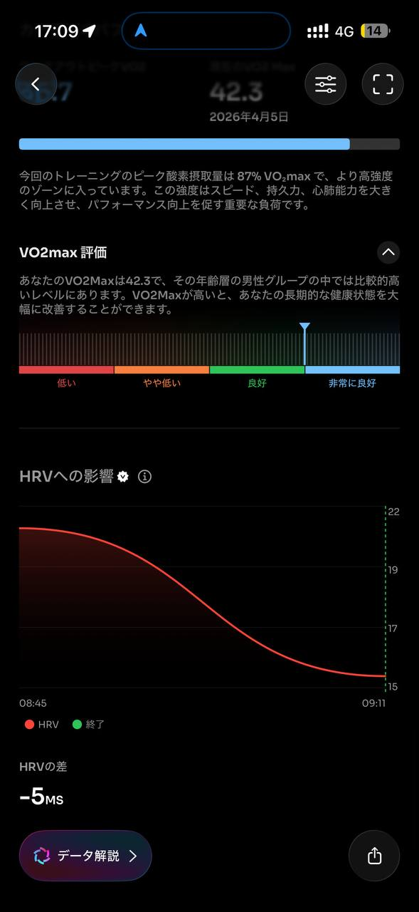
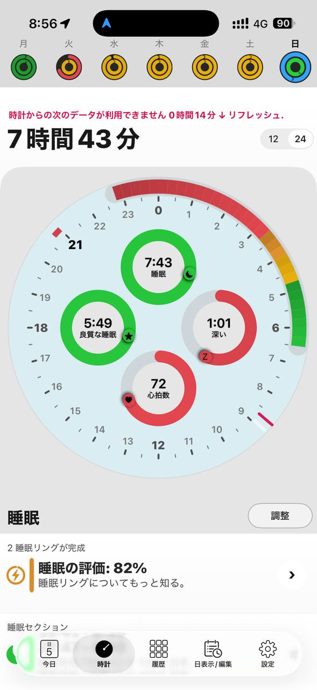
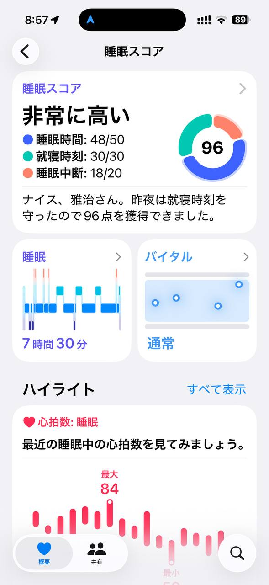