- 距離：4.09km
- 時間：0:26:06
- 平均心拍数：129拍/分
- 使用シューズ：インフィニットプロ
- 時間帯：7時頃
- 天候：7時頃 快晴 気温15.8℃ 風速3.4m/s
- コース：調布市
- 補給：
- 睡眠：7時間20分, スコア:97
- 今日の目的：血行のためのリカバリージョグ
- コメント：#朝ラン #ゆるラン 天気はいいけど、雲も多い
- 自分メモ：疲れてるのか？たくさん寝たのにボディバッテリー低い、ペースもあがらないから、まぁリカバリーとしてはちょうどよかったのかな？ってなジョグ

## 📊 ラップデータ
- 1km:6:18
- 2km:6:17
- 3km:6:28
- 4km:6:24
- 5km:0:37

## 📝 コーチコメント
MASAさん、データ確認しました。お疲れ様です。

「たくさん寝たのにボディバッテリーが低い」とのことですが、睡眠スコア自体は高い数値が出ていますね。しかし、睡眠時間7時間20分に対し、深い睡眠が1時間46分と少し短いです。睡眠の質を上げるために、寝る前のカフェイン摂取やスマホの使用を控え、リラックスできる環境を整えることを意識してみましょう。

ランニングデータとしては、心拍数がゾーン2に集中しており、ほぼジョグという強度でした。直近の東日本国際親善マラソンに向けて、疲労を抜きつつ、少しずつスピードを上げていく必要があるので、週に一度は短い距離でも良いので、インターバル走やレペティションを取り入れてみましょう。現在のVO2max42.2を向上させるには、高強度なトレーニングも必要です。

ただし、疲労が溜まっていると感じる場合は、無理せずリカバリージョグを優先してください。特に、レース2週間前からは疲労を完全に抜くことを意識しましょう。睡眠と栄養をしっかり摂り、万全の状態でレースに臨めるようサポートしていきます。

## 📸 写真一覧
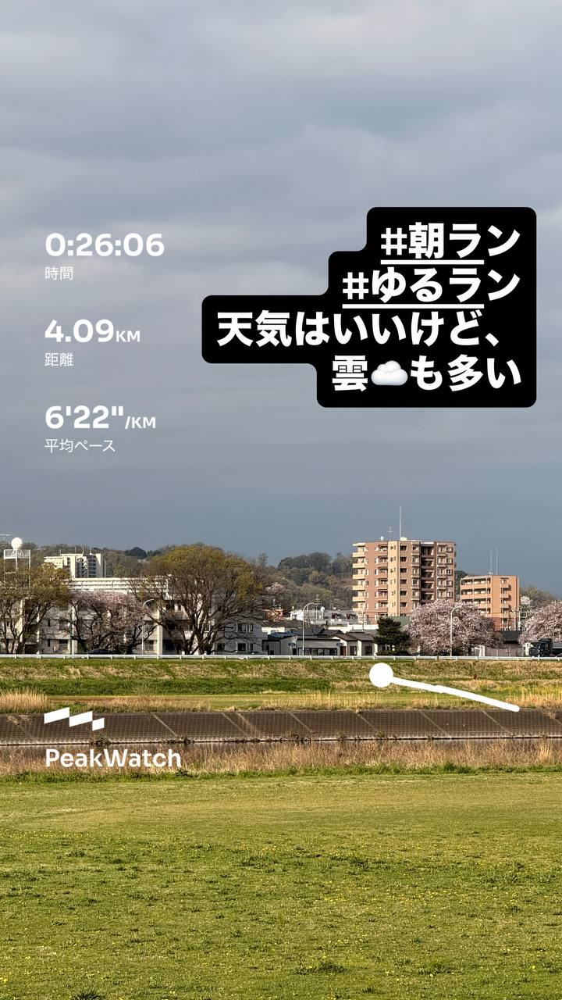
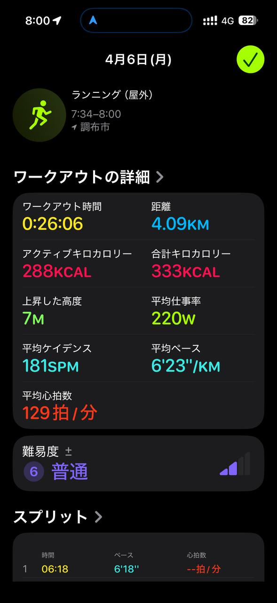
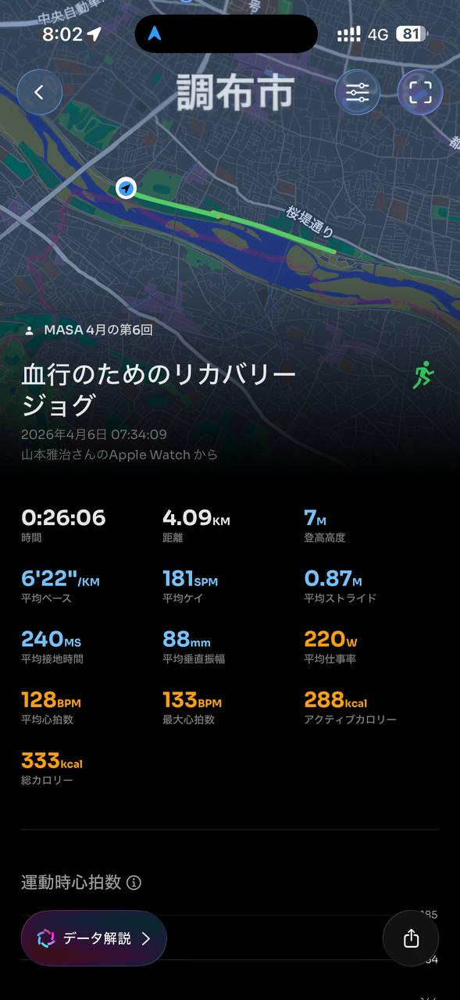
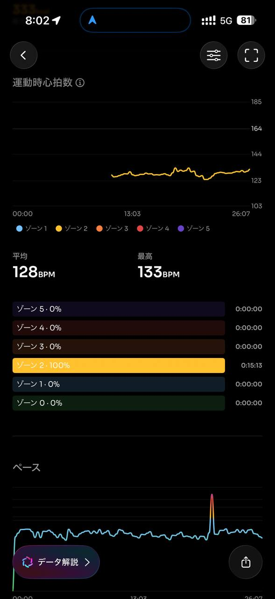
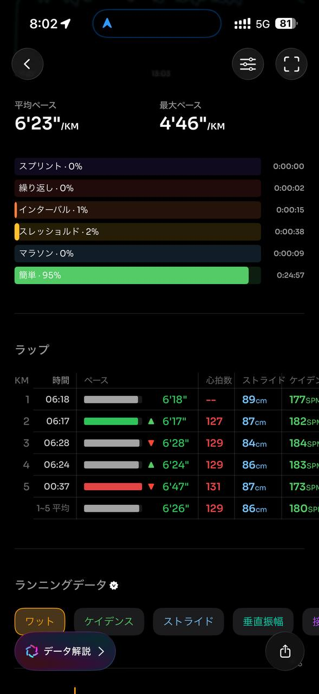
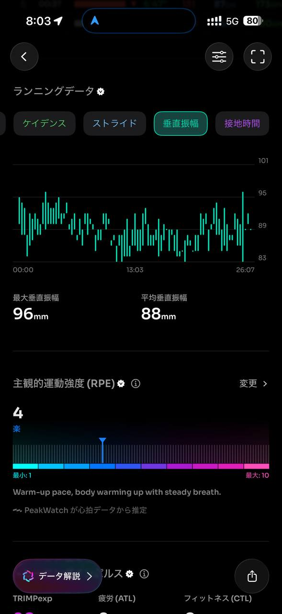
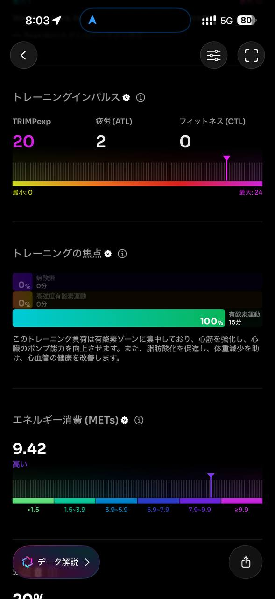
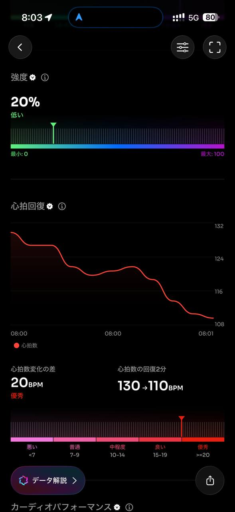
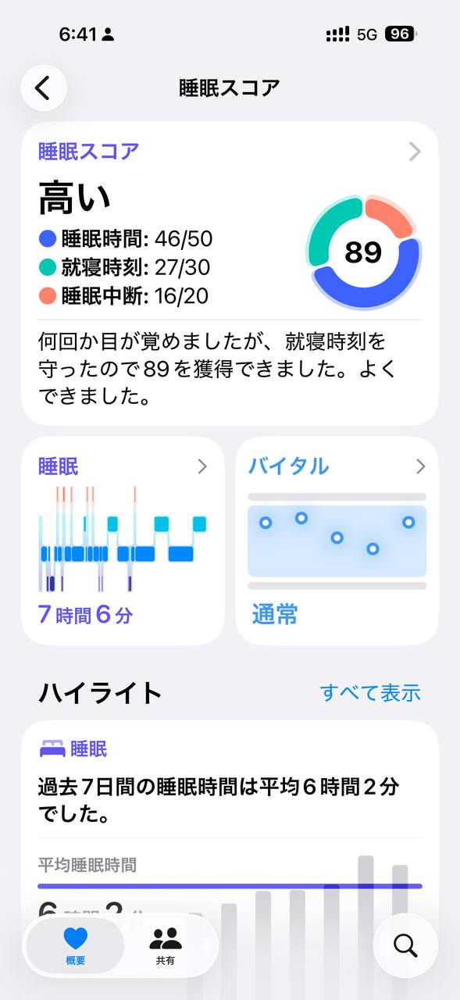
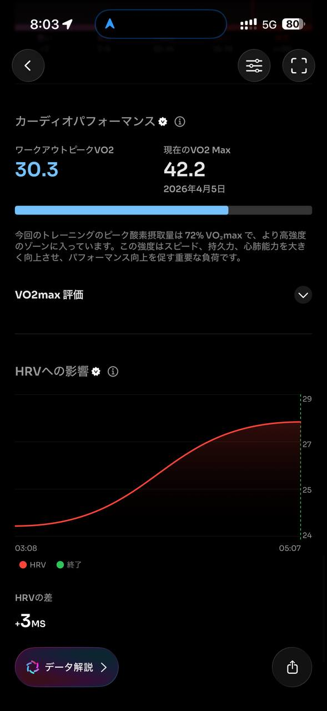
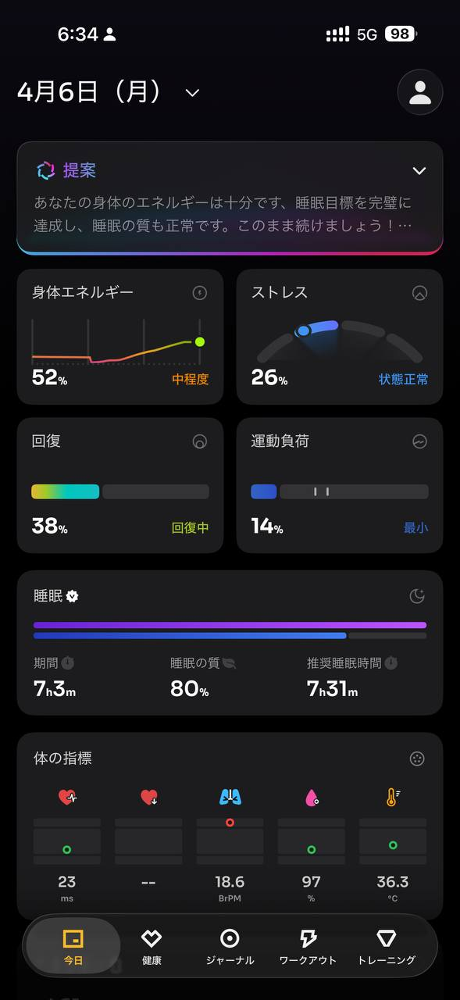
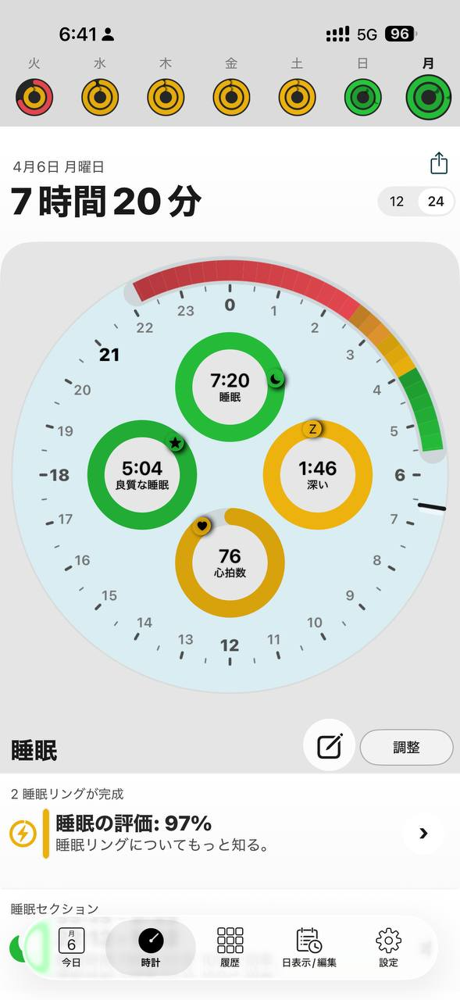