- 距離：6.18km
- 時間：0:35:25
- 平均心拍数：162拍/分
- 使用シューズ：マジックスピード4
- 時間帯：7時頃
- 天候：取得失敗
- コース：調布市
- 補給：
- 睡眠：5時間30分,74
- 今日の目的：閾値走4km
- コメント：#朝ラン #ゆるラン 閾値走4km! ゼーハーが止まらん
- 自分メモ：閾値走はキツいけど、達成感ある！もーちょい走れたらよかったなー

## 📊 ラップデータ
- 1km:5:25
- 2km:5:00
- 3km:4:22
- 4km:4:32
- 5km:4:22
- 6km:5:07
- 7km:0:56

## 📝 コーチコメント
MASAさん、閾値走お疲れ様でした！「もーちょい走れたらよかったなー」という向上心、素晴らしいですね！ データを見ると、平均ペースは4'48"/kmで、心拍数もゾーン4とゾーン5にしっかり入っています。トレーニング強度は目標レースに向けて良い刺激になっていると思います。

ただ、睡眠時間が5時間半と少し短いのが気になります。睡眠不足はパフォーマンス低下だけでなく、怪我のリスクも高めます。特に閾値走のような高強度の練習後には、質の高い睡眠が不可欠です。

4月26日のハーフマラソンに向けて、残り期間で疲労を抜きつつ、レースペースへの慣れも重要です。

そこで、次の提案です。
- 閾値走の距離を少しずつ伸ばす代わりに、睡眠時間を最低でも7時間確保することを優先しましょう。
- レースペースでのジョグや、短い距離のインターバルを取り入れて、スピード感を養いましょう。
- レース1週間前からは、練習量を減らし、疲労回復に専念しましょう。

頑張ってください！応援しています！

## 📸 写真一覧
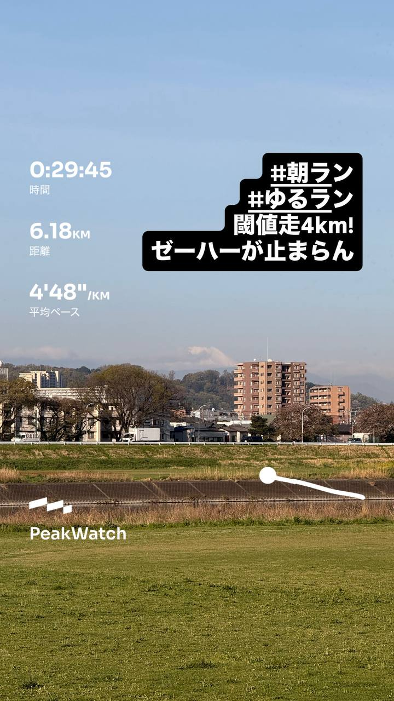
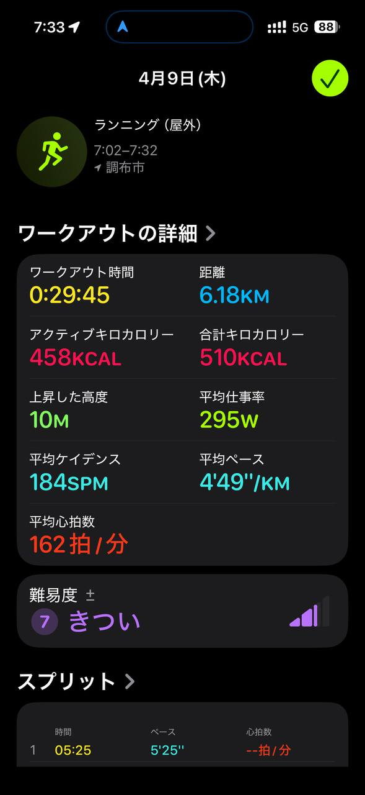
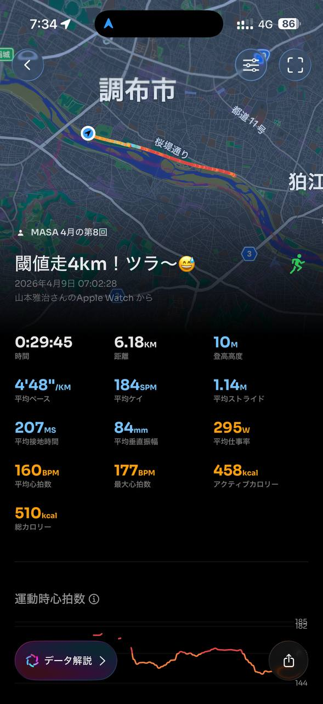
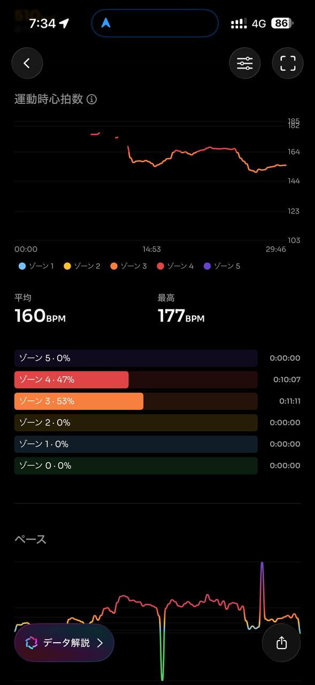
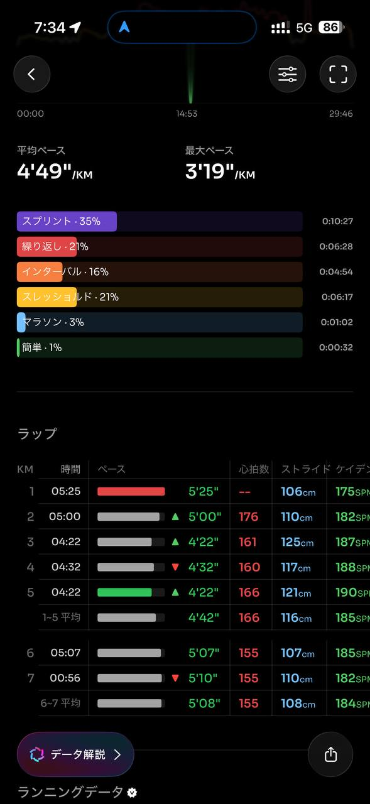
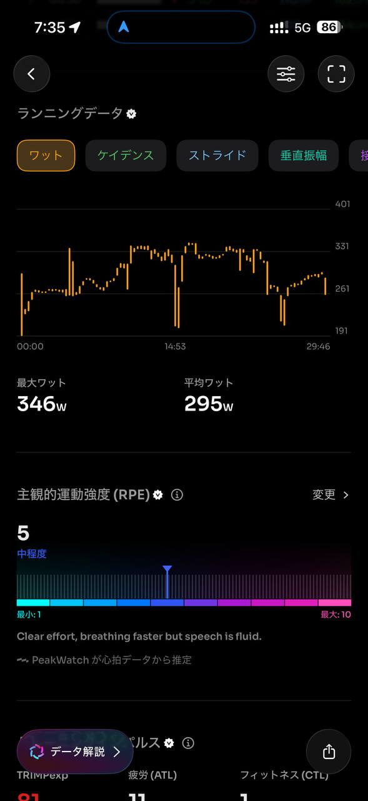
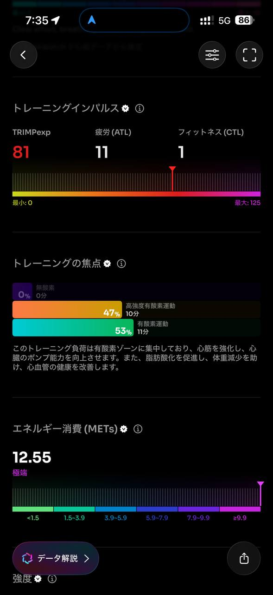
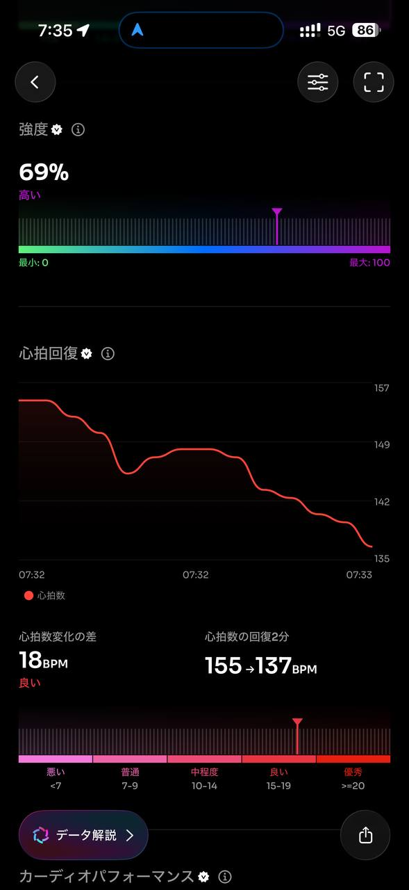
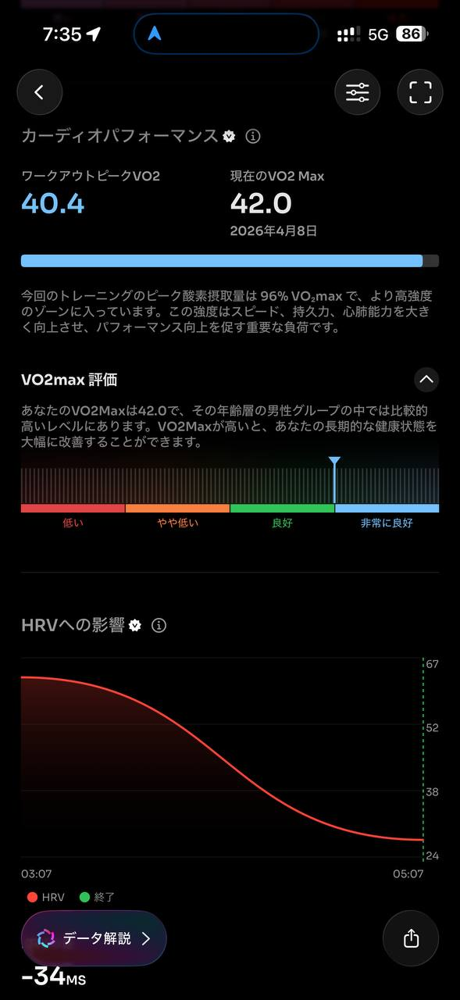
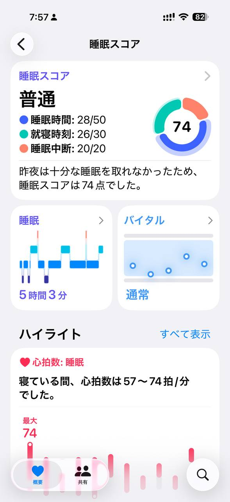
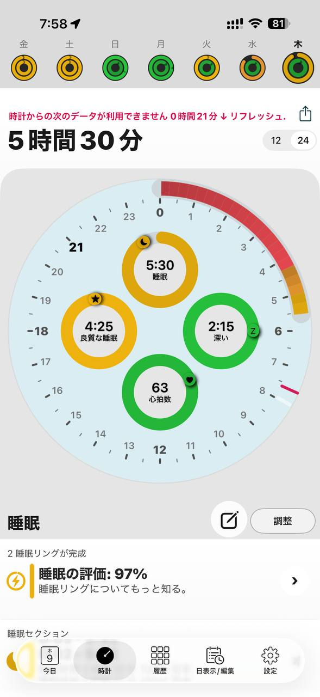