- 距離：4.05km
- 時間：0:29:57
- 平均心拍数：134拍/分
- 使用シューズ：ワラーチ
- 時間帯：12時頃
- 天候：12時頃 快晴 気温24.4℃ 風速5.2m/s
- コース：調布市
- 補給：
- 睡眠：7時間52分, 69
- 今日の目的：温泉♨️までラン
- コメント：#ゆるラン
温泉♨️までラン
- 自分メモ：温泉♨️までジョグ。暑いので久々にワラーチでラン！ただ途中で間違ってワークアウト終わらせたので続きが1kmあります😅

## 📊 ラップデータ
- 1km:6:44
- 2km:6:31
- 3km:6:26
- 4km:9:39
- 5km:10:58

## 📝 コーチコメント
MASAさん、温泉ジョグお疲れ様でした！ワラーチでのランニング、気持ちよさそうですね！データを確認しました。平均ペース7'23"/km、心拍数も平均134bpmと、リラックスして走れていることがわかります。直近のレースに向けて、疲労を抜く時期に入っているようですので、温泉でのリフレッシュは良い選択ですね。

ただ、4km地点でペースが大きく落ちていますね。これはワークアウトを一時停止した影響でしょうか。GPSが途切れるとペースが乱れることがあります。今後は、ワークアウト中の操作には注意してくださいね。

全体的に、有酸素運動の割合が高く、心肺機能の強化に繋がっているようです。睡眠データも拝見しましたが、睡眠時間は確保できているものの、睡眠の質は改善の余地がありそうですね。レースに向けて、睡眠の質も意識していくと、よりパフォーマンスアップに繋がると思います。引き続き、頑張っていきましょう！

## 📸 写真一覧
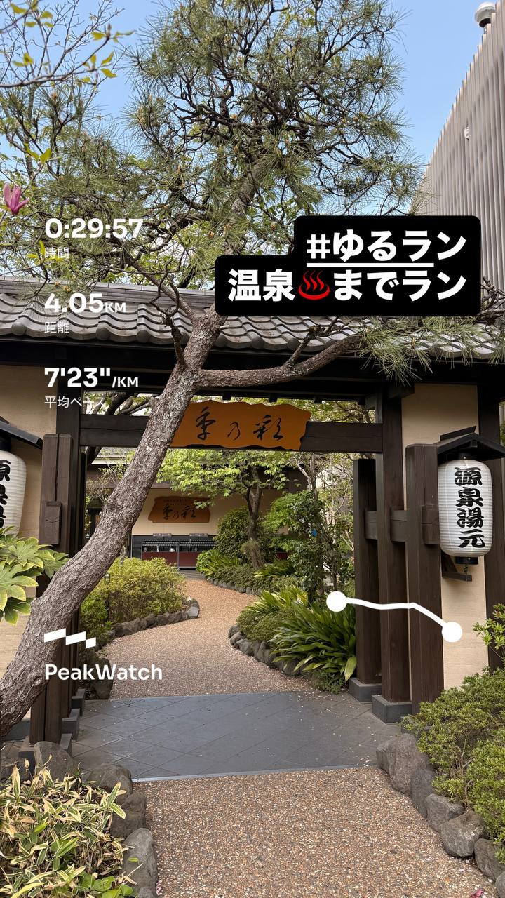
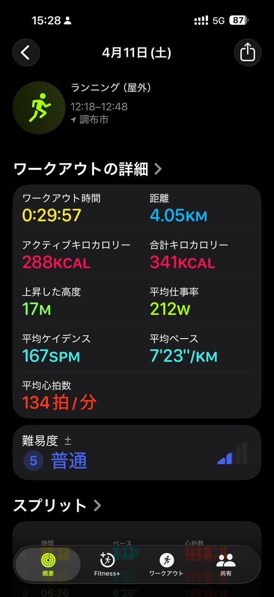
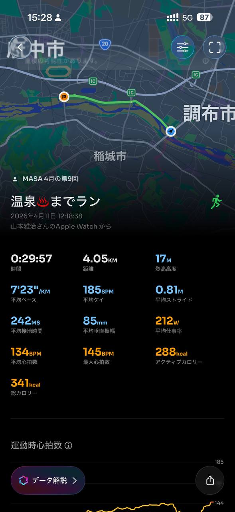
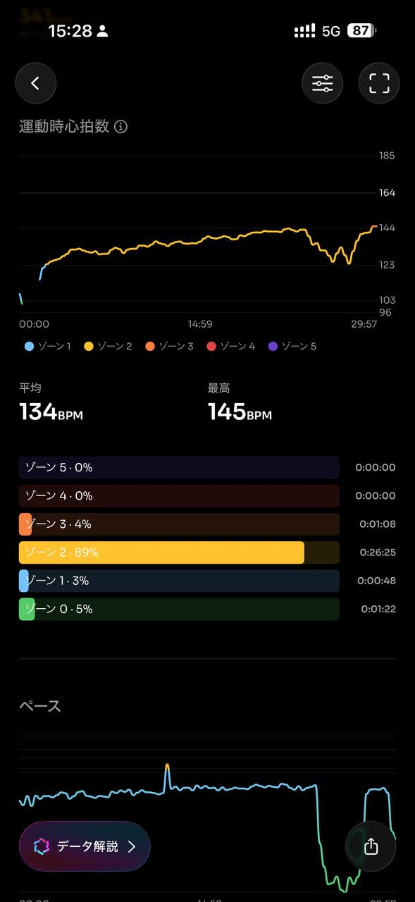
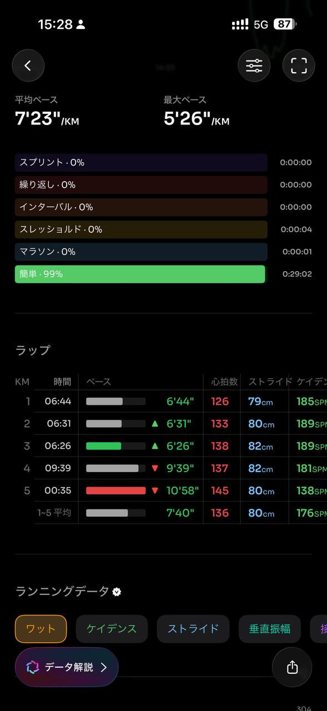
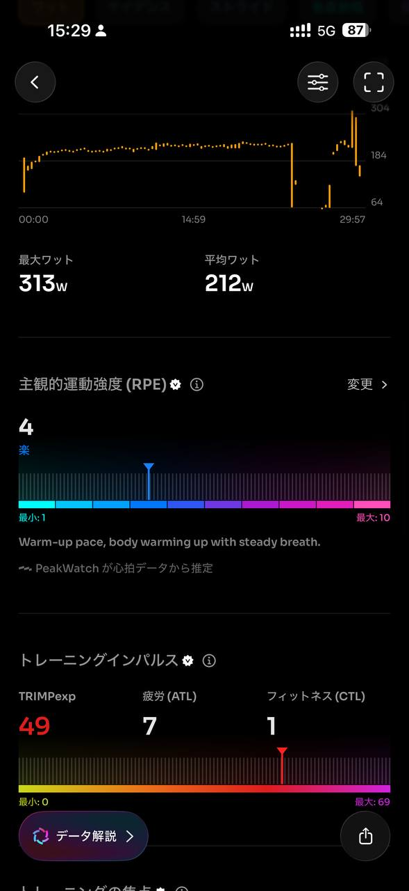
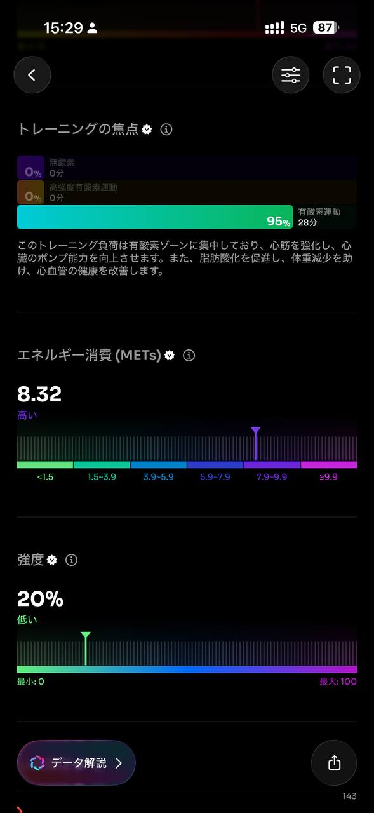
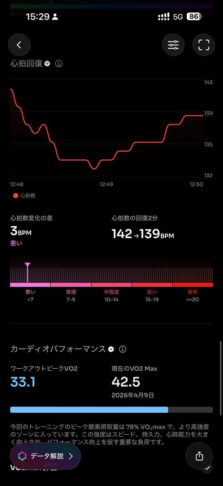
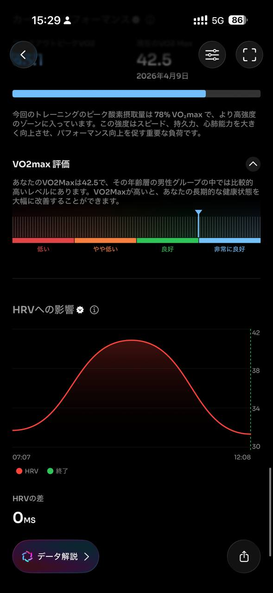
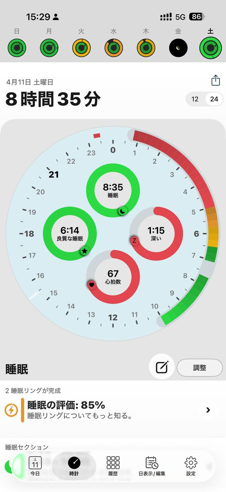
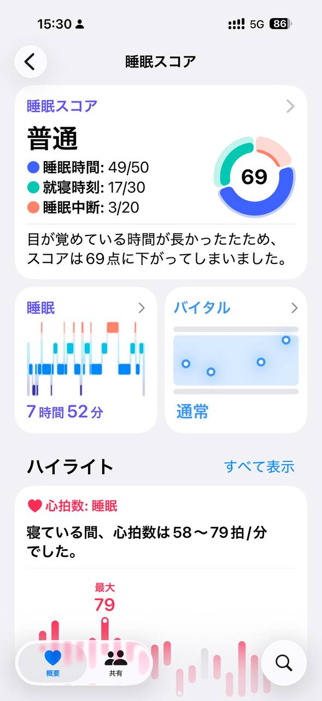