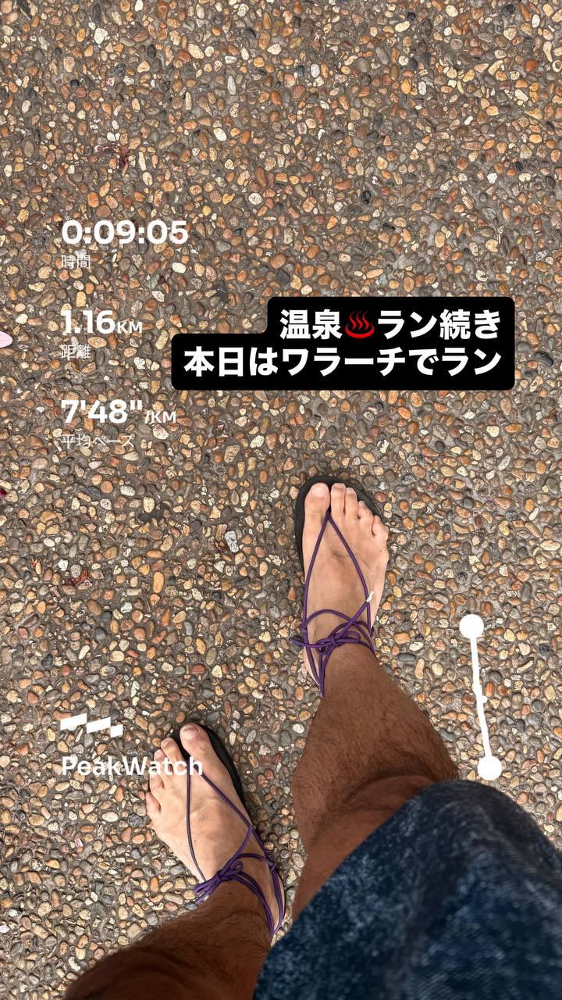
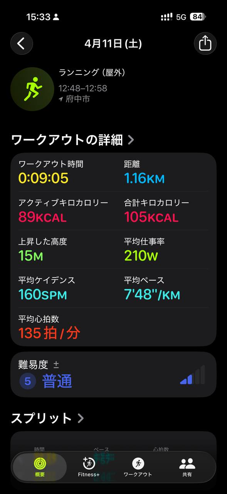
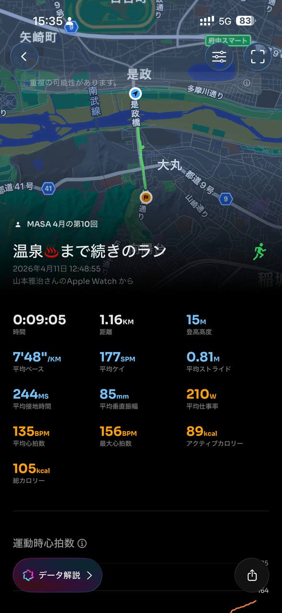
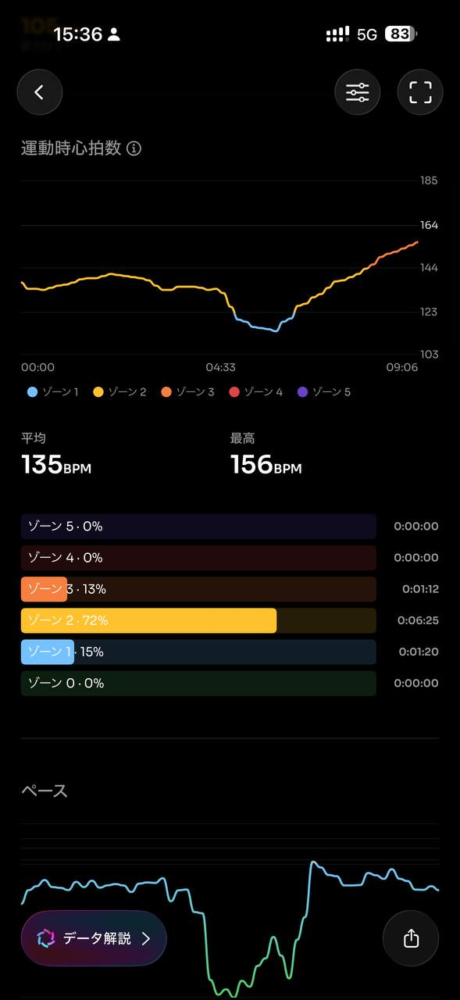
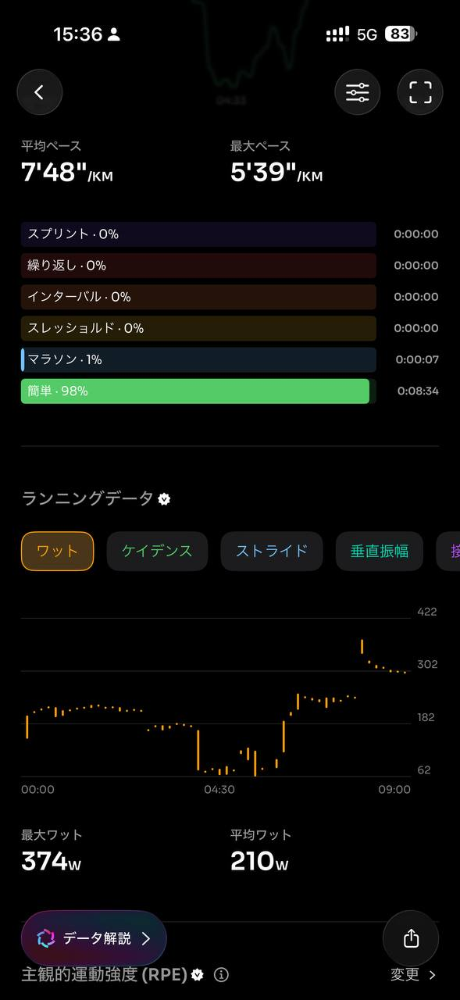
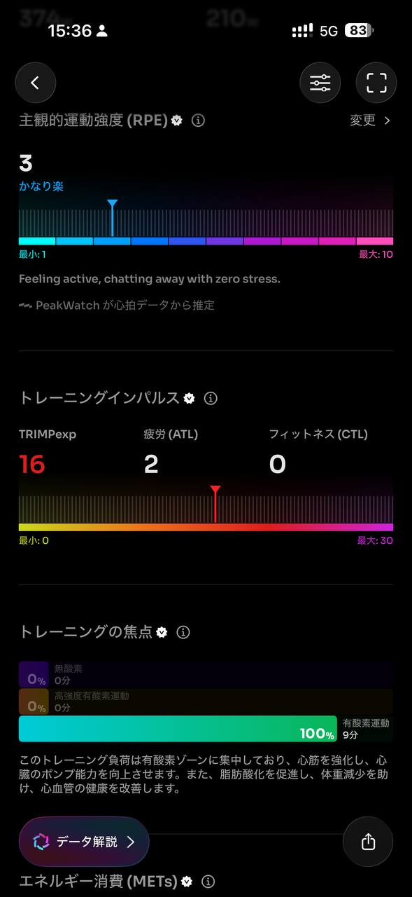
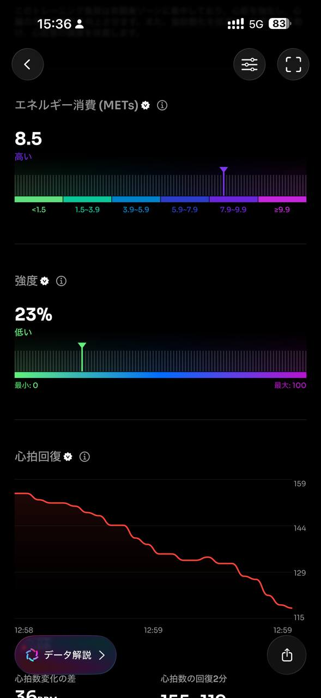
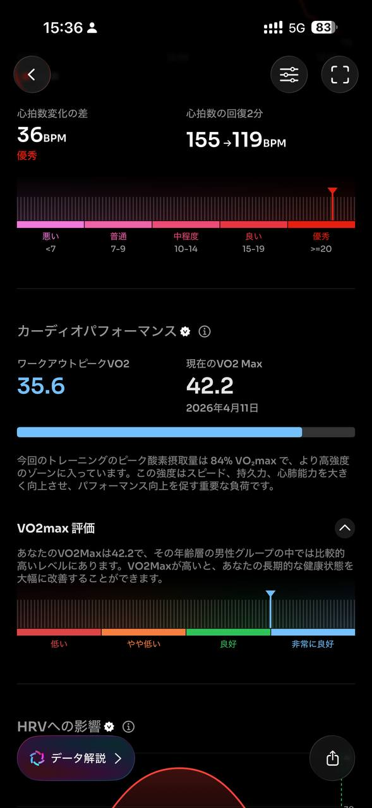
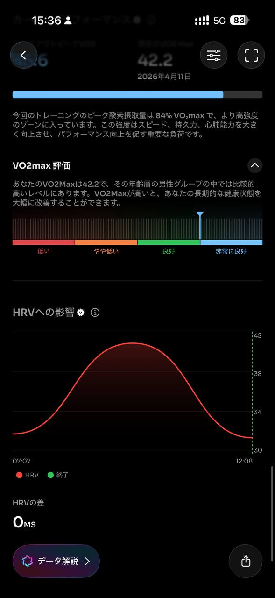

- 距離：1.16km
- 時間：0:09:05
- 平均心拍数：135拍/分
- 使用シューズ：ワラーチ
- 時間帯：12時頃
- 天候：12時頃 快晴 気温24.4℃ 風速4.6m/s
- コース：府中市
- 補給：
- 睡眠：
- 今日の目的：
- コメント：温泉♨️♨️ラン続き
本日はウラーチでラン
- 自分メモ：温泉♨️ラン、ログを誤操作で切ってしまったので続き！

## 📝 コーチコメント
MASAさん、温泉ランお疲れ様でした！ログの誤操作は残念でしたが、続きからデータを確認できて良かったです。

今回のデータを見ると、短い距離ですが、心拍数が比較的高いゾーン2～3で推移しており、心肺機能への良い刺激になったと思います。平均ペースが7'48"/km、平均心拍数135bpm、最大心拍数156bpmというのも妥当な範囲でしょう。主観的運動強度(RPE)が3で「かなり楽」とのことなので、リラックスして走れたようですね。

VO2maxが42.2と年齢層の中でも比較的高いレベルにあるのは素晴らしいです。これは過去のトレーニングの成果が出ていますね。心拍数の回復も優秀です。

ただ、4月26日の東日本国際親善マラソン（ハーフ）に向けて、ペースを意識した練習も取り入れていきましょう。目標タイムを設定し、レースペースでのランニングを週に1回程度行うことをお勧めします。また、疲労を考慮して、休息日もきちんと設けるようにしてください。

今回は短い距離でしたが、本番に向けて徐々に距離を伸ばし、ペース走やロング走も取り入れて、レース本番で自己ベスト更新を目指しましょう！引き続きサポートさせていただきます。

## 📸 写真一覧

