- 距離：30.32km
- 時間：3:20:25
- 平均心拍数：140拍/分
- 使用シューズ：スーパーノヴァ
- 時間帯：11時頃
- 天候：11時頃 快晴 気温18℃ 風速1.5m/s
- コース：調布市
- 補給：
- 睡眠：8時間45分, 75
- 今日の目的：ツキイチサンジュウ2604
- コメント：#ツキイチサンジュウ
何か走った~!
- 自分メモ：休みを入れつつも何とか30km楽しく走れたー！

## 📊 ラップデータ
- 1km:6:36
- 2km:6:27
- 3km:6:55
- 4km:6:24
- 5km:7:36
- 6km:6:19
- 7km:5:50
- 8km:5:50
- 9km:6:09
- 10km:7:41
- 11km:6:12
- 12km:6:08
- 13km:6:11
- 14km:6:07
- 15km:6:03
- 16km:7:08
- 17km:6:11
- 18km:6:28
- 19km:6:09
- 20km:5:53
- 21km:6:41
- 22km:6:41
- 23km:6:07
- 24km:6:07
- 25km:6:24
- 26km:10:12
- 27km:7:13
- 28km:6:13
- 29km:6:18
- 30km:6:28
- 31km:3:15

## 📝 コーチコメント
MASAさん、30km走お疲れ様でした！「何とか」という言葉から、少し苦しい場面もあったのかなと推察しますが、楽しく走り切れたとのこと、素晴らしいです。平均ペース6'36"/km、心拍数も安定しており、全体的に見て良いトレーニングだったと思います。

直近のハーフマラソンに向けて、良い練習になっているでしょう。心拍数のデータを見ると、ゾーン2が67%と多く、持久力強化に効果的なトレーニングだったことが伺えます。

いくつか気になった点としては、26km以降のペースダウンと、睡眠時間です。26km以降のペースダウンは、疲労が蓄積した可能性があります。今後の練習では、30km走の頻度を調整したり、給水・給食のタイミングを見直したりするのも良いかもしれません。

睡眠に関しては、過去7日間の平均睡眠時間が6時間34分とやや短めです。パフォーマンス向上のためには、睡眠時間の確保も重要です。特にレース前は、十分な睡眠を心掛けてください。

次のハーフマラソンでは、2時間切りが見えてくると思います！引き続き頑張りましょう！応援しています！

## 📸 写真一覧
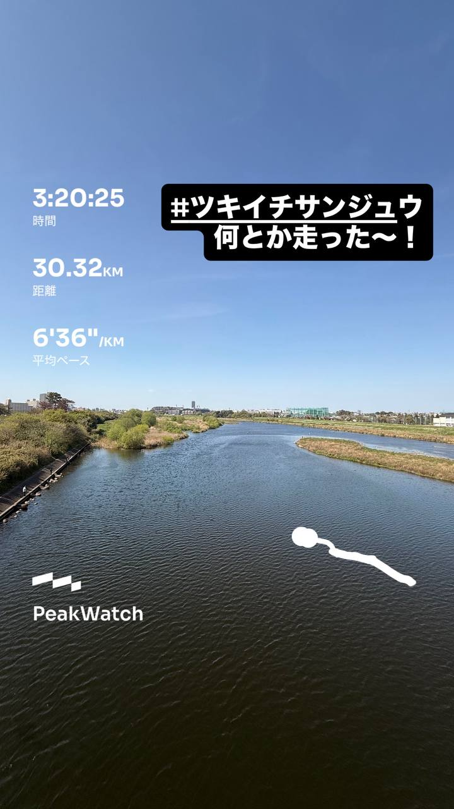
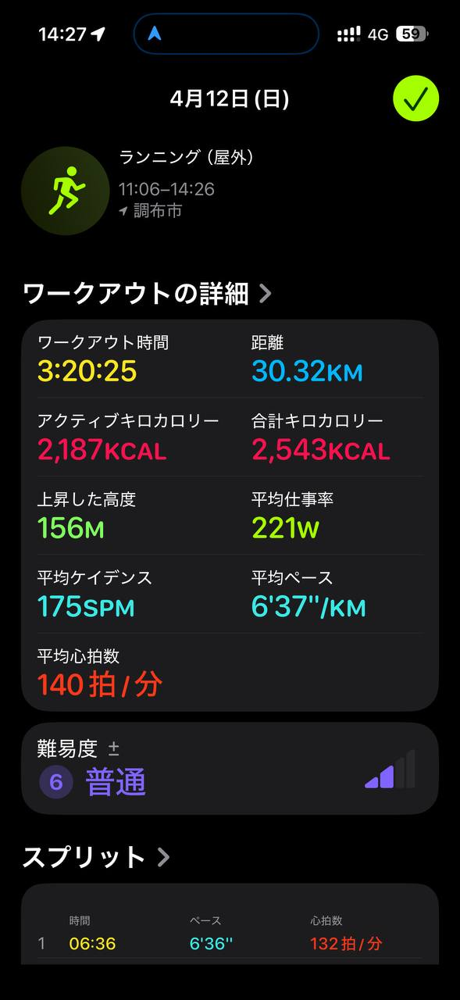
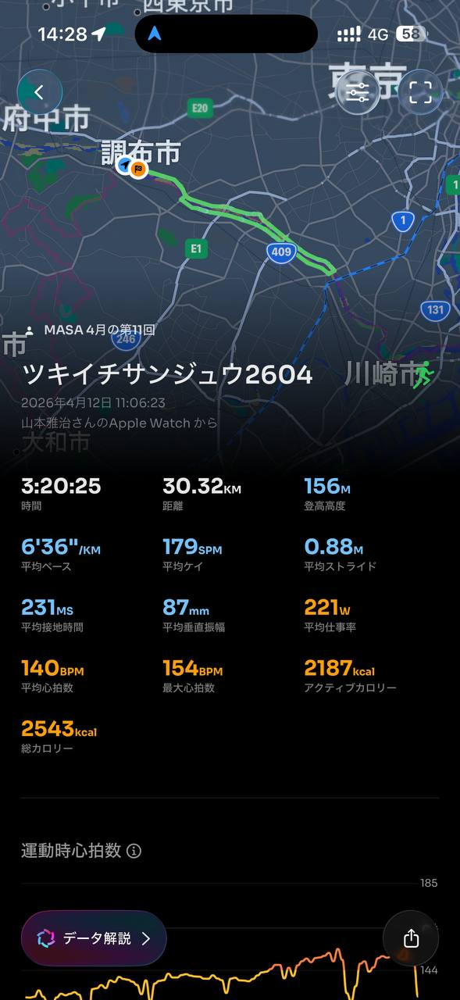
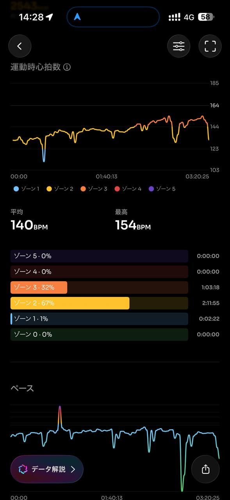
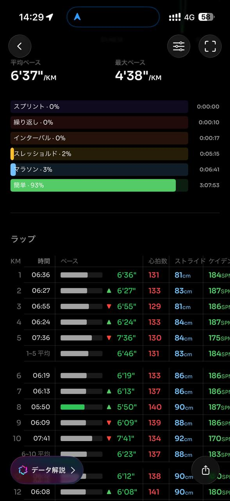
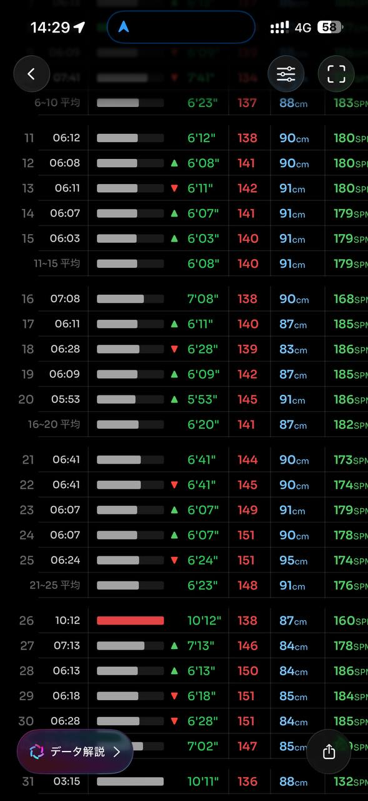
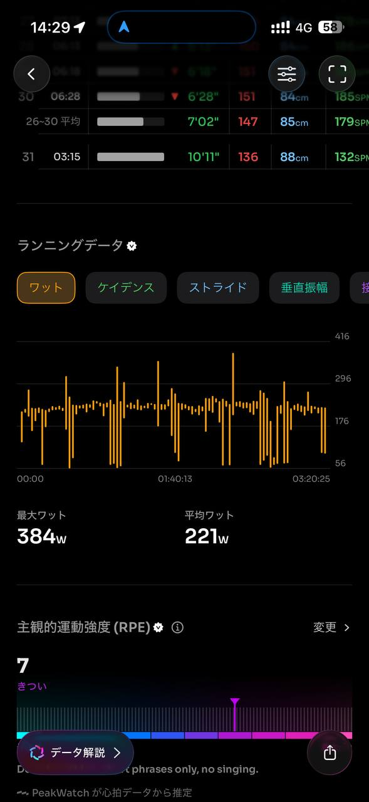
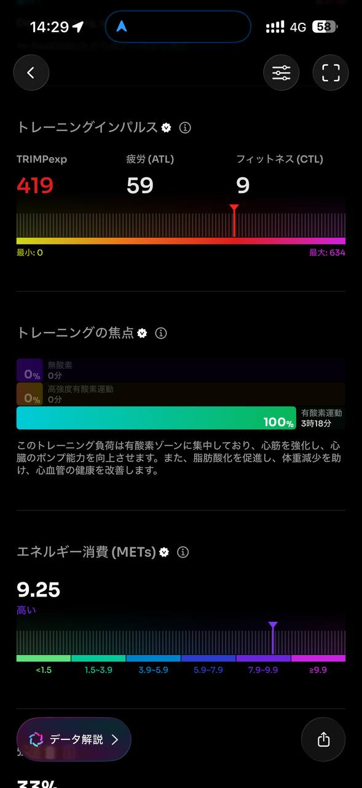
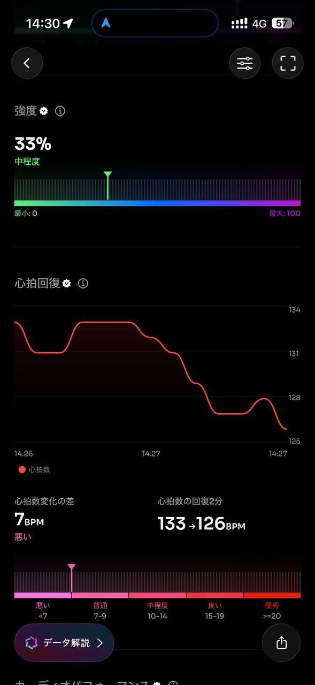
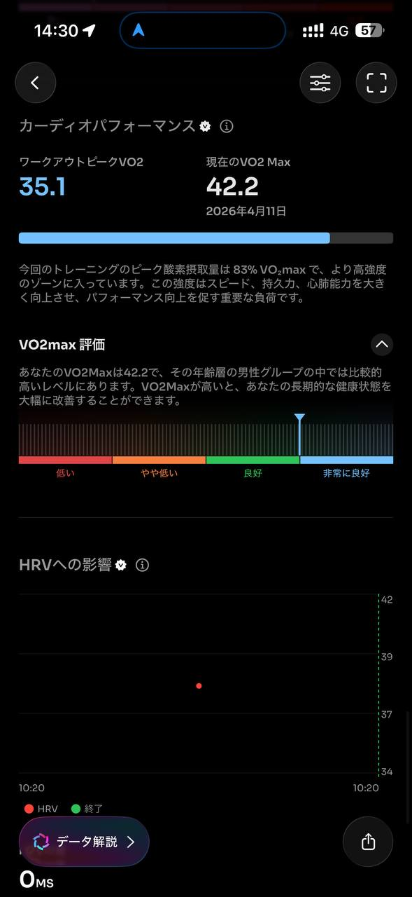
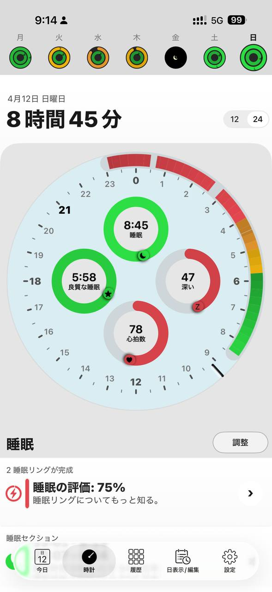
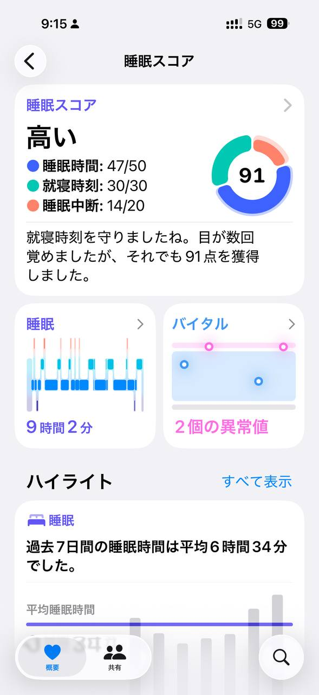