- 距離：7.40km
- 時間：0:41:24
- 平均心拍数：141拍/分
- 使用シューズ：マジックスピード4
- 時間帯：7時頃
- 天候：取得失敗
- コース：調布市
- 補給：
- 睡眠：6時間41分,91
- 今日の目的：400m×6本インターバル
- コメント：#朝ラン
#ゆるラン
ゼーハーなスピ練！
- 自分メモ：スピ練インターバル走！400m×6本について語って！

## 📊 ラップデータ
- 1km:5:52
- 2km:5:35
- 3km:4:51
- 4km:5:23
- 5km:5:11
- 6km:5:42
- 7km:6:15
- 8km:2:33

## 📝 コーチコメント
MASAさん、インターバル走お疲れ様でした！データを確認しました。400m×6本のインターバル、しっかりと追い込めていますね。

まず、全体的なペースですが、4'10"/km～4'36"/kmの間で推移しており、非常に良いペース設定です。回復のジョグも6'33"/km～6'53"/kmと、しっかりと緩急をつけていますね。心拍数の推移を見ても、インターバル中はゾーン4～5に入り、回復時にはゾーン2～3まで下がっており、狙い通りのトレーニングができていることが分かります。心拍数の回復も優秀ですね。

直近の目標レースがハーフマラソンなので、このスピードを維持しつつ、さらに距離を伸ばしていく練習も取り入れていくと良いでしょう。例えば、1000mインターバルや、少し長めの距離でのペース走なども効果的です。

また、睡眠データも拝見しました。睡眠スコアが高いのは素晴らしいですね。質の高い睡眠はトレーニング効果を高めるために非常に重要です。

今回のインターバル走は、MASAさんの現在のレベルに合った、非常に効果的なトレーニングだったと思います。この調子で、目標レースに向けて頑張ってください！

## 📸 写真一覧
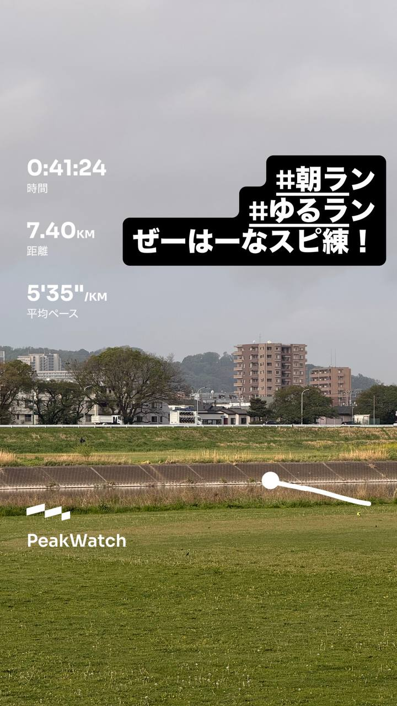
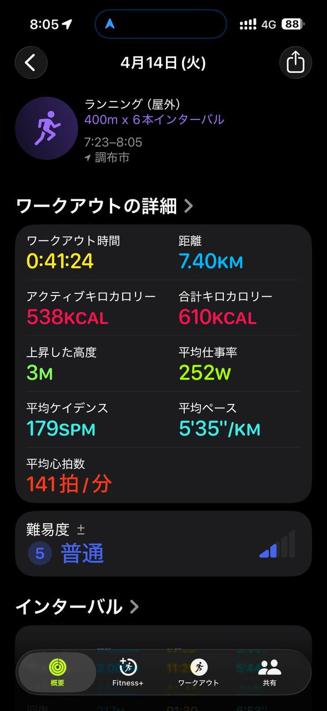
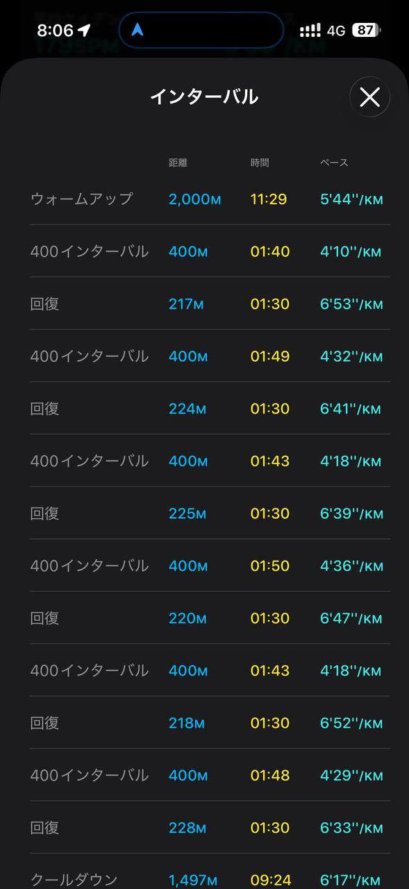
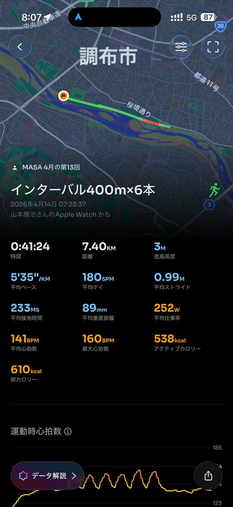
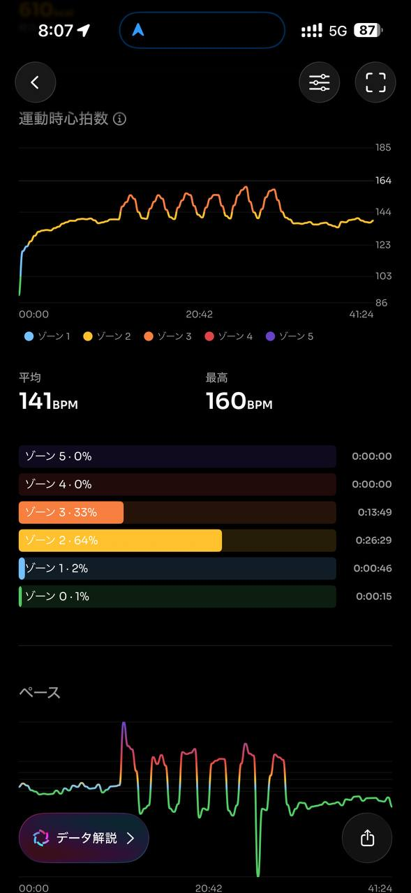
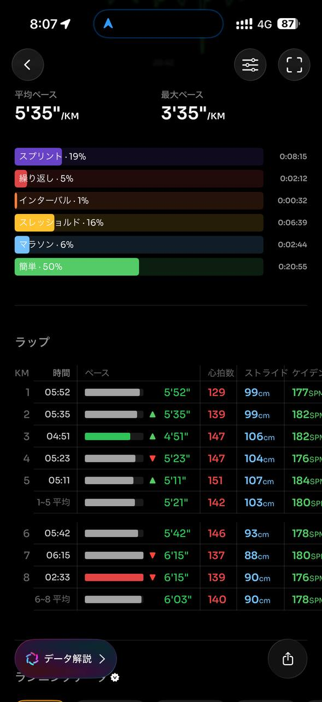
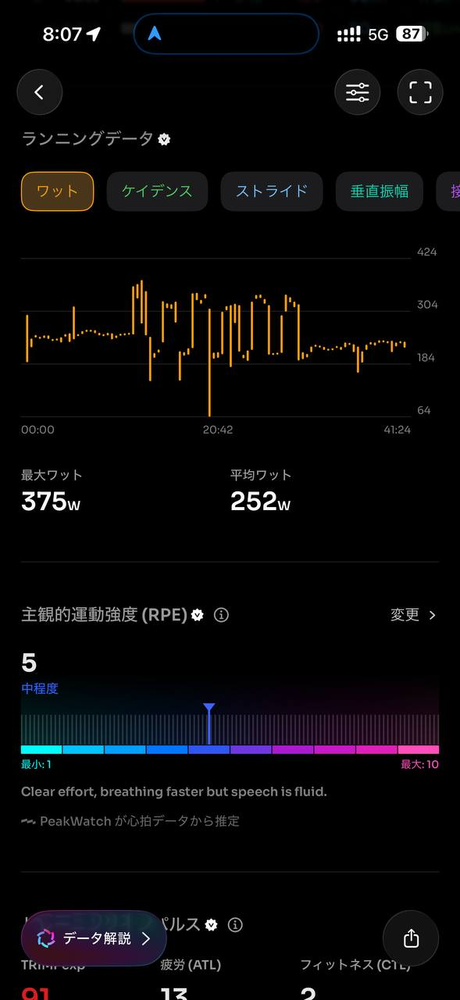
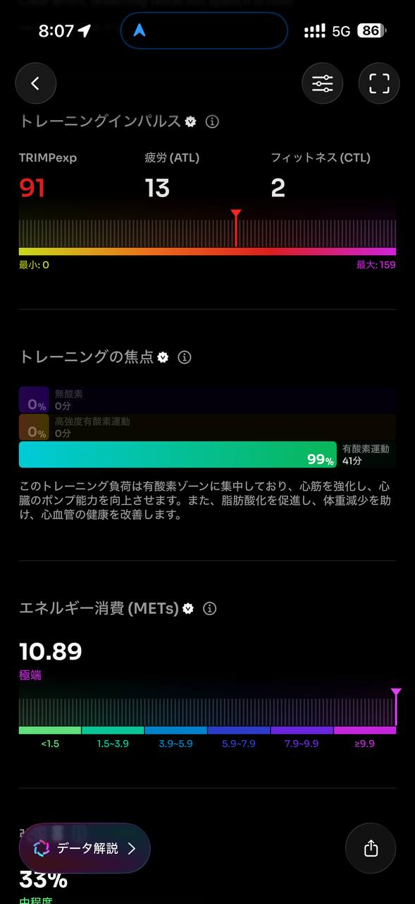
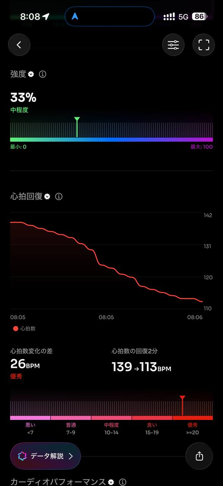
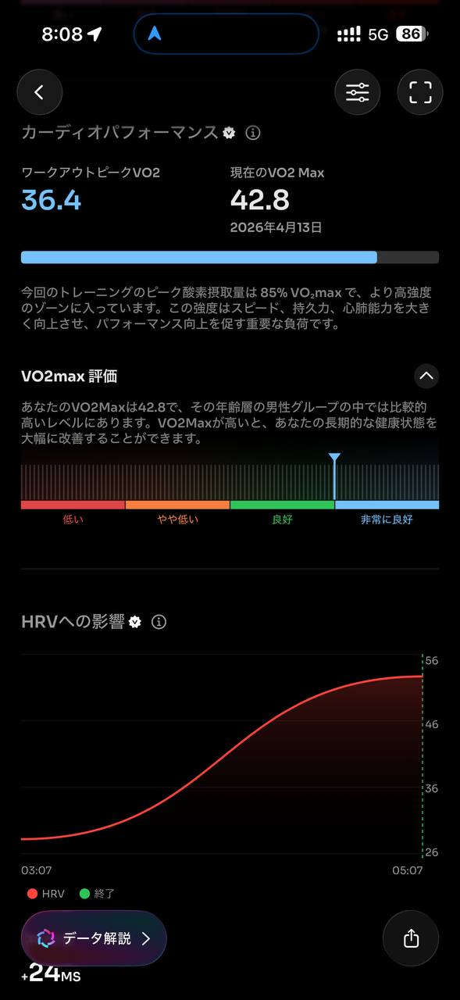
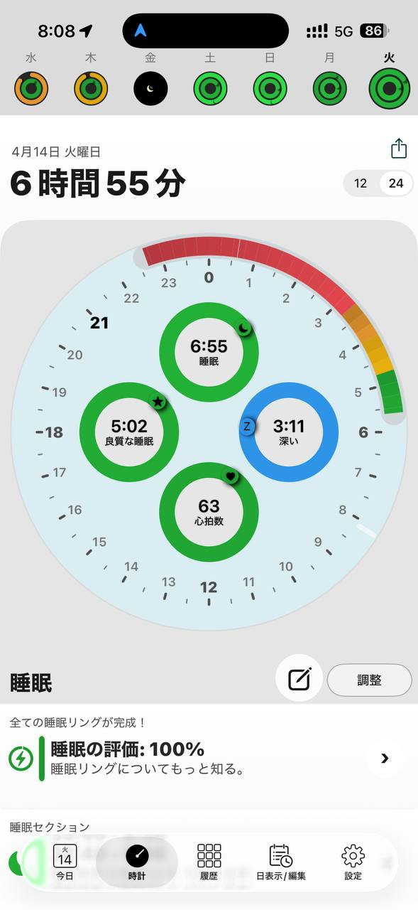
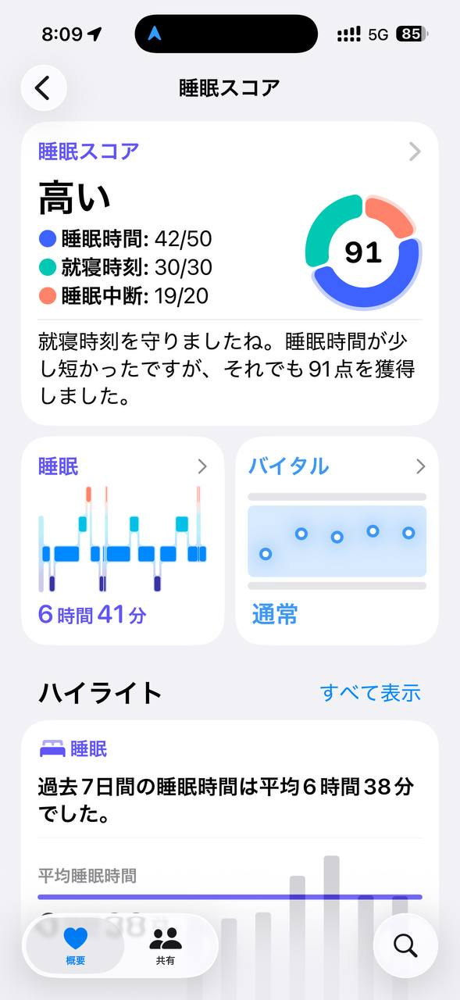