- 距離：4.10km
- 時間：0:19:37
- 平均心拍数：146拍/分
- 使用シューズ：マジックスピード4
- 時間帯：6時頃
- 天候：取得失敗
- コース：調布市
- 補給：
- 睡眠：4時間16分, 68
- 今日の目的：ビルドアップ気味なテンポ走
- コメント：#朝ラン #ゆるラン #時短ラン
- 自分メモ：テンポ走だけど、ビルドアップ気味になってしまった。ペースコントロール難しい

## 📊 ラップデータ
- 1km:5:07
- 2km:4:44
- 3km:4:40
- 4km:4:35
- 5km:0:28

## 📝 コーチコメント
MASAさん、データ確認しました。テンポ走、お疲れ様でした。ビルドアップ気味になったとのことですが、ラップタイムを見ると確かに後半ペースが上がっていますね。

いくつかポイントがあります。まず、心拍数のデータを見ると、ゾーン3（65%）での時間が最も長く、ある程度負荷の高いトレーニングができています。VO2maxも43.0と良好で、トレーニング効果は期待できます。

ペースコントロールの改善ですが、設定ペースを意識しすぎず、心拍数を指標にするのも有効です。例えば、テンポ走の目標心拍数ゾーンを設定し、その範囲内で走るように意識することで、ペースの変動を抑えられます。また、最初の1kmはウォーミングアップを兼ねてゆっくり入り、徐々にペースを上げていくと、よりスムーズに目標ペースに移行できるでしょう。

さらに、睡眠データを見ると睡眠スコアが低いですね。睡眠不足はパフォーマンス低下に繋がるため、睡眠時間の確保と質の向上を意識しましょう。特にレースが近づいているので、疲労回復のためにも重要です。

東日本国際親善マラソンに向けて、今回のデータから得られた気づきを活かして、ペースコントロールの練習を取り入れてみましょう。応援しています！

## 📸 写真一覧
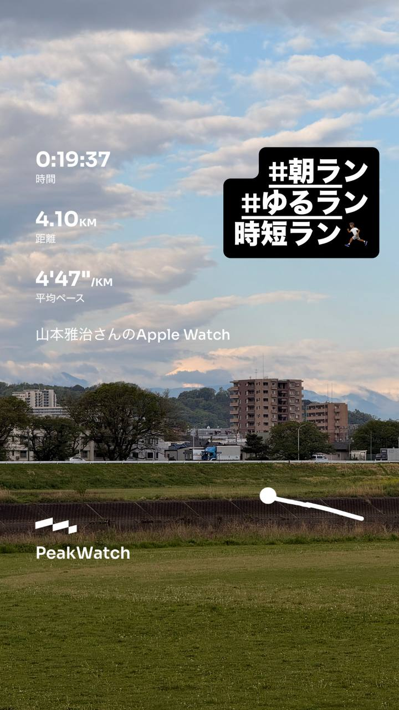
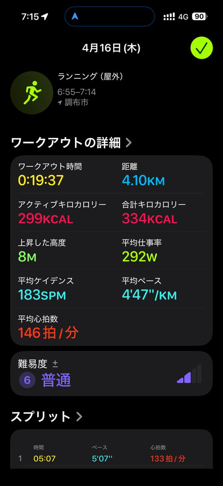
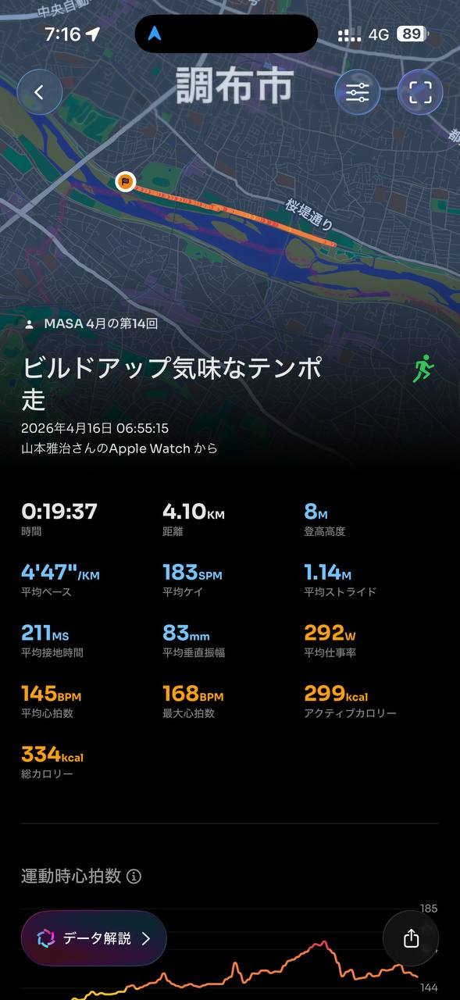
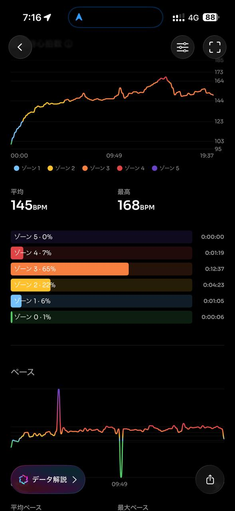
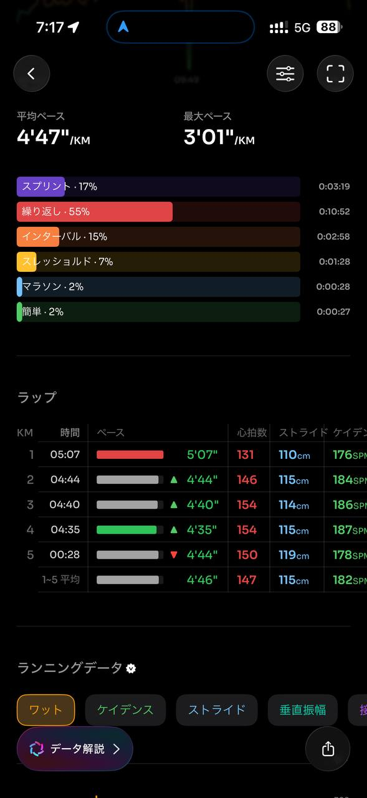
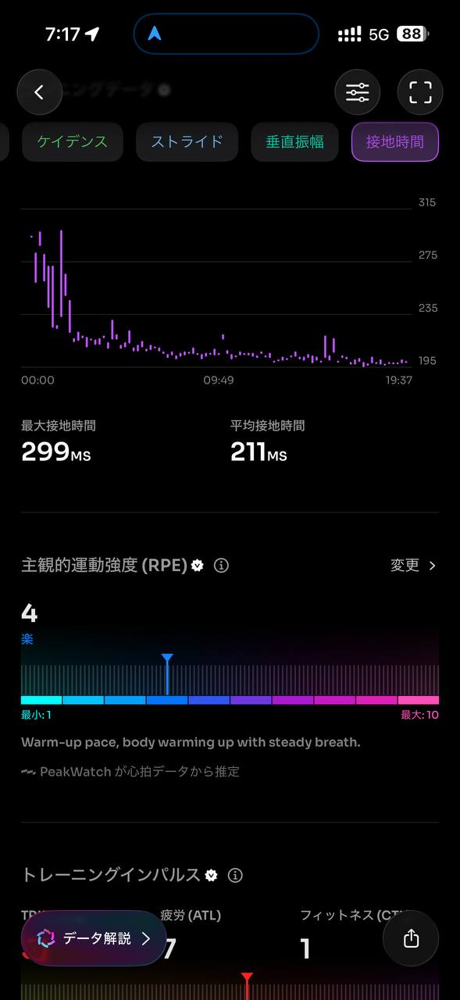
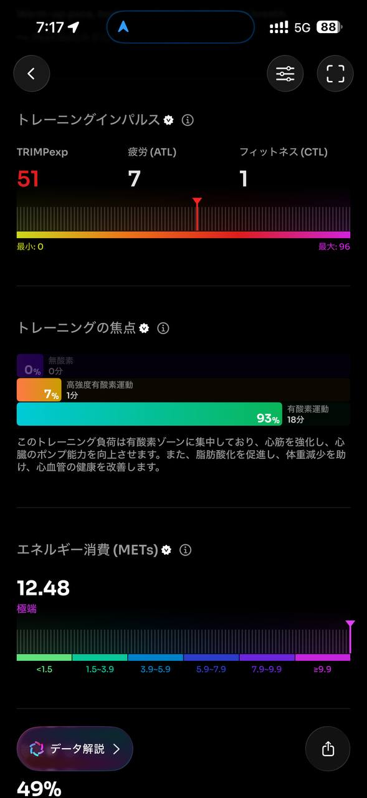
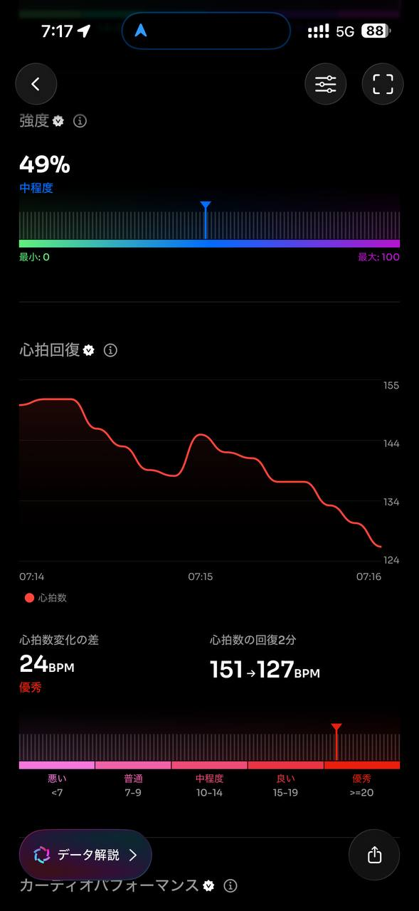
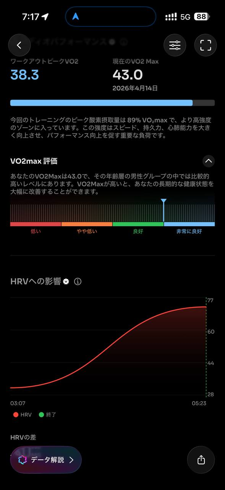
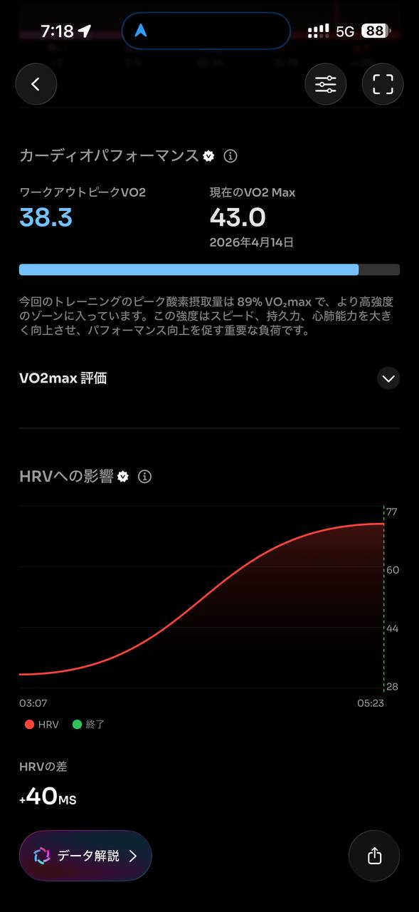
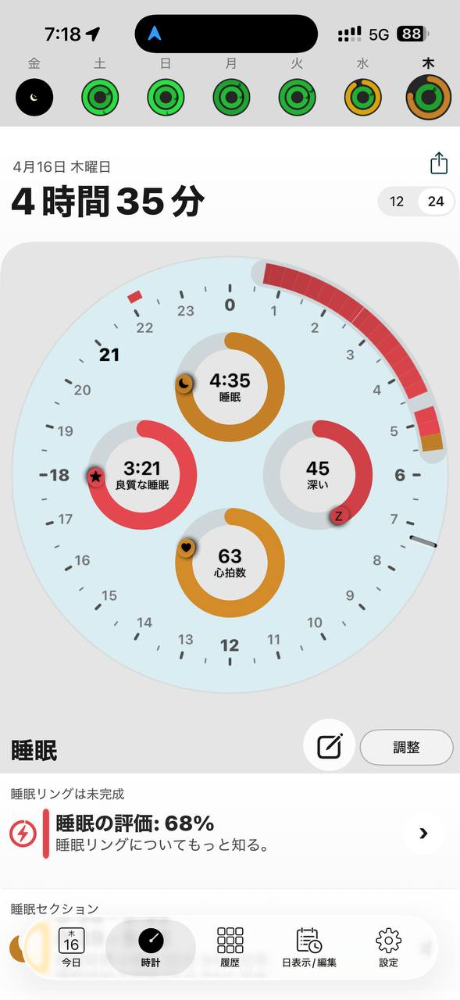
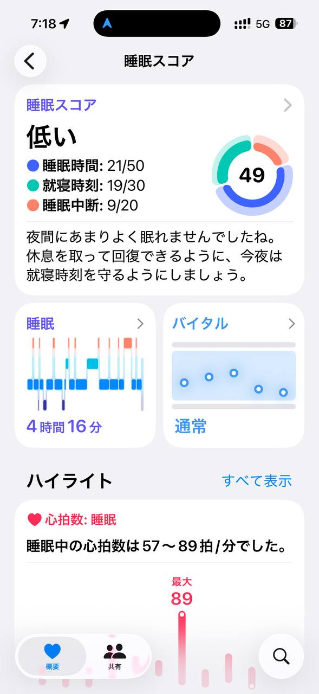