- 距離：6.19km
- 時間：0:36:55
- 平均心拍数：133拍/分
- 使用シューズ：インフィニットプロ
- 時間帯：7時頃
- 天候：取得失敗
- コース：調布市
- 補給：
- 睡眠：5時間38分, 77
- 今日の目的：
- コメント：#朝ラン #ゆるラン やべーよ、あちーよ
- 自分メモ：もう7:30過ぎると暑いかもしれない、、、

## 📊 ラップデータ
- 1km:6:02
- 2km:5:53
- 3km:5:52
- 4km:5:56
- 5km:5:46
- 6km:6:08
- 7km:1:14

## 📝 コーチコメント
MASAさん、データありがとうございます！7時半過ぎると暑いとのこと、お気持ちお察しします。今回の6.19kmのランニング、お疲れ様でした。平均ペース5'57"/km、心拍数も平均132bpmと、比較的楽なジョギングだったようですね。

直近の目標レースがハーフマラソンとのことですので、これからの時期は暑さ対策が重要になります。まず、朝のランニング時間をさらに早めることを検討しましょう。5時台にスタートできれば、かなり涼しく走れるはずです。また、水分補給をこまめに行うようにしてください。給水ボトルやハイドレーションバッグなどを活用するのも良いでしょう。

トレーニング内容ですが、今の時期は無理に追い込む必要はありません。暑さに身体を慣らすことを優先し、距離やペースよりも、心拍数を意識したトレーニングを心がけましょう。例えば、最大心拍数の70～80%程度を維持するような、ゆっくりとしたジョギングをメインにするのがおすすめです。

データを見ると、睡眠時間が少し短いようですね。睡眠不足はパフォーマンス低下の原因になりますので、7時間以上の睡眠を確保するように意識しましょう。質の高い睡眠のためには、寝る前にカフェインを摂取しない、寝室を暗く静かに保つなどの工夫も大切です。

4月26日の東日本国際親善マラソンに向けて、体調管理を万全にして臨んでください！応援しています！

## 📸 写真一覧
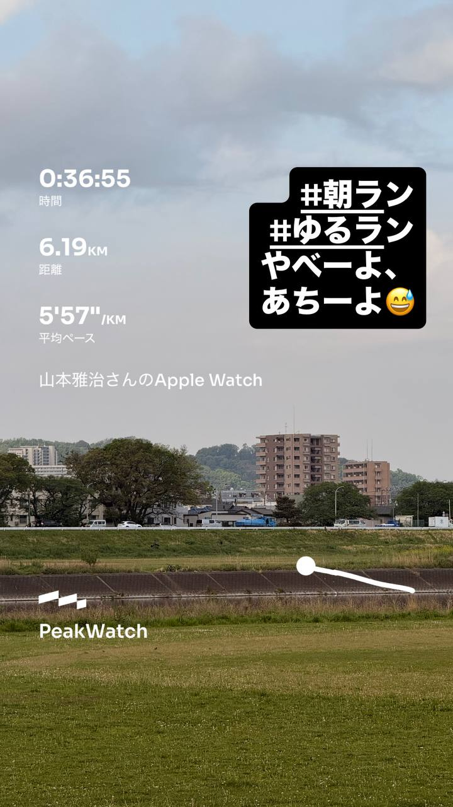
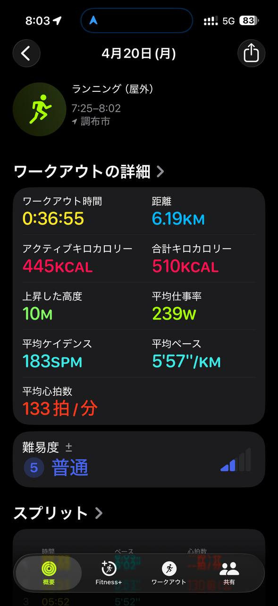
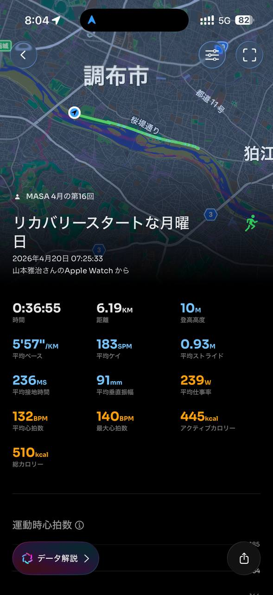
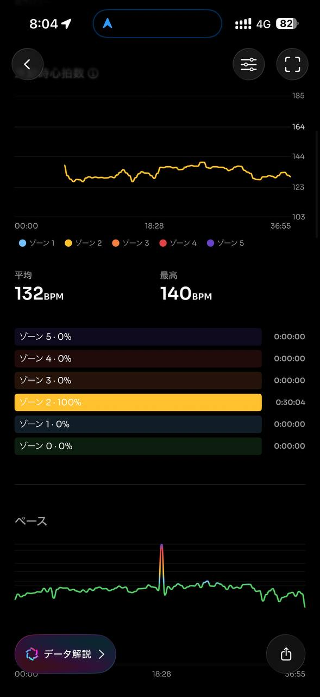
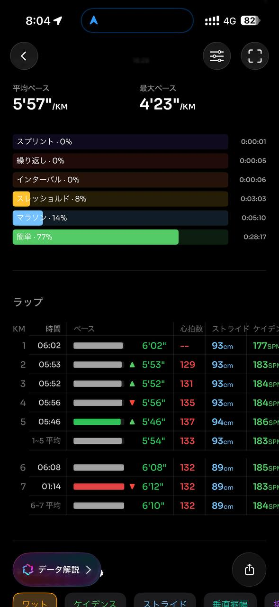
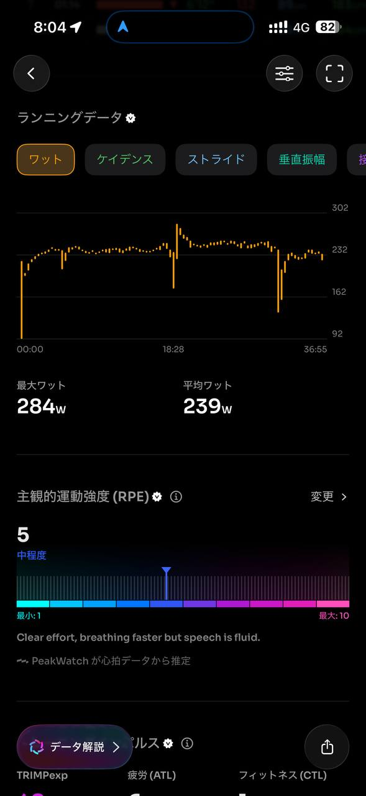
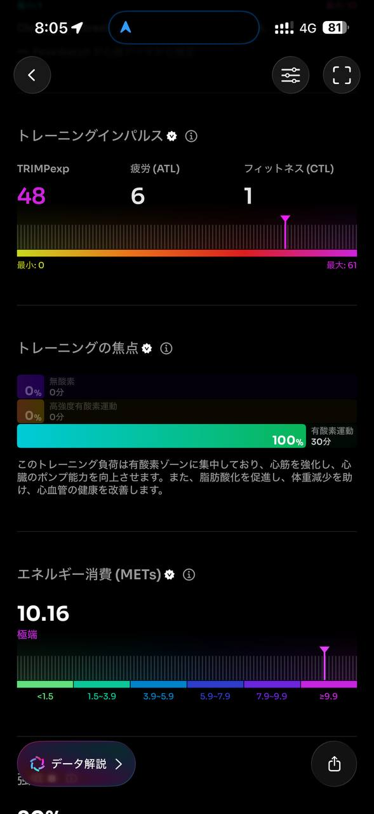
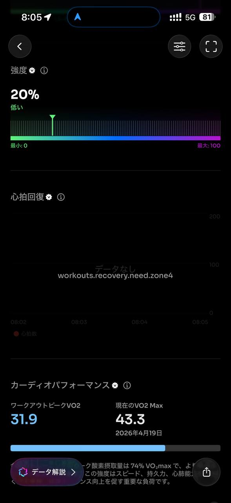
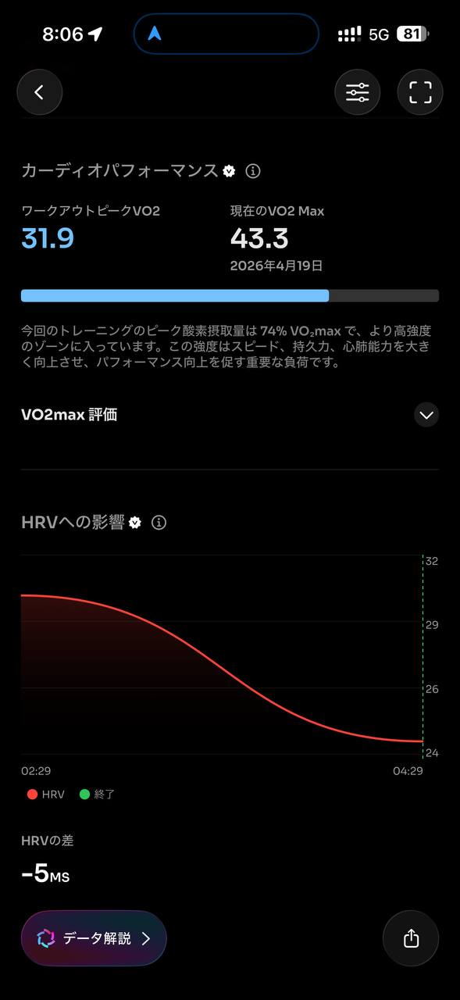
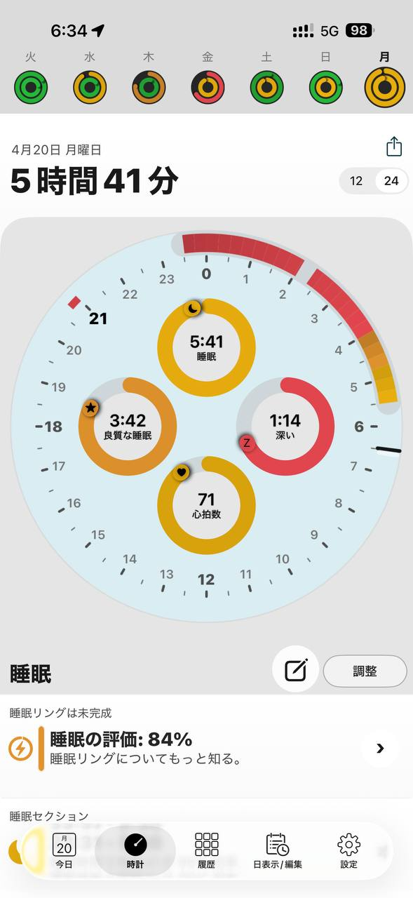
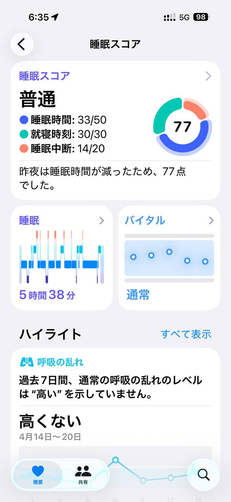