- 距離：6.14km
- 時間：0:37:36
- 平均心拍数：133拍/分
- 使用シューズ：スーパーノヴァ
- 時間帯：7時頃
- 天候：7時頃 曇り 気温18.5℃ 風速13.5m/s
- コース：調布市
- 補給：
- 睡眠：5時間23分, スコア:69
- 今日の目的：ゆるジョグ
- コメント：#朝ラン
#ゆるラン
ゆるジョグ
- 自分メモ：今日はランオフせずにゆるジョグ

## 📊 ラップデータ
- 1km:6:27
- 2km:6:02
- 3km:6:05
- 4km:6:10
- 5km:6:02
- 6km:6:01
- 7km:0:48

## 📝 コーチコメント

## 📸 写真一覧
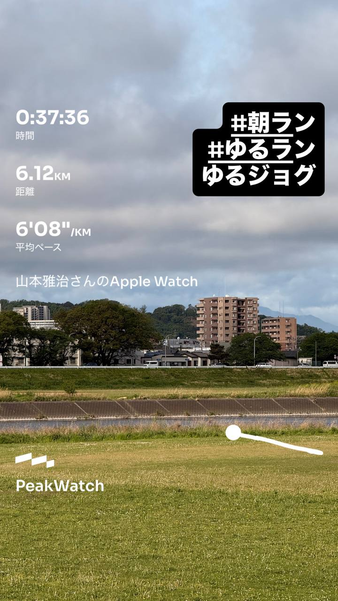
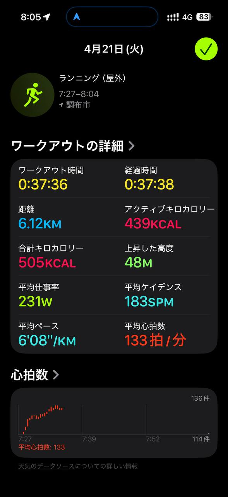
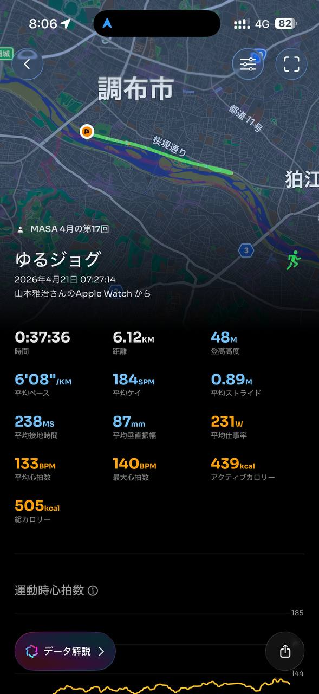
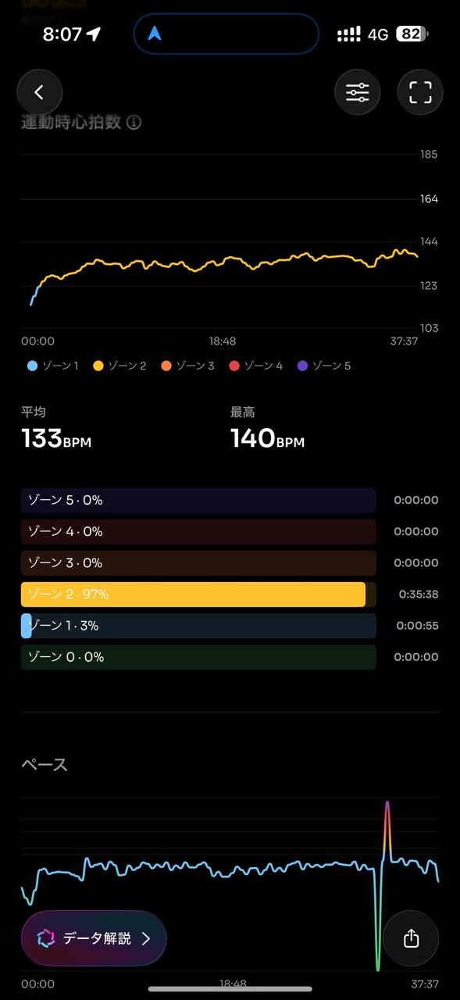
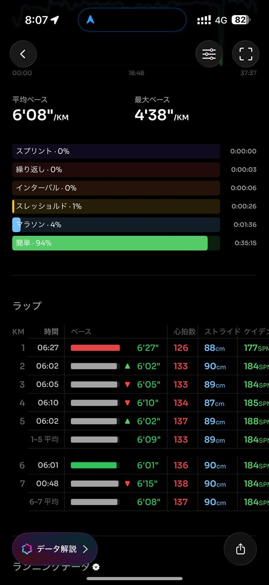
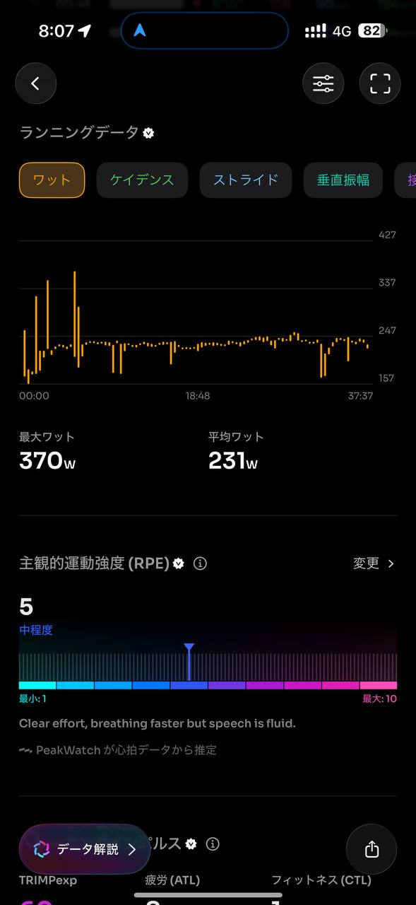
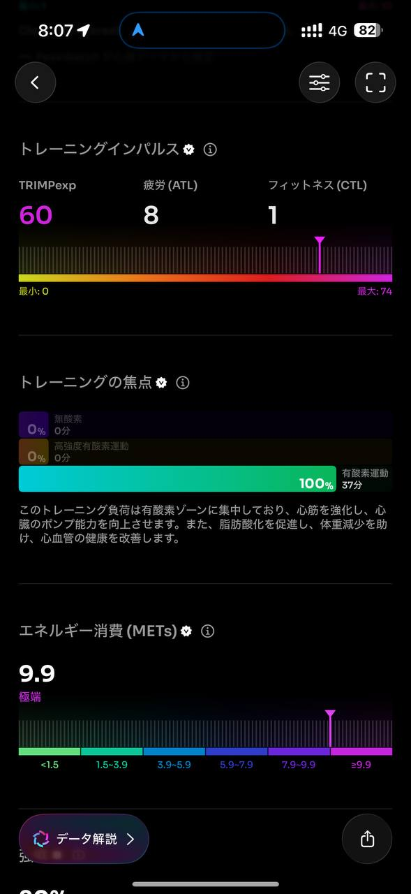
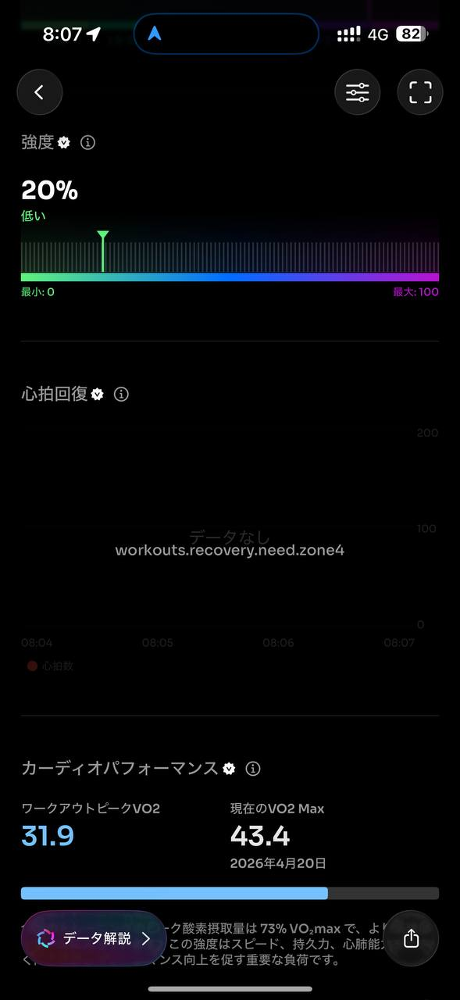
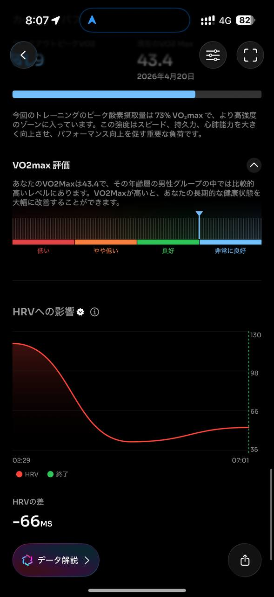
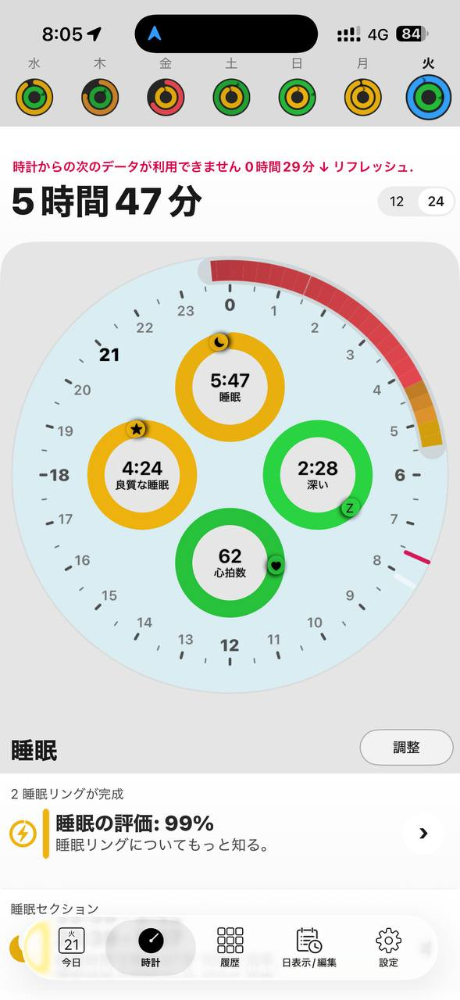
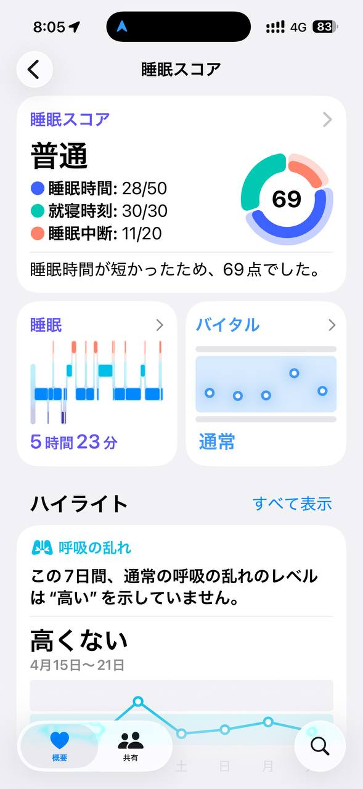