- 距離：7.38km
- 時間：0:37:25
- 平均心拍数：146拍/分
- 使用シューズ：マジックスピード4
- 時間帯：7時頃
- 天候：取得失敗
- コース：調布市
- 補給：
- 睡眠：4時間37分 スコア:61
- 今日の目的：テンポ走！
- コメント：#朝ラン #ゆるラン #テンポラン
- 自分メモ：1kmアップで6kmテンポ走！いい感じで走れた

## 📊 ラップデータ
- 1km:5:40
- 2km:5:03
- 3km:4:57
- 4km:4:56
- 5km:4:59
- 6km:5:00
- 7km:5:00
- 8km:1:50

## 📝 コーチコメント
MASAさん、テンポ走お疲れ様でした！データを確認しました。平均ペース5'04"/km、心拍数も安定していて、良いトレーニングができたようですね。特に4km目以降はペースが安定し、心拍数もゾーン3にしっかり入っているので、狙った強度で走れている証拠です。

直近の目標レースがハーフマラソン（東日本国際親善マラソン）ということで、今回のテンポ走は非常に効果的な練習です。レースペースを意識しながら、心肺機能と筋持久力を高めることができています。

ただ、睡眠時間が少し短いようですね。睡眠スコアが61点と「普通」レベルになっています。トレーニング効果を最大限に引き出すためには、質の高い睡眠が不可欠です。特にレースが近づいているので、睡眠時間の確保と睡眠の質向上を意識しましょう。例えば、寝る前にカフェインを避けたり、入浴でリラックスしたりするのも良いでしょう。

また、VO2Maxが43.4と高いレベルにあるのは素晴らしいですが、さらに向上させるために、インターバルトレーニングを取り入れてみるのも効果的です。

今後もテンポ走を継続しつつ、睡眠と休息を意識して、目標レースに向けて頑張りましょう！応援しています！

## 📸 写真一覧
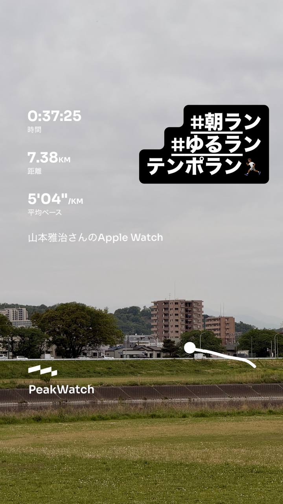
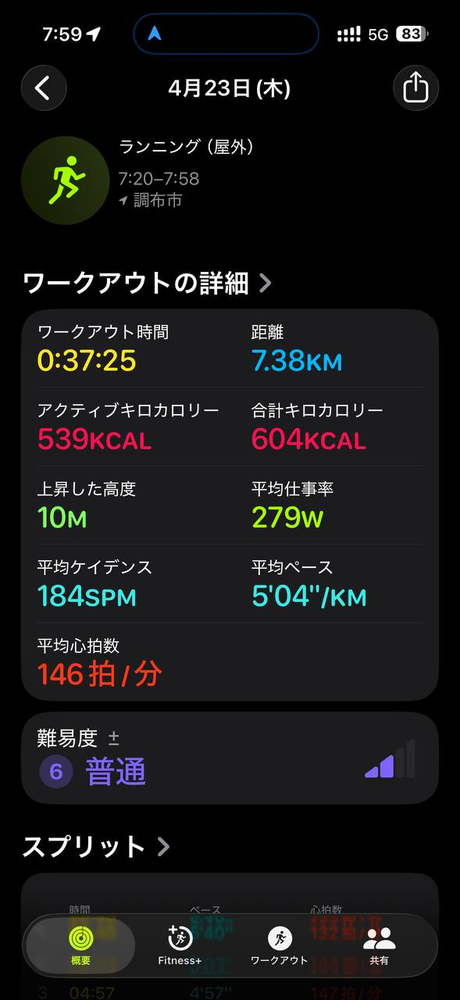
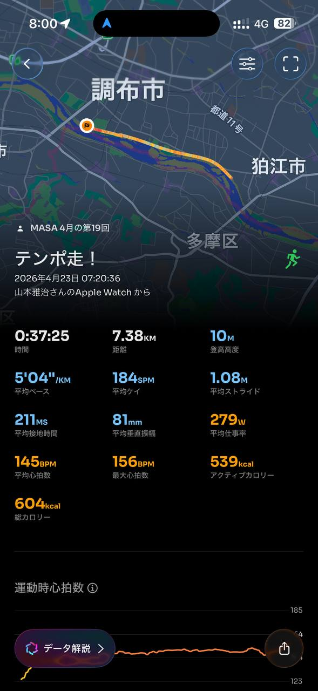
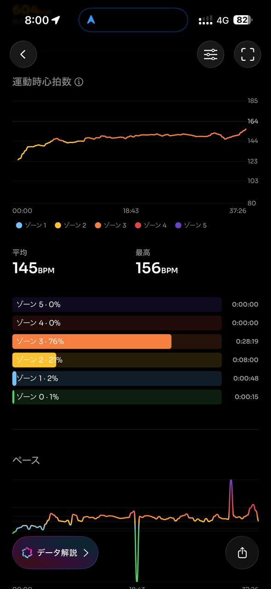
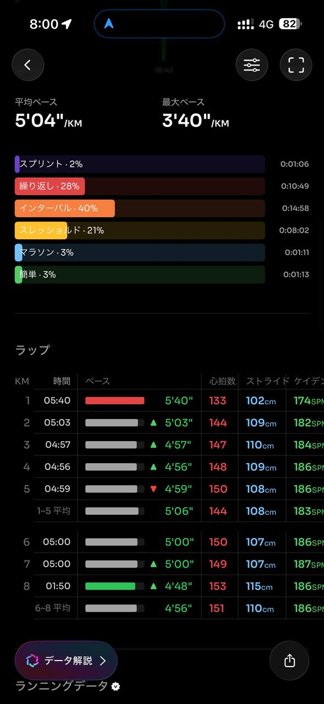
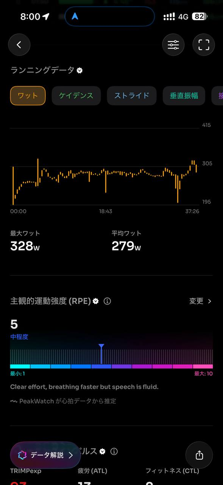
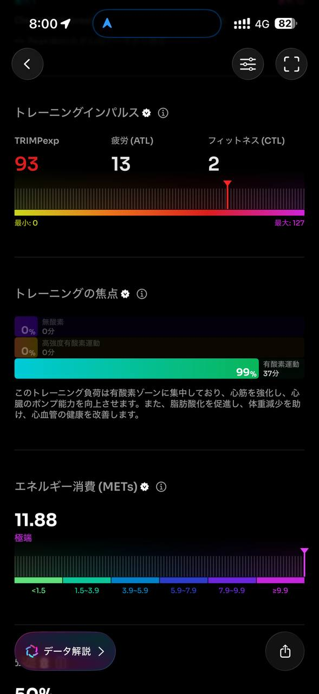
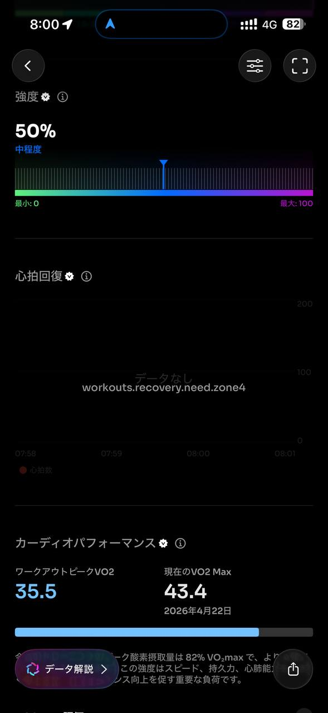
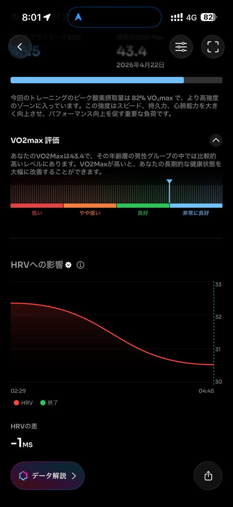
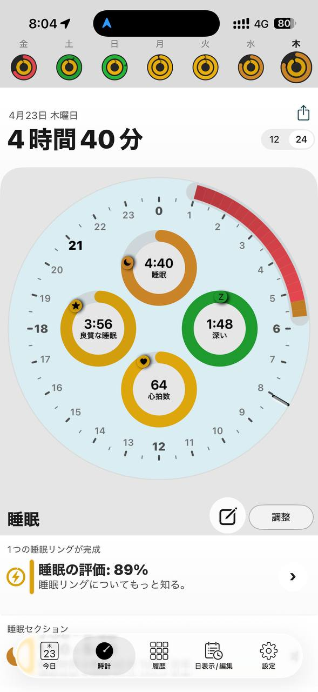
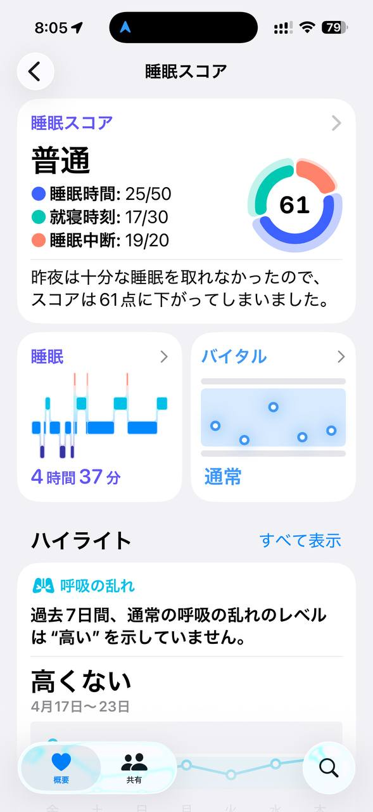