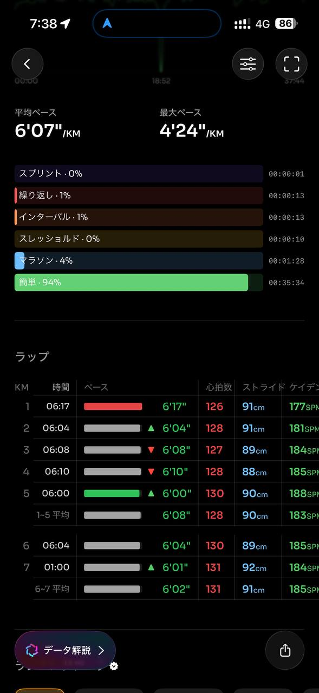
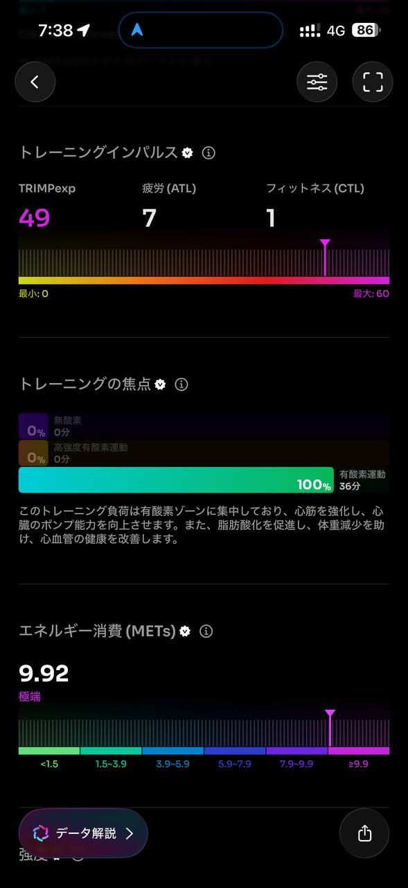

- 距離：6.16km
- 時間：0:37:44
- 平均心拍数：129拍/分
- 使用シューズ：インフィニットプロ
- 時間帯：6時頃
- 天候：取得失敗
- コース：調布市
- 補給：
- 睡眠：6時間50分 睡眠スコア83
- 今日の目的：リカバリージョグ
- コメント：#朝ラン #ゆるラン どんより天気続き
- 自分メモ：カラダが重く感じられるのでリカバリージョグ

## 📊 ラップデータ
- 1km:6:17
- 2km:6:04
- 3km:6:08
- 4km:6:10
- 5km:6:00
- 6km:6:04
- 6.16km:1:00

## 📝 コーチコメント
MASAさん、お疲れ様でした！「カラダが重く感じられるのでリカバリージョグ」というコメント通り、今回のランニングは平均ペース6'07/km、平均心拍数129拍/分（最大134拍/分）と、リカバリーに適した非常に良い内容でした。心拍数ゾーンではゾーン2に96%もの時間滞在しており、有酸素運動能力の維持・向上、そして疲労回復に効果的なトレーニングだったと言えます。トレーニング負荷も「簡単」が94%を占めており、疲労感のある状態での無理のない運動ができたことは素晴らしいです。

現在のMASAさんのランナープロフィールを見ると、ハーフマラソンのPBが1:48:33（東日本国際親善マラソン）、フルマラソンのPBが4:25:32（横浜マラソン）で、次の目標は2026/10/25の横浜マラソンでのサブ4達成とのことですね。オフシーズン中のこのようなリカバリージョグは、今後の本格的なトレーニングに向けて非常に重要です。

睡眠データを見ると、6時間50分の睡眠でスコア83と、質・量ともに比較的良好です。良質な睡眠は身体の回復を促し、トレーニング効果を高める上で不可欠なので、この調子で続けていきましょう。しかし、前回のランニングからのHRVの差が-17msと少し低下している点が気になります。これは疲労が蓄積している可能性を示唆しています。体が重いと感じたのも、このHRVの低下と関連しているかもしれません。

今回のリカバリージョグは、そのような身体のサインを適切に捉え、無理なく体を動かせた点で非常に評価できます。オフシーズンは、無理に追い込むよりも、このようなリカバリーやベース作りに重点を置くことが、怪我の予防と次の目標達成への土台作りになります。今後も体調と相談しながら、時には休養を取り入れつつ、トレーニングを継続していきましょう。もし重だるさが続くようであれば、栄養面や日常生活でのストレスについても見直してみるのも良いかもしれません。次回のランニングも楽しみにしています！

## 📸 写真一覧

