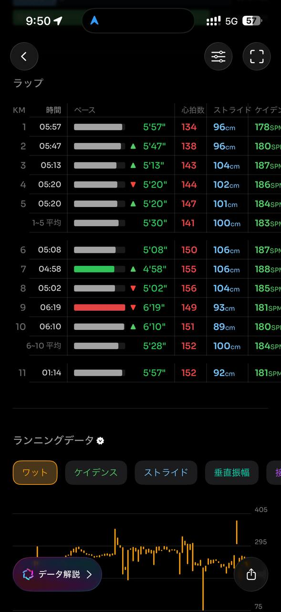
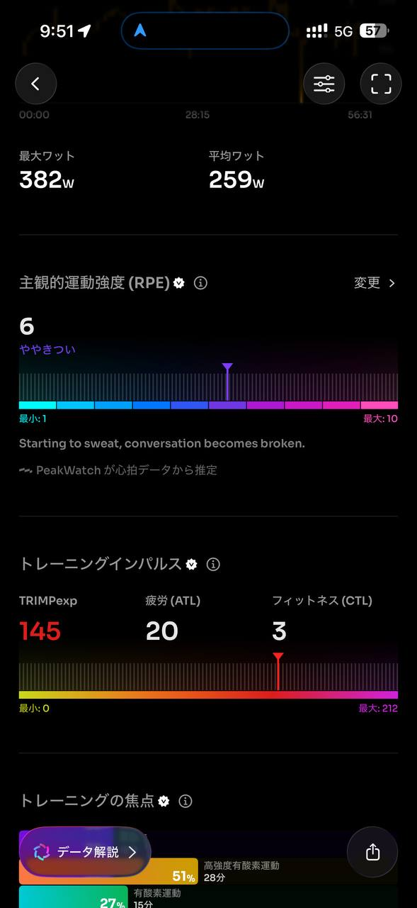

- 距離：10.20km
- 時間：0:56:30
- 平均心拍数：147拍/分
- 使用シューズ：スーパーノヴァ
- 時間帯：8時頃
- 天候：取得失敗
- コース：調布市
- 補給：
- 睡眠：5時間33分 58点
- 今日の目的：5月初ランはテンポ走
- コメント：#朝ラン#ゆるラン久々に富士山 しかし暑い
- 自分メモ：アップ2km、テンポ走6km、クールダウン2km！

## 📊 ラップデータ
- 1km:5:57
- 2km:5:47
- 3km:5:13
- 4km:5:20
- 5km:5:20
- 6km:5:08
- 7km:4:58
- 8km:5:02
- 9km:6:19
- 10km:6:10

## 📝 コーチコメント
MASAさん、いつも素晴らしいランニングデータありがとうございます。5月初のランニングは、おっしゃる通り『テンポ走』を意識された非常に良いトレーニングになりましたね。

今回の走行距離は10.20km、タイムは56分30秒、平均ペースは5分32秒/kmでした。平均心拍数は147拍/分で、ゾーン4（高強度有酸素運動）に51%もの時間滞在されており、まさにテンポ走の目的である『乳酸閾値の向上』に効果的な負荷をかけられたと言えるでしょう。

特に6kmから8kmにかけてのペースアップは見事です。6km地点の5分08秒/km、7km地点の4分58秒/km、8km地点の5分02秒/kmというラップタイムは、MASAさんのハーフマラソンPB（1時間48分33秒、平均ペース4分55秒/km）に近いペースを維持できており、サブ4目標の横浜マラソンに向けて非常に自信につながる走りだと思います。

ただし、ご自身のコメントで『アップ2km、テンポ走6km、クールダウン2km！』と計画されていたにも関わらず、実際のラップデータを見ると、2km以降もペースが徐々に上がっていますが、計画通りの『テンポ走6km』の部分は、6kmから8kmの3km区間と解釈できますね。そして、9km以降のペースが大きく落ち込んでいる点が気になります。これは、暑さの影響もあったかもしれませんが、後半に失速する癖をつけないためにも、事前に設定したペースと距離をより厳密に守る意識を持つことが重要です。

アップとクールダウンの重要性はご存知の通りですが、今回のデータではアップの2km、クールダウンの2kmがそれぞれ平均ペースから見ると十分に機能しているとは言い難いかもしれません。アップは心拍数を徐々に上げていく意識、クールダウンは心拍数をゆっくり下げていく意識を強く持ち、ペースの強弱を明確につけていきましょう。具体的には、アップは設定したテンポ走のペースより1分/km程度遅いペースで、クールダウンはさらに遅いペースで走ることをお勧めします。

睡眠データについてですが、睡眠時間が5時間33分で睡眠スコアが58点と『低い』評価でしたね。過去7日間の平均睡眠時間も5時間29分とのことですので、全体的に睡眠不足の傾向にあるようです。トレーニング効果を最大化し、疲労回復を促すためにも、最低でも7時間以上の睡眠を心がけましょう。睡眠の質が低いと、トレーニングで得た刺激が身体に定着しにくく、怪我のリスクも高まります。就寝時刻を守り、規則正しい睡眠習慣を身につけることが、今後のパフォーマンス向上に直結します。

VO2Maxは43.1と年齢層の男性グループの中では比較的高レベルにあり、基礎的な体力は十分に備わっています。今回の高強度有酸素運動はVO2Maxの維持・向上にも貢献しています。

横浜マラソンでのサブ4達成に向けては、このようなテンポ走を定期的に取り入れ、乳酸閾値を高めていくことが非常に効果的です。次回のテンポ走では、明確なペース設定と区間ごとの心拍数目標を立て、アップ・テンポ走・クールダウンの区間ごとのペースにメリハリをつけて実施してみましょう。そして、ランニング後には十分な栄養補給と、何よりも質の高い睡眠を確保することを忘れずに。MASAさんなら必ず目標達成できますので、これからも一緒に頑張っていきましょう！

## 📸 写真一覧

