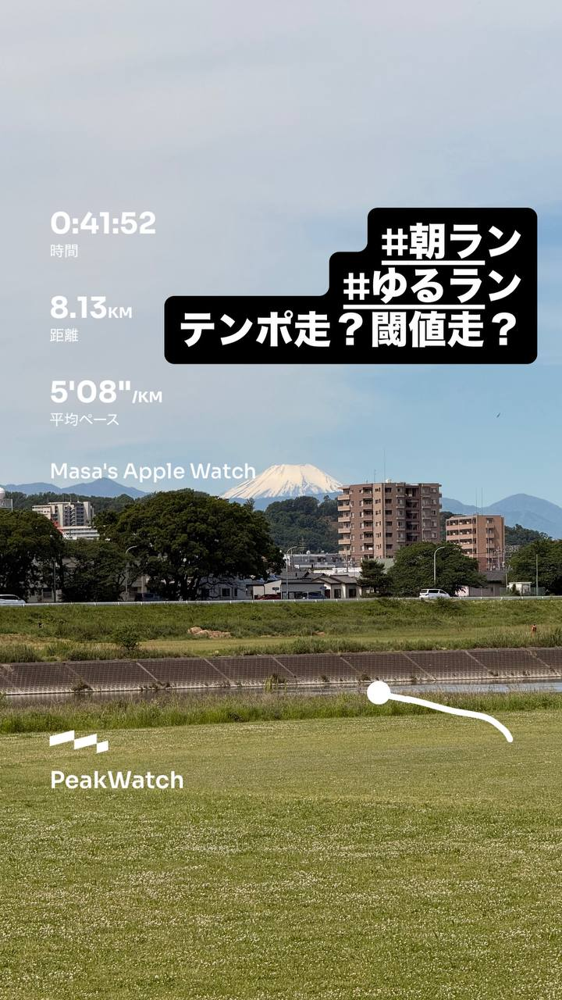
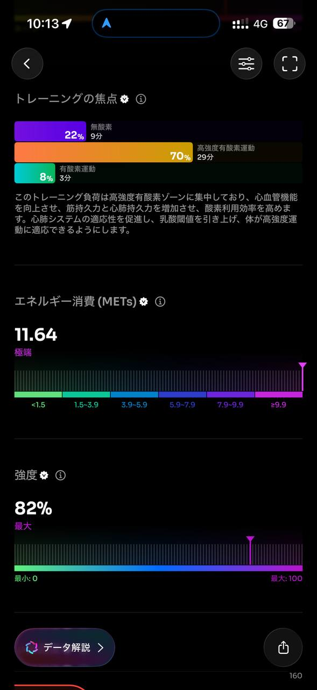

- 距離：8.13km
- 時間：0:41:52
- 平均心拍数：151拍/分
- 使用シューズ：ボストン12
- 時間帯：9時頃
- 天候：取得失敗
- コース：調布市
- 補給：
- 睡眠：6時間30分 71点
- 今日の目的：テンポ走！目標5'19
- コメント：#朝ラン #ゆるラン テンポ走？閾値走？
- 自分メモ：5分19秒ペースのテンポ走が目的でした、、、😅

## 📊 ラップデータ
- 1km:5:39
- 2km:4:54
- 3km:5:09
- 4km:5:04
- 5km:5:09
- 6km:5:09
- 7km:5:15
- 8km:4:51

## 📝 コーチコメント
MASAさん、今回のランニングデータ拝見しました。ご自身が設定した『5分19秒ペースのテンポ走』を目的とされていたとのこと、その目標意識は素晴らしいですね。しかし、データを見ると平均ペースは5分09秒/kmと、目標を大きく上回るペースで走られています。これはテンポ走としては少し速すぎた可能性があり、結果として『閾値走』に近いトレーニングになっていたと言えるでしょう。

ラップデータを見ると、最初の1kmは5分39秒とややゆったり入っていますが、その後は2kmが4分54秒、3kmが5分09秒、4kmが5分04秒とペースアップし、最後の8kmは4分51秒とかなり追い込んでいるのが分かります。心拍数も平均151拍/分、最大161拍/分と、ゾーン4（高強度有酸素運動）に28分44秒（70%）も滞在しており、このことからも強度が高かったことが伺えます。

ハーフマラソンの自己ベストが1時間48分33秒（平均ペース5分09秒/km）であることを考えると、今回の平均ペースはハーフのレースペースとほぼ同じです。テンポ走は、レースペースより少し遅めのペースで、長く走り続けることで乳酸閾値を高めることを目的とします。今回のランは、目標の『5分19秒ペース』であればゾーン3〜ゾーン4の低い方に収まるはずでしたが、実際にはゾーン4中心でした。

MASAさんの目標は2026年10月の横浜マラソンでサブ4達成とのこと、現状のハーフPBから見てもサブ4は十分に狙える目標です。しかし、そのためには様々なペースでのトレーニングを計画的に実施し、身体に適切な刺激を与えることが重要です。

今回のランニングは、結果として閾値走に近い良いトレーニングになりましたが、意図した目的とは異なりました。次回以降のテンポ走では、GPSウォッチや心拍数ゾーンをより意識して、設定ペースを守ることを心がけましょう。設定ペースをキープするトレーニングは、ペース感覚を養う上でも非常に重要です。

また、睡眠データを見ると6時間30分、スコア71点と『普通』の評価でした。就寝時刻が遅かったとのことですが、疲労回復やパフォーマンス向上には質の良い睡眠が不可欠です。トレーニング効果を最大限に引き出すためにも、睡眠時間の確保と質の向上にも意識を向けてみてください。

オフシーズンは様々なトレーニングを試す良い機会です。今回の経験を活かし、次回のランニングに繋げていきましょう。何か不明な点があれば、いつでも相談してください。

## 📸 写真一覧

