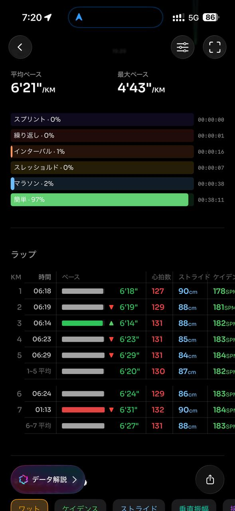
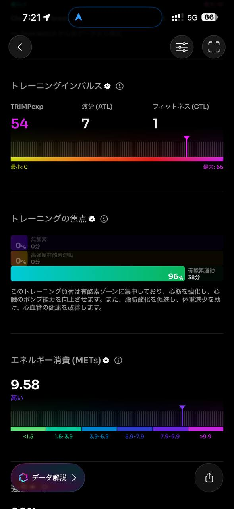

- 距離：6.18km
- 時間：0:39:18
- 平均心拍数：129拍/分
- 使用シューズ：インフィニットプロ
- 時間帯：6時頃
- 天候：取得失敗
- コース：調布市
- 補給：
- 睡眠：2時間50分、スコア48
- 今日の目的：リカバリージョグ
- コメント：#朝ラン
#ゆるラン
リカバリージョグ
- 自分メモ：予定まだだったけど、今日はリカバリージョグ。

## 📊 ラップデータ
- 1km:6:18
- 2km:6:19
- 3km:6:14
- 4km:6:23
- 5km:6:29
- 6km:6:24

## 📝 コーチコメント
MASAさん、いつも素晴らしいデータ提供ありがとうございます。今回はリカバリージョグとのこと、その目的がデータにもしっかり現れている非常に良いランニングでした。

まず、全体的な平均ペースは6'21/km、平均心拍数は129拍/分と、まさに『リカバリー』に最適な強度です。心拍数ゾーンでは『ゾーン2』が88%と大半を占めており、有酸素運動能力の向上、脂肪燃焼促進、心血管健康の改善に効果的なトレーニング負荷であったことが伺えます。最大心拍数も135拍/分と低めに抑えられており、身体への負担が少ないことを示していますね。

走行距離6.18kmに対し、走行時間39分18秒。平均ケイデンスは182SPMと高めで、平均ストライド88cmも悪くありません。着地衝撃を抑えつつ、効率の良い走りができている証拠です。リカバリージョグでケイデンスを意識することは、疲労回復を促しながらランニングフォームの維持・改善にも繋がるため、非常に良い習慣です。

今回のランニングの『トレーニングの焦点』は有酸素運動に96%集中しており、心臓を強化し、心臓のポンプ能力を向上させることが期待されます。また、『VO2 Max』は43.0と良好なレベルを維持しており、あなたのランニング能力の高さを物語っています。

一点、睡眠データについて気になるところがあります。昨晩の睡眠時間は2時間50分、睡眠スコアは48と低めでした。平均就寝時刻を1時間3分も過ぎており、睡眠中断も13/20と多い状況です。睡眠は身体の回復において非常に重要な要素です。特にリカバリージョグは身体の回復を目的とするため、十分な睡眠と質の高い睡眠が不可欠です。今後は就寝時刻を守る、寝る前のスマートフォンやカフェイン摂取を控えるなど、睡眠の質を高める工夫をしてみてください。

MASAさんのプロフィールを見ると、ハーフマラソンPBが1時間48分33秒、フルマラソンPBが4時間25分32秒と、素晴らしい実績をお持ちですね。次の目標である2026年10月の横浜マラソンでのサブ4達成に向けて、現在のオフシーズンは非常に重要な時期です。リカバリージョグで疲労を抜きつつ、ベースとなる有酸素能力を着実に向上させていきましょう。

今後もランニングの目的と身体の状態をしっかり見極め、適切なトレーニングを継続してください。次回以降のトレーニングも楽しみにしています！

## 📸 写真一覧

