- 距離：8.06km
- 時間：0:52:42
- 平均心拍数：125拍/分
- 使用シューズ：インフィニットプロ
- 時間帯：7時頃
- 天候：取得失敗
- コース：調布市
- 補給：
- 睡眠：4時間22分 睡眠スコア57
- 今日の目的：リカバリー8km
- コメント：#朝ラン #ゆるラン リカバリーで8km
- 自分メモ：今朝はリカバリー8km

## 📊 ラップデータ
- 1km:6:44
- 2km:6:29
- 3km:6:24
- 4km:6:30
- 5km:6:35
- 6km:6:29
- 7km:6:36
- 8km:6:25
- 9km:0:26

## 📝 コーチコメント
MASAさん、リカバリーランお疲れ様でした！『今朝はリカバリー8km』というコメント通り、素晴らしいリカバリーランができましたね。平均ペース6'32/km、平均心拍数125拍/分というデータは、有酸素運動ゾーンに集中しており、心肺機能への負担も少なく、まさにリカバリーに最適な強度だったと言えます。特に心拍数がゾーン2で95%を占めている点は、疲労回復を目的としたランニングとして理想的です。

レース実績を見ると、ハーフマラソンPBが1:48:33、フルマラソンベストが4:25:32でサブ4を目指しているMASAさんにとって、このようなゆっくりとしたペースでのランニングは非常に重要です。オフシーズン中は、基礎体力の向上と疲労回復に重点を置くことが、次の目標レースである2026年10月の横浜マラソンでのサブ4達成に繋がります。

しかし、睡眠データに目を向けると、睡眠時間が4時間22分と短く、睡眠スコアも57と低い数値が出ています。昨晩は就寝時刻が51分遅れたとのことですが、これはトレーニングの回復に大きく影響します。睡眠は、疲労回復や筋肉の修復、ホルモンバランスの調整など、ランナーにとって最も重要な回復手段の一つです。目標達成のためには、質の良い睡眠を確保することが不可欠です。

今後は、トレーニング内容に加えて、睡眠の質と量の改善にも意識的に取り組んでいきましょう。具体的には、毎日同じ時間に就寝・起床する習慣をつけること、寝る前のカフェインやアルコールの摂取を控えること、寝室の環境を整えることなどが挙げられます。日中のトレーニングで得た効果を最大限に引き出すためにも、今夜は就寝時刻を守り、十分な睡眠時間を確保できるよう心がけてください。

今回のリカバリーランは成功でしたが、今後はトレーニングと休息のバランスをより一層意識し、万全の体調で次のレースに臨めるようにサポートしていきます。VO2max評価も「非常に良好」と出ていますので、この良い状態を維持しつつ、着実にレベルアップしていきましょう！

## 📸 写真一覧
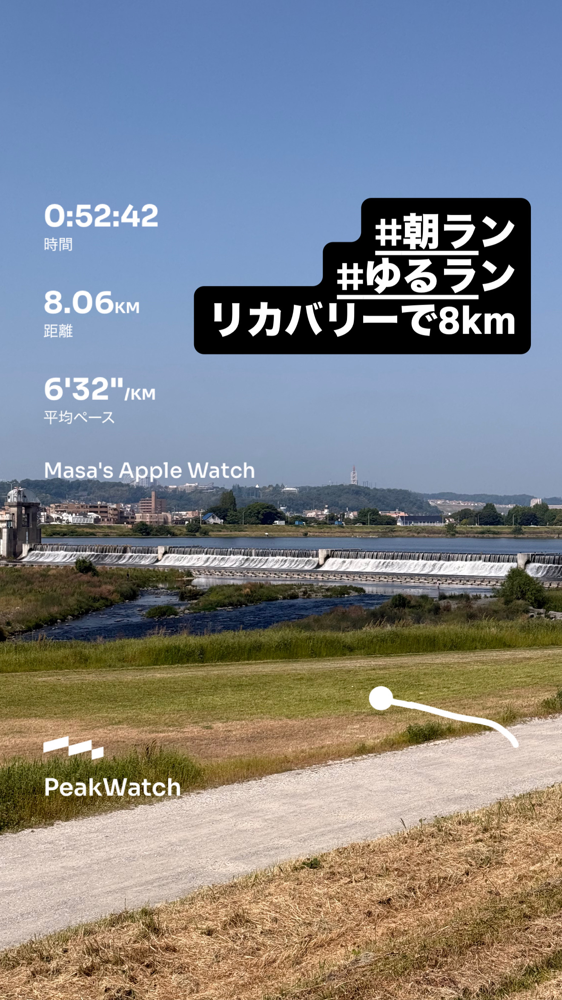
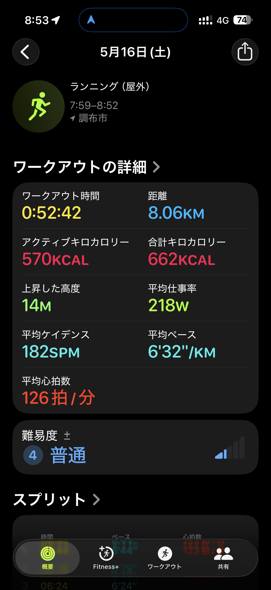
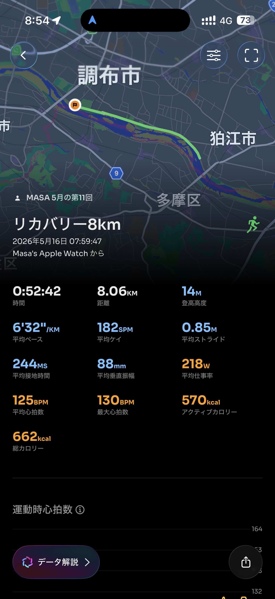
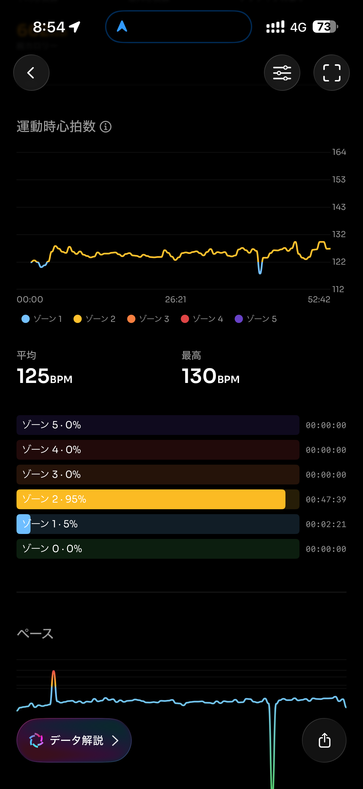
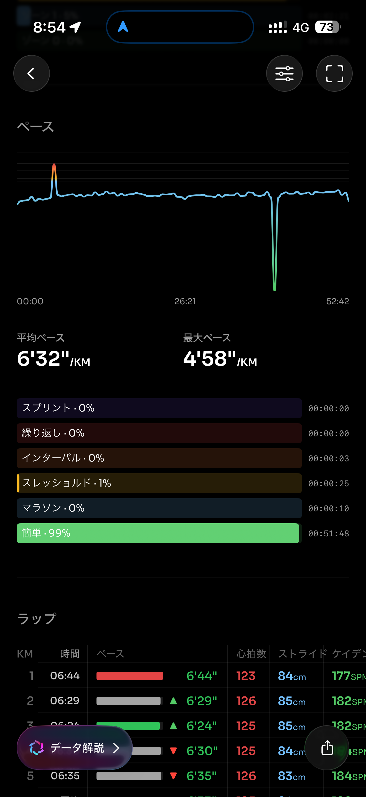
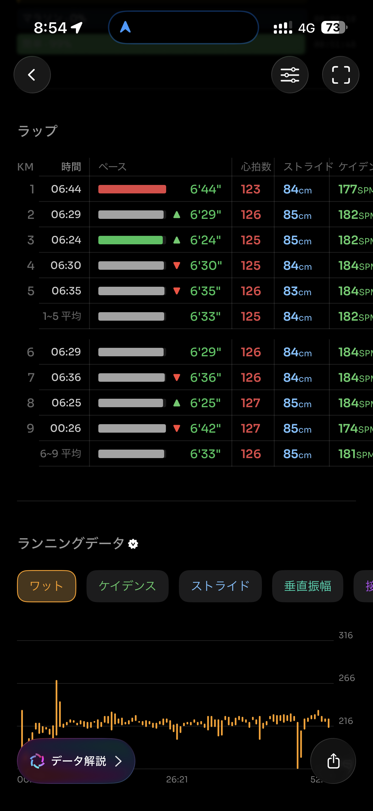
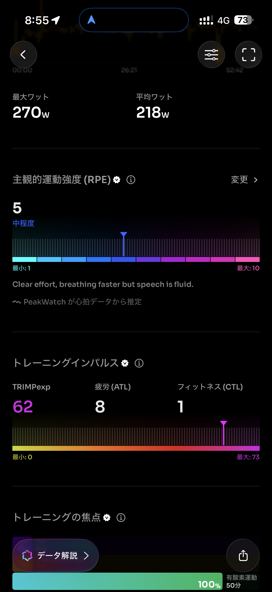
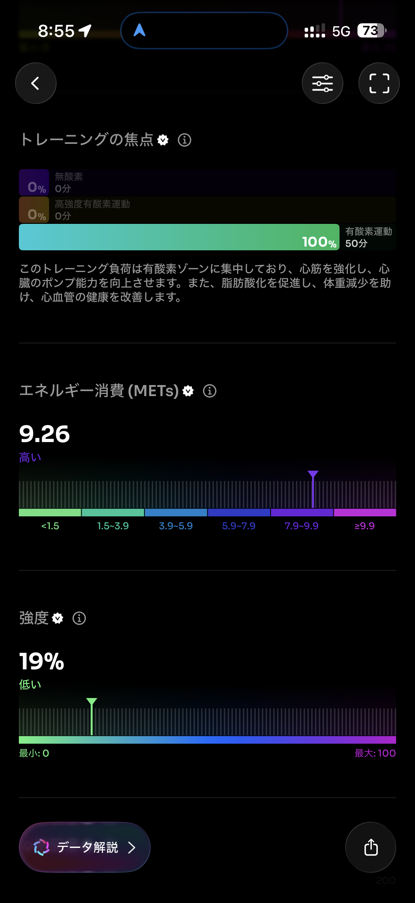
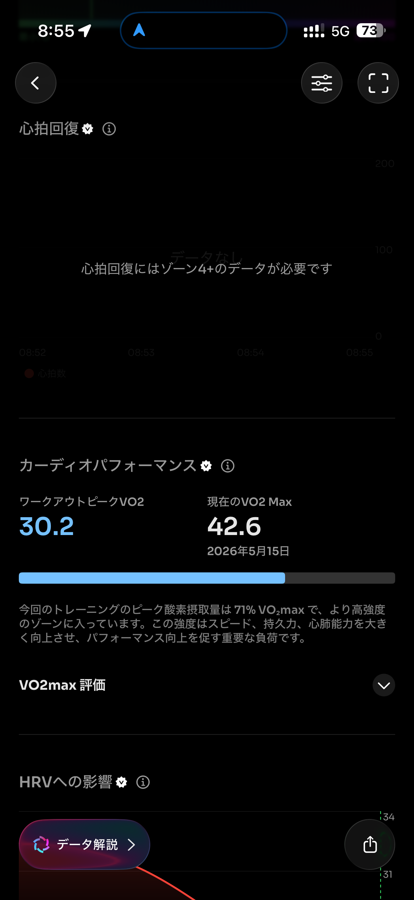
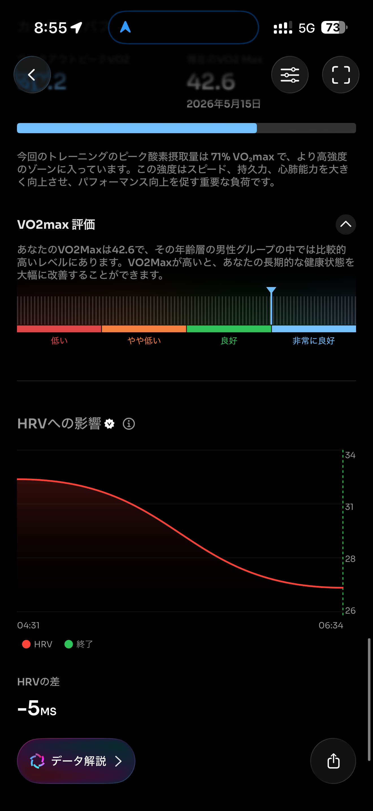
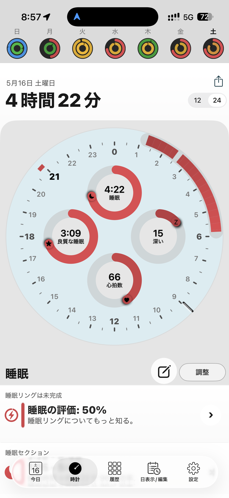
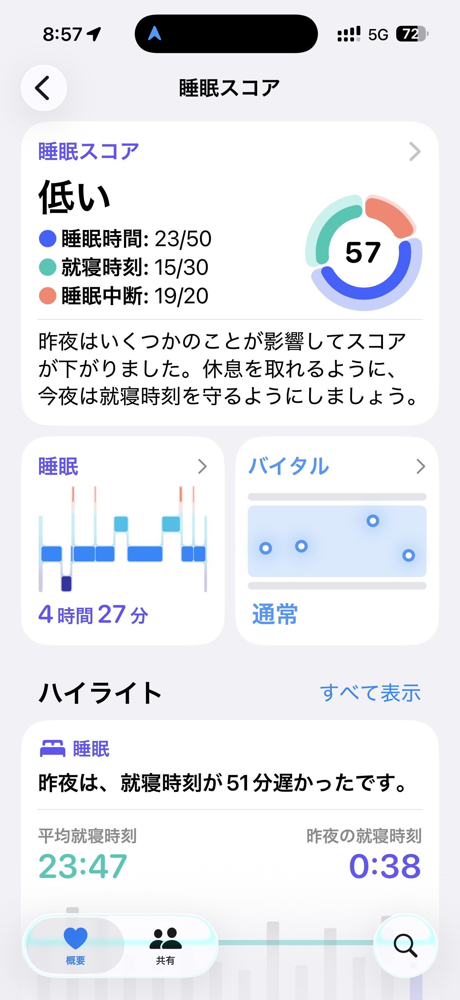