- 距離：5.02km
- 時間：0:33:36
- 平均心拍数：118拍/分
- 使用シューズ：ワラーチ
- 時間帯：6時頃
- 天候：取得失敗
- コース：調布市
- 補給：
- 睡眠：5時間55分 83点
- 今日の目的：ワラーチリカバリージョグ
- コメント：#朝ラン #ゆるラン リカバリージョグ
- 自分メモ：ワラーチでリカバリージョグ

## 📊 ラップデータ
- 1km:6:53
- 2km:6:39
- 3km:6:43
- 4km:6:34
- 5km:6:31

## 📝 コーチコメント
MASAさん、お疲れ様です！本日のワラーチリカバリージョグ、素晴らしいですね。オフシーズンとはいえ、週初めにしっかり体を動かすことで、気分転換にもなりますし、血液循環を促して疲労回復にも繋がります。ワラーチでのランニングは、足裏の感覚を研ぎ澄まし、本来の着地や体の使い方を意識できる良い機会になったのではないでしょうか。裸足感覚でのジョグは、足底筋群の強化や、自然なフォームの習得に非常に有効です。

今回のデータを見ると、平均心拍数118拍/分（最高123拍/分）で、心拍ゾーンはゾーン0とゾーン1が大半を占めており、まさしくリカバリージョグに最適な強度だったことがわかります。特に、ゾーン1が76%と高く、有酸素運動に集中できた証拠です。平均ペース6'41/kmというのも、ワラーチでのリカバリーとしては無理のないペースで、体の負担を最小限に抑えつつ、活動的な回復を促せたと考えられます。

平均ケイデンス184SPMは非常に優秀です。このケイデンスは、脚への衝撃を和らげ、効率的なランニングフォームを維持する上で理想的と言えます。ストライドも平均0.81mと適切で、ワラーチでも安定したピッチとストライドを保てているのは素晴らしいです。平均垂直振幅も85mmと低く抑えられており、上下動の少ない安定した走りができている証拠です。

前日の睡眠も83点と高評価で、平均就寝時刻より1時間10分早い23時に就寝できたとのこと。リカバリージョグと合わせて、しっかり休息が取れているのは、オフシーズンにおける体作りの基盤として非常に重要です。睡眠時間の確保は、疲労回復だけでなく、ホルモンバランスの調整や免疫力向上にも繋がります。

現在のVO2Maxが43.1と非常に良好なレベルにあることも、素晴らしい健康状態を示しています。この数値は、フルマラソンサブ4達成に向けて非常に良い基盤となります。オフシーズン中は、このような低強度有酸素運動を継続しつつ、筋力トレーニングや体幹強化にも取り組むことで、更なるパフォーマンス向上に繋がるでしょう。特にワラーチでのランニングは、足部の細かい筋肉を使うため、足裏の強化にも繋がり、今後のフルマラソンにおいて安定したフォームを維持するのに役立つはずです。

今後の目標である2026年10月25日の横浜マラソン（フル・サブ4目標）に向けて、焦らず着実にトレーニングを積んでいきましょう。ワラーチでのランニングは、故障予防にも繋がるため、ぜひ定期的に取り入れてみてください。次回は、もう少し距離を延ばしてみたり、少しだけペースを上げてみて、体力の回復具合やワラーチでの感触を確認してみるのも良いかもしれませんね。応援しています！

## 📸 写真一覧
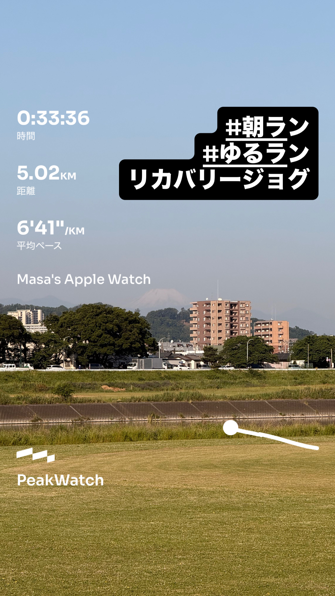
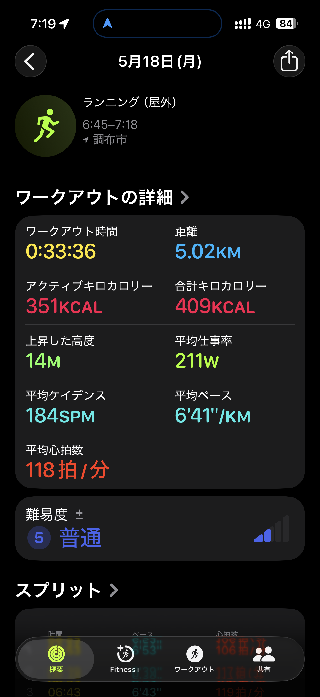
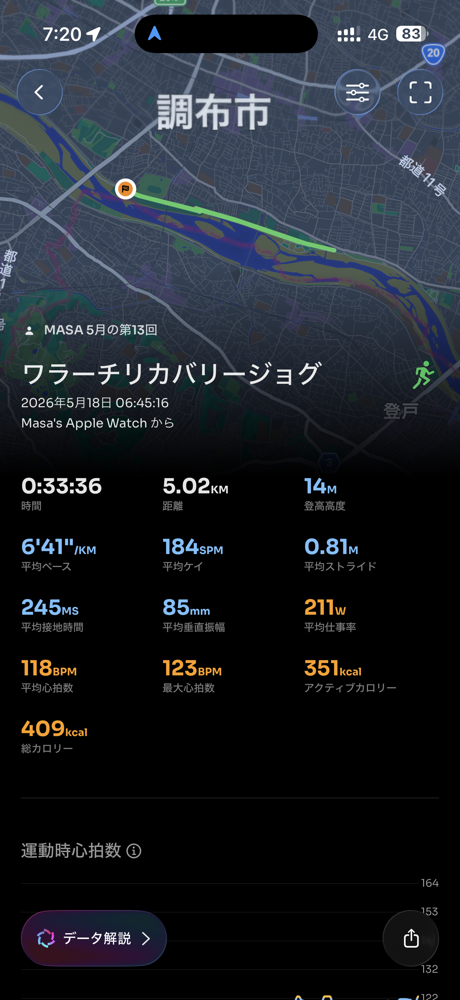
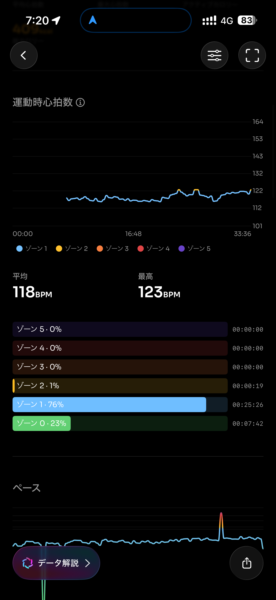
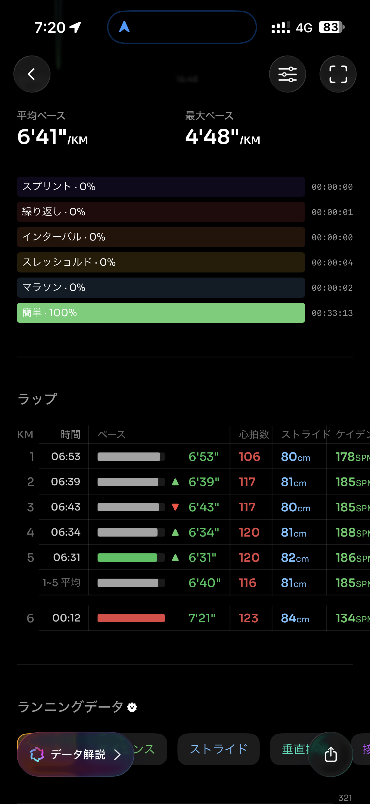
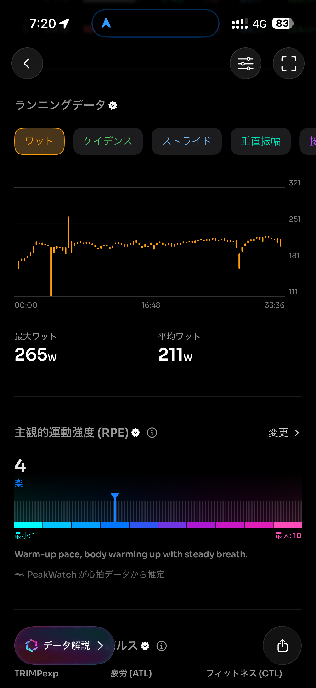
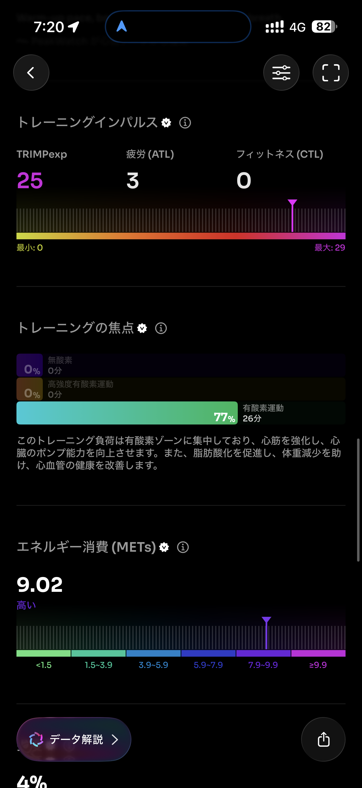
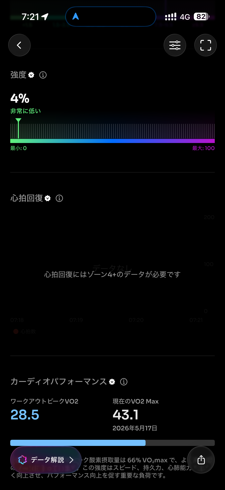
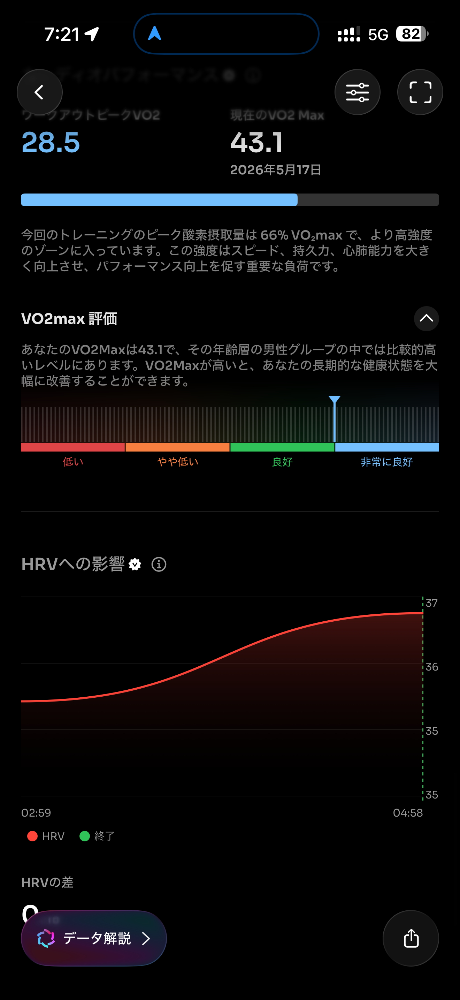
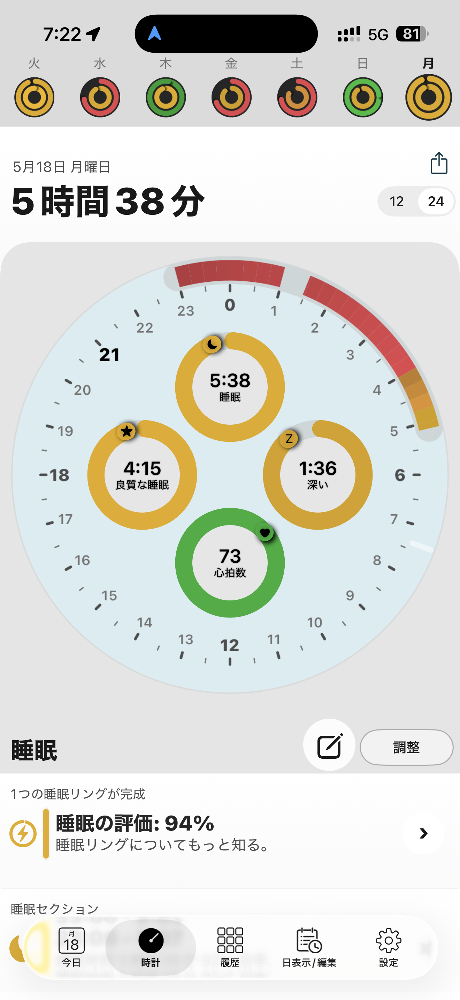
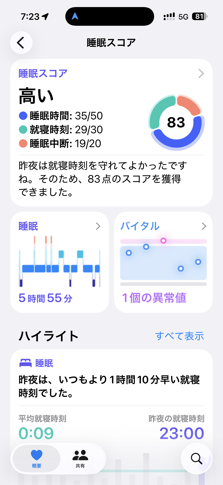