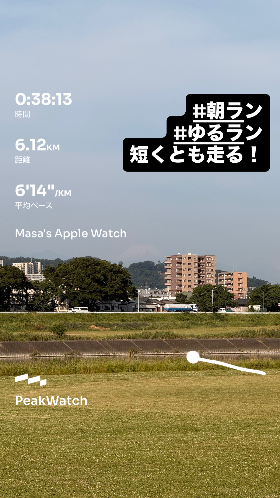
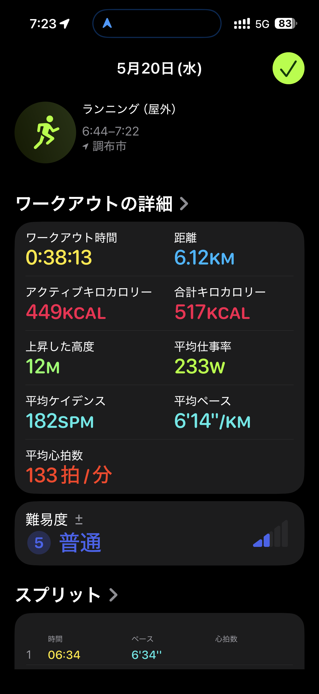
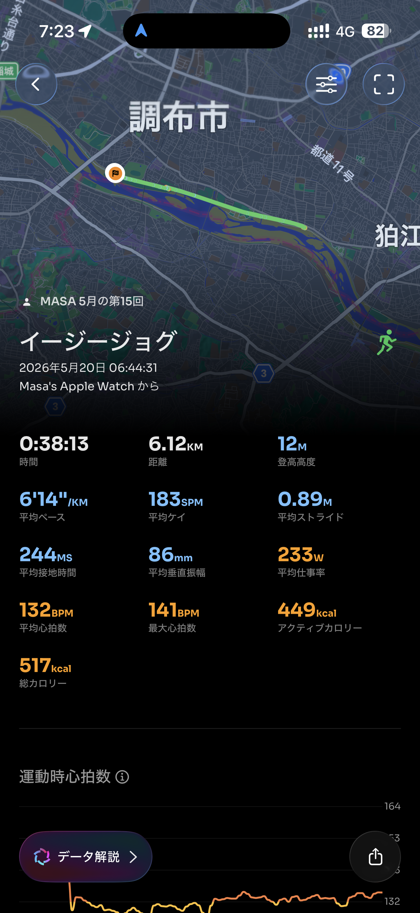

- 距離：6.12km
- 時間：0:38:13
- 平均心拍数：133拍/分
- 使用シューズ：インフィニットプロ
- 時間帯：6時頃
- 天候：取得失敗
- コース：調布市
- 補給：
- 睡眠：4時間46分, 68点
- 今日の目的：イージージョグ
- コメント：#朝ラン #ゆるラン 短くとも走る！
- 自分メモ：短い距離だけどジョグってきた！

## 📊 ラップデータ
- 1km:6:34
- 2km:6:13
- 3km:6:18
- 4km:6:14
- 5km:6:05
- 6km:6:02
- 7km:0:45

## 📝 コーチコメント
MASAさん、短い距離のジョグ、お疲れ様でした！朝からのランニング、そして富士山を望める景色の良い場所でのトレーニングは、心身のリフレッシュにも繋がり、とても素晴らしいですね。ワークアウトの詳細を見ると、6.12kmを38分13秒、平均ペース6分14秒/km、平均心拍数133拍/分と、イージージョグとしては非常に良い内容だったと思います。特に心拍数データを見ると、トレーニングのほとんどが有酸素運動ゾーン（ゾーン2とゾーン3で90%）に集中しており、心肺機能の強化と脂肪燃焼促進に効果的なトレーニングができています。平均ケイデンス182SPM、平均ストライド0.89Mというデータも、効率の良いフォームを維持できている証拠です。オフシーズン中にこのような『ゆるラン』を継続することは、怪我のリスクを減らしつつ、有酸素能力を維持・向上させるために非常に重要です。次期目標である横浜マラソンサブ4達成に向けて、基礎体力とランニングエコノミーを高める土台作りを着実に進められています。

睡眠データを見ると、昨夜は4時間46分と睡眠時間がやや短めだったようですね。睡眠スコアも68点と「普通」の評価でした。ランニングのパフォーマンス向上と疲労回復のためには、質の良い睡眠が不可欠です。可能であれば、もう少し睡眠時間を確保できると、トレーニング効果を最大限に引き出し、体調もさらに良くなるでしょう。平均就寝時刻23:51と、規則正しい生活リズムは素晴らしいので、就寝前のリラックスできる時間を少し長めに取るなど、質の向上も意識してみてください。

今回のVO2max評価は43.4と「良好」なレベルを維持されており、長期的な健康状態の改善に繋がっています。トレーニングインパルスも53と適度な負荷で、現在の疲労度ATL7、フィットネスCTL1という数値から見ても、身体への負担が適切にコントロールされていることが伺えます。オフシーズンは、このように無理なく継続できるトレーニングと十分な休養のバランスが非常に大切です。

MASAさんの「短い距離だけどジョグってきた！」というコメントからは、ランニングを気軽に楽しむ姿勢が伝わってきます。この意識が、長期間にわたるトレーニング継続の秘訣です。今後も、今日のジョグのように気持ちよく走れる日を増やしつつ、徐々に距離や時間を伸ばしていくことで、フルマラソンサブ4達成に必要な走力は自然と身についてくるはずです。焦らず、自身の身体と相談しながら、ランニングを楽しんでいきましょう。次回も素晴らしいランニングデータの報告を楽しみにしています！

## 📸 写真一覧

