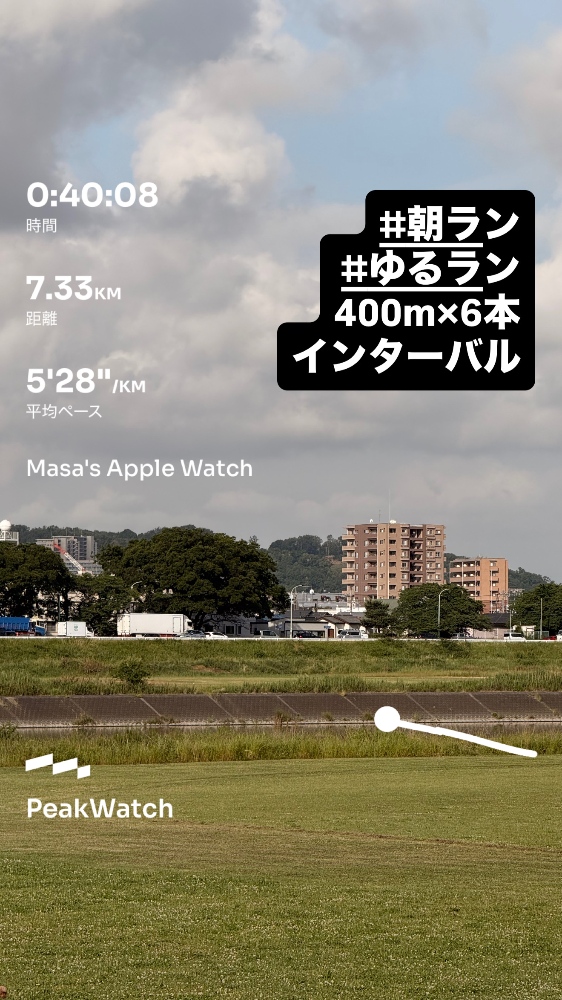
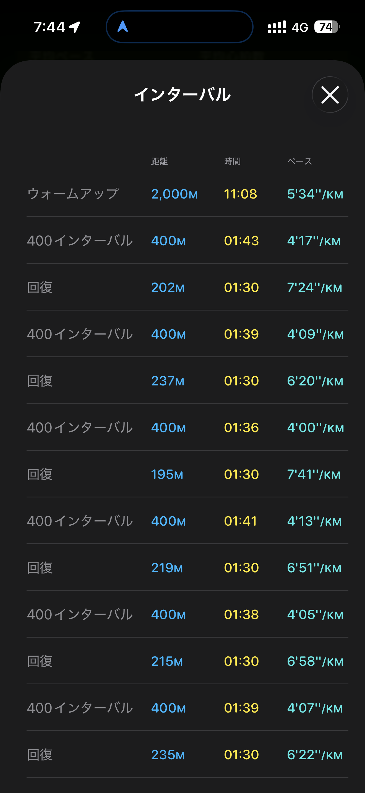

- 距離：7.33km
- 時間：0:40:08
- 平均心拍数：141拍/分
- 使用シューズ：マジックスピード4
- 時間帯：7時頃
- 天候：取得失敗
- コース：調布市
- 補給：
- 睡眠：5時間41分 スコア75
- 今日の目的：400m×6本インターバル
- コメント：#朝ラン#ゆるラン
- 自分メモ：400m×6本インターバル！走った

## 📊 ラップデータ
- 1km:5:37
- 2km:5:28
- 3km:4:51
- 4km:5:16
- 5km:5:04
- 6km:5:26
- 7km:6:21

## 📝 コーチコメント
MASAさん、いつも素晴らしいトレーニングデータをありがとうございます！400m×6本のインターバル走、お疲れ様でした。今回のワークアウトは、平均ペースが5'29/km、平均心拍数が141拍/分と、全体的に質の高いトレーニングができていますね。特にインターバル区間では、4'17/kmから4'00/kmまでしっかりとペースを上げられており、心肺機能に高い負荷をかけられています。最も速い区間では4'00/kmまで出せており、スピード能力の向上に寄与していることは間違いありません。回復走のペースが6'20/kmから7'41/kmと幅がありますが、これは意図的に心拍数を下げて回復を促しているものと推測します。心拍回復のデータも「優秀」判定で23BPMと非常に良好であり、MASAさんの心肺機能の回復力が優れていることを示しています。VO2maxの評価も「ワークアウトピークVO2」が38.5、現在のVO2 Maxが43.0と高い水準を維持できています。今回のトレーニングはVO2maxの90%以上を狙うゾーンに入っており、スピード、持久力、心肺能力を大きく向上させる重要な負荷となっています。これらのデータは、MASAさんがサブ4目標の横浜マラソンに向けて着実に走力を高めている証拠です。オフシーズン中にこのような高強度のトレーニングを継続できているのは素晴らしいことです。一方で、前日の睡眠データを見ると、睡眠時間が5時間41分、スコアが75と少し低めですね。昨夜は何度か目が覚めてしまったとのことですが、インターバル走のような高強度のトレーニングを行う前日は、最低でも7時間程度の質の高い睡眠を確保できると、パフォーマンス向上と疲労回復にさらに効果的です。疲労（ATL）が13、フィットネス（CTL）が2と、まだベースが低い段階ですので、トレーニング負荷の管理と合わせて、日々の睡眠や栄養にも意識を向けていきましょう。次の横浜マラソンでのサブ4達成に向けて、この調子で頑張っていきましょう！

## 📸 写真一覧

