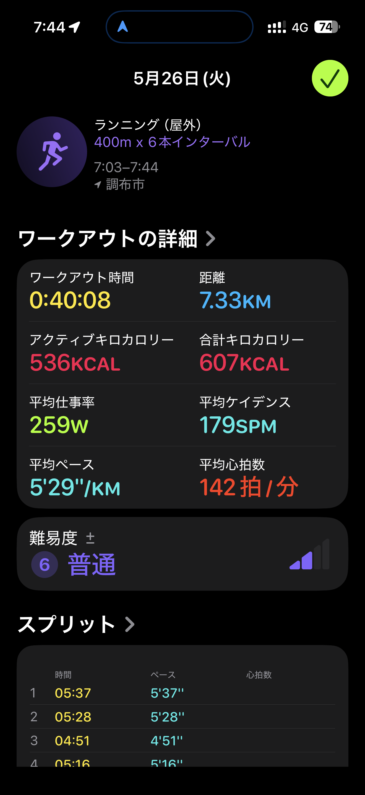

- 距離：7.33km
- 時間：0:40:08
- 平均心拍数：142拍/分
- 使用シューズ：マジックスピード4
- 時間帯：7時頃
- 天候：取得失敗
- コース：調布市
- 補給：
- 睡眠：5時間41分/75
- 今日の目的：400m x 6本インターバル
- コメント：#朝ラン #ゆるラン 400m×6本インターバル
- 自分メモ：400m×6本インターバル！走った

## 📊 インターバルデータ
- ウォームアップ:2000m/11:08/5'34
- 400インターバル:400m/01:43/4'17
- 回復:202m/01:30/7'24
- 400インターバル:400m/01:39/4'09
- 回復:237m/01:30/6'20
- 400インターバル:400m/01:36/4'00
- 回復:195m/01:30/7'41
- 400インターバル:400m/01:41/4'13
- 回復:219m/01:30/6'51
- 400インターバル:400m/01:38/4'05
- 回復:215m/01:30/6'58
- 400インターバル:400m/01:39/4'07
- 回復:235m/01:30/6'22
- クールダウン:1499m/09:25/6'17
- フリー:105m/00:43/6'50

## 📊 ラップデータ
- 1km:5:37
- 2km:5:28
- 3km:4:51
- 4km:5:16
- 5km:5:04
- 6km:5:26
- 7km:6:21
- 8km:2:02

## 📝 コーチコメント
MASAさん、今日の400m×6本のインターバル、お疲れ様でした！オフシーズンの重要な基礎作りとして、このようなスピード練習を取り入れているのは素晴らしいです。平均心拍数142拍/分、最大心拍数164拍/分と、インターバル中にはしっかり負荷をかけられていますね。心拍ゾーンを見ると、ゾーン3が59%と最も長く、ゾーン4と5も合わせて36%を占めており、有酸素能力と無酸素能力の両方に刺激が入っていることが分かります。特に、400mインターバルのペースは4'00/kmから4'17/kmと非常に安定しており、MASAさんのコンディションの良さが伺えます。リカバリージョグのペースも無理なく設定できており、心拍回復も「優秀」判定は素晴らしいですね。ただし、昨晩の睡眠は5時間41分でスコア75とのこと、疲れを溜めないためにも、できれば7時間以上を目指したいところです。質の高い睡眠は、トレーニング効果を最大化し、怪我のリスクを低減するために不可欠です。

次の目標である2026年10月の横浜マラソンでのサブ4達成に向けて、今シーズンは筋力強化と持久力向上に重点を置きましょう。インターバル走の継続はもちろん、週に1〜2回は坂道インターバルやテンポ走なども取り入れて、筋力と心肺機能のさらなる向上を図りましょう。また、体幹トレーニングやストレッチも欠かさず行い、効率的なフォームを維持することが重要です。特に、ハーフマラソンで1時間48分33秒という自己ベストをお持ちなので、サブ4は十分に達成可能な目標です。体調管理とトレーニングのバランスをしっかり保ちながら、着実に目標に近づいていきましょう。何か困ったことや相談したいことがあれば、いつでもご連絡ください。

## 📸 写真一覧

