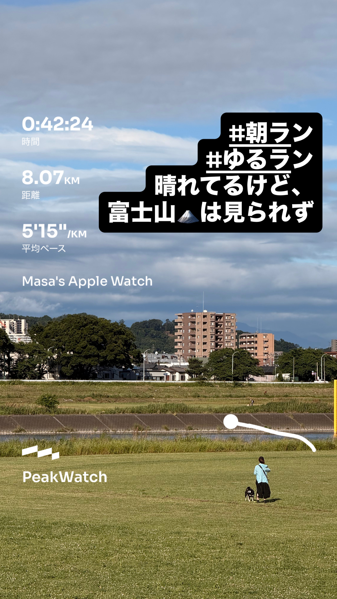
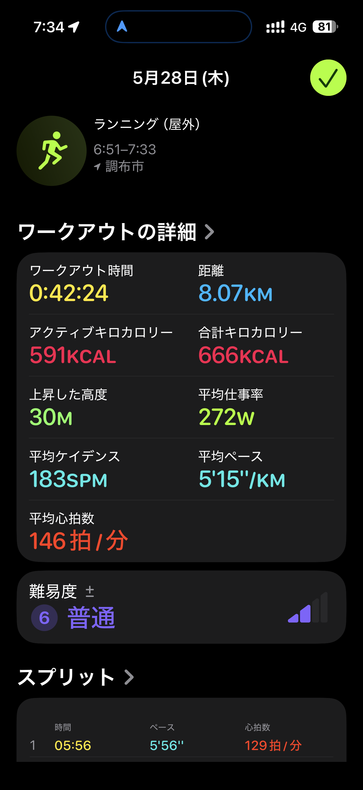
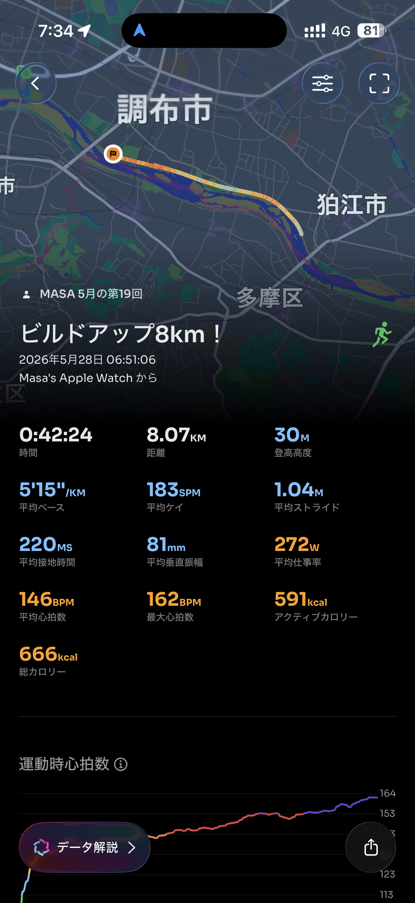

- 距離：8.07km
- 時間：0:42:24
- 平均ペース：平均5'15/km 最大3'15/km
- 平均心拍数：146拍/分
- 最大心拍数：162bpm
- 平均ケイデンス：183spm
- 平均ストライド：1.04m
- VO2Max：43.2（ワークアウトピーク：38.1）
- カロリー：アクティブ591/総計666kcal
- 使用シューズ：ボストン12
- 時間帯：6時頃
- 天候：取得失敗
- コース：調布市
- 補給：
- 睡眠：4時間33分(睡眠評価52%)/スコア68点(普通)
- 今日の目的：ビルドアップ8km！
- RPE：5 中程度
- コメント：#朝ラン #ゆるラン 晴れてるけど、富士山は見られず
- 自分メモ：ビルドアップ走！スタートもうちょい遅くしたい
- 心拍ゾーン：ゾーン1 0.1%/ゾーン2 1.2%/ゾーン3 2.3%/ゾーン4 34%/ゾーン5 32%/ゾーン6 28%
- ペースゾーン：スプリント3%/繰り返し16%/インターバル23%/スレッショルド32%/マラソン11%/簡単14%
- トレーニング負荷：TRIMPexp111/ATL15/CTL2
- 心拍回復：心拍数変化の差16BPM (良い)、心拍数の回復2分 162→146BPM (良い)

## 📊 ラップデータ
- 1km(5'56/129bpm/96cm/178spm)
- 2km(5'30/140bpm/99cm/181spm)
- 3km(5'25/142bpm/99cm/183spm)
- 4km(5'14/145bpm/104cm/181spm)
- 5km(5'07/149bpm/105cm/187spm)
- 6km(5'04/153bpm/106cm/184spm)
- 7km(5'01/154bpm/106cm/187spm)
- 8km(4'44/160bpm/112cm/185spm)
- 9km(0'22/162bpm/114cm/171spm)

## 📝 コーチコメント
MASAさん、今回のビルドアップ走お疲れ様でした！8.07kmを平均5'15/kmで走り切り、最後の1kmは4'44/kmまでペースアップできているのは素晴らしいです。特にラップデータを見ると、最初の1kmが5'56/kmから徐々にペースを上げていき、7km以降は5'00/kmを切るペースを維持できていますね。心拍数もペースに比例して上がっており、最大心拍数162bpm、平均146bpmと効果的な負荷がかかっています。心拍ゾーン分布もゾーン4とゾーン5が合計60%を占めており、高強度有酸素運動にしっかり取り組めている証拠です。RPEも『5 中程度』と主観的には感じているようですが、客観的なデータからはかなりの負荷がかかっていたことがわかります。VO2Maxも現状43.2で、ワークアウトピークVO2が38.1と、着実に向上している傾向が見られます。心拍回復も『良い』評価ですので、心肺機能も良好と言えるでしょう。

MASAさんからの「スタートもうちょい遅くしたい」というコメントですが、今回のランはビルドアップ走という目的を考えると、最初の5'56/kmというペースは決して遅すぎるわけではありません。むしろ、ビルドアップの意図通り、徐々にペースを上げていく良い入りだったと思います。もし、全体を通してもう少し楽に走りたいという意味合いであれば、最初の数キロを6'00/kmから6'15/km程度で入り、そこから徐々にビルドアップしていく形も良いでしょう。オフシーズン中は、このようなビルドアップ走はスピード持久力向上に非常に効果的です。疲労（ATL）が15、フィットネス（CTL）が2と、まだそこまでトレーニング負荷は蓄積されていませんが、今後トレーニングを積むにつれてこれらの数値も変わってきます。

一点、睡眠時間が4時間33分と短く、睡眠スコアも68点と『普通』の評価でした。質の高いトレーニングを継続し、パフォーマンスを最大化するためには、十分な睡眠とリカバリーが不可欠です。可能な範囲で睡眠時間の確保と質の向上に努めてください。就寝時刻の安定化や、寝る前のカフェインやアルコール摂取を控えるなどの工夫も有効です。

次の目標である2026年10月の横浜マラソン（サブ4目標）に向けて、今回のビルドアップ走で得られたスピードと持久力をさらに磨いていきましょう。今後も定期的にこのようなインターバルやビルドアップ走を継続しつつ、週に一度はロング走を取り入れることで、フルマラソンに向けた脚作りを進めていくことをお勧めします。素晴らしい走りでした！

## 📸 写真一覧

