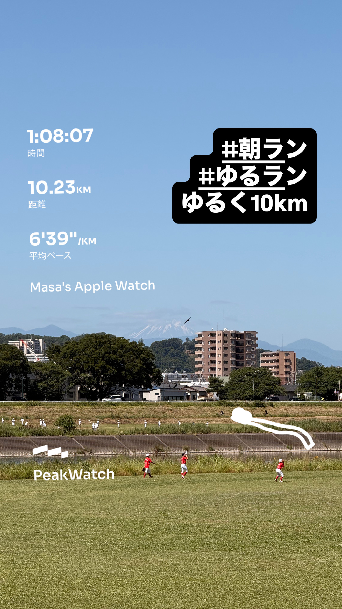
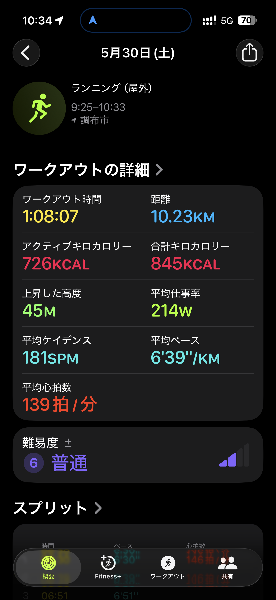
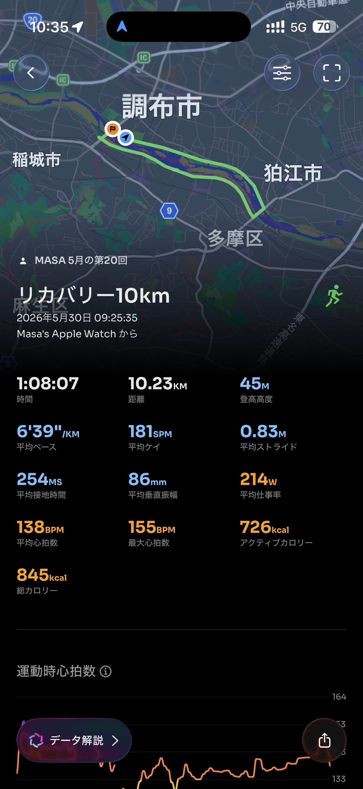

- 距離：10.23km
- 時間：1:08:07
- 平均ペース：平均6'39/km 最大5'38/km
- 平均心拍数：139拍/分
- 最大心拍数：155bpm
- 平均ケイデンス：181spm
- 平均ストライド：0.83m
- VO2Max：43.1（ワークアウトピーク：36.7）
- カロリー：アクティブ726/総計845kcal
- 使用シューズ：インフィニットプロ
- 時間帯：9時頃
- 天候：取得失敗
- コース：調布市
- 補給：
- 睡眠：4時間48分、睡眠スコア59（低い）
- 今日の目的：リカバリー10km
- RPE：6 ややきつい
- コメント：#朝ラン #ゆるラン ゆるく<10km
- 自分メモ：明け方、脚攣って急遽ゆるラン。でも思った以上に走れた
- 心拍ゾーン：ゾーン1 0.0%/ゾーン2 11%/ゾーン3 70%/ゾーン4 19%/ゾーン5 0.0%
- ペースゾーン：簡単100%/マラソン0%/スプリント0%/繰り返し0%/インターバル0%/スレッシュホールド0%
- トレーニング負荷：TRIMPexp127/ATL18/CTL3
- 心拍回復：心拍変化の差 3BPM、心拍数の回復2分 136→133BPM（悪い）

## 📊 ラップデータ
- 1km(6'30/145bpm/84cm/179spm)
- 2km(6'39/145bpm/81cm/181spm)
- 3km(6'51/143bpm/80cm/182spm)
- 4km(6'55/131bpm/80cm/182spm)
- 5km(6'59/137bpm/79cm/181spm)
- 6km(6'42/134bpm/82cm/182spm)
- 7km(6'31/137bpm/84cm/181spm)
- 8km(6'31/137bpm/85cm/181spm)
- 9km(6'21/138bpm/87cm/181spm)
- 10km(6'34/143bpm/85cm/181spm)
- 11km(6'25/142bpm/87cm/180spm)

## 📝 コーチコメント
MASAさん、明け方に脚を攣ってしまったとのこと、大変でしたね。急遽のゆるランにも関わらず、10.23kmを1時間8分7秒で走り切り、平均ペースも6'39/kmと、脚の具合を考えると非常に良い走りだったと思います。平均心拍数が139bpm、最大心拍数155bpmで、心拍ゾーンの分布を見るとゾーン3が70%、ゾーン4が19%と、リカバリーランとしてはやや高い強度で走られていますね。脚の攣りがあったことを踏まえると、もう少し心拍ゾーン2での比率を上げて、本当に『ゆるく』走ることを意識できると、より効果的な回復につながる可能性があります。今回の主観的運動強度（RPE）は「6 ややきつい」とのことですが、実際の体感と心拍データがよく一致しています。トレーニングの焦点が81%有酸素運動に集中しており、心肺機能の向上に寄与する内容であることは素晴らしいです。VO2Maxも43.1と非常に良好なレベルを維持されています。これは長期的な健康状態の改善にも繋がるポジティブなサインです。ただし、睡眠データを見ると、前夜は就寝時刻が1時間33分遅く、睡眠時間も4時間48分、睡眠スコアも低い評価でした。脚の攣りの原因の一つに、睡眠不足や疲労が考えられます。特にオフシーズン中であっても、質の良い睡眠は身体の回復とパフォーマンス維持に不可欠です。次の横浜マラソン（サブ4目標）に向けては、トレーニングと同時に回復も重要な要素です。今後は、就寝時刻を一定にし、十分な睡眠時間を確保することを強くお勧めします。例えば、就寝前のカフェイン摂取を控える、寝る前にスマホを見ないなど、睡眠の質を高める工夫を取り入れてみてください。心拍回復が「悪い」という評価も、この睡眠不足と疲労が影響している可能性があります。継続的にデータを見て、睡眠とコンディションの関連性を把握していきましょう。

## 📸 写真一覧

