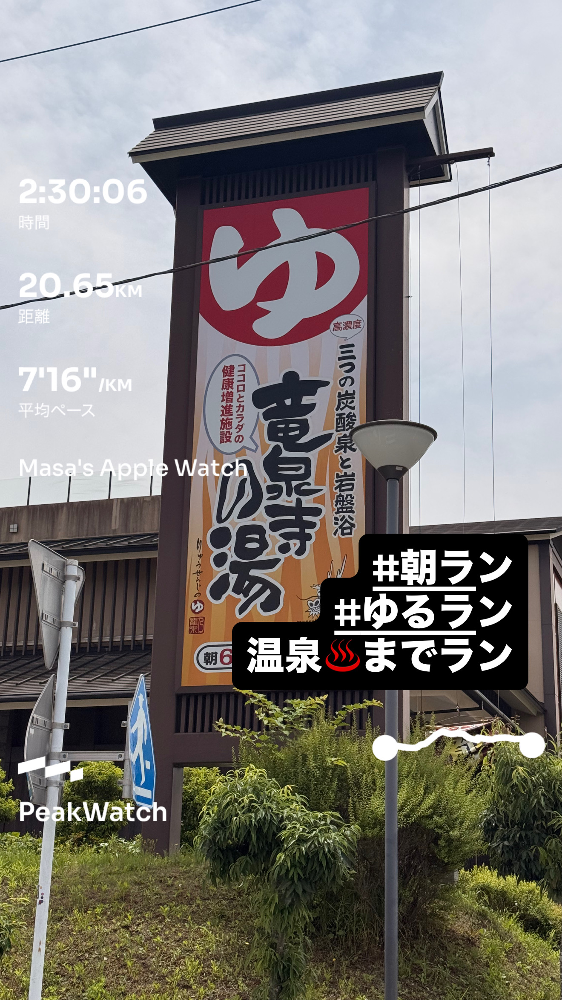
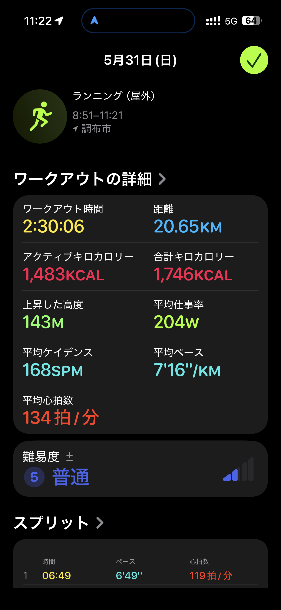
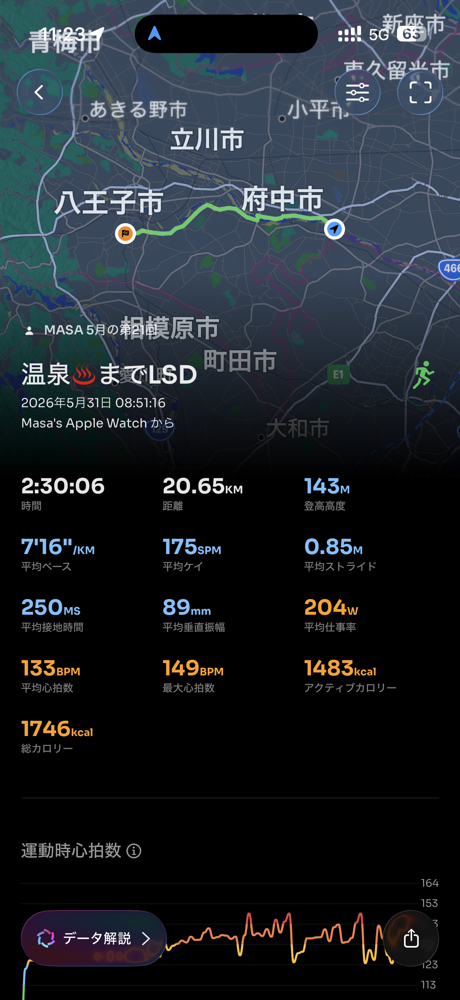

- 距離：20.65km
- 時間：2:30:06
- 平均ペース：平均7'16/km 最大4'31/km
- 平均心拍数：134拍/分
- 最大心拍数：149bpm
- 平均ケイデンス：175spm
- 平均ストライド：0.85m
- VO2Max：42.5（ワークアウトピーク：35.3）
- カロリー：アクティブ1483/総計1746kcal
- 使用シューズ：スーパーノヴァ
- 時間帯：8時頃
- 天候：取得失敗
- コース：調布市
- 補給：
- 睡眠：7時間45分 睡眠スコア91
- 今日の目的：温泉までLSD
- RPE：7 きつい
- コメント：#朝ラン #ゆるラン #温泉♨️までラン
- 自分メモ：温泉までLSD。ただ、30kmなくて20kmだった😅そしてそれでもラストはヘタれた😭
- 心拍ゾーン：ゾーン5 0%/ゾーン4 11%/ゾーン3 41%/ゾーン2 42%/ゾーン1 5%
- ペースゾーン：簡単94%/マラソン2%/インターバル3%/スレッシュホールド1%
- トレーニング負荷：TRIMPexp258/ATL36/CTL6
- 心拍回復：心拍変化の差 17bpm (良い), 心拍数の回復2分 149→132bpm

## 📊 ラップデータ
- 1km(6'49/121bpm/82cm/177spm)
- 2km(6'51/126bpm/81cm/181spm)
- 3km(6'56/125bpm/80cm/182spm)
- 4km(6'56/125bpm/80cm/181spm)
- 5km(6'46/129bpm/82cm/180spm)
- 6km(6'44/129bpm/82cm/183spm)
- 7km(6'46/131bpm/82cm/181spm)
- 8km(6'37/133bpm/83cm/181spm)
- 9km(6'56/133bpm/80cm/180spm)
- 10km(6'44/136bpm/87cm/180spm)
- 11km(6'55/139bpm/88cm/173spm)
- 12km(7'17/137bpm/89cm/172spm)
- 13km(6'29/138bpm/91cm/174spm)
- 14km(7'02/140bpm/88cm/176spm)
- 15km(9'41/137bpm/88cm/154spm)
- 16km(7'20/136bpm/83cm/175spm)
- 17km(7'01/141bpm/84cm/178spm)
- 18km(7'28/139bpm/88cm/168spm)
- 19km(10'27/132bpm/87cm/160spm)
- 20km(7'51/137bpm/86cm/169spm)
- 21km(6'52/146bpm/85cm/176spm)

## 📝 コーチコメント
MASAさん、お疲れ様でした。今回の「温泉までLSD」は、当初の30km目標には届かなかったものの、20.65kmを2時間30分06秒で走り切り、平均ペース7'16/km、平均心拍134bpmという結果でしたね。RPEが「7 きつい」と感じたとのこと、ラストはヘタれてしまったというMASAさんのコメントから、思った以上に身体に負荷がかかっていたことが伺えます。

データを見ると、心拍ゾーンの分布はゾーン2が42%、ゾーン3が41%と、LSDとしてはややゾーン3の割合が高い点が気になります。LSDは脂肪燃焼効果を高め、持久力を養うためのトレーニングですので、基本的に心拍はゾーン2を中心に維持することが理想です。特にラストが「ヘタれた」と感じたのは、序盤からペースが少し速すぎたか、あるいは疲労が蓄積していた可能性も考えられます。

ラップデータを見ると、15km地点でペースが9'41/kmに落ち込み、その後もペースが変動しています。特に19kmでは10'27/kmまで大幅にペースダウンしており、このあたりで「ヘタれた」感覚があったのでしょう。このような長距離走では、序盤から体力を温存し、後半にペースが落ち込まないように均一なペース配分を心がけることが重要です。

トレーニングインパルスはTRIMPexp258、ATL36、CTL6と、今回のワークアウトが身体に与えた負荷はそれなりに高かったことを示しています。オフシーズンとはいえ、次の横浜マラソンでのサブ4目標に向けて、無理なく着実に持久力を高めていく必要があります。

心拍回復データは17bpmと「良い」評価で、VO2Maxも42.5と良好です。この潜在能力を十分に引き出すためにも、LSDでは「楽に会話ができるペース」を意識し、心拍が上がりすぎないように注意しましょう。疲労が蓄積していると感じた場合は、無理せず休養を取るか、より短い距離や低い強度のランニングに切り替えることも大切です。

MASAさんのコメントにある「30kmなくて20kmだった😅そしてそれでもラストはヘタれた😭」という反省は、今後のトレーニングに活かせる貴重な気づきです。LSDの目的は距離を伸ばすことですが、決して苦痛なものであってはなりません。次回は、より心拍をコントロールし、疲労を最小限に抑えながら距離を伸ばしていくことを意識してみてください。例えば、15kmまで心拍をゾーン2にキープし、その後は身体の状態と相談しながらペースを調整するなどの工夫も有効です。温泉までのランニング、素晴らしい挑戦でした。この経験を次に繋げ、着実に目標達成に近づいていきましょう。

## 📸 写真一覧

