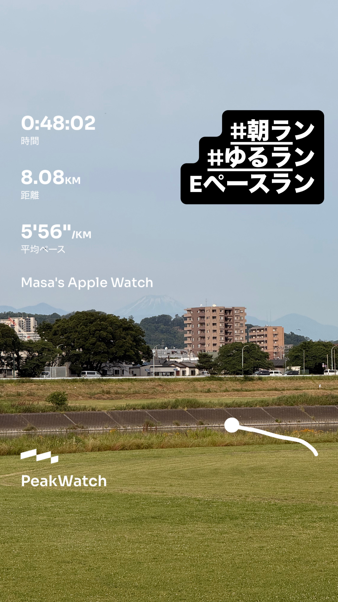
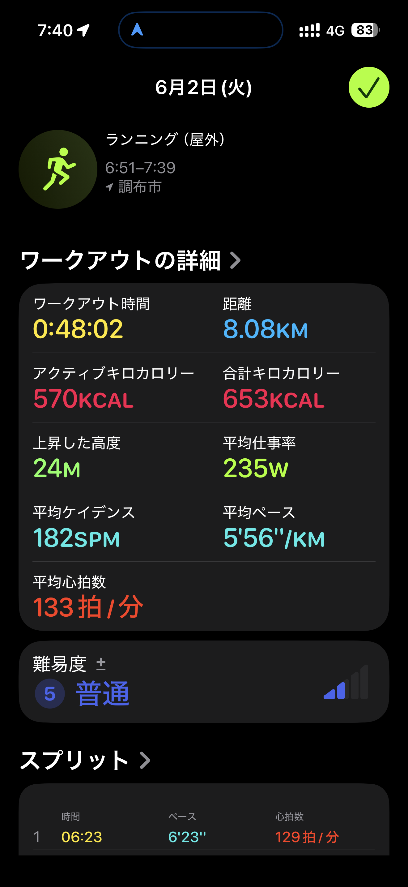
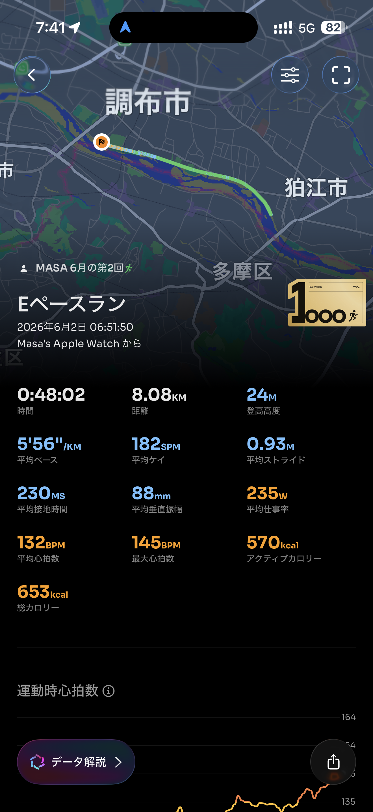

- 距離：8.08km
- 時間：0:48:02
- 平均ペース：平均5'56/km 最大3'57/km
- 平均心拍数：133拍/分
- 最大心拍数：145bpm
- 平均ケイデンス：182spm
- 平均ストライド：0.93m
- VO2Max：43.1（ワークアウトピーク：34.4）
- カロリー：アクティブ570/総計653kcal
- 使用シューズ：スーパーノヴァ
- 時間帯：6時頃
- 天候：取得失敗
- コース：調布市
- 補給：
- 睡眠：5時間28分 評価95%/睡眠スコア75 普通
- 今日の目的：Eペースラン
- RPE：5 中程度
- コメント：#朝ラン #ゆるラン #Eペースラン
- 自分メモ：Eペースラン、ラストは気持ちよくあげる！
- 心拍ゾーン：ゾーン1 0.0%/ゾーン2 78%/ゾーン3 19%/ゾーン4 1%/ゾーン5 0%
- ペースゾーン：簡単79%/マラソン8%/スレッシュホールド9%/インターバル3%/繰り返し1%/スプリント0%
- トレーニング負荷：TRIMPexp77/ATL11/CTL1
- 心拍回復：心拍数変化の差 23BPM 優秀, 心拍数の回復2分 143→120BPM 優秀

## 📊 ラップデータ
- 1km(6'23/127bpm/91cm/174spm)
- 2km(6'04/131bpm/93cm/180spm)
- 3km(6'06/130bpm/88cm/181spm)
- 4km(5'57/131bpm/91cm/183spm)
- 5km(6'01/131bpm/90cm/185spm)
- 6km(5'48/135bpm/92cm/185spm)
- 7km(5'49/134bpm/94cm/183spm)
- 8km(5'24/140bpm/100cm/184spm)
- 8.08km(0'28/144bpm/105cm/176spm)

## 📝 コーチコメント
MASAさん、今回のEペースランお疲れ様でした！『Eペースラン、ラストは気持ちよくあげる！』というMASAさんのコメント通り、見事にペースアップして素晴らしい走り込みでしたね。特に、最後の2kmでは平均ペースが5'48/km、5'24/kmと大幅に上がっており、ラストスパートの意識がデータからもはっきりと見て取れます。最後の0.08kmも28秒と、わずかな距離ながらも意識的にペースを上げて終了されたことが伺えます。平均心拍数133bpm、平均ケイデンス182spm、平均ストライド0.93mというデータは、全体を通して効率的かつリラックスしたEペースを維持できていたことを示しています。心拍ゾーン分布ではゾーン2が78%とほとんどを占めており、有酸素能力の向上に効果的なトレーニングができたと言えるでしょう。また、ワークアウトピークVO2が34.4、現在のVO2Maxが43.1と高い数値を維持しており、心肺機能のベースがしっかりしていることが伺えます。心拍回復データも優秀で、疲労回復能力も高いですね。ただし、睡眠時間が5時間28分、睡眠スコアが75と『普通』の評価でしたので、トレーニング効果を最大限に引き出すためにも、今後はもう少し睡眠時間の確保を意識してみてください。横浜マラソンでのサブ4達成に向けては、このようなEペース走で持久力の土台をしっかりと築きつつ、今後はペース走やインターバル走といったスピードと筋持久力を高めるトレーニングもバランス良く取り入れていきましょう。ラストを気持ちよく上げる感覚は非常に重要ですので、今後も継続して取り組んでいき、レース終盤での粘り強さに繋げていきましょう！

## 📸 写真一覧

